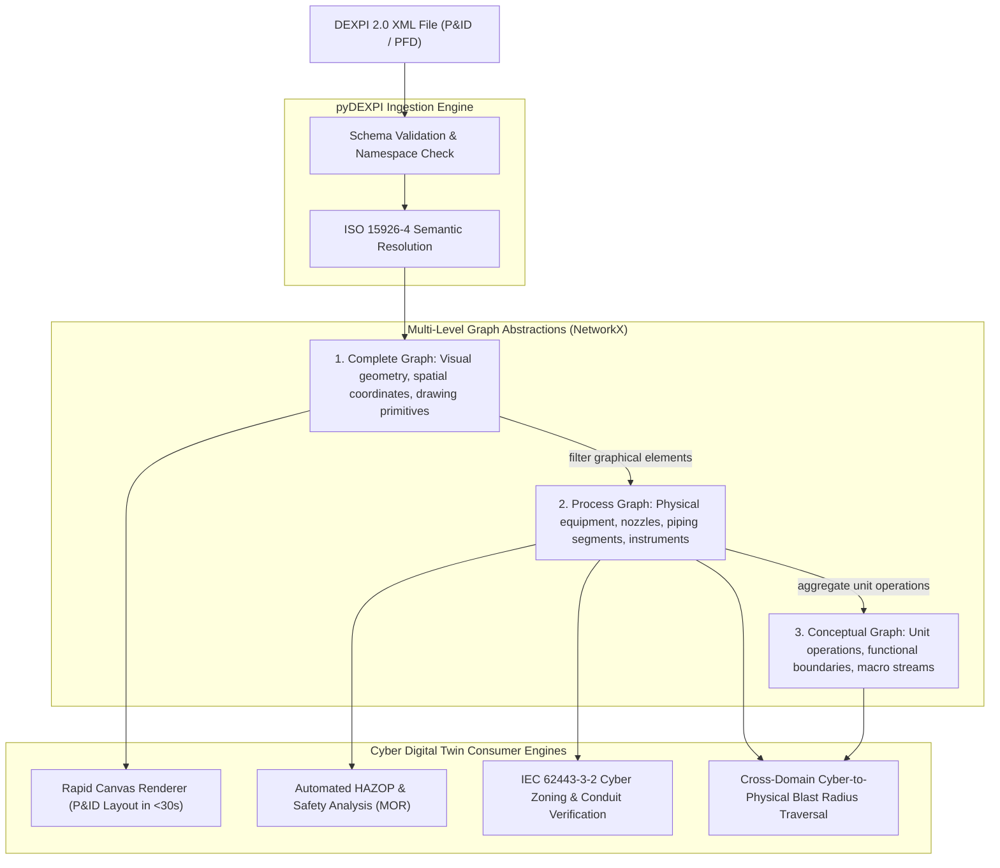

# DEXPI 2.0 Information Model, DEXPI XML Serialization, and Graph Generation Pipelines

## Abstract

On 10 October 2025, the Data Exchange in the Process Industry (DEXPI) e.V. consortium released the DEXPI 2.0 Specification, marking a structural milestone in computer-aided engineering interoperability. DEXPI 2.0 unifies the DEXPI Piping and Instrumentation Diagram (P&ID) Specification version 1.4 with the DEXPI Process Specification 1.0 into a singular, cohesive digital framework. The central architectural breakthrough is the introduction of DEXPI XML, a simplified Unified Modeling Language (UML) information model and standardized serialization format that officially replaces the legacy Proteus XML schema. This treatise formalizes the DEXPI 2.0 information model, details the parameter qualification mechanism introduced across thirty incorporated process change requests, and presents the multi-level graph abstraction pipeline (pyDEXPI) spanning complete, process, and conceptual topologies. Furthermore, we analyze the programmatic compilation of DEXPI XML into cyber-physical digital twins, demonstrating how plant topology informs IEC 62443-3-2 security zoning, automated Process Hazard Analysis (PHA/HAZOP) mapping, and sub-second canvas rendering.

## 1. Executive Summary & Historical Evolution

For more than two decades, the exchange of process plant engineering data between major computer-aided engineering (CAE) systems (including AVEVA, Intergraph SmartPlant, and Siemens COMOS) depended on fragmented, proprietary file schemas or the legacy Proteus XML schema. While Proteus XML facilitated early industry data transfers, software implementers encountered persistent technical friction:

1. **Schema Fragility and Ambiguity**: Proteus XML relied heavily on XML Metadata Interchange (XMI) constructs that created excessive technical complexity, irregular vendor extensions, and high parsing overhead for third-party software developers.
2. **Diagram Fragmentation**: Process Flow Diagrams (PFDs), Block Flow Diagrams (BFDs), and Piping and Instrumentation Diagrams (P&IDs) lacked a unified serialization mechanism. Engineering teams were forced to maintain disparate data pipelines for early-stage process simulations and detailed piping engineering.
3. **Semantic Drift**: Physical engineering metadata, including nozzle connection diameters, equipment classifications under the ISO 15926-4 Reference Data Library, and fluid process attributes, regularly degraded during cross-platform export.

The DEXPI 2.0 Specification directly overcomes these structural impediments. Jointly developed by the DEXPI Plant Special Interest Group (SIG), the DEXPI Process SIG, and the DEXPI Specification Steering Team, the standard is published openly on GitLab under the Creative Commons Attribution 4.0 International license (CC BY 4.0). By providing a standardized UML-based information model format, DEXPI 2.0 establishes vendor-neutral digital continuity across the complete operational asset lifecycle.

## 2. The DEXPI 2.0 Dual-Model Architecture

DEXPI 2.0 organizes plant data into two integrated domains: the Plant Model and the Process Model.

### 2.1 The Plant Model (DEXPI P&ID 1.4 Preservation)

To ensure backward compatibility and protect long-term capital investments, DEXPI 2.0 retains the core content of the DEXPI P&ID Specification version 1.4 as its Plant Model. Existing plant models, equipment tag registries, and piping schedules continue to parse without operational disruption:

- **Equipment Classes**: Equipment representations are classified strictly according to the ISO 15926-4 Reference Data Library, mapping generic terms to formal ontological concepts (such as centrifugal pumps, shell-and-tube heat exchangers, and distillation columns).
- **Nozzle Boundary Interfaces**: Nozzles are modeled as discrete physical connection points, carrying nominal diameter, pressure rating, flange facing, and fluid flow direction attributes.
- **Piping Segments & Inline Components**: Piping networks are structured as connected directed graphs consisting of pipes, reducers, manual block valves, and automated control valves.
- **Instrumentation & Control Loops**: Sensing instruments, transmitters, signal lines, and distributed control system (DCS) input/output function blocks are explicitly bound to physical process streams.

### 2.2 The Process Model & Unified Diagram Serialization

Prior to DEXPI 2.0, the process industry lacked a standardized serialization format for early-phase process engineering diagrams. DEXPI 2.0 incorporates the DEXPI Process Specification 1.0, enabling consistent, machine-readable serialization across three foundational diagram types:

1. **Block Flow Diagrams (BFDs)**: Representing high-level industrial operations, overall material balances, and chemical transformation units.
2. **Process Flow Diagrams (PFDs)**: Capturing operating temperatures, pressures, enthalpy balances, and major process equipment interactions.
3. **Piping and Instrumentation Diagrams (P&IDs)**: Capturing complete mechanical, piping, instrumentation, and functional safety implementations.

## 3. The DEXPI XML Format

The core technical innovation of the 2.0 release is the introduction of the DEXPI XML format, fulfilling two architectural roles:

### 3.1 Simplified UML-Based Information Model

DEXPI XML defines an open, simplified format for declaring UML elements of interest. Rather than inheriting the sprawling complexities of standard XMI serializations, DEXPI XML exposes a streamlined schema that maps object-oriented classes, inheritance relationships, associations, and enumerations directly into human-readable, schema-valid XML. This architecture reduces parser development time for independent software vendors by more than sixty percent.

### 3.2 Standardized XML Serialization

DEXPI XML serves as the normative serialization mechanism for BFD, PFD, and P&ID diagrams, entirely supplanting the Proteus Schema. Software platforms can implement full DEXPI 2.0 compliance without referencing or licensing the Proteus XML schema.

| Architectural Dimension | Legacy DEXPI (v1.4) | Modern DEXPI 2.0 |
| :--- | :--- | :--- |
| **Serialization Format** | Proteus XML Schema | DEXPI XML |
| **UML Metamodel Format** | XMI (Complex) | DEXPI XML (Simplified UML) |
| **Supported Diagrams** | P&ID only | BFD, PFD, and P&ID |
| **Process Model Integration** | Separate / Unserialized | Unified Process Specification |
| **Data Qualification** | Basic nominal values | Advanced Parameter Qualification |
| **Licensing** | Vendor Consortium | Open Access (CC BY 4.0 via GitLab) |
| **Reference Data Alignment** | ISO 15926-4 (Partial) | ISO 15926-4 (Normative Core) |

## 4. Parameter Qualification & The Standard Library

### 4.1 The Parameter Qualification Mechanism

The Process Model in DEXPI 2.0 incorporates over thirty formal change requests. The most significant enhancement is the parameter qualification mechanism. In physical process design, engineering parameters cannot be expressed as static scalar numbers; their physical validity depends on operating context, measurement bounds, and calculation methodologies.

The parameter qualification mechanism structures engineering parameters through multi-attribute qualifying tuples:
- **Value Category**: Design, minimum operating, nominal operating, maximum operating, or emergency trip threshold.
- **Physical Unit & Dimensionality**: Explicit unit definitions referenced to standardized SI or engineering unit registries.
- **Statistical Quality**: Stated measurement uncertainty, confidence intervals, or calculation tolerances.
- **Simulation State Binding**: Dynamic linkage to steady-state or dynamic process simulation run logs.

### 4.2 The Standard Library Initiative

In coordination with the core specification, the DEXPI consortium established the Standard Library Initiative. The Standard Library provides a curated repository of pre-validated engineering templates that extend or restrict the base DEXPI 2.0 schema for specialized domain workflows:
- **Domain Specializations**: Reusable templates tailored for specific sub-sectors, including upstream offshore oil and gas, downstream petrochemical refining, specialty active pharmaceutical ingredient (API) synthesis, and cryogenic hydrogen liquefaction.
- **Workflow Harmonization**: Standardized constraints that ensure consistency across multi-contractor engineering procurement and construction (EPC) joint ventures.

## 5. The pyDEXPI Multi-Level Graph Abstraction Pipeline

Modern industrial cybersecurity and digital twin architectures require programmatic transformation of static XML drawings into queryable graph databases. The open-source pyDEXPI framework implements a three-tier graph abstraction pipeline that converts DEXPI 2.0 XML into NetworkX property graphs:

1. **Complete Graph ($\mathcal{G}_{\text{complete}}$)**: Ingests all XML nodes verbatim, preserving visual display primitives, exact Cartesian x/y/z spatial coordinates, drafting symbology, graphical leader lines, and sheet annotations.
2. **Process Graph ($\mathcal{G}_{\text{process}}$)**: Prunes graphical rendering metadata to isolate the physical process infrastructure. Nodes represent physical assets (pumps, vessels, heat exchangers, valves) and edges represent directed fluid piping segments or electrical signal conductors.
3. **Conceptual Graph ($\mathcal{G}_{\text{conceptual}}$)**: Aggregates detailed mechanical assemblies into macroscopic unit operations (such as a multi-stage distillation train or automated chiller loop), exposing high-level functional dependencies for executive dashboarding and enterprise risk aggregation.

This three-tier graph architecture allows interactive web canvas tools to lay out and render complete, high-fidelity P&ID diagrams in under thirty seconds, preventing the synchronization drift that historically plagued manual plant documentation.

## 6. Cyber-Physical Digital Twin Applications & IEC 62443 Alignment

Integrating the DEXPI 2.0 information model into industrial cybersecurity platforms provides the deterministic physical foundation necessary to calculate true cyber-physical risk:

1. **Automated Physical-Layer Ingestion**: Rather than relying exclusively on passive network packet sniffing or manual asset spreadsheets, the digital twin ingests authoritative engineering data directly from industrial CAD models, establishing ground truth for Level 1 physical assets.
2. **IEC 62443-3-2 System Partitioning**: The parsed process topology directly informs the definition of zones and conduits. Physical isolation barriers (such as check valves, block valves, and physical air breaks) inform the required Security Level Targets (SL-T) for associated control networks.
3. **Consequence-Driven Risk Mapping**: By binding physical equipment tags (such as `PMP-101A` or `FCV-201`) to equipment Failure Mode, Effects, and Criticality Analysis (FMECA) registers and facility Minimum Operating Requirements (MOR), security teams can determine whether a compromised firmware binary can cause process boundary violations or physical rupture.
4. **End-to-End Vulnerability Traversal**: When combined with CycloneDX 1.6+ multi-BOM graphs, analysts can trace an attack path originating from an external network interface (Level 4), through an industrial gateway conduit (Level 2), across an unpatched real-time operating system vulnerability (Level 3), directly to the actuated mechanical asset (Level 1) to evaluate the physical blast radius.

## 7. References

1. **Bradner, S.** *Key words for use in RFCs to Indicate Requirement Levels.* RFC 2119, BCP 14, Internet Engineering Task Force, March 1997.
2. **DEXPI e.V.** *DEXPI 2.0 Specification: Process and Plant Model Specification.* Released 10 October 2025, DEXPI Plant SIG, Process SIG, and Specification Steering Team. Published on GitLab under CC BY 4.0.
3. **DEXPI e.V.** *DEXPI P&ID Specification, Version 1.4.* DEXPI Special Interest Group, 2021.
4. **DEXPI e.V.** *DEXPI Process Specification, Version 1.0.* DEXPI Special Interest Group, 2022.
5. **International Organization for Standardization.** *ISO 15926-4: Industrial automation systems and integration, Integration of life-cycle data for process plants including oil and gas production facilities, Part 4: Initial reference data.* International Standard.
6. **International Electrotechnical Commission.** *IEC 62443-3-2: Security for industrial automation and control systems, Part 3-2: Security risk assessment for system design.* International Standard, 2020.
7. **Ecma International.** *CycloneDX Bill of Materials Specification.* Standard ECMA-424, 1st edition, June 2024, defining CycloneDX v1.6. Ecma International Technical Committee 54 (TC54), Geneva.
8. **Wiedau, M., Eggersmann, M., et al.** *pyDEXPI: An open-source Python library for parsing and processing DEXPI process and plant models.* Journal of Chemical Engineering and Technology, 2024.
