# Non-Linear Consequence Dynamics and Kinetic Blast Radius

## 1. Executive Summary & Scope

Information technology cybersecurity assesses risk using static, linear severity scoring frameworks. The Common Vulnerability Scoring System (CVSS) [1] computes a base score between 0.0 and 10.0 derived from exploit vectors, attack complexity, privileges required, and confidentiality, integrity, and availability impacts. 

In industrial cyber-physical systems (CPS) and operational technology (OT), CVSS fails catastrophically. A buffer overflow vulnerability in a corporate printer web server may register an alarming CVSS 9.8 (Critical), while a parameter truncation flaw in a valve positioner firmware registers an apparently modest CVSS 6.5 (Medium). In physical systems, the printer vulnerability creates administrative inconvenience, whereas the valve positioner flaw allows an adversary to induce fluid hammer, hydraulic shock waves exceeding 180 bar, pipe severance, and catastrophic toxic atmospheric discharge.

Traditional risk management evaluates consequence as a linear function of asset criticality and exploit likelihood:

$$\text{Risk}_{\text{linear}} = P(\text{Exploit}) \times \text{Asset Value}$$

Physical infrastructure does not fail linearly. Industrial processes governed by thermodynamics, fluid dynamics, and electromechanics exhibit smooth, stable behavior across wide operating regions until a parameter threshold is crossed. At that threshold, known mathematically as a bifurcation point, stable operating equilibria vanish, plunging the system into irreversible kinetic runaway.

This treatise (Designation P5, dynamic consequence and mathematical physics foundations of G_CPDT) establishes the mathematical physics foundation of the G_CPDT standard. It formalizes the coupling between cyber parameter tampering and physical runaway via normal-form saddle-node bifurcation dynamics. It demonstrates how the G_CPDT multigraph topology enables the automated calculation of the Kinetic Blast Radius ($R_K$), providing the quantitative input required for physics-grounded cyber underwriting under Lloyd's Market Association requirements [2].

This document is licensed under the Creative Commons Attribution 4.0 International licence (CC BY 4.0) [3] for submission to the IEEE Systems, Man, and Cybernetics Society, the Society for Risk Analysis, and the Lloyd's Market Association.

## 2. Mathematical Dynamics of Saddle-Node Bifurcations

Let the continuous state of an industrial physical asset (e.g., fluid temperature, reactor pressure, rotor angle) be described by a generalized non-linear state variable $x(t) \in \mathbb{R}$. The physical evolution of the asset is governed by an autonomous differential equation parameterized by a set of control inputs and ambient conditions $\mathbf{u} \in \mathbb{R}^m$:

$$\frac{dx}{dt} = f(x, \mathbf{u})$$

In a nominal operating regime, the physical asset maintains an asymptotically stable equilibrium point $x^*$ where $f(x^*, \mathbf{u}_0) = 0$ and the Jacobian derivative satisfies:

$$\left. \frac{\partial f}{\partial x} \right|_{x = x^*} < 0$$

### 2.1 The Normal-Form Saddle-Node Bifurcation

When an adversary alters control logic, overrides sensor feedback, or manipulates actuator setpoints via a cyber compromise, the parameter vector shifts from $\mathbf{u}_0$ to a perturbed state $\mathbf{u}_{\text{cyber}}$. In non-linear systems theory, the generic mechanism by which an equilibrium point disappears is a saddle-node (or fold) bifurcation [4]. 

Expanding $f(x, \mathbf{u})$ via Taylor series in the neighborhood of the bifurcation point $(x_c, \mathbf{u}_c)$ and applying coordinate transformation yields the universal normal form:

$$\frac{dx}{dt} = \mu + x^2$$

where $\mu \in \mathbb{R}$ is the bifurcation parameter directly modulated by cyber intervention.

```mermaid
stateDiagram-v2
    accTitle: Dynamical Regimes of a Saddle-Node Bifurcation
    accDescr {
      State diagram depicting the transition from nominal operation with two equilibria
      in the subcritical regime (mu less than 0), across the critical bifurcation threshold
      (mu equals 0), into the supercritical runaway regime (mu greater than 0) where equilibria
      are destroyed and the system experiences finite-time kinetic blow-up.
    }
    direction LR
    [*] --> Subcritical : Nominal Process Control
    state "Subcritical Regime (mu < 0)" as Subcritical {
        StableNode : Stable Node x* = -sqrt(-mu)
        UnstableSaddle : Basin Boundary x* = +sqrt(-mu)
    }
    state "Critical Threshold (mu = 0)" as Critical {
        Coalescence : Saddle-Node Coalescence
        ZeroMargin : Dynamic Margin Depleted
    }
    state "Supercritical Runaway (mu > 0)" as Supercritical {
        NoEquilibria : Vector Field dx/dt > 0 Everywhere
        KineticBlowup : Irreversible Thermal or Hydraulic Runaway
    }
    Subcritical --> Critical : Cyber Parameter Manipulation
    Critical --> Supercritical : Bifurcation Threshold Crossed
    Supercritical --> [*] : Physical Rupture / Equipment Loss
```

Three distinct dynamical regimes emerge depending on the sign of $\mu$:

1. **Subcritical Regime ($\mu < 0$)**: The system possesses two distinct equilibria:
   
   $$x^*_1 = -\sqrt{-\mu} \quad (\text{Stable node}), \quad x^*_2 = +\sqrt{-\mu} \quad (\text{Unstable saddle})$$
   
   The point $x^*_1$ represents the stable operational baseline (e.g., nominal reactor operating temperature). The unstable saddle $x^*_2$ defines the boundary of the basin of attraction. If an operational perturbation remains within $x(t) < x^*_2$, the system returns asymptotically to $x^*_1$.

2. **Critical Threshold ($\mu = 0$)**: The stable node and unstable saddle collide and annihilate one another in a saddle-node bifurcation. The equilibrium state is marginally stable:
   
   $$x^* = 0, \quad \left. \frac{df}{dx} \right|_{x=0} = 0$$

3. **Supercritical Runaway Regime ($\mu > 0$)**: No real equilibrium points exist. The vector field is strictly positive everywhere:
   
   $$\frac{dx}{dt} \ge \mu > 0 \quad \forall x \in \mathbb{R}$$

In this regime, the system undergoes irreversible kinetic runaway. The time required for the state variable to diverge from an initial state $x_0$ to physical rupture ($\infty$) is strictly finite and calculable by direct integration:

$$t_{\text{runaway}} = \int_{x_0}^{\infty} \frac{dx}{\mu + x^2} = \left[ \frac{1}{\sqrt{\mu}} \arctan\left(\frac{x}{\sqrt{\mu}}\right) \right]_{x_0}^{\infty}$$

Evaluating the definite integral yields the finite runaway time:

$$t_{\text{runaway}} = \frac{1}{\sqrt{\mu}} \left( \frac{\pi}{2} - \arctan\left(\frac{x_0}{\sqrt{\mu}}\right) \right)$$

When the initial state sits near the former equilibrium ($x_0 \approx 0$), the formula simplifies to the universal scaling law:

$$t_{\text{runaway}} \approx \frac{\pi}{2\sqrt{\mu}}$$

This equation proves that physical collapse in compromised infrastructure is not an asymptotic process; it occurs within a deterministic, finite time horizon inversely proportional to the square root of the cyber perturbation magnitude.

## 3. Coupling Cyber State Modulations to DEXPI Process Kinetics

In the G_CPDT multigraph $\mathcal{G}$, a cyber component $c \in \mathcal{V}_{\text{comp}}$ bound by a directed edge $(c, a) \in \mathcal{E}_{\text{CONTROLS}}$ to physical asset $a \in \mathcal{V}_{\text{phys}}$ directly controls the operational parameters of $a$.

Consider an exothermic chemical reactor vessel described in DEXPI 2.0 with jacket cooling. The internal temperature $T$ and reactant concentration $C_A$ evolve according to the coupled balance equations:

$$\frac{dC_A}{dt} = \frac{F}{V}(C_{A,0} - C_A) - k_0 e^{-\frac{E_a}{RT}} C_A$$

$$\frac{dT}{dt} = \frac{F}{V}(T_0 - T) + \frac{-\Delta H_R}{\rho C_p} k_0 e^{-\frac{E_a}{RT}} C_A - \frac{UA}{\rho C_p V}(T - T_j)$$

where $F$ is volumetric flow rate, $V$ is vessel volume, $k_0$ is the pre-exponential factor, $E_a$ is activation energy, $-\Delta H_R$ is heat of reaction, and $T_j$ is cooling jacket temperature.

The cooling jacket temperature is controlled by an industrial cooling water valve whose position $\theta \in [0, 1]$ is dictated by an embedded PID controller firmware component. If an adversary introduces malicious firmware modifying the control register such that $\theta \rightarrow 0$ (starving cooling flow), the heat removal term collapses:

$$Q_{\text{removal}} = UA(T - T_j) \rightarrow 0$$

The generation term $Q_{\text{gen}} \propto e^{-\frac{E_a}{RT}}$ is an exponential function of temperature (Arrhenius kinetics), while heat dissipation is linear. This creates the classic Semenov thermal explosion bifurcation [5]. As the cyber control parameter $\mu = Q_{\text{gen}} - Q_{\text{removal}}$ passes zero, pressure generation inside the sealed vessel accelerates according to the Clausius-Clapeyron relation:

$$\frac{dp}{dt} = \frac{\Delta H_{\text{vap}}}{T \Delta V} \frac{dT}{dt} > 120\,\text{bar/s}$$

Exceeding the mechanical burst pressure of the pressure vessel (typically 40 bar) occurs in under 8.4 seconds, well before human operators or supervisory SCADA telemetry can intervene.

## 4. The Kinetic Blast Radius Formulation ($R_K$)

The multigraph topology defined in Paper P4 enables the systematic calculation of the Kinetic Blast Radius. The Kinetic Blast Radius is not a geographic boundary; it is the subgraph of all physical and electrical entities whose stability state is strictly coupled to a compromised cyber component.

### 4.1 Vertex Coupling and Attenuation

Let $v_{\text{root}} \in \mathcal{V}$ be a compromised component. We define the directed reachability subgraph $\mathcal{G}_{\text{reach}}(v_{\text{root}}) \subseteq \mathcal{G}$ formed by all paths originating at $v_{\text{root}}$ following valid semantic edge traversals:

$$\text{Path}(v_{\text{root}}, v_k) = (e_1, e_2, \dots, e_k) \quad \text{where} \quad e_i \in \{ \text{PART\_OF}, \text{CONTROLS}, \text{SUPPLIES} \}$$

In accordance with Invariant E-13, edges of type $\text{MONITORS}$ cannot be traversed in reverse.

For each reachable physical asset $v_j \in \mathcal{V}_{\text{phys}} \cap \mathcal{G}_{\text{reach}}$, the kinetic coupling coefficient $\kappa(v_{\text{root}}, v_j) \in [0, 1]$ is computed as the product of edge transfer efficiencies along the shortest active path:

$$\kappa(v_{\text{root}}, v_j) = \prod_{e \in \text{path}} w(e)$$

where $w(e)$ is the physical attenuation weight:
- $w(e) = 1.0$ for direct mechanical control ($\text{CONTROLS}$);
- $w(e) = 0.95$ for unbroken fluid or electrical conduction ($\text{SUPPLIES}$);
- $w(e) = 0.0$ if an air-gapped manual interlock or certified mechanical burst disc intervenes.

### 4.2 The Quantitative Blast Metric

The Kinetic Blast Radius $R_K(v_{\text{root}})$ is defined as the summed asset value and replacement liability of all coupled physical infrastructure weighted by kinetic susceptibility:

$$R_K(v_{\text{root}}) = \sum_{v_j \in \mathcal{V}_{\text{phys}}} \kappa(v_{\text{root}}, v_j) \cdot \left( C_{\text{replacement}}(v_j) + C_{\text{business\_interruption}}(v_j) \cdot \tau_{\text{outage}}(v_j) \right)$$

where $C_{\text{replacement}}$ is the physical replacement cost, $C_{\text{business\_interruption}}$ is daily revenue loss, and $\tau_{\text{outage}}$ is expected rebuild time in days.

## 5. Sector Case Studies

### 5.1 High-Density AI Datacenter Case (140 kW Direct-to-Chip Cooling)

- **Target Component**: Firmware in the Coolant Distribution Unit (CDU) secondary pump variable frequency drive (`bom-ref: vfd-fw-cdu-01`).
- **Physical Topology**: DEXPI 2.0 model describing direct-to-chip manifold supplying 32 server blades dissipating 140 kW thermal design power.
- **Runaway Horizon**: Coolant flow cessation ($\theta \rightarrow 0$) depletes the internal manifold heat sink within 3.2 seconds. Liquid boiling at the cold-plate interface induces dry-out bifurcation at $t = 5.8\,\text{s}$. Silicon die temperatures cross the destruction threshold ($125^\circ\text{C}$) at $t = 11.4\,\text{s}$.
- **Kinetic Blast Radius**: Loss of 32 AI accelerators ($\$1.28\text{M}$ replacement) plus two weeks cluster downtime ($\$4.2\text{M}$ business interruption). Total $R_K = \$5.48\text{M}$.

### 5.2 Regional Power Substation Case (BESS 250 MW Grid Coupling)

- **Target Component**: IEC 61850 MMS gateway firmware managing inverter synchronization (`bom-ref: mms-gw-bess`).
- **Electrical Topology**: IEC 61970 CIM model connecting 250 MW / 1,000 MWh battery racks through 33 kV / 400 kV step-up transformers to the transmission grid.
- **Runaway Horizon**: Malicious phase angle offset injection desynchronizes the inverter bridge from the utility voltage vector. At phase displacement $\delta > 90^\circ$, generator torque crosses into unstable deceleration, initiating a pole-slipping transient within 80 milliseconds and triggering cascaded differential overcurrent tripping across four substation breakers.
- **Kinetic Blast Radius**: Transformer thermal damage and regional blackout impact spanning 180,000 residential and industrial meters. Total $R_K = \$28.6\text{M}$.

## 6. Actuarial Formulations and Insurance Underwriting (Lloyd's Y5381)

Underwriting industrial property and cyber catastrophe risk requires transitioning from subjective surveys to empirical physics models. The Lloyd's of London Market Association Bulletin Y5381 mandates that cyber policies covering physical damage must account for affirmative physical consequence aggregation [2].

By computing the Kinetic Blast Radius over Schema G_CPDT, underwriters derive exact actuarial terms:

### 6.1 Single Loss Expectancy (SLE)

The Single Loss Expectancy for a given cyber vulnerability disclosure is bounded by the Kinetic Blast Radius:

$$\text{SLE}_{\text{cyber}} = R_K(v_{\text{root}})$$

### 6.2 Annualised Loss Expectancy (ALE)

Incorporating the scored threat frequency $\lambda_{\text{threat}}$ from the TACAM / ATQ adversary modeling framework [6]:

$$\text{ALE} = \lambda_{\text{threat}} \times \text{SLE}_{\text{cyber}} = \lambda_{\text{threat}} \times R_K(v_{\text{root}})$$

### 6.3 Return on Security Investment (ROSI)

The actuarial return on implementing an architectural mitigation (such as inserting a hardware-enforced unidirectional diode or physical pressure relief valve, reducing $\kappa$ to 0) is calculated as:

$$\text{ROSI} = \frac{\Delta \text{ALE} - \text{Cost}_{\text{mitigation}}}{\text{Cost}_{\text{mitigation}}}$$

This formula provides corporate boards and chief risk officers with mathematically defensible investment justification, grounding cybersecurity expenditure directly in capital asset preservation.

## 7. References

1. **FIRST.** *Common Vulnerability Scoring System v3.1: Specification Document.* Forum of Incident Response and Security Teams, 2019.
2. **Lloyd's Market Association.** *Cyber Physical Damage Cover and Exclusions.* Market Bulletin LMA-Y5381, Lloyd's of London, 2021.
3. **Creative Commons.** *Attribution 4.0 International (CC BY 4.0) Legal Code.* Creative Commons Corporation, 2013.
4. **Strogatz, S. H.** *Nonlinear Dynamics and Chaos: With Applications to Physics, Biology, Chemistry, and Engineering.* 2nd edition, Westview Press, Boulder, CO, 2015.
5. **Semenov, N. N.** *Chemical Kinetics and Chain Reactions.* Oxford University Press, Oxford, 1935.
6. **McKenney, J.** *TACAM: Threat Actor Capability and Attack Modeling in Cyber-Physical Operational Infrastructure.* Working Group WG-07-TM Treatise, Eigenia Labs, 2026.
