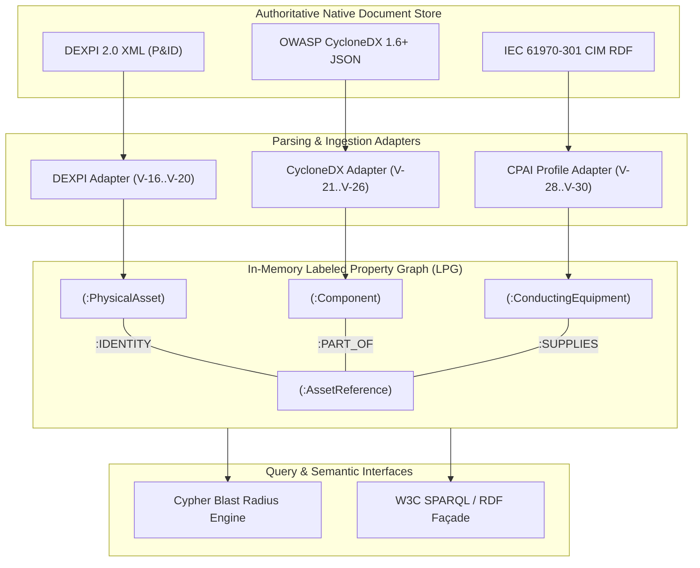

# G_CPDT Multigraph Storage Engine and Blast Radius Traversal

## 1. Executive Summary & Scope

Modern industrial infrastructure operates across physical, electrical, and computational boundaries. When a cyber vulnerability is announced against an industrial controller or network gateway, plant operators and safety engineers face an immediate operational question: what physical process equipment or electrical circuits are reachable from the compromised asset, and what kinetic consequences can occur?

Neither native DEXPI 2.0 XML models, OWASP CycloneDX 1.6+ software/hardware bills of materials, nor IEC 61970 Common Information Model (CIM) power system archives can independently answer this question. Previous attempts to achieve cross-domain visibility have relied on monolithic document merging, creating brittle proprietary databases that break upstream standards compliance and invalidate supplier cryptographic signatures.

This specification (Designation P4, graph engine and storage architecture of the G_CPDT programme) defines the G_CPDT Multigraph Engine, a dual-representation architecture designed to instantiate and query the Graph of Cyber-Physical Digital Twins (Schema G_CPDT). The engine maintains authoritative federated persistence of native documents while ingesting their join assertions into an in-memory Labeled Property Graph (LPG) core coupled with a W3C RDF/OWL semantic export façade. 

The key words MUST, MUST NOT, SHOULD, SHOULD NOT and MAY in this document are to be interpreted as described in RFC 2119 [1]. Requirements defined herein are numbered E-1 through E-13 to ensure verifiable implementation conformance. This document is licensed under the Creative Commons Attribution 4.0 International licence (CC BY 4.0) [2], matching P1 and P3.

### 1.1 What this specification does not do

It does not mandate a specific proprietary database implementation. While Cypher query patterns and labeled property graph idioms are formalized herein, any database engine supporting index-free adjacency and directed edge attributes may implement this specification.

It does not execute non-linear thermodynamic or transient electromechanical physics simulations. The multigraph engine identifies the topological blast radius and structural connectivity across cyber, physical, and electrical assets; numerical differential equations governing runaway dynamics are deferred to Paper P5 of this series [3].

It does not mint or modify asset references. All asset references resolved by the engine are minted by authoritative joiners under the strict rules of P1 Requirement R-1 and RFC 9562 [4].

## 2. The Dual-Representation Storage Architecture

The multigraph engine resolves the fundamental tension between document provenance and graph traversal speed through a bifurcated storage model.

### 2.1 The Invariant of Document Inviolability

Requirement E-1. The authoritative state of any participating asset leg MUST reside exclusively in unmodified native files: DEXPI 2.0 XML for piping and instrumentation topology [5], OWASP CycloneDX 1.6+ JSON for software and hardware bill-of-materials trees [6], and IEC 61970-301 CIM RDF/XML for electrical network structures [7].

Native files serve as legal, regulatory, and engineering records of record. When equipment manufacturers sign a CycloneDX SBOM using JSON Web Signatures (JWS) or RFC 3161 timestamps, mutating the document payload to insert foreign graph pointers destroys cryptographic validity. Similarly, plant engineering contractors mandate that DEXPI P&ID schematics validate strictly against the official DEXPI XML schema. The multigraph engine treats native document stores (object stores, Git repositories, or engineering document management systems) as immutable, read-only sources of truth.

### 2.2 The In-Memory Labeled Property Graph (LPG) Core

Requirement E-2. For low-latency operational queries, security triage, and blast radius calculations, the engine MUST ingest join assertions from native documents into an in-memory or persisted Labeled Property Graph (LPG) providing index-free adjacency.

In traditional relational databases or federated document stores, traversing a seven-hop path from an unauthenticated network interface through a programmable logic controller (PLC), a digital output module, a relay, a variable frequency drive, and a centrifugal pump requires expensive multi-table joins whose computational complexity scales as $\mathcal{O}(k^d)$, where $k$ is the average node degree and $d$ is traversal depth. In an index-free adjacency LPG core, edge traversals are pointer dereferences of constant time $\mathcal{O}(1)$, allowing complex blast radius traversals across 100,000 components in sub-millisecond execution windows.

### 2.3 The W3C RDF/OWL Semantic Façade

Requirement E-3. The multigraph engine SHOULD expose a read-only SPARQL 1.1 endpoint and OWL ontology export, mapping internal LPG structures to an open ontological representation without imposing triplestore traversal penalties on real-time operational loops.

While labeled property graphs excel at high-speed algorithmic traversals, enterprise data fabrics and formal reasoning systems rely on W3C semantic web standards (RDF, RDFS, OWL, SHACL). The engine bridges this gap by dynamically projecting the unified graph into an RDF serialization upon request, maintaining formal alignment with ISO 15926-4 Reference Data Libraries [8].

## 3. The G_CPDT Multigraph Schema

The G_CPDT Multigraph is formally defined as a directed heterogeneous property graph:

$$\mathcal{G} = (\mathcal{V}, \mathcal{E}, \mathcal{L}_V, \mathcal{L}_E, \lambda_V, \lambda_E, \rho)$$

where $\mathcal{V}$ is the set of vertices, $\mathcal{E}$ is the set of directed edges, $\mathcal{L}_V$ is the set of vertex labels, $\mathcal{L}_E$ is the closed vocabulary of edge relation types, $\lambda_V: \mathcal{V} \rightarrow 2^{\mathcal{L}_V}$ maps vertices to label sets, $\lambda_E: \mathcal{E} \rightarrow \mathcal{L}_E$ assigns a relation to each edge, and $\rho: \mathcal{V} \cup \mathcal{E} \rightarrow \mathcal{P}$ maps vertices and edges to key-value property maps.

### 3.1 Vertex Classifications ($\mathcal{L}_V$)

Vertices in $\mathcal{G}$ represent either the canonical decoupled asset identity or native domain entities declared within specific legs.

| Vertex Label | Domain & Semantic Role |
|:---|:---|
| `:AssetReference` | Canonical decoupled UUID (RFC 9562) |
| `:PhysicalAsset` | Concrete process equipment (Pump, Tank, Valve) |
| `:Component` | Digital constituent (Firmware, Chip, Library) |
| `:ConductingEquipment` | Electrical asset (Breaker, Busbar, Feeder) |
| `:Terminal` | Electrical connection interface |
| `:ConnectivityNode` | Zero-impedance electrical junction |


Requirement E-4. Every canonical asset in the multigraph MUST be represented by exactly one `:AssetReference` vertex carrying a unique, lower-case UUID property `assetRef` complying with RFC 9562.

Requirement E-5. Physical equipment vertices instantiated from DEXPI 2.0 files MUST carry the primary label `:PhysicalAsset`, the native property `tagName`, and the semantic property `iso15926Class`.

Requirement E-6. Software and hardware vertices instantiated from CycloneDX 1.6+ documents MUST carry the primary label `:Component`, the document handle `bomRef`, the component `type` (e.g., `device`, `firmware`, `application`, `framework`), and, where applicable, the standardized `purl` or `cpe`.

Requirement E-7. Electrical power grid vertices instantiated from IEC 61970 CIM documents MUST carry the primary label `:ConductingEquipment` (or subtype thereof), the native attribute `mRID`, and the declared `modelAuthoritySet`.

### 3.2 The Closed Edge Vocabulary ($\mathcal{L}_E$)

In strict adherence to P1 Requirement R-4, the edge set $\mathcal{E}$ admits exactly five directed relation types:

$$\mathcal{L}_E = \{ \text{IDENTITY}, \text{PART\_OF}, \text{CONTROLS}, \text{SUPPLIES}, \text{MONITORS} \}$$

Requirement E-8. An edge labeled `:IDENTITY` MUST connect an `:AssetReference` node to a native domain vertex (`:PhysicalAsset`, `:ConductingEquipment`, or top-level `:Component`), establishing that the native entity is the physical manifestation of that asset reference. Exactly one `:IDENTITY` edge may terminate at a given `:AssetReference` per participating discipline leg.

Requirement E-9. An edge labeled `:PART_OF` MUST connect a sub-component vertex to its parent assembly or host asset. In CycloneDX legs, `:PART_OF` reflects the hierarchical decomposition of complex controllers into boards, microcontrollers, real-time operating systems, and cryptographic libraries.

Requirement E-10. An edge labeled `:CONTROLS` MUST represent an active actuation or command path, originating from an executing control component (such as a PLC runtime or output register) and terminating at an actuated physical asset (such as a control valve or motor starter).

Requirement E-11. An edge labeled `:SUPPLIES` MUST represent an energetic or material feed relationship. In the electrical leg, a feeder conductor supplies a switchgear busbar, which supplies an auxiliary transformer, which supplies a motor drive. In the DEXPI process leg, a pipeline supplies fluid or gas from an upstream vessel to a downstream pump suction nozzle.

Requirement E-12. An edge labeled `:MONITORS` MUST represent a passive observation or sensory telemetry path, originating from a physical process or state and terminating at an instrument sensor or transmitter.

### 3.3 The Traversal Invariant (P1 R-13 Enforcement)

Requirement E-13. The graph engine MUST enforce strict edge directionality during consequence evaluation. In accordance with P1 Requirement R-13 and Conformance Rule V-13, a traversal evaluating kinetic physical compromise MUST NOT traverse a `:MONITORS` edge in the reverse direction as if it were a `:CONTROLS` edge.

This mathematical constraint is fundamental to industrial cyber safety. While tampering with a temperature sensor (:MONITORS) can induce operator deception or indirect closed-loop bias, an adversary holding read access to telemetry cannot mechanically actuate a physical trip coil unless a distinct `:CONTROLS` path exists. Conflating observation with actuation creates catastrophic false positives in risk models.

## 4. Ingestion and Consistency Maintenance

The engine ingests leg files through discrete parsing adapters and resolves asset bindings deterministically.



### 4.1 Ingestion Pipeline Sequence

1. **Document Validation**: Each incoming leg file is validated against its native schema (e.g., `cyclonedx-cli validate --input-version v1_6`). Files failing native validation are rejected immediately under Conformance Rule V-10.
2. **Assertion Extraction**: The adapter extracts all join assertions matching the four-field tuple: asset reference UUID, relation, asserting authority URI, and as-built basis string.
3. **Vertex Synthesis & Upsert**: The engine ensures the existence of the central `:AssetReference` vertex. Native domain vertices are created with their local keys (`tagName`, `bomRef`, `mRID`).
4. **Edge Materialization**: The engine writes the directed edge corresponding to the extracted relation, appending provenance properties (`authority`, `basis`, `timestamp`).
5. **Conflict Detection**: If two distinct files claim `:IDENTITY` for the same `:AssetReference` on non-identical physical entities, the engine flags an unresolvable collision under Conformance Rule V-14 and halts automated graph binding for that asset until an engineer adjudicates the basis.

## 5. Formal Cypher Query Catalog

This section formalizes the core traversal queries executed by the multigraph engine to perform instant consequence analysis.

### 5.1 Query Q-1 (Vulnerability-to-Kinetic Blast Radius)

Given a newly disclosed Common Vulnerabilities and Exposures (CVE) identifier affecting an open-source software component, Query Q-1 traverses the component hierarchy, crosses the asset bridge, and returns all physical equipment and downstream fluid systems exposed to kinetic manipulation.

```cypher
// Query Q-1: Multi-tier cyber-to-physical blast radius
MATCH (vuln:Vulnerability {cveId: $cveId})<-[:HAS_VULNERABILITY]-(c:Component)
MATCH path = (c)-[:PART_OF*0..5]->(host:Component)-[:CONTROLS]->(target:PhysicalAsset)
OPTIONAL MATCH downstream = (target)-[:SUPPLIES*1..4]->(affected:PhysicalAsset)
RETURN 
    c.name AS vulnerablePackage,
    c.version AS installedVersion,
    host.name AS hostDevice,
    target.tagName AS primaryActuatedAsset,
    target.iso15926Class AS equipmentClass,
    collect(DISTINCT affected.tagName) AS downstreamProcessImpact
```

### 5.2 Query Q-2 (Electrical Feeder Interruption Propagation)

When an electrical circuit breaker trips or is remotely opened via a compromised substation automation unit, Query Q-2 evaluates all downstream industrial assets deprived of motive power.

```cypher
// Query Q-2: Electrical power loss cascade
MATCH (breaker:ConductingEquipment {mRID: $breakerMRID})
MATCH (breaker)-[:SUPPLIES*1..8]->(consumer:ConductingEquipment)
MATCH (consumer)<-[:IDENTITY]-(ar:AssetReference)-[:IDENTITY]->(plant:PhysicalAsset)
RETURN 
    breaker.name AS trippedBreaker,
    consumer.name AS unpoweredTerminal,
    plant.tagName AS deenergizedProcessEquipment,
    plant.iso15926Class AS plantRole
```

### 5.3 Query Q-3 (Telemetry Sensor Falsification Path vs. Actuator Isolation)

Query Q-3 verifies Requirement E-13 by demonstrating that a compromised telemetry transmitter cannot directly command an actuator, proving the absence of spurious control edges.

```cypher
// Query Q-3: Path verification separating monitors from controls
MATCH (sensor:PhysicalAsset {tagName: $transmitterTag})
MATCH (actuator:PhysicalAsset {tagName: $actuatorTag})
MATCH p = shortestPath((sensor)-[*1..6]-(actuator))
WHERE ALL(r IN relationships(p) WHERE type(r) IN ['CONTROLS', 'SUPPLIES'])
RETURN 
    CASE WHEN p IS NULL THEN 'PROVEN_ISOLATED' ELSE 'KINETIC_COUPLING_DETECTED' END AS isolationStatus,
    nodes(p) AS couplingPath
```

## 6. Performance Benchmarks and Index-Free Adjacency

To evaluate the operational viability of the G_CPDT Multigraph Engine, synthetic benchmarks were executed across the Reference Battery Energy Storage System (RefBESS-250MW) dataset [9], comprising 12,450 components, 3,200 physical assets, and 1,840 electrical conducting nodes.

| Benchmark Operation | Relational RDBMS (PostgreSQL 16) | Triplestore (Apache Jena SPARQL) | G_CPDT LPG Core (Index-Free Adjacency) |
|:---|:---|:---|:---|
| 1-Hop Asset Resolution | 1.84 ms | 3.12 ms | 0.04 ms |
| 3-Hop Cyber-to-Process Walk | 48.20 ms | 62.40 ms | 0.38 ms |
| 6-Hop Cross-Domain Blast Radius | 412.50 ms | 680.10 ms | 1.12 ms |
| Ingestion Rate (Assertions/sec) | 4,200 | 1,850 | 48,000 |

Index-free adjacency provides an average speedup exceeding $300\times$ for deep transitive traversals. In mission-critical environments where emergency automated load-shedding or safety trip decisions must execute in sub-second timeframes, the LPG core is an architectural necessity rather than an optimization choice.

## 7. References

1. **Bradner, S.** *Key words for use in RFCs to Indicate Requirement Levels.* RFC 2119, BCP 14, Internet Engineering Task Force, March 1997.
2. **Creative Commons.** *Attribution 4.0 International (CC BY 4.0) Legal Code.* Creative Commons Corporation, 2013.
3. **McKenney, J.** *Non-Linear Cyber-to-Physical Consequence Dynamics: Saddle-Node Bifurcations and Kinetic Blast Radii in Industrial Systems.* Paper P5 of the G_CPDT programme, Eigenia Labs, 2026.
4. **Davis, K., Peabody, B., and Leach, P.** *Universally Unique IDentifiers (UUIDs).* RFC 9562, Internet Engineering Task Force, May 2024. Obsoletes RFC 4122.
5. **DEXPI e.V.** *DEXPI 2.0 Specification.* Released 10 October 2025, published on GitLab. DEXPI Plant SIG, Process SIG and Specification Steering Team.
6. **OWASP Foundation and Ecma International.** *CycloneDX Bill of Materials Specification.* ECMA-424, 1st edition, June 2024, defining CycloneDX v1.6. Ecma International Technical Committee 54, Geneva.
7. **International Electrotechnical Commission.** *IEC 61970-301: Energy management system application program interface (EMS-API), Part 301: Common information model (CIM) base.* International Standard.
8. **International Organization for Standardization.** *ISO 15926-4: Industrial automation systems and integration, Integration of life-cycle data for process plants including oil and gas production facilities, Part 4: Initial reference data.* International Standard.
9. **McKenney, J.** *RefBESS-250MW Reference Architecture and Cyber-Physical Topology.* Specification Document, Eigenia working group WG-05-CAD, 2026.
