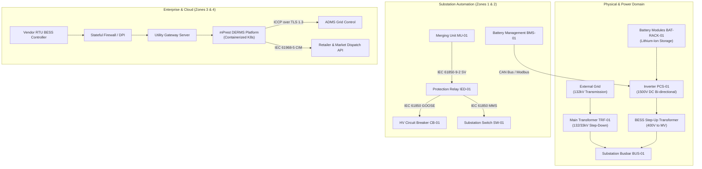

# Substation & Battery Energy Storage System (BESS) Graph Topology Specification
## Interface Connection Architecture, Node Inventories, and Multi-Level P&ID Abstraction for Cyber Digital Twins

### Executive Abstract

Integrating modern Distributed Energy Resources (DER) into legacy electrical grid substations requires unifying physical plant schematics, electrical power lines, telemetry protocols, and safety envelopes into a computable knowledge graph. Disconnected computer-aided design (CAD) diagrams and static spreadsheets fail to reflect the dynamic failure cascades that emerge when software automation, battery thermal runaway envelopes, and power conversion systems interact.

This specification formalizes the **Substation and Battery Energy Storage System (BESS) Graph Topology**. By capturing equipment assets as typed graph nodes and flows as directed, attributed edges, this model bridges the gap between process engineering (DEXPI 2.0 / ISO 15926-4) [3][5], power systems automation (IEC 61850) [1], market dispatch integration (IEC 61968-5 CIM) [2], and cyber-physical security zoning (IEC 62443-3-2) [4].

---

---

### PART 1: Node Inventory (Bill of Materials)

These entities represent the foundational vertices in the Cyber Digital Twin, categorized across physical, electrical, automation, and enterprise governance tiers:

#### 1. Primary Electrical Substation System (Physical & Power Layer)
* **TRF-01:** High-voltage power transformer (step-down/step-up, e.g., 132/33kV or 33/11kV).
* **CB-01:** High-voltage circuit breaker ($\text{SF}_6$ or vacuum interrupter).
* **BUS-01:** Substation busbar conductor assembly (copper/aluminium).
* **DS-01:** Motor-operated disconnector and isolator switch.
* **LA-01:** Metal-oxide surge and lightning arrester.
* **GND-01:** Substation grounding and earthing grid conductor mesh.

#### 2. Battery Energy Storage System (BESS Architecture)
* **BAT-RACK-01:** Lithium-ion battery module strings and rack enclosures.
* **PCS-01:** Power conversion system and bi-directional inverter (1500V DC to 400V AC).
* **BESS-TRF-01:** Dedicated BESS step-up transformer (medium-voltage coupling).
* **BMS-01:** Battery management system (master controller and string/module telemetry).
* **HVAC-01:** Environmental thermal management unit (chilled water / forced air convection).
* **FSS-01:** Automated fire suppression system (VESDA early detection, Novec 1230 clean agent, or deluge spray).

#### 3. Substation Auxiliary & Emergency Power
* **AUX-BAT-01:** 110V DC station battery bank (valve-regulated lead-acid, VRLA).
* **AUX-CHG-01:** Redundant uninterruptible DC battery charger system.
* **AUX-DC-BUS:** Station 110V DC distribution switchboard and protective fusing.

#### 4. Substation Automation & OT Network (IEC 62443 Zones 1 & 2)
* **IED-01:** Intelligent electronic device and protective relay (Zone 1 process bus).
* **MU-01:** Optical merging unit digitizing analogue CT/VT signals per IEC 61850-9-2 [1].
* **RTU-EE:** Utility remote terminal unit (Zone 2.3 supervisory interface).
* **RTU-VEN:** Vendor-managed remote terminal unit (BESS subsystem controller).
* **SW-01:** Ruggedized substation Ethernet switch (Layer 2 VLAN separation).
* **FW-01:** Substation perimeter stateful firewall and deep packet inspection gateway (Zone 2.4) [4].
* **MOD-01:** Utility-controlled cellular edge gateway (private APN encrypted tunnel).

#### 5. Central IT/OT & Cloud Integration (Zones 3, 4 & External Interfaces)
* **DERMS-01:** Distributed Energy Resource Management System application cluster (Kubernetes on Nutanix).
* **UT-SRV-01:** Central utility gateway server managing data plane and control plane routing.
* **ADMS-01:** Advanced Distribution Management System (Zone 3.1.3 supervisory core).
* **ICCP-GW:** Inter-Control Center Communications Protocol adapter proxy.
* **EIP-01:** Enterprise integration platform message broker.
* **HIST-01:** Time-series operational historian database (PostgreSQL / TimescaleDB).
* **OT-BUS-01:** On-premise industrial enterprise service bus.
* **AZ-APIM:** Cloud API management gateway.
* **AZ-BUS:** Cloud enterprise message queue.
* **AZ-SQL:** Relational cloud registry database.
* **PORTAL-INST:** Installer and connection compliance web portal.
* **API-RET:** Market retailer programmatic dispatch interface.
* **BH-01:** Secure OT bastion host and multi-factor jump gateway (Zone 3.5).
* **ANALYTICS-01:** Dynamic operating envelope and grid constraint calculator.

---

### PART 2: Interface Connection Mapping (Edges)

Edges define directed relationships between nodes, carrying physical medium, protocol parameters, and operational payloads:

#### A. Physical & Environmental Flows
| Source Node | Target Node | Edge / Relationship | Protocol / Medium / Payload |
|:---|:---|:---|:---|
| `HVAC-01` | `BAT-RACK-01` | `THERMAL_REGULATION` | Chilled air / forced convection cooling |
| `FSS-01` | `BAT-RACK-01` | `FIRE_SUPPRESSION` | Clean agent (Novec 1230 / $\text{CO}_2$) or high-pressure water spray |

#### B. Electrical Power Flows
| Source Node | Target Node | Edge / Relationship | Protocol / Medium / Payload |
|:---|:---|:---|:---|
| `External Grid` | `TRF-01` | `POWER_TRANSMISSION` | High-voltage AC (132 kV, 50 Hz) |
| `TRF-01` | `BUS-01` | `POWER_DISTRIBUTION` | Medium-voltage AC (33 kV / 11 kV) |
| `BAT-RACK-01` | `PCS-01` | `POWER_DC_BUS` | High-voltage direct current (1500 V DC) |
| `PCS-01` | `BESS-TRF-01` | `POWER_AC_LOW` | Three-phase low-voltage AC (400 V AC) |
| `BESS-TRF-01` | `BUS-01` | `POWER_COUPLING` | Medium-voltage AC injection (33 kV) |
| `AUX-CHG-01` | `AUX-BAT-01` | `POWER_AUXILIARY` | 110 V DC float charging current |
| `AUX-BAT-01` | `IED-01` / `CB-01` | `POWER_CONTROL` | 110 V DC trip coil and relay backup supply |

#### C. Substation Automation & Local Control (Zones 1 & 2)
| Source Node | Target Node | Edge / Relationship | Protocol / Medium / Payload |
|:---|:---|:---|:---|
| `MU-01` | `IED-01` | `PROCESS_BUS_DATA` | IEC 61850-9-2 Sampled Values (SV) [1] |
| `IED-01` | `CB-01` | `PROTECTIVE_TRIP` | IEC 61850 GOOSE (fast trip / close interlock) |
| `IED-01` | `SW-01` | `STATION_BUS_MMS` | IEC 61850-8-1 MMS (status reporting) |
| `BMS-01` | `PCS-01` | `SAFETY_INTERLOCK` | CAN Bus / Modbus TCP (state of charge, thermal limits) |
| `BMS-01` | `RTU-VEN` | `TELEMETRY_MONITOR` | Modbus TCP / RTU cyclic polling |
| `RTU-EE` | `RTU-VEN` | `BOUNDARY_ISOLATION` | Optically isolated RS-485 serial connection (strict ACLs) |

#### D. BESS Gateway & Remote Engineering Access
| Source Node | Target Node | Edge / Relationship | Protocol / Medium / Payload |
|:---|:---|:---|:---|
| `RTU-VEN` | `MOD-01` | `LOCAL_TRANSPORT` | IEEE 802.3 Ethernet / IPv4 |
| `MOD-01` | `FW-01` | `WAN_TRANSPORT` | Encrypted IPsec tunnel across private APN cellular link |
| `FW-01` | `UT-SRV-01` | `INGRESS_CONDUIT` | WireGuard / IPsec VPN carrying Modbus TCP (ports 502, 3113) |
| `Vendor Engineer` | `BH-01` | `REMOTE_SESSION` | HTTPS / FIDO2 MFA via hardened Citrix jump host |
| `BH-01` | `RTU-VEN` | `MANAGEMENT_LINK` | SSH (port 22) / proprietary fleet manager over restricted VLAN |

#### E. Enterprise Integration & Real-Time Grid Dispatch
| Source Node | Target Node | Edge / Relationship | Protocol / Medium / Payload |
|:---|:---|:---|:---|
| `UT-SRV-01` | `DERMS-01` | `INGESTION_STREAM` | REST / gRPC carrying normalized telemetry |
| `DERMS-01` | `ICCP-GW` | `GRID_DISPATCH` | Internal ICCP proxy protocol |
| `ICCP-GW` | `ADMS-01` | `GRID_DISPATCH_WAN` | ICCP (IEC 60870-6) over TLS 1.3 mutual certificate exchange |
| `UT-SRV-01` | `AZ-APIM` | `CLOUD_TELEMETRY` | Mutual TLS HTTPS REST endpoints |
| `AZ-APIM` | `AZ-BUS` | `MESSAGE_ROUTING` | AMQP (ports 5671, 5672) message bus |
| `AZ-BUS` | `HIST-01` | `DATA_ARCHIVAL` | Batch ingestion into PostgreSQL / TimescaleDB tables |
| `API-RET` | `DERMS-01` | `MARKET_SCHEDULE` | IEC 61968-5 CIM JSON schema over HTTPS [2] |
| `ANALYTICS-01` | `DERMS-01` | `CAPACITY_ENVELOPE` | HTTPS JSON dynamic operating envelope updates |

---

### PART 3: Digital Twin Graph Instantiation Guidelines

To ingest this specification into a property graph database (Neo4j / Azure Digital Twins):

1. **Node Properties:** Every entity in Part 1 is instantiated with:
   - `node_id`: Unique identifier (e.g., `TRF-01`, `BMS-01`).
   - `zone_level`: IEC 62443 zone assignment (e.g., `Zone 1`, `Zone 2.3`, `Zone 3.5`).
   - `criticality_tier`: Asset loss criticality rating ($C \in [1, 4]$).
   - `dexpi_uri`: Standardized ISO 15926-4 reference URI [5].
2. **Edge Properties:** Relationships in Part 2 are instantiated as directed edges:
   - `[:CARRIES_FLOW {type: "ELECTRICAL", voltage_v: 1500, medium: "DC_BUS"}]`
   - `[:CARRIES_CONTROL {protocol: "IEC_61850_GOOSE", latency_ms: 4.0, encrypted: false}]`
3. **Lateral Movement Restriction (Zone Boundary Defense):** Notice that no routable Ethernet path connects `RTU-EE` and `RTU-VEN`. They interact strictly via serial connections or hardware-isolated jump proxies. In the Seldon graph simulation engine, this architectural boundary introduces a massive Kramers potential barrier height, preventing an attacker on the vendor subsystem from laterally pivoting into utility substation protection relays.

---

## References & Empirical Citations

- [1] **IEC 61850 (2021)**: *Communication networks and systems for power utility automation*. International Electrotechnical Commission.
- [2] **IEC 61968-5 (2020)**: *Application integration at electric utilities — System interfaces for distribution management — Part 5: Distributed energy optimization*.
- [3] **DEXPI e.V. (2025)**: *DEXPI 2.0 Specification: Plant and Process Information Exchange*.
- [4] **IEC 62443-3-2 (2020)**: *Security for industrial automation and control systems — Security risk assessment for system design*.
- [5] **ISO 15926-4 (2019)**: *Industrial automation systems and integration — Integration of life-cycle data for process plants including oil and gas production facilities*.
