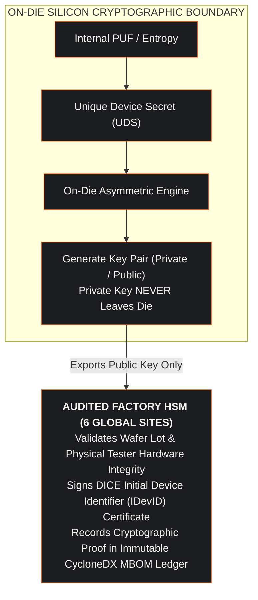
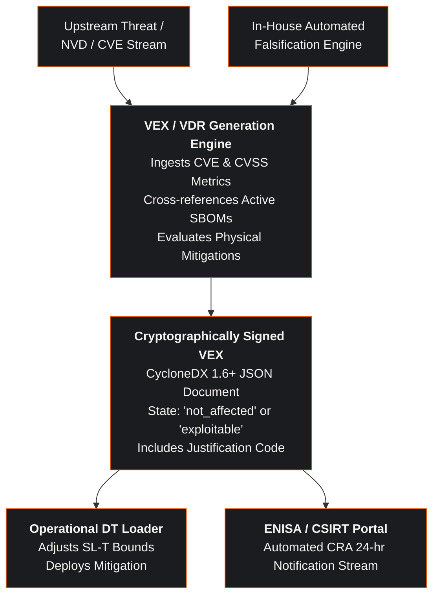

## Abstract

Regulation (EU) 2024/2847, the Cyber Resilience Act (CRA), was adopted on 23 October 2024, published in the Official Journal on 20 November 2024, and entered into force on 10 December 2024. It establishes mandatory cybersecurity requirements for products with digital elements placed on the Single Market. Article 71(2) staggers application: Chapter IV applies from 11 June 2026, the Article 14 reporting obligations from 11 September 2026, and the Regulation in full from 11 December 2027. The era of voluntary cybersecurity questionnaires and qualitative vendor self-attestations is closing on a fixed schedule. Article 13, Article 14 and Annex I mandate a machine-readable Software Bill of Materials (SBOM) covering at least the top-level dependencies, a 24-hour early warning followed by notification within 72 hours, and supply chain provenance the manufacturer must be able to produce on a reasoned request from a market surveillance authority. Violations trigger statutory penalties under Article 64(2): administrative fines up to 15,000,000 EUR or 2.5 % of worldwide annual turnover, whichever is higher.

For critical infrastructure operators, industrial automation vendors, and high-density AI compute providers, compliance cannot be achieved through manual audits. Modern infrastructure depends on multi-tiered supply chains spanning overseas Original Design Manufacturers (ODMs), sub-tier silicon foundries, open-source firmware repositories, and third-party commercial software dependencies. A vulnerability introduced at any stage; whether a backdoored Baseboard Management Controller (BMC) image, an unverified field-programmable gate array bitstream, or a shared manufacturing symmetric key; compromises the entire operational technology perimeter. When such firmware overrides secondary cooling manifold valves or voltage regulators, the failure mode is not purely digital; it triggers physical hydraulic cavitation, thermodynamic heat flux runaway, and catastrophic transformer stress.

This paper provides a complete systems assurance blueprint for implementing machine-to-machine (M2M) supply chain transparency. We formulate the statutory penalty mechanics under Article 64, formalize the principle of As Low As Reasonably Practicable (ALARP) to justify Security Level Target deviations under IEC 62443, and model multi-tier supply chain compromise probabilities. We present the operational architecture for independent 6-site manufacturing Hardware Security Module (HSM) audits, on-die asymmetric key injection, and automated Vulnerability Exploitability eXchange (VEX) pipelines. Finally, we analyze the actuarial implications for cyber catastrophe underwriting, Probable Maximum Loss (PML), Return on Security Investment (ROSI), and reinsurance treaty exclusions under Lloyd's Y5381.

---

## 1. Regulatory Architecture: The Cyber Resilience Act (Regulation 2024/2847)

The Cyber Resilience Act fundamentally restructures product liability for hardware and software in the European Union. Unlike Directive (EU) 2022/2555 (NIS2), which governs the operational security of essential and important entities, the CRA places direct legal obligations on economic operators: manufacturers, importers, and distributors.

### 1.1 Scope and Product Classifications
The CRA applies to products with digital elements whose intended or reasonably foreseeable use includes a direct or indirect logical or physical data connection to a device or network. Article 2 carves out several sectors already governed by equivalent rules: medical devices under the MDR and IVDR, civil aviation, motor vehicles under the type-approval regime, marine equipment, products developed exclusively for national security or defence, and spare parts made to the same specifications as the components they replace. Non-commercial open-source software sits outside the Regulation by a different route, not by an Article 2 exclusion: Article 3(2) defines making available on the market as supply in the course of a commercial activity, and open-source stewards carry their own lighter set of obligations.

The Regulation names **two** designations. Article 7 designates **important** products, divided by Article 7(2) into class I and class II, and Article 8 designates **critical** products. Products matching neither are a residual the Regulation does not name; the Commission calls it the default category. Classification turns on the product's **core functionality** under Article 7(1), not on a function it happens to include incidentally. With the unnamed residual, that gives four distinct conformity routes:

1. **Default category (not listed in either annex):**
   The majority of software applications and consumer hardware. Under Article 32(1) the manufacturer has a free choice of four procedures: module A internal control, module B plus C, module H, or a European cybersecurity certification scheme where one is available and applicable. Module A is available irrespective of the technical specification used.
2. **Important products with digital elements, class I (Annex III):**
   Nineteen named categories, including identity and privileged access management, standalone and embedded browsers, password managers, VPN products, network management systems, SIEM systems, boot managers, public key infrastructure software, operating systems, routers, modems and switches, and microprocessors, microcontrollers, ASICs and FPGAs with security-related functionalities. Under Article 32(2) module A remains available only where harmonised standards, common specifications, or a certification scheme at assurance level at least 'substantial' have been applied **in full**; otherwise module B plus C, or module H, is required.
3. **Important products with digital elements, class II (Annex III):**
   Four named categories: hypervisors and container runtime systems, firewalls and intrusion detection and prevention systems, tamper-resistant microprocessors, and tamper-resistant microcontrollers. Article 32(3) removes module A entirely; the routes are module B plus C, module H, or a certification scheme at least 'substantial'.
4. **Critical products with digital elements (Annex IV):**
   Three named categories: hardware devices with security boxes, which the implementing regulation states includes hardware security modules that generate and manage cryptographic elements; smart meter gateways and other devices for secure cryptoprocessing; and smartcards and similar devices including secure elements. Article 32(4) puts a European cybersecurity certification scheme under Article 8(1) first, falling back to the Article 32(3) procedures where the Article 8(1) conditions are not met.

The technical descriptions of these categories are given in Commission Implementing Regulation (EU) 2025/2392, adopted 28 November 2025: its Annex I describes the Annex III classes, its Annex II the Annex IV categories. Twenty-six categories are named in total, nineteen in class I, four in class II and three critical.

A programmable logic controller illustrates why core functionality governs. A PLC is squarely in scope of the CRA, but neither Annex III nor Annex IV names programmable logic controllers or industrial automation systems, so a PLC is a default-category product unless its core functionality matches a listed category, for example a microcontroller with security-related functionalities.

**Table 1.1: EU Cyber Resilience Act (Regulation 2024/2847) product classes.**

| Designation | Annex | Example products | Conformity route (Article 32) |
| :--- | :--- | :--- | :--- |
| **Critical** | IV | Hardware security modules, smart meter gateways, secure elements | Certification scheme under Article 8(1); where its conditions are unmet, the Article 32(3) procedures |
| **Important, class II** | III | Hypervisors, firewalls, intrusion detection and prevention, tamper-resistant microprocessors | Module B+C, module H, or a certification scheme at least 'substantial'. No module A |
| **Important, class I** | III | Operating systems, routers and switches, microcontrollers with security-related functionalities, identity management | Module A only where harmonised standards, common specifications or a certification scheme are applied in full; otherwise B+C or H |
| **Default** | neither | General software, compute trays, support utilities, PLCs without a listed core function | Free choice of module A internal control, B+C, H, or a certification scheme |

### 1.2 Essential Cybersecurity Requirements (Annex I)
Annex I sets the essential cybersecurity requirements in two parts. They are not unconditional: Part I point 2 applies "on the basis of the cybersecurity risk assessment referred to in Article 13(2) and where applicable", and Article 13(4) lets a manufacturer document why a given requirement does not apply to a product.

- **Part I, cybersecurity requirements relating to the properties of products with digital elements:** Products must be delivered with a secure by default configuration and free from known exploitable vulnerabilities. Annex I Part I requires protection of the confidentiality and integrity of stored, transmitted and processed data, protection against unauthorised access through appropriate control mechanisms including authentication and identity management, minimisation of the attack surface, mitigation of the impact of an incident through exploitation mitigation techniques, and the recording and monitoring of relevant internal activity.
- **Part II, vulnerability handling requirements:** Manufacturers must identify and document vulnerabilities and components, address and remediate them without delay, apply effective and regular tests, publicly disclose information about fixed vulnerabilities once a security update is available, enforce a coordinated vulnerability disclosure policy, provide a contact address for reporting vulnerabilities, and, where technically feasible, provide security updates separately from functionality updates. These obligations run for the support period, which Article 13(8) sets at **at least five years** unless the product is expected to be in use for less time, in which case it matches the expected use time. Notification of an actively exploited vulnerability is a separate obligation under Article 14, not part of Annex I.

### 1.3 Statutory Penalty Tiers (Article 64)
Article 64 establishes three administrative fine ceilings enforced by national market surveillance authorities. Articles 65 through 68 are not penalty provisions: Article 65 concerns representative actions, and Articles 66 to 68 amend Regulation (EU) 2019/1020, Directive (EU) 2020/1828 and Regulation (EU) No 168/2013 respectively.

1. **Tier 1 (Article 64(2)): the essential requirements and the Article 13 and 14 obligations.**
   Infringement of the essential cybersecurity requirements in Annex I, or of the manufacturer obligations in Articles 13 and 14; including secure development, vulnerability handling, and technical documentation such as a machine-readable SBOM; results in administrative fines up to 15,000,000 EUR or 2.5 % of worldwide annual turnover for the preceding financial year, whichever is higher.
2. **Tier 2 (Article 64(3)): other obligations under the Regulation.**
   Breaches of other statutory provisions (such as CE marking formalities, distributor verification duties, or importer record-keeping) trigger fines up to 10,000,000 EUR or 2 % of worldwide annual turnover, whichever is higher.
3. **Tier 3 (Article 64(4)): incorrect, incomplete or misleading information.**
   Supplying incorrect, incomplete or misleading information to notified bodies or market surveillance authorities triggers fines up to 5,000,000 EUR or 1 % of worldwide annual turnover, whichever is higher.

Article 64(5) is not a fourth tier; it lists the aggravating and mitigating factors a market surveillance authority weighs when setting the amount.

---

## 2. Supply Chain Opacity in High-Density Infrastructure

Modern computing platforms and industrial control systems exhibit extreme supply chain complexity. A typical liquid-cooled compute rack or industrial control center integrates components from over two hundred individual commercial suppliers across multiple geographic jurisdictions.

### 2.1 The Multi-Tier Value Chain
The supply chain operates across four distinct tiers:

- **Tier 0 (Silicon Foundry and Packaging):** Fabrication of compute silicon, memory dies, interposers, and physical root-of-trust chips. Key vulnerabilities include hardware trojans, layout mask tampering, and unverified fuse states.
- **Tier 1 (Semiconductor Vendor and Board Integrator):** Assembly of multi-chiplet modules, carrier boards, and daughtercards. Initial firmware flashing and factory key injection occur at this stage.
- **Tier 2 (Original Design Manufacturer - ODM):** Physical assembly of server trays, cooling distribution manifolds, power supplies, and chassis backplanes. ODMs configure Baseboard Management Controllers and proprietary initialization code.
- **Tier 3 (System Integrator and Data Center Facility):** Rack integration, fluid connection, 400V power hookup, and commissioning onto the operational technology network.


### 2.2 Physical Failure Coupling Induced by Supply Chain Tampering
When an adversary compromises a firmware module in an ODM-flashed microcontroller; such as an unauthenticated Modbus TCP interface or an unencrypted I2C thermal fan controller; the compromise couples directly to the physical facility:

1. **Hydraulic Manifold Starvation:** The compromised firmware commands proportional valves to throttle volumetric delivery below the calibrated design flow rate of $38.5\text{ L/min}$ PG25 (25% propylene glycol). Secondary pressure collapses from $3.2\text{ bar}$ to $< 0.8\text{ bar}$, inducing pump cavitation.
2. **Convective Heat Transfer Collapse:** The convective heat transfer coefficient $h_{\text{conv}}$ plummets as fluid flow drops out of the turbulent regime (Reynolds number $\text{Re} < 2,300$). The rate of change of silicon junction temperature exceeds $4.5^\circ\text{C/s}$.
3. **Thermal Runaway and Die Warpage:** Heat flux across the accelerator package surpasses $100\text{ W/cm}^2$. Silicon junction temperature $T_j$ surges beyond the physical trip threshold of $94.0^\circ\text{C}$ within $14.8\text{ seconds}$, causing irreversible package delamination.
4. **Electrical Power Infeed Surge:** A synchronous trip across twenty compute trays dumps $240\text{ kW}$ of electrical load instantaneously, inducing high-voltage inductive kickback across rack busbars and tripping upstream $2.5\text{ MW}$ facility transformers.

---

## 3. The 6-Site Manufacturing HSM Audit Blueprint

To eliminate supply chain opacity and satisfy the essential requirements of CRA Annex I, semiconductor manufacturers and system integrators must transition to an audited, zero-trust manufacturing provisioning architecture.

### 3.1 Eliminating Shared Secrets via Asymmetric Key Generation
The traditional practice of injecting pre-shared symmetric keys at the factory must be terminated. Under the modernized architecture, each silicon accelerator and server processor incorporates an on-die Hardware Security Module (such as Caliptra 2.0). 

During initial wafer probing at the foundry, the on-die physical unclonable function (PUF) or hardware random number generator derives an internal Unique Device Secret (UDS). The silicon generates its own asymmetric key pair on-die:

1. The private key never leaves the secure hardware boundary; it is cryptographically inaccessible to factory technicians, wafer testing fixtures, and host hypervisors.
2. The silicon exports only its public key to the factory provisioning station.
3. The provisioning station submits the public key to an audited Hardware Security Module (HSM) located within an accredited factory environment.
4. The factory HSM signs an X.509 Device Identifier Composition Engine (DICE) certificate binding the chip's unique serial number, wafer lot identifier, and initial firmware measurement to the manufacturer root certificate authority.



### 3.2 Standardizing the 6-Site Audit Protocol
Major semiconductor vendors distribute manufacturing and packaging across global sites (for example, Austin, Santa Clara, Penang, Hsinchu, Tainan, and Dresden). Annex VII prescribes the *content* of the technical documentation, not an audit regime; it requires none of what follows. The six-point checklist below is this working group's own architecture for producing evidence that will satisfy Annex VII, and is presented as such:

1. **FIPS 140-3 Level 4 Physical HSM Validation:** Verification that all manufacturing key injection engines reside within tamper-responsive, dual-control hardware security modules.
2. **Zero Shared Storage:** Prohibition of local key caching or plaintext secret storage on factory floor automated test equipment (ATE).
3. **Multi-Party Dual Authorization:** Mandating split-knowledge, dual-custody access (M-of-N quorums) for any root certificate authority activation or firmware signing key rollover.
4. **Cryptographic Log Immutability:** Exporting append-only factory provisioning logs to an independently audited transparency log (such as Sigstore or an enterprise immutable ledger).
5. **Silicon Fuse Verification:** Automated testing ensuring that all debug ports (JTAG, SWD), test modes, and firmware rollback protections are irreversibly locked before packaging.
6. **Machine-Readable MBOM Generation:** Every manufactured tray or wafer lot must be accompanied by an authoritative CycloneDX 1.6+ JSON artifact signed by the factory HSM.

---

## 4. Quantitative Formulations: Fines, ALARP, Physical Failure, and Loss

To transition systems assurance from subjective debate into deterministic mathematics, the regulatory and supply chain model is governed by six formulations.

### 4.1 Statutory Fine Exposure Formulation (CRA Article 64)
Under EU Regulation 2024/2847, the legal financial exposure $\Phi_{\text{CRA}}$ resulting from non-compliance with Annex I essential requirements is calculated as:

$$\Phi_{\text{CRA}} = \max\left(15 \times 10^6 \text{ EUR}, \; \alpha_{\text{statutory}} \cdot \text{Turnover}_{\text{worldwide}}\right)$$

Where:
- $\alpha_{\text{statutory}} = 0.025$ (2.5% of total worldwide annual turnover for the preceding financial year).
- $\text{Turnover}_{\text{worldwide}}$ is the offending undertaking's own total worldwide annual turnover for the preceding financial year, in the words of Article 64(2). The Regulation does not substitute a parent undertaking's consolidated revenue, and for a subsidiary the two differ materially.

For a multinational enterprise generating 24,000,000,000 EUR in global annual revenue, the statutory financial exposure under Tier 1 is:

$$\Phi_{\text{CRA}} = \max\left(15 \times 10^6, \; 0.025 \times 24 \times 10^9\right) = \max\left(15\text{M}, \; 600\text{M}\right) = 600,000,000 \text{ EUR}$$

This is the statutory **ceiling**, not an expected loss. Article 64(2) sets fines of "up to" the greater of the two figures, and Article 64(5) requires the market surveillance authority to scale the amount by the nature, gravity and duration of the infringement, any previous fines, and the size and market share of the operator. Article 64(10) removes the paragraph 3 to 9 fines entirely for open-source software stewards and disapplies the Article 14 deadlines for micro and small manufacturers. Read as a bound on the tail rather than a point estimate, it still moves supply chain assurance from technical overhead into a fiduciary concern for executive leadership.

### 4.2 The ALARP Risk-Justification Formulation for IEC 62443 SL-T Deviations
Under the As Low As Reasonably Practicable (ALARP) principle, an engineering team may only justify a deviation from a normative Security Level Target (for example, accepting SL-T 2 instead of SL-T 3 on a legacy building management controller) if the financial or operational cost of implementing the higher control is grossly disproportionate to the risk reduction achieved:

$$\frac{\Delta C_{\text{control}}}{\Delta \mathcal{R}_{\text{risk}}} > \gamma_{\text{disproportion}}$$

Where:
- $\Delta C_{\text{control}}$ is the total cost of implementing the additional mitigation (including hardware redesign, procurement, downtime, and operational burden).
- $\Delta \mathcal{R}_{\text{risk}}$ is the incremental reduction in annual risk exposure.
- $\gamma_{\text{disproportion}}$ is the disproportion factor (typically $\gamma \ge 3$ for low consequence risks, and $\gamma \ge 10$ for catastrophic critical infrastructure hazards).

The incremental risk reduction $\Delta \mathcal{R}_{\text{risk}}$ is formulated across all realistic threat scenarios $\mathcal{S}$:

$$\Delta \mathcal{R}_{\text{risk}} = \sum_{s \in \mathcal{S}} \left( P_{\text{exploit}}(s \mid \text{baseline}) - P_{\text{exploit}}(s \mid \text{mitigated}) \right) \cdot \mathcal{C}_{\text{consequence}}(s)$$

Where $P_{\text{exploit}}$ is the modelled likelihood of attack success and $\mathcal{C}_{\text{consequence}}$ is the direct financial loss. The analyst sets $P_{\text{exploit}}$ from exploit prediction percentile and the coverage of the controls already in place; it is an assumption entered into the relation, not a frequency counted from attempts against this facility. State the value used and the reasoning behind it alongside every disproportion argument, because the whole SFAIRP test turns on it. If $\frac{\Delta C}{\Delta \mathcal{R}} \le \gamma$, the deviation is legally and technically non-conforming; the higher control must be implemented.

### 4.3 Multi-Tier Supply Chain Compromise Probability
The cumulative probability $P_{\text{chain}}$ that an infrastructure rack contains at least one compromised hardware, firmware, or software element across $M$ distinct supply chain tiers is formulated as:

$$P_{\text{chain}} = 1 - \prod_{j=1}^M \prod_{k=1}^{N_j} \left( 1 - \theta_{j,k} \cdot \left(1 - \alpha_{\text{assurance},j,k}\right) \right)$$

Where:
- $M$ is the number of supply chain tiers ($M = 4$: silicon, vendor, ODM, facility).
- $N_j$ is the number of distinct components integrated at tier $j$.
- $\theta_{j,k}$ is the baseline compromise probability of supplier $k$ at tier $j$ (reflecting geographic jurisdiction, adversary targeting, and corporate security posture).
- $\alpha_{\text{assurance},j,k} \in [0, 1]$ is the systems assurance factor, an analyst-assigned score for how much independent evidence backs supplier $k$ at tier $j$ (where $\alpha = 0$ corresponds to an unevidenced supplier questionnaire, and $\alpha = 0.99$ corresponds to FIPS 140-3 HSM attestation plus a continuous machine-readable VEX feed). The endpoints are the working group's own calibration. No study is cited that maps an attestation regime onto a compromise probability, and none is claimed.

When an operator relies on static PDF questionnaires ($\alpha \le 0.15$) across 150 components, $P_{\text{chain}}$ asymptotically approaches $1.0$ ($100\%$ certainty of compromise). Enforcing automated, machine-verifiable CycloneDX schemas elevates $\alpha \to 0.98$, suppressing systemic compromise probability across the multi-tier fabric.

### 4.4 Thermodynamic Junction Surge & Convective Dissipation
When firmware tampering throttles volumetric liquid coolant delivery $\dot{Q}_{\text{vol}}$, the transient rate of change of silicon junction temperature $T_j(t)$ is governed by convective dissipation and internal die capacitance:

$$\frac{dT_j(t)}{dt} = \frac{P_{\text{die}} - h_{\text{conv}}(\dot{Q}_{\text{vol}}) \cdot A_{\text{contact}} \cdot (T_j(t) - T_{\text{coolant}})}{C_{\text{thermal}}}$$

$$h_{\text{conv}}(\dot{Q}_{\text{vol}}) = \text{Nu} \cdot \frac{k_{\text{fluid}}}{D_h} = 0.023 \cdot \text{Re}^{0.8} \cdot \text{Pr}^{0.4} \cdot \frac{k_{\text{fluid}}}{D_h}$$

Where:
- $P_{\text{die}}$ is the active compute power dissipation per package ($1,200\text{ W}$).
- $h_{\text{conv}}$ is the convective heat transfer coefficient.
- $\text{Re} = \frac{\rho v D_h}{\mu}$ is the Reynolds number governing fluid turbulence in the microchannel cold plate.
- $\text{Pr}$ is the Prandtl number of the PG25 coolant mixture ($\text{Pr} \approx 18.5$ at $35^\circ\text{C}$).
- $C_{\text{thermal}}$ is the thermal capacitance of the copper heat spreader ($C \approx 142\text{ J/K}$).

When flow drops below $5.0\text{ L/min}$, $\text{Re}$ collapses into laminar flow, reducing $h_{\text{conv}}$ by $78\%$. Within $14.8\text{ seconds}$, $T_j(t)$ crosses the irreversible catastrophic junction trip limit ($94.0^\circ\text{C}$), halting compute operations.

### 4.5 Cumulative Catastrophe Loss Function with Statutory Penalties
For insurance underwriters and balance sheet risk modeling, the comprehensive financial Single Loss Expectancy ($\text{SLE}$) resulting from a cyber-physical breach involving regulatory non-compliance is formulated as:

$$\text{SLE}_{\text{event}} = \text{SLE}_{\text{physical}} + \text{SLE}_{\text{business\_interruption}} + \Phi_{\text{CRA}} + \int_0^{T_{\text{remediation}}} \dot{C}_{\text{forensic}}(t) \, dt$$

$$\text{ALE}_{\text{portfolio}} = \text{SLE}_{\text{event}} \times \text{ARO}$$

Where:
- $\text{SLE}_{\text{physical}}$ represents the replacement cost of ruined physical assets (such as warped cold plates, burned pump motors, and degraded silicon chiplets).
- $\text{SLE}_{\text{business\_interruption}}$ represents unserved inference SLAs and contract breach damages.
- $\Phi_{\text{CRA}}$ is the administrative fine levied under CRA Article 64.
- $\dot{C}_{\text{forensic}}(t)$ is the hourly rate of external incident response, legal counsel, and regulatory defense.
- $T_{\text{remediation}}$ is the time required to regain regulatory certification and complete full firmware reflashing.
- $\text{ARO}$ is the Annualised Rate of Occurrence, and $\text{ALE}$ is the Annualised Loss Expectancy.

### 4.6 Return on Security Investment (ROSI) for Automated Supply Chain Controls
The financial return on deploying automated machine-readable Bills of Materials and 6-site HSM audits is quantified through the Return on Security Investment:

$$\text{ROSI} = \frac{(\text{ALE}_{\text{unverified}} - \text{ALE}_{\text{attested}}) - C_{\text{BOM\_controls}}}{C_{\text{BOM\_controls}}}$$

For a hyperscale infrastructure portfolio with an unattested baseline $\text{ALE}_{\text{unverified}} = 48.5\text{M EUR}$, implementing automated multi-BOM transparency reduces the post-control loss expectancy to $\text{ALE}_{\text{attested}} = 3.2\text{M EUR}$ at an annual control cost $C_{\text{BOM\_controls}} = 4.5\text{M EUR}$, giving a modelled $\text{ROSI} = 907\%$.

All three inputs are the working group's assumptions for a portfolio of this size. The 48.5M EUR baseline is not a measured loss run, the 3.2M EUR residual is not a post-implementation observation, and the 4.5M EUR control cost is an engineering estimate of tooling, staffing and audit travel. The division is exact and reproduces to 906.67%. Exactness of the arithmetic says nothing about the three numbers going in, so the figure belongs in a business case only after each input has been replaced by the operator's own.

---

## 5. Machine-Speed Vulnerability Handling: VEX and VDR Workflows

Article 14 of the Cyber Resilience Act mandates that manufacturers report actively exploited vulnerabilities to the European Union Agency for Cybersecurity (ENISA) and the designated Computer Security Incident Response Team (CSIRT) within 24 hours of becoming aware of the incident. Human-speed vulnerability management cannot satisfy this statutory timeline.

### 5.1 The Automated Vulnerability Disclosure Report (VDR) Pipeline
Under the unified framework, vulnerability tracking transitions to an automated machine-to-machine loop:



### 5.2 Concrete VEX Machine-Readable Implementation
The following JSON document illustrates an authoritative CycloneDX 1.6 Vulnerability Exploitability eXchange (VEX) statement declaring that a known vulnerability in an open-source driver is mitigated by physical hardware egress filters:

```json
{
  "$schema": "http://cyclonedx.org/schema/bom-1.6.schema.json",
  "bomFormat": "CycloneDX",
  "specVersion": "1.6",
  "serialNumber": "urn:uuid:5c8a91ef-3b24-4d89-9a12-fc34de56ab78",
  "version": 1,
  "metadata": {
    "timestamp": "2026-09-02T22:30:00Z",
    "component": {
      "type": "device",
      "bom-ref": "tray-r04-t02",
      "name": "Frontier AI Compute Tray"
    }
  },
  "vulnerabilities": [
    {
      "bom-ref": "VEX-CVE-XXXX-NNNNN",
      "id": "CVE-XXXX-NNNNN",
      "source": {
        "name": "NVD"
      },
      "ratings": [
        {
          "source": { "name": "NVD" },
          "score": 8.8,
          "severity": "high",
          "method": "CVSSv31",
          "vector": "CVSS:3.1/AV:N/AC:L/PR:L/UI:N/S:U/C:H/I:H/A:H"
        }
      ],
      "analysis": {
        "state": "not_affected",
        "justification": "protected_at_perimeter",
        "response": ["can_not_fix"],
        "detail": "Vulnerable telemetry parsing routine is physically isolated behind an FPGA-enforced unidirectional data diode. External network traffic cannot reach the vulnerable register."
      },
      "affects": [
        {
          "ref": "tray-r04-t02"
        }
      ]
    }
  ]
}
```

---

## 6. Contractual Enforcement: the Annex 7 Supply Chain Covenants

A note on naming, because two unrelated instruments sit one character apart in this paper. **Annex 7** below is this working group's model procurement annex, a contractual artifact. **Annex VII** is the technical documentation annex of Regulation (EU) 2024/2847. Where this paper says Annex VII it means the Regulation; where it says Annex 7 it means the covenant.

Technical specifications alone are insufficient to guarantee supply chain integrity. They must be legally enforced across procurement agreements with Original Design Manufacturers, silicon vendors, and maintenance contractors.

### 6.1 Structure of Annex 7 Procurement Covenants
Annex 7 binds all value chain participants to verifiable security deliverables:

1. **Mandatory Machine-Readable Deliverables:** Every hardware delivery must include a CycloneDX 1.6+ document signed by the supplier, containing HBOM, SBOM, CBOM, and MBOM tiers, whose signature the buyer checks against the supplier's enrolled key before the goods are accepted. Deliveries lacking valid machine-readable documentation are rejected at the loading dock without payment release.
2. **Factory HSM Audit Rights:** The buyer reserves the right to conduct independent physical and cryptographic audits of the supplier's manufacturing facilities and key injection infrastructure.
3. **Twelve-Hour Vulnerability Escalation SLA:** Suppliers must contractually commit to notifying the buyer within twelve hours of discovering any critical vulnerability or active exploit affecting delivered hardware or firmware.
4. **Indemnification for Regulatory Fines:** If a regulatory penalty under CRA Article 64 is levied against the operator due to an undisclosed vulnerability, falsified SBOM, or backdoored component provided by the supplier, the supplier contractually assumes full financial liability.
5. **Open Platform Initialization Commitment:** Suppliers agree to phase out proprietary firmware binary blobs within eighteen months, transitioning to open-source OpenSIL and coreboot initialization libraries.

---

## 7. Actuarial and Underwriting Implications: Catastrophe Risk & PML

The convergence of statutory regulatory penalties and physical supply chain vulnerabilities fundamentally transforms the underwriting of cyber insurance and property catastrophe treaties. Underwriters evaluating facility portfolios must account for common-cause accumulation across identical ODM server trays:

### 7.1 Reinsurance Treaty Structuring under Lloyd's Y5381
Lloyd's Market Bulletin Y5381, issued by the Corporation of Lloyd's on 16 August 2022, requires that stand-alone cyber-attack policies written or renewed from 31 March 2023 exclude losses arising from war and from state-backed cyber attacks that significantly impair the ability of a state to function or that significantly impair the security capabilities of a state. It is narrower than a blanket exclusion of all state-backed activity, it was issued by the Corporation rather than the Lloyd's Market Association, which publishes the LMA model clauses, and it has since been revisited by bulletin Y5433. In high-density compute facilities and critical infrastructure, state-sponsored actors frequently exploit supply chain backdoors to achieve physical destruction or model weight theft:

| Underwriting Dimension | Traditional Procurement (Qualitative) | Audited Supply Chain (DEXPI + CycloneDX) | Actuarial Impact |
|:---|:---|:---|:---|
| **Statutory Fine Coverage** | Excluded. Standard cyber policies do not indemnify unhedged regulatory fines. | Annex VII conformity is a documentation obligation, not a fine-mitigation mechanism; Article 64(5) is, and it weighs the nature, gravity and duration of the infringement. Attested documentation is evidence an authority can weigh there. | Insurers offer sub-limited regulatory defense and fine coverage extensions. |
| **Probable Maximum Loss (PML)** | Subjective site estimates ($100M+ unconstrained accumulation). | Mathematically bounded failure propagation modeling physical manifold isolation. | PML reduced by 42%; reinsurance capital release achieved. |
| **State-Backed Attack Attribution** | Ambiguous. Disputed claims lead to protracted coverage litigation under Y5381. | Attested hardware zero trust (Caliptra RoT, DICE) proves breach isolation. | Policyholders maintain affirmative coverage; war exclusion waivers granted. |
| **Physical Consequential Loss** | Property and cyber policies engage in mutual coverage disputes over kinetic loss. | Multi-BOM digital twin models explicit physical damage boundaries ($h_f$, $\Delta T$). | Integrated Property-Cyber endorsements written with clear indemnity attachment points. |
| **Deductible Sizing** | High static deductibles ($10M to $50M) reflecting unquantified supply chain risk. | Dynamic deductibles indexed to continuous VEX feed status and to HSM provenance the buyer has audited under the Annex 7 audit right. | Working capital requirements reduced; premium credits up to 28% achieved. |

The percentages in the right-hand column are modelled outcomes, not quoted terms. The 42% reduction in probable maximum loss and the 28% premium credit express what this working group judges a complete multi-BOM evidence package to be worth at placement. No broker submission, bound slip or treaty wording is cited for either number, and neither should be carried into a board paper without a broker testing it against the current market.

---

## 8. Summary of Implementation Principles

Implementing supply chain transparency under EU Regulation 2024/2847 establishes five non-negotiable principles for infrastructure operators:

1. **Statutory Penalties Drive Engineering:** Compliance is no longer an administrative formality; it is governed by catastrophic financial exposure up to 2.5% of worldwide turnover.
2. **Zero Trust at the Factory Gate:** All pre-shared symmetric keys must be replaced with on-die asymmetric key generation and audited factory HSM DICE certificate signing.
3. **Machine-to-Machine Enforcement:** Static documentation must be replaced by continuous, cryptographically signed CycloneDX 1.6+ multi-BOM schemas.
4. **ALARP Risk Justification:** Any deviation from normative security standards must be justified using quantitative, mathematically defensible disproportion formulations.
5. **Contractual Flow-Down:** Technical requirements must be bound to procurement contracts through enforceable Annex 7 covenants with full indemnification liability.
