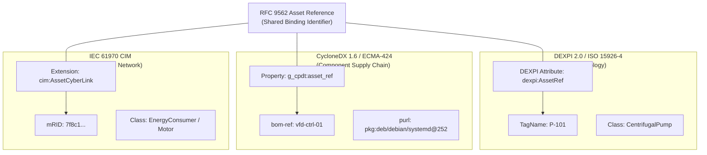

# The Three-Identity Join Across DEXPI 2.0, CycloneDX, and CIM

## 1. Executive Summary & Scope

Three open standards describe the same physical asset. DEXPI 2.0 describes its process topology. CycloneDX 1.6 describes the software and hardware it is built from. IEC 61970 CIM describes the electrical network that supplies it. Each standard is complete within its own discipline and none of them can answer the question an operator asks after a vulnerability disclosure lands: if this is exploited, what physically happens downstream?

The obstacle is identity. A pump carries a tag. Its controller firmware carries a package URL. Its feeder carries a master resource identifier. No identifier survives across all three. That is the whole problem, and it is smaller and more tractable than it is usually made to sound.

This specification (Designation P1, foundational specification of the three-schema programme) establishes the normative foundation for **Schema G_CPDT** (Graph of Cyber-Physical Digital Twins). It defines the form of a join assertion, the vocabulary of relations that assertion may declare, the rules a producer follows when writing one, and the rules a consumer follows when reading one. It defines how the assertion is carried inside a DEXPI file, inside a CycloneDX document, and inside a CIM model, using each standard's own sanctioned extension point.



The key words MUST, MUST NOT, SHOULD, SHOULD NOT and MAY in this document are to be interpreted as described in RFC 2119 [1]. Requirements are numbered R-1 through R-35 so that a conformance rule can be written against each one individually.

This specification is offered under the Creative Commons Attribution 4.0 International licence (CC BY 4.0) [2] for submission to DEXPI e.V., the CycloneDX project, and IEC TC 57. That is the licence under which DEXPI e.V. publishes the DEXPI 2.0 Specification on GitLab [3], so the DEXPI leg of this work can be merged into a DEXPI artefact without a licence conflict. Where a receiving body's contribution policy requires different terms, the authors hold the copyright and will grant those terms on request.

### 1.1 What this specification does not do

It does not merge the three schemas. A merged model breaks conformance to all three, which is why every previous attempt ended as a vendor's proprietary model that only its author could read. Nothing here alters a DEXPI class, a CycloneDX field, or a CIM class. Every file that carries a join assertion remains valid against its own specification, unchanged.

It does not define a physics model. Hydraulic head loss, thermal propagation and blast radius traversal are treated in the existing two-schema work [4] and generalised to three ontologies in a later paper of this programme. This document defines only the identity mapping those computations depend on.

It does not define the CIM profile. Naming which subset of a model as large as CIM is in scope is a substantial piece of work with its own precedent, and it is deferred to P2. Section 7 states the requirements a P1 implementation must meet at the CIM boundary and marks the rest as out of scope.

It does not define the conformance test suite. The requirements in section 8 say what conformance means. The test vectors, the round-trip cases and the reference implementation are deferred to P3.

It does not verify that any of the three files is true. That limitation is central rather than incidental and section 9 treats it at length.

### 1.2 Terms

**G_CPDT (Graph of Cyber-Physical Digital Twins).** The unified, traversable multigraph schema instantiated by binding physical process topology (DEXPI 2.0 / ISO 15926-4), component supply-chain hierarchy (OWASP CycloneDX 1.6+ / ECMA-424), and electrical network topology (IEC 61970 CIM) via decoupled RFC 9562 asset references without mutating or forking any underlying standard.

**Asset.** The smallest physical object that at least two of the three participating schemas can name. A centrifugal pump is an asset. A firmware image is not, because DEXPI and CIM have nothing to say about it; it is a constituent of one.

**Leg.** The part of a join that lives in one of the three standards. A join has at most three legs and is useful with two.

**Join assertion.** A statement, carried inside a file of one of the three standards, binding an object in that file to an asset reference under a declared relation.

**Asset reference.** The identifier that the three legs share. It is not a fourth identity system for assets; it identifies the binding, not the asset's role in any discipline.

**Model authority.** The organisation or tool that mints identifiers within a scope and vouches for their uniqueness inside it. The term is used in CIM in this sense and is used the same way here.

## 2. The three identity systems

| Standard | Describes | Identity | Assigned by | Nature |
|:---|:---|:---|:---|:---|
| DEXPI 2.0 | process topology, P&ID and BFD/PFD | `TagName` plus ISO 15926-4 class | plant engineer | human, stable, semantic |
| CycloneDX | component supply chain | `bom-ref` plus `purl` or `cpe` | build system | machine, versioned, ephemeral |
| IEC 61970 CIM | electrical network topology | `mRID`, a UUID | network model tool | machine, stable, opaque |

Every later paper in this programme cites that table. The columns are worth reading as claims rather than description, because each one constrains what the join can do.

### 2.1 DEXPI 2.0

DEXPI 2.0 was released on 10 October 2025, unifying the DEXPI P&ID Specification 1.4 and the DEXPI Process Specification 1.0 into one framework and introducing DEXPI XML as the serialization for P&IDs, PFDs and BFDs in place of the Proteus Schema [3]. Its identity is the `TagName`, drawn from a plant's own tagging convention, and its semantics come from the ISO 15926-4 reference data library [5], which supplies the equipment and property classes the tag is an instance of.

A tag is assigned by a person, changes rarely, and means something to the person who reads it. It is also scoped to a plant and a discipline. `P-101` is unique on one site and says nothing at all on another. A tag alone is therefore not a join key, which is why R-18 requires the ISO 15926-4 class to travel with it.

### 2.2 CycloneDX 1.6

CycloneDX 1.6 is standardised as ECMA-424, first edition, June 2024, published by Ecma International Technical Committee 54 with the OWASP Foundation [6]. Its identity is twofold. The `bom-ref` is a document-local handle with no meaning outside the file that declares it. The `purl` is a package URL, standardised as ECMA-427, first edition, December 2025 [7], and it identifies a package coordinate: type, namespace, name, version, qualifiers. Where a package coordinate does not apply, a `cpe` identifies a product class under the CPE naming specification [8].

CycloneDX identity is machine-assigned and versioned. A firmware upgrade produces a new `purl`, and correctly so, because it is a different artefact. This is the property that makes the CycloneDX leg the most volatile of the three and it drives R-12 and R-15.

### 2.3 IEC 61970 CIM

CIM identity is the `mRID`, an attribute of `IdentifiedObject`, the base class of most CIM types [9]. It is a string that implementations conventionally restrict to a UUID, and CIM practice strongly recommends a UUID for exactly the reason this specification does. The mRID is issued by a model authority and is unique within an exchange context. It is opaque; nothing about the asset can be recovered from it.

Two consequences follow, and both are load-bearing. First, an mRID without its model authority set is not a globally resolvable identifier, which is why R-29 requires that authority to be stated. Second, most assets a DEXPI model describes have no mRID at all, because they are not conducting equipment. The CIM leg is therefore optional in the general case and rich only where the electrical network is the point.

### 2.4 Why no identifier can be promoted to serve as the join

The obvious cheap solution is to elect one of the three as primary. Each election fails for a different reason.

Electing the tag fails because CycloneDX components are produced by build systems that have never heard of the plant and cannot mint a tag. Electing the `purl` fails because it identifies a package, not an asset; a pump has no `purl` and a firmware version change would silently break every binding. Electing the `mRID` fails because it exists only for objects inside a CIM model, which excludes most of a process plant, and because an mRID is unique within an exchange context rather than globally.

A fourth identifier is the minimum that works, provided it does one job only. That is what section 4 defines.

## 3. Why extension rather than fork

A specification that requires any of the three bodies to change its standard will not be adopted. This one requires none of them to, because all three already publish a mechanism for exactly this kind of addition.

**DEXPI.** The DEXPI Specification Teams are developing the DEXPI Profile, "which extends the DEXPI specification with a mechanism for defining explicit constraints on classes and properties" [12]. That is a sanctioned extension point, in writing, from the body that owns the standard. The join is delivered as a Profile. It adds attributes to existing classes; it introduces no class of its own. The verb in that sentence governs what the Profile does to the specification, which is to add a mechanism, and the mechanism itself is described in the language of constraints. Section 3.1 states what that leaves open instead of assuming it away.

**CycloneDX.** CycloneDX has carried custom properties since version 1.3, and the project maintains a public property taxonomy in which a top-level namespace is registered by opening an issue, held as reserved, and confirmed once the taxonomy documentation is publicly available [10]. The join is delivered as a registered namespace under that process.

**CIM.** CIM is profiled rather than extended, and the precedent is large and successful. The Common Grid Model Exchange Standard is a profile of CIM adopted by the IEC as IEC 61970-600-1 and IEC 61970-600-2, most recently in their 2021 editions [11]. A cyber-physical profile follows the same path. P2 defines it.

So all three legs have a sanctioned extension point, nothing is forked, and every file stays conformant to its own specification. This is the difference between a proposal a body can adopt and one it must reject on governance grounds, and it is worth stating plainly, because governance rather than technique is what has killed the previous attempts.

### 3.1 The DEXPI extension mechanism, and what it leaves unsettled

DEXPI e.V.'s August 2026 update describes two pieces of work that bear on this specification [12]. The first is DEXPI 2.0.1, being prepared as an important update to the DEXPI 2.0 specification, addressing corrections and clarifications in the Process Model, and expected once released to become the recommended basis for further work with the specification, replacing DEXPI 2.0. The second is the DEXPI Profile, "which extends the DEXPI specification with a mechanism for defining explicit constraints on classes and properties", and which creates the basis for the DEXPI Process Type Library.

An earlier draft of this specification named a different carrier, the DEXPI Standard Library, described in briefing material held by the authors as a curated set of templates intended to extend or restrict the DEXPI Specification to meet specific engineering requirements. That briefing material is not publicly resolvable, so it is not cited here. The August 2026 update does not mention a Standard Library; the term does not appear on the page. The Profile is the mechanism DEXPI e.V. currently describes, so the DEXPI leg is written against the Profile, and the earlier reading is recorded here rather than deleted. A reader holding the older briefing can then tell which of the two documents is current instead of guessing.

One question survives the switch, and it is not cosmetic. This join adds four attributes to a DEXPI object. The Profile is described as a mechanism for defining constraints. Adding and constraining are not the same operation, and the update's single sentence carries both ideas at once: "extends" governs what the Profile does to the specification, which is to add a mechanism, while the mechanism is then described as defining explicit constraints on classes and properties. Two readings are available on that sentence and the page does not choose between them.

Under the first reading, defining explicit constraints on classes and properties includes declaring which properties a class may carry. A Profile can then license the attribute set of section 5.1, and the DEXPI leg fits the mechanism as published.

Under the second reading, a Profile only narrows a model that already exists. Adding an attribute set would then need a different mechanism, most plausibly the generic attribute facility the DEXPI plant model already provides, which is the same facility the example encoding in section 5.2 uses.

This specification assumes the first reading, and R-16 names the Profile as the carrier on that basis. The assumption is stated here and repeated in section 9 as a limitation, because it is an assumption and not a citation. What would settle it is the published Profile text, or a direct answer from the DEXPI Specification Teams; the August 2026 update names Dr. Gregor Tolksdorf as a contact for its question and answer sessions [12].

If the second reading is correct, the correction is small, and that is worth stating plainly because it tells a reviewer the proposal holds under either answer. The join's content is four attributes on existing classes, a closed vocabulary of five relations, and a rule about where the attributes attach. None of it depends on which mechanism carries it. R-17, the attachment rule, is the requirement that binds under either reading. R-16 is the only requirement that would change, and it would change by naming a different carrier for content that stays as written.

## 4. The join, normatively

### 4.1 Form

A join assertion binds one object, in one file, to one asset reference, under one relation. Assertions are made independently in each leg. There is no central registry, no merged file and no master document; a registry would reintroduce the single point of authority that forking creates, in a different place.

R-1. An asset reference MUST be a UUID as defined by RFC 9562 [13], serialised in the canonical hyphenated lowercase textual form.

R-2. An asset reference MUST be minted once per asset and MUST NOT be reused for a different asset, in any file, at any time.

R-3. A join assertion MUST state exactly one asset reference, exactly one relation, exactly one asserting authority, and exactly one as-built basis.

R-4. The relation MUST be one of `identity`, `partOf`, `controls`, `supplies` or `monitors`, defined in section 4.2.

R-5. A file MUST NOT carry more than one assertion with relation `identity` for a given asset reference.

R-6. A consumer MUST NOT infer a relation that is absent. An assertion without a relation is non-conformant and a consumer MUST reject it rather than defaulting it to `identity`.

R-7. The asserting authority MUST be stated as an absolute URI identifying the organisation or tool that made the binding.

R-8. The as-built basis MUST identify the document revision the binding was drawn from, and SHOULD state a document identifier, a revision, and an issue date.

R-9. The local identity in a join assertion MUST be expressed in the native identity system of the file that carries the assertion, and MUST NOT be expressed in the identity system of another leg.

R-9 is the most important requirement in this document. It is what makes this a mapping rather than a merge. A DEXPI file names DEXPI objects; a CycloneDX document names CycloneDX components; a CIM model names CIM objects. No file ever holds a foreign identifier, so no file ever needs revalidating when a foreign identity system changes.

R-10. A file MUST remain valid against its own specification with all join assertions present.

R-11. A producer MUST NOT alter, normalise, truncate or re-mint an identifier belonging to another identity system.

### 4.2 The relation vocabulary

An equality join across the three standards is wrong, and this is the failure mode most likely to be reached for by an implementer who has not thought about granularity. The three standards do not describe assets at the same level. A DEXPI equipment object is a functional asset. A CycloneDX component is frequently a package inside a controller inside that asset. A CIM conducting equipment object may be a feeder supplying a motor control centre that serves twenty such assets. Binding all three with an implicit "is the same thing" produces a graph in which a vulnerability in a monitoring agent looks identical to a vulnerability in a safety controller.

Five relations, no more, each stated from the perspective of the object carrying the assertion toward the asset:

| Relation | Meaning | Cardinality | Directed |
|:---|:---|:---|:---|
| `identity` | the object denotes the asset itself | one to one | no |
| `partOf` | the object is a constituent of the asset | many to one | yes |
| `controls` | the object commands the asset's state | many to many | yes |
| `supplies` | the object provides the asset's energy or working fluid | many to many | yes |
| `monitors` | the object observes the asset without commanding it | many to many | yes |

R-13 in section 4.4 governs traversal across them. The vocabulary is deliberately closed. An open vocabulary would let each implementer invent relations that no other implementer can traverse, which returns the corpus to the proprietary model the whole exercise exists to avoid. Section 9 records the risk that five is too few.

The distinction between `controls` and `monitors` carries most of the analytic weight. A compromised temperature transmitter falsifies a reading; a compromised valve positioner moves metal. Both sit on the same Modbus segment and both appear in the same bill of materials. Only the relation tells them apart, and only if it is stated rather than guessed, which is what R-6 enforces.

### 4.3 Worked example (non-normative)

The following illustrates a single asset with all three legs. It uses a generic plant tag and carries no reference architecture from any applied paper. All values are synthetic.

A variable-speed centrifugal pump is tagged `P-101` in the plant model. Its drive runs a firmware image with a package URL. Its motor is fed from a circuit represented in the network model by an mRID. The asset reference `3f2a91c4-7b60-4d1e-9a55-0c8e21b4f7d2` is minted once, by the plant's model authority, and appears in all three files.

DEXPI leg, attaching to the equipment object that carries the tag:

```xml
<Equipment ID="EQ-P-101">
  <TagName>P-101</TagName>
  <GenericAttributes Set="AssetJoin">
    <GenericAttribute Name="AssetReference"
                      Value="3f2a91c4-7b60-4d1e-9a55-0c8e21b4f7d2"/>
    <GenericAttribute Name="AssetReferenceRelation" Value="identity"/>
    <GenericAttribute Name="AssetReferenceAuthority"
                      Value="https://example.org/authority/plant-engineering"/>
    <GenericAttribute Name="AssetReferenceBasis"
                      Value="PID-COOL-004 rev D 2026-04-18"/>
  </GenericAttributes>
</Equipment>
```

CycloneDX leg, on the firmware component. The local identity is the component's own `bom-ref` and `purl`, so the taxonomy carries only the join fields:

```json
{
  "type": "firmware",
  "bom-ref": "pkg:generic/vfd-firmware@4.2.1",
  "name": "vfd-firmware",
  "version": "4.2.1",
  "purl": "pkg:generic/vfd-firmware@4.2.1",
  "properties": [
    { "name": "assetjoin:ref",
      "value": "3f2a91c4-7b60-4d1e-9a55-0c8e21b4f7d2" },
    { "name": "assetjoin:relation", "value": "partOf" },
    { "name": "assetjoin:authority",
      "value": "https://example.org/authority/platform-build" },
    { "name": "assetjoin:basis", "value": "BUILD-2026-0412 2026-04-12" }
  ]
}
```

CIM leg, on the identified object representing the supplying circuit:

```
cim:ConductingEquipment
  cim:IdentifiedObject.mRID      "c81d4e2e-bcf2-11e6-869b-7df92533d2db"
  cim:IdentifiedObject.name      "MCC-3 Feeder 7"
  join:assetReference            "3f2a91c4-7b60-4d1e-9a55-0c8e21b4f7d2"
  join:relation                  "supplies"
  join:authority                 "https://example.org/authority/network-model"
  join:basis                     "NM-EXPORT-2026-Q2 2026-04-30"
  join:modelAuthoritySet         "https://example.org/mas/distribution-south"
```

Three files. Three identity systems, each untouched. One shared reference, four fields, and a relation that says how the object stands to the asset. A traversal from the firmware `purl` to the physical pump to the feeder that supplies it is now two hops and no inference.

### 4.4 Traversal and conflict

R-12. A consumer MUST treat an asset reference that appears in only one file as unjoined, and MUST NOT synthesise the missing legs.

R-13. A consumer computing physical consequence MUST follow relations in the direction declared, MUST NOT traverse a `monitors` relation as if it were `controls`, and MUST NOT invert a directed relation.

R-14. Where two files assert `identity` for the same asset reference and the objects are not the same asset, a consumer MUST report the conflict and MUST NOT silently select one binding over the other.

R-15. A join assertion SHOULD carry the instant at which the binding was made. Where a leg's file format offers a timestamp field, the producer SHOULD use it in preference to a join property.

R-14 exists because silent selection is how a twin becomes untrustworthy without anyone noticing. Two identity claims for one reference means the model authority has made a mistake, and the correct behaviour of a consumer is to say so.

## 5. The DEXPI Profile extension

The DEXPI leg is delivered as a DEXPI Profile, adding attributes to existing DEXPI classes and introducing none of its own. The Profile is the extension point DEXPI e.V. is currently building, and section 3.1 records both what is known about it and what is not.

R-16. The DEXPI leg MUST be expressed as a DEXPI Profile and MUST NOT declare a new DEXPI class.

R-16 names the carrier and settles nothing else. Section 3.1 records that the Profile is described in terms of constraints and that its capacity to license an added attribute set is not yet confirmed in published text. If a Profile proves to be restriction-only, R-16 is the single requirement that has to be restated, naming the generic attribute facility of the DEXPI plant model in place of the Profile. Every other requirement in this section stands unchanged, because they govern where the attributes attach, what they must state, and what they may not do, rather than what carries them.

R-17. The Profile MUST attach its attributes to the object that carries the `TagName`, and MUST NOT attach them to a drawing, a shape, a symbol or a presentation element. A join bound to a graphic does not survive a redraw.

R-18. The DEXPI leg MUST state the object's ISO 15926-4 class alongside its tag. A tag alone is scoped to one plant and one discipline and carries no cross-site meaning.

R-19. A DEXPI file carrying the Profile MUST validate against the DEXPI 2.0 Specification.

R-20. The Profile MUST NOT relax any constraint the base specification declares. It MAY restrict, which is the use the Profile mechanism is described as existing to serve [12].

### 5.1 Attribute set

Four attributes, named for a reader who has never seen this specification:

| Attribute | Type | Cardinality | Requirement |
|:---|:---|:---|:---|
| `AssetReference` | UUID textual form | exactly one | R-1, R-2 |
| `AssetReferenceRelation` | closed vocabulary | exactly one | R-4 |
| `AssetReferenceAuthority` | absolute URI | exactly one | R-7 |
| `AssetReferenceBasis` | document identifier, revision, date | exactly one | R-8 |

The DEXPI leg will most often carry relation `identity`, because a DEXPI equipment object usually is the asset. It will not always. An instrument object in a DEXPI model that commands a valve carries `controls` toward that valve's asset reference, and a piping segment that feeds an asset carries `supplies`. The vocabulary is the same in every leg; only its distribution differs.

### 5.2 Serialization binding

The example in section 4.3 shows the attributes carried in a generic attribute set, which is the mechanism DEXPI's plant model has long used for properties outside the core classes and which DEXPI 2.0 preserves, since the P&ID plant model content is unchanged from version 1.4 [3]. The binding of these four attributes to concrete DEXPI XML elements MUST be confirmed against the published DEXPI 2.0 schema before submission, and section 9 records that as an open item rather than an established fact. The requirement that binds is R-17, the attachment point, not the element spelling.

## 6. The CycloneDX property taxonomy

The CycloneDX leg is delivered as a registered top-level property namespace, `assetjoin`, documented publicly and submitted through the taxonomy project's issue process [10].

R-21. The CycloneDX leg MUST carry its assertion in the `properties` array of the `component` or `service` object it applies to, and MUST NOT carry it at document metadata level.

R-22. A production implementation MUST use a namespace registered with the CycloneDX property taxonomy. An implementation MAY use `assetjoin` before registration completes, and MUST label such use as provisional.

R-23. The taxonomy MUST NOT redefine, shadow or extend any name in the `cdx` namespace.

R-24. A CycloneDX document carrying join properties MUST validate against the unmodified CycloneDX 1.6 schema, in whichever of the JSON or XML serializations it uses.

R-25. Where a component's relation is `partOf` and the document also contains a component representing the asset itself, the two MUST be connected in the document's `dependencies` graph. The join does not replace CycloneDX's own structure and MUST NOT be used to route around it.

R-26. A producer MUST NOT copy a `TagName` or an `mRID` into a CycloneDX property. This is R-9 restated at the leg it is most often violated in, because a build engineer holding a plant tag will reach for a property field.

### 6.1 Property names

| Property | Value | Requirement |
|:---|:---|:---|
| `assetjoin:ref` | UUID textual form | R-1, R-2 |
| `assetjoin:relation` | closed vocabulary | R-4 |
| `assetjoin:authority` | absolute URI | R-7 |
| `assetjoin:basis` | build or release identifier and date | R-8 |

CycloneDX property values are strings, so every value above is a string and a consumer parses it. The asset reference is validated as a UUID at parse time; the relation is validated against the closed vocabulary; a value outside it is a rejection under R-6, not a warning.

### 6.2 Relationship to the existing two-schema bridge

The two-schema semantic bridge already defines `dexpi:*` properties carrying plant attributes into CycloneDX components, and computes blast radius over the resulting multigraph [4]. This specification extends that work and does not replace it.

The two mechanisms answer different questions and both are needed. The `dexpi:*` properties carry plant *values*, such as design flow rate or operating pressure, to a place where a security tool can read them without parsing XML. The `assetjoin:*` properties carry *identity*, and nothing else. Conflating them was the weakness of the two-schema approach: a plant value copied into a bill of materials has no stated authority, no basis and no relation, so a consumer cannot tell a measurement from an assumption, or a constituent from the thing itself. Implementations MAY carry both namespaces on the same component. Where they do, `assetjoin:ref` is authoritative for identity and the `dexpi:*` values are treated as carried data.

## 7. The CIM profile reference

The CIM leg is a profile, in the manner of CGMES, and this document does not define it.

R-27. The CIM leg MUST be expressed as a profile over IEC 61970-301 [9] and MUST NOT add classes to the CIM UML.

R-28. The CIM leg MUST bind the asset reference to an `IdentifiedObject` and MUST record that object's `mRID` unchanged.

R-29. The CIM leg MUST state the model authority set within which the `mRID` is unique. An mRID is unique within an exchange context, not globally, so an mRID quoted without its authority set is not resolvable and a consumer MUST NOT treat it as though it were.

R-30. An implementation MUST NOT claim CIM profile conformance on the basis of this document alone. P1 states the boundary requirements; P2 defines the profile.

### 7.1 What P2 has to settle, and why it cannot be settled here

CIM is large. Saying "add CIM" without naming a subset is an unbounded commitment, and unbounded commitments are how a specification becomes an aspiration. CGMES exists precisely because the same problem arose in grid model exchange and was answered by profiling the model down to a stated purpose, then standardising the profile as IEC 61970-600-1 and IEC 61970-600-2 [11]. That is the pattern P2 follows.

Three questions are open and each has consequences a cyber-physical profile must weigh.

Which classes are in scope. A profile that admits the full topology model imposes a cost on producers who only need to say which feeder supplies a pump. A profile that admits only `ConductingEquipment` cannot express a protection scheme.

How thin a leg may be. The applied papers in this programme deliberately include a case with a weak CIM leg, because a join that only works when every leg is rich is not a general mechanism. The profile must degrade rather than fail.

Where the profile is submitted. The DEXPI template goes to DEXPI e.V., the taxonomy goes to the CycloneDX project, and the profile goes to the relevant IEC TC 57 working group. Three engagements, three timetables, none of them under the authors' control. The specification must stand as research regardless of whether any of the three is accepted.

## 8. Conformance requirements

Conformance is claimed per role and per leg. Partial conformance is expected and is named rather than hidden, because an implementation that writes a CycloneDX leg and reads nothing is a legitimate and common case.

### 8.1 Roles

**Producer.** Writes join assertions into files of one or more legs.

**Consumer.** Reads join assertions and traverses them.

**Joiner.** Mints asset references and asserts the bindings. A joiner is a model authority in the CIM sense and carries the responsibility R-2 and R-14 imply.

### 8.2 Requirements on each role

R-31. A conformant producer MUST satisfy R-1 through R-11 for every leg it writes, and MUST satisfy the leg-specific requirements of section 5, 6 or 7 for those legs.

R-32. A conformant consumer MUST satisfy R-6 and R-12 through R-14.

R-33. A conformant joiner MUST satisfy R-1, R-2, R-7, R-8 and R-14, and MUST be able to state, for any asset reference it has minted, the basis on which each leg was bound.

R-34. An implementation claiming conformance MUST state which roles and which legs it implements, and MUST state the version of each standard it implements against. An unqualified claim of conformance to this specification is not meaningful and MUST NOT be made.

R-35. An implementation MUST NOT claim conformance for a leg unless it validates that leg's file against that leg's own specification. Conformance to this document does not substitute for conformance to DEXPI 2.0, CycloneDX 1.6 or IEC 61970-301.

### 8.3 What P3 adds

The test vectors, the three round-trip cases, the validator and the reference implementation are defined in P3. An implementation MAY self-declare conformance before P3 is published and MUST label such a declaration provisional. A specification submitted without a conformance suite is not adoptable, which is why P3 sits ahead of P2 in this programme's sequence rather than at the end of it.

## 9. Limitations

Each of the following is a thing this specification cannot do. They are stated because an implementer who discovers one of them after deployment will conclude the specification was oversold, and because a standards body will find them anyway.

**The join does not verify that a DEXPI model matches the installed plant.** It binds an object in a drawing to an object in a bill of materials. Whether the drawing describes what was built is a question about site verification and it is outside every one of the three standards. A join over a stale P&ID produces confident, precise, wrong answers.

**A `purl` identifies a package, not the running firmware image.** It names what a build system produced. It does not establish that the named artefact is what is executing on the device, that it was installed rather than shipped, or that it has not been modified since. Establishing that requires attestation, which this specification does not define and does not require. A twin built on `purl` alone knows the intended software state, not the actual one.

**An `mRID` is stable within one network model export and is not guaranteed stable across tools.** It is unique within an exchange context, which R-29 requires to be declared for that reason. Two exports of the same network by two tools may carry different mRIDs for the same physical circuit, and this specification offers no mechanism to reconcile them. It only makes the scope explicit enough that a consumer can tell it has a problem.

**Nothing here establishes that three files describing one asset were produced from the same as-built state.** R-8 requires each leg to state its basis, which makes the divergence visible; it does not remove it. A P&ID at revision D, a bill of materials from a build two months later and a network model export from the quarter before are a legitimate, conformant, mutually inconsistent set. The specification surfaces the inconsistency. Resolving it is an operational discipline, not a schema feature.

**The relation vocabulary is closed at five and may prove too few.** Redundancy, protection and standby relationships are not expressible and would currently be forced into `supplies` or `controls`, which loses the distinction. Widening the vocabulary is a breaking change for consumers. The choice here is deliberate and it is the one this specification is least confident about.

**The DEXPI serialization binding is provisional.** Section 5.2 states the attachment rule, which is stable, and shows a generic attribute encoding, which is not yet confirmed against the published DEXPI 2.0 schema. R-17 is the requirement that binds, and the element spelling is not part of it. An implementer who reproduces the example verbatim and has it rejected by a validator has found a defect in the example, not in the join.

**The DEXPI Profile is assumed to permit an added attribute set.** DEXPI e.V. describes the Profile as extending the DEXPI specification "with a mechanism for defining explicit constraints on classes and properties" [12]. This specification reads that as covering a declaration of which properties a class may carry, which is what licenses the four attributes of section 5.1. The competing reading is that a Profile only narrows a model already defined, in which case the DEXPI leg needs the generic attribute facility instead. Section 3.1 sets out both readings in full. An earlier draft of this document named the DEXPI Standard Library as the carrier, and the August 2026 update does not mention that mechanism, which is why the carrier moved. R-16 therefore rests on a reading of one published sentence rather than on published Profile text. A reviewer at DEXPI e.V. can confirm or correct it in a sentence, and the join's content is unaffected either way; only its carrier is at stake.

**The normative DEXPI target is 2.0 and a successor is in preparation.** DEXPI e.V. states that DEXPI 2.0.1 is being prepared as an important update to the DEXPI 2.0 specification, that the work addresses corrections and clarifications in the Process Model, and that once released it is expected to become the recommended basis for further work with the specification, replacing DEXPI 2.0 [12]. This specification does not move its normative target. R-19 and R-35 are written against DEXPI 2.0, which is the version that exists. An implementation working against 2.0.1 MUST state that under R-34. Whether 2.0.1 changes anything the DEXPI leg depends on cannot be known before it is published, and the corrections are described as falling in the Process Model rather than in the P&ID plant model content the example encoding in section 5.2 uses.

**CycloneDX has editions later than the one targeted here.** This specification is written against CycloneDX 1.6 as standardised in ECMA-424, first edition, June 2024 [6], and a later edition of ECMA-424 exists. Custom properties have been available since CycloneDX 1.3, so the taxonomy is not expected to be version-sensitive, but the normative target stated here is 1.6 and an implementation on a later version MUST say so under R-34.

**Nothing here is authenticated.** A join assertion is an unsigned claim in a file. R-7 requires the asserting authority to be named, which supports attribution; it does nothing to prevent a false assertion. Signing, and the trust model that would give a signature meaning, are out of scope and are not deferred to a named later paper, because the authors have not yet established what that model should be.

**No implementation of this specification exists at the time of writing.** The requirements are reasoned from the three standards' published mechanisms, not from deployment experience. P3 is where that changes, and until it does, every requirement here is a proposal.

## 10. References

1. **Bradner, S.** *Key words for use in RFCs to Indicate Requirement Levels.* RFC 2119, BCP 14, Internet Engineering Task Force, March 1997.
2. **Creative Commons.** *Attribution 4.0 International (CC BY 4.0) Legal Code.* Creative Commons Corporation, 2013.
3. **DEXPI e.V.** *DEXPI 2.0 Specification.* Released 10 October 2025, published on GitLab under the Creative Commons Attribution 4.0 International licence. DEXPI Plant SIG, DEXPI Process SIG and DEXPI Specification Steering Team.
4. **McKenney, J.** *The Unified DEXPI 2.0 and CycloneDX 1.6 Semantic Bridge.* Eigenia working group WG-05-CAD, 2026.
5. **International Organization for Standardization.** *ISO 15926-4: Industrial automation systems and integration, Integration of life-cycle data for process plants including oil and gas production facilities, Part 4: Initial reference data.* International Standard.
6. **OWASP Foundation and Ecma International.** *CycloneDX Bill of Materials Specification.* ECMA-424, 1st edition, June 2024, defining CycloneDX v1.6. Ecma International Technical Committee 54, Geneva.
7. **Ecma International.** *Package URL (purl) Specification.* ECMA-427, 1st edition, December 2025. Ecma International Technical Committee 54, Geneva.
8. **Cheikes, B. A., Waltermire, D., and Scarfone, K.** *Common Platform Enumeration: Naming Specification Version 2.3.* NISTIR 7695, National Institute of Standards and Technology, August 2011.
9. **International Electrotechnical Commission.** *IEC 61970-301: Energy management system application program interface (EMS-API), Part 301: Common information model (CIM) base.* International Standard.
10. **CycloneDX Project.** *CycloneDX Property Taxonomy.* OWASP Foundation. Taxonomy of official CycloneDX property namespaces and names, including the top-level namespace registration process.
11. **International Electrotechnical Commission.** *IEC 61970-600-1:2021 and IEC 61970-600-2:2021: Common Grid Model Exchange Standard (CGMES).* International Standards, developed with ENTSO-E. First edition, published 4 June 2021, which cancels and replaces IEC TS 61970-600-1:2017 and IEC TS 61970-600-2:2017.
12. **DEXPI e.V.** *DEXPI August 2026 Update.* dexpi.org, August 2026. States that DEXPI 2.0.1 is being prepared as an important update to the DEXPI 2.0 specification and that the Specification Teams are developing the DEXPI Profile, which extends the DEXPI specification with a mechanism for defining explicit constraints on classes and properties. Available at https://dexpi.org/dexpi-august-2026-update/ (accessed 7 September 2026).
13. **Davis, K., Peabody, B., and Leach, P.** *Universally Unique IDentifiers (UUIDs).* RFC 9562, Internet Engineering Task Force, May 2024. Obsoletes RFC 4122.
