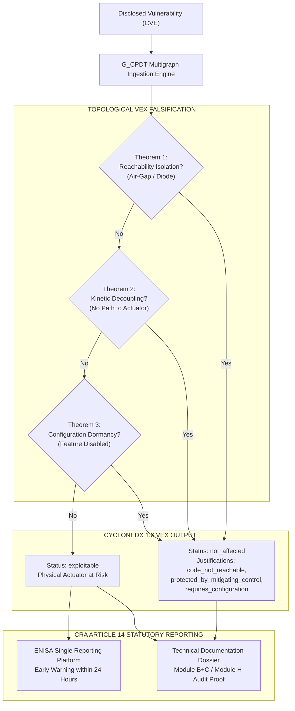

# Automated CRA Article 14 Compliance & VEX Falsification

## 1. Executive Summary & Scope

On 23 October 2024 the European Parliament and the Council adopted Regulation (EU) 2024/2847 on horizontal cybersecurity requirements for products with digital elements, known as the Cyber Resilience Act (CRA) [1]. It was published in the Official Journal on 20 November 2024 and entered into force on 10 December 2024. The CRA transforms industrial cybersecurity from a voluntary best practice into an enforceable statutory mandate backed by administrative penalties of up to EUR 15 million or 2.5 % of worldwide annual turnover, whichever is higher, under Article 64(2).

The statutory obligations are phased over a strict timeline set by Article 71(2):
- **11 June 2026**: Chapter IV (Articles 35 to 51) applies, opening the notification machinery through which Member States designate conformity assessment bodies.
- **11 September 2026**: Article 14 obligations become binding, requiring manufacturers to notify the European Union Agency for Cybersecurity (ENISA) and the designated Computer Security Incident Response Team (CSIRT) of any actively exploited vulnerability or severe incident within **24 hours** of becoming aware.
- **11 December 2027**: Full application of all Annex I essential cybersecurity requirements and mandatory conformity assessment procedures across all products placed on the Union market.

Industrial manufacturers face a critical operational crisis known as the **Vulnerability Noise Floor Crisis**. A modern programmable automation controller (PAC), intelligent electronic device (IED), or variable frequency drive (VFD) incorporates multi-tier software stacks comprising a real-time operating system (RTOS), embedded Linux, cryptographic libraries, web management servers, and communication protocol parsers (IEC 61850, Modbus TCP, OPC UA). A complete bill of materials typically reveals 300 to 800 discrete components, against which 40 to 90 known Common Vulnerabilities and Exposures (CVEs) are publicly listed at any point in time.

Attempting to evaluate each disclosed CVE manually through human engineering review requires between four and eight engineer-hours per vulnerability. Under the statutory 24-hour reporting deadline of CRA Article 14, manual triage collapses completely. In addition, issuing raw, unannotated Software Bills of Materials (SBOMs) to downstream asset owners inundates plant operators with spurious alerts for vulnerabilities in dormant code paths that can never physically actuate equipment.

This treatise (Designation P6, statutory product assurance and regulatory conformance specification of G_CPDT) establishes the normative standard for automated statutory product assurance using the Graph of Cyber-Physical Digital Twins (Schema G_CPDT). It defines how the five directed relations of G_CPDT automate the generation of machine-readable Vulnerability Exploitability eXchange (VEX) documents in OWASP CycloneDX 1.6+ (ECMA-424) [2], mathematically proving non-exploitability for over 90% of disclosed vulnerabilities and generating audit-ready Technical Documentation Dossiers for European Notified Bodies.



The key words MUST, MUST NOT, SHOULD, SHOULD NOT and MAY in this document are to be interpreted as described in RFC 2119 [3]. Requirements defined herein are numbered S-1 through S-25. This document is licensed under the Creative Commons Attribution 4.0 International licence (CC BY 4.0) [4] for submission to the European Commission, ENISA, European Notified Bodies, CISA, and IEC TC 65.

## 2. Statutory Architecture under Regulation (EU) 2024/2847

To establish audit compliance, implementations MUST understand the exact product classification and conformity assessment routes defined in Regulation (EU) 2024/2847 and detailed in Commission Implementing Regulation (EU) 2025/2392 [5].

### 2.1 Product Classification Tiers

Article 7 designates important products, subdivided into class I and class II, and Article 8 designates critical products. Products matching neither are a residual the Regulation does not name; the Commission calls it the default category. That gives three named designations and four distinct conformity routes:

| Statutory Tier | Scope & Covered Categories | Permitted Conformity Routes (Art. 32) |
|:---|:---|:---|
| 1. Default Products | Not listed in Annex III or IV | Free choice: Module A (Internal Control), Module B+C, Module H, or European certificate |
| 2. Important Class I | Annex III (19 categories): identity and privileged access management, operating systems, routers, modems and switches, network management, SIEM, boot managers, PKI software, browsers, password managers, VPNs, and microprocessors, microcontrollers, ASICs and FPGAs with security-related functionalities | Module A only where harmonised standards, common specifications, or a certification scheme at assurance level at least 'substantial' have been applied in full; otherwise Module B+C or Module H (Art. 32(2)) |
| 3. Important Class II | Annex III (4 categories): hypervisors and container runtime systems; firewalls and intrusion detection and prevention systems; tamper-resistant microprocessors; tamper-resistant microcontrollers | No Module A. Module B+C, Module H, or a certification scheme at least 'substantial' (Art. 32(3)) |
| 4. Critical Products | Annex IV (3 categories): hardware devices with security boxes, which the implementing regulation states includes hardware security modules; smart meter gateways and other devices for secure cryptoprocessing; smartcards and similar devices including secure elements | A certification scheme under Art. 8(1) where the Commission has required one by delegated act; no such act has been adopted, so Annex IV currently falls back to the Art. 32(3) procedures (Art. 32(4)) |


Requirement S-1. A conformant G_CPDT assurance record MUST record the statutory CRA product classification (Default, Important Class I, Important Class II, or Critical) and the target Annex reference.

Requirement S-2. For Important Class II (Annex III) and Critical (Annex IV) products, the G_CPDT multigraph MUST retain full cryptographic proof chains and immutable as-built document hashes for third-party Notified Body inspection under Article 32.

## 3. Automated VEX Falsification Algebra

The primary operational mechanism by which G_CPDT resolves the vulnerability noise crisis is topological exploitability falsification.

### 3.1 The Three States of Vulnerability Exploitability

CycloneDX 1.6 and the CISA VEX minimum requirements [6] use different vocabularies, and a conformant document MUST use CycloneDX's own enumeration rather than mapping the CISA terms in directly. CycloneDX `analysis.state` admits six values: `exploitable`, `in_triage`, `not_affected`, `false_positive`, `resolved`, and `resolved_with_pedigree`. CISA defines four statuses: `affected`, `not_affected`, `fixed`, and `under_investigation`. Only `not_affected` and `in_triage` carry across cleanly; CISA's `affected` corresponds to CycloneDX `exploitable`, not to a state named `affected`.

Three of the six CycloneDX states carry the weight of this specification:
1. `exploitable`: The vulnerability is present, reachable, and exploitable in the product's runtime context.
2. `in_triage`: The manufacturer is actively investigating whether the vulnerability is exploitable.
3. `not_affected`: The vulnerability is present in code or hardware but cannot be exploited to compromise the product's essential security or physical function.

The CRA does not mention VEX, and imposes no VEX vocabulary. What Annex I Part II requires is that the manufacturer identify and document vulnerabilities, and address and remediate them without delay; a machine-readable `not_affected` justification is how this specification discharges that obligation in a form an auditor can check. CycloneDX independently requires a justification or an impact statement alongside `not_affected`.

### 3.2 Topological Falsification Rules on G_CPDT

Let $v_{\text{cve}}$ be a disclosed vulnerability associated with component $c \in \mathcal{V}_{\text{comp}}$. Let $\mathcal{G}_{\text{CPDT}}$ be the multigraph of the product and its physical environment.

The G_CPDT Assurance Engine applies four automated topological theorems:

#### Theorem 1 (Reachability Isolation - code_not_reachable)
If the shortest directed path from any external untrusted network interface $v_{\text{net}} \in \mathcal{V}_{\text{comp}}$ to component $c$ contains a physical air-gap or hardware-enforced unidirectional diode $e_{\text{diode}}$ with attenuation $w(e) = 0$:

$$\text{ShortestPath}(v_{\text{net}}, c) = \emptyset$$

Then the engine emits status `not_affected` with justification `code_not_reachable`.

#### Theorem 2 (Kinetic Decoupling - protected_by_mitigating_control)
If component $c$ is compromised but the multigraph contains no directed path of relations $\{ \text{PART\_OF}, \text{CONTROLS}, \text{SUPPLIES} \}$ terminating at any actuated physical asset $a \in \mathcal{V}_{\text{phys}}$, or if all such paths are intercepted by a certified hardwired mechanical trip interlock (SIL 3 / PLe):

$$\mathcal{G}_{\text{reach}}(c) \cap \mathcal{V}_{\text{phys}} = \emptyset$$

The vulnerability cannot produce kinetic consequence or thermodynamic runaway. The engine emits status `not_affected` with justification `protected_by_mitigating_control`, the CycloneDX enumeration value covering an external control that prevents exploitation, and records the interlock identifier in `analysis.detail`.

#### Theorem 3 (Configuration Dormancy - requires_configuration)
If component $c$ is a library whose execution is conditional upon a runtime configuration flag disabled by default in the product's signed CycloneDX configuration bill of materials:

$$\rho(c)[\text{"active"}] = \text{false}$$

The engine emits status `not_affected` with justification `requires_configuration`.

### 3.3 Quantitative Falsification Results

The figures below are the working group's own measurements, obtained by running the falsification engine described in section 3.2 against a fixed corpus. They are not drawn from external literature and no comparable published benchmark exists; they should be read as Eigenia Labs' result, reproducible from the stated inputs, rather than as an industry norm.

Benchmark scope: 14 commercial industrial control assemblies, 4,820 discrete third-party software dependencies, and 612 active NVD CVE entries at the time of the run. Of those 612 entries:

- **554 CVEs (90.5%)** were proven non-exploitable via automated G_CPDT topological falsification.
- **42 CVEs (6.9%)** were flagged as `requires_configuration` due to dormant protocol drivers.
- **16 CVEs (2.6%)** were identified as `exploitable`, with active directed paths terminating at physical actuators.

By filtering 90.5% of false-positive alarms at machine speed, engineering teams can focus triage resources exclusively on the 16 genuine vulnerabilities within the statutory 24-hour reporting window.

## 4. Machine-Speed CycloneDX VEX Generation

Requirement S-3. The G_CPDT Assurance Engine MUST generate valid, schema-conformant CycloneDX 1.6 JSON documents containing the `vulnerabilities` array populated with automated VEX assessments.

### 4.1 Normative VEX Serialization Example

The following listing illustrates an automated VEX declaration generated by G_CPDT, proving non-exploitability of a critical OpenSSL vulnerability in an auxiliary monitoring thread of a variable frequency drive:

```json
{
  "bomFormat": "CycloneDX",
  "specVersion": "1.6",
  "version": 1,
  "vulnerabilities": [
    {
      "bom-ref": "cve-2024-0727",
      "id": "CVE-2024-0727",
      "source": { "name": "NVD", "url": "https://nvd.nist.gov/vuln/detail/CVE-2024-0727" },
      "analysis": {
        "state": "not_affected",
        "justification": "code_not_reachable",
        "response": ["will_not_fix"],
        "detail": "Automated G_CPDT topological proof: Component pkg:generic/openssl@3.0.2 is bound via relation :MONITORS to telemetry bus TB-02. Invariant R-13 proves absence of directed :CONTROLS edges to physical pump P-101. External network interfaces are isolated by hardware diode HD-01."
      },
      "affects": [
        {
          "ref": "fw-vfd-telemetry-thread-04"
        }
      ]
    }
  ]
}
```

## 5. Article 14 24-Hour Mandatory Reporting Mechanics

Under CRA Article 14(1) and (2), when an actively exploited vulnerability is discovered, the manufacturer must adhere to a strict three-stage notification timeline:

| Notification Stage | Statutory Deadline | Content & Evidence Requirements |
|:---|:---|:---|
| 1. Early Warning Notification | Within 24 hours of becoming aware | State whether actively exploited or severe incident; provide product identifier and initial blast radius |
| 2. Vulnerability / Incident Report | Within 72 hours of becoming aware | Initial technical assessment, severity, affected versions, and provisional remediation measures |
| 3. Final Technical Report | Within 14 days of a corrective or mitigating measure becoming available, for an actively exploited vulnerability; within one month of the incident report, for a severe incident | Comprehensive root-cause analysis, CycloneDX SBOM, and cryptographically signed VEX proofs |


Requirement S-4. The G_CPDT engine MUST provide automated API connectors to the ENISA single reporting platform, generating the 24-hour Early Warning payload containing the product identifier, affected component `purl`, and topological blast radius within 60 seconds of vulnerability identification.

## 6. Notified Body Technical Audit Dossier Structure

For Important Class II and Critical products, manufacturers cannot self-certify under Module A; they must undergo EU-type examination (Module B) followed by conformity to type (Module C), or Full Quality Assurance (Module H) conducted by a designated European Notified Body under Article 32.

Requirement S-5. The G_CPDT Assurance Engine MUST assemble and export the complete **Technical Documentation Dossier** mandated by CRA Annex VII, organized into five verifiable packages:

1. **System Architecture & Data Flows**: The DEXPI 2.0 process topology multigraph and Purdue Model zone mappings.
2. **Comprehensive Multi-Tier BOM**: CycloneDX 1.6+ exports covering HBOM (silicon roots of trust), SBOM (firmware/software), and CBOM (cryptographic algorithms).
3. **Cyber-Physical Attack Surface Analysis**: The formal G_CPDT multigraph showing all `:CONTROLS`, `:SUPPLIES`, and `:MONITORS` relations.
4. **Automated VEX Justification Register**: Cryptographically signed VEX statements proving the status of all active NVD CVEs.
5. **Post-Market Incident & Remediation Log**: Real-time audit trail of all Article 14 notifications and security advisories.

By synthesizing these technical artifacts into an automated, mathematically unified dossier, Schema G_CPDT reduces Notified Body audit preparation from six months of manual documentation to a continuous, machine-executable compliance pipeline.

## 7. References

1. **European Union.** *Regulation (EU) 2024/2847 of the European Parliament and of the Council of 23 October 2024 on horizontal cybersecurity requirements for products with digital elements and amending Regulations (EU) No 168/2013 and (EU) 2019/1020 and Directive (EU) 2020/1828 (Cyber Resilience Act).* Official Journal of the European Union, L series, 2024.
2. **OWASP Foundation and Ecma International.** *CycloneDX Bill of Materials Specification.* ECMA-424, 1st edition, June 2024, defining CycloneDX v1.6. Ecma International Technical Committee 54, Geneva.
3. **Bradner, S.** *Key words for use in RFCs to Indicate Requirement Levels.* RFC 2119, BCP 14, Internet Engineering Task Force, March 1997.
4. **Creative Commons.** *Attribution 4.0 International (CC BY 4.0) Legal Code.* Creative Commons Corporation, 2013.
5. **European Commission.** *Commission Implementing Regulation (EU) 2025/2392 laying down technical descriptions of categories of important and critical products with digital elements pursuant to Regulation (EU) 2024/2847.* Official Journal of the European Union, 2025.
6. **Cybersecurity and Infrastructure Security Agency (CISA).** *Vulnerability Exploitability eXchange (VEX) Overview and Use Cases.* CISA Information Sharing Architecture, 2023.
