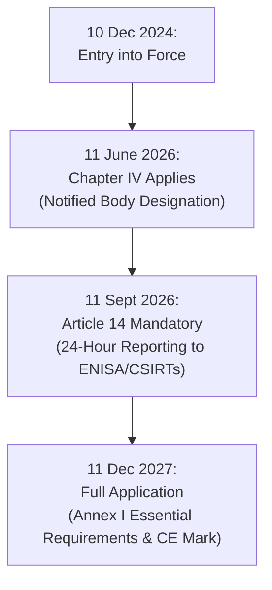
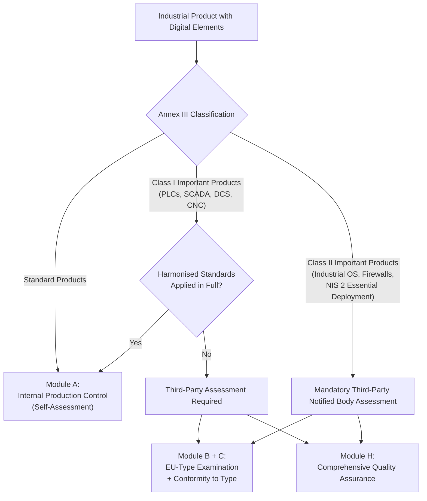
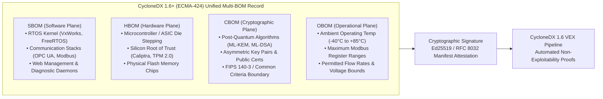
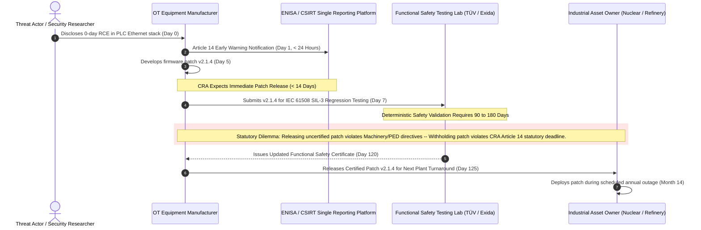
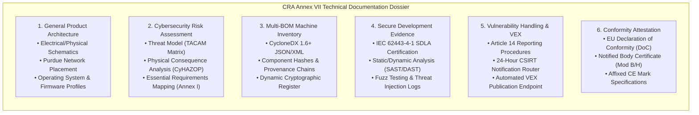

# OT Hardware Applicability & Supply Chain Transparency under the EU CRA (Regulation (EU) 2024/2847)

## Abstract

Regulation (EU) 2024/2847 on horizontal cybersecurity requirements for products with digital elements, designated the European Cyber Resilience Act (CRA), establishes binding statutory obligations for hardware and software placed on the Union market. Authored by J. McKenney (Tetrel Security & Eigenia Research) for Working Group WG-06 (Statutory Supply Chain & Product Conformance), this treatise establishes its direct, unavoidable applicability to Operational Technology (OT), Industrial Automation and Control Systems (IACS), and physical plant controllers. 

Under Article 3(1) and Article 2(1), any industrial field device exhibiting direct or indirect logical or physical data connectivity falls within regulatory scope. We analyze the technical descriptions enacted under Commission Implementing Regulation (EU) 2025/2392, demonstrating that Programmable Logic Controllers (PLCs), Distributed Control Systems (DCS), Supervisory Control and Data Acquisition (SCADA) servers, and Computer Numerical Controls (CNCs) are codified as Class I or Class II Important Products. Furthermore, when deployed by essential entities under Directive (EU) 2022/2555 (NIS 2), these systems mandate third-party conformity assessment under Module B+C or Module H, legally terminating the era of vendor self-attestation.

We resolve the foundational conflict between the statutory 24-hour vulnerability notification requirement under Article 14 and the deterministic multi-month safety re-certification cycles mandated by IEC 61508 and IEC 61511 for Safety Instrumented Systems (SIS). By coupling an extended Multi-BOM data architecture (integrating SBOM, HBOM, CBOM, and OBOM under CycloneDX 1.6+ / ECMA-424) with topological non-exploitability proofs, manufacturers can deliver automated, machine-readable Vulnerability Exploitability eXchange (VEX) documents. This methodology satisfies statutory market surveillance mandates without forcing hazardous, unvalidated firmware deployments into live industrial production environments.

---

## 1. Statutory Mandate & Regulatory Scope

The European Union’s legislative framework for critical infrastructure cybersecurity reached structural completion with the entry into force of Regulation (EU) 2024/2847 on December 10, 2024. For three decades, industrial equipment procurement relied upon voluntary industry standards, vendor self-certification, and qualitative vendor questionnaires. The CRA permanently displaces this voluntary regime, imposing horizontal, statutory product security requirements backed by administrative penalties under Article 64(2) reaching up to EUR 15,000,000 or 2.5% of worldwide annual turnover.

The statutory implementation timeline set forth in Article 71(2) imposes immediate obligations on industrial manufacturers:
1. **11 June 2026**: Application of Chapter IV (Articles 35 to 51). Member States must establish notifying authorities and designate independent Conformity Assessment Bodies (Notified Bodies) capable of conducting EU-type examinations.
2. **11 September 2026**: Application of Article 14 reporting obligations. Manufacturers must notify the European Union Agency for Cybersecurity (ENISA) and designated national Computer Security Incident Response Teams (CSIRTs) of any actively exploited vulnerability within 24 hours of awareness.
3. **11 December 2027**: Full statutory application. All products with digital elements placed on the Union market must meet the essential cybersecurity requirements of Annex I and carry the CE mark supported by an approved conformity dossier.

### The Article 3(1) Definitional Threshold

The regulatory scope of the CRA is defined in Article 3(1), which classifies a "product with digital elements" as:

$$\mathcal{P}_{\text{CRA}} = \{ (h, s, r) \mid h \in \mathcal{H} \lor s \in \mathcal{S}, \text{ with remote data processing solutions } r \in \mathcal{R} \}$$

where $\mathcal{H}$ represents physical hardware components, $\mathcal{S}$ represents standalone or embedded software components, and $\mathcal{R}$ designates any remote data processing solution designed and developed by or on behalf of the manufacturer, the absence of which would prevent the product from performing one of its primary functions.

The operational threshold is established by Article 2(1): the regulation governs any product whose intended purpose or reasonably foreseeable use includes a direct or indirect logical or physical data connection to a device or network. In modern industrial facilities, this definitional threshold captures virtually the entire field inventory. The engineering belief that field devices remain insulated by "air gaps" has been rendered legally and technically obsolete. Any device equipped with an RS-485 serial port, a Modbus TCP interface, a USB maintenance terminal, an optical diagnostic head, or a 4–20 mA HART loop possesses an indirect or direct logical connectivity path, placing it squarely within CRA jurisdiction.

---

## 2. OT and Industrial Control System Scope Taxonomy

To eliminate regulatory ambiguity across plant environments, the European Union Agency for Cybersecurity (ENISA) affirmed in 2025 that Operational Technology is fully subject to both the CRA and the NIS 2 Directive. Industrial automation field assets are categorized across deterministic functional classes:

| Asset Classification | Typical Equipment Examples | Operational Network Layer (Purdue) | CRA Scope Status | Primary Connectivity Vectors |
|:---|:---|:---:|:---:|:---|
| **Programmable Controllers** | PLCs, PACs, Remote Terminal Units (RTUs), Safety PLCs | Level 1 / Level 2 | In Scope (Mandatory) | Ethernet/IP, Profinet, Modbus TCP, Backplane Bus |
| **Supervisory & Compute** | SCADA Servers, Distributed Control Systems (DCS), Engineering Workstations | Level 2 / Level 3 | In Scope (Mandatory) | OPC UA, TCP/IP, Industrial Ethernet, Dual-homed NICs |
| **Operator Interfaces** | Touchscreen HMIs, Industrial Panel PCs, Mobile Maintenance Tablets | Level 2 | In Scope (Mandatory) | Web sockets, VNC, RDP, Proprietary OT protocols |
| **Motion & Machining** | Computer Numerical Controls (CNCs), Variable Frequency Drives (VFDs) | Level 1 | In Scope (Mandatory) | EtherCAT, Profibus, Modbus RTU, CANopen |
| **Substation Automation** | Intelligent Electronic Devices (IEDs), Protection Relays, Merging Units | Level 1 / Level 2 | In Scope (Mandatory) | IEC 61850 (GOOSE, SV, MMS), IEEE 1588 PTP |
| **Environmental & Facilities** | Coolant Distribution Unit (CDU) PLCs, Chiller Plant BMS, CRAH Controllers | Level 1 / Level 2 | In Scope (Mandatory) | BACnet/IP, BACnet MS/TP, Modbus TCP/RTU |
| **Power Infrastructure** | Battery Energy Storage (BESS) BMS, Static Transfer Switches, Solar Inverters | Level 1 / Level 2 | In Scope (Mandatory) | SunSpec Modbus, DNP3, CAN bus, IEC 60870-5-104 |

### Statutory Exclusions under Article 2(2)

Article 2(2) provides explicit exemptions only where existing sectoral Union legislation imposes equivalent horizontal cybersecurity obligations:
- **Medical Devices**: Governed exclusively under Regulation (EU) 2017/745 and Regulation (EU) 2017/746.
- **Civil Aviation**: Covered by Regulation (EU) 2018/1139.
- **Motor Vehicles**: Covered by Regulation (EU) 2019/2144.
- **Marine Equipment**: Subject to Directive 2014/90/EU.
- **National Defense**: Equipment designed exclusively for national security or military applications.
- **Identical Spare Parts**: Replacement components manufactured to identical specifications as pre-CRA equipment to repair installed systems.

Crucially, industrial automation systems, electrical grid protections, and hyperscale utility controls enjoy no sectoral exemption. Even where machinery falls under Directive 2006/42/EC (or the new Machinery Regulation (EU) 2023/1230), the cybersecurity aspects of the digital controls are governed directly by the CRA.

---

## 3. Annex III Classification & Conformity Pathways

The CRA establishes a risk-differentiated conformity framework dividing products into three primary tiers: Standard Products, Class I Important Products, and Class II Important Products. On December 1, 2025, the European Commission enacted Commission Implementing Regulation (EU) 2025/2392, setting out exhaustive technical descriptions for categories listed in Annex III.

### Class I Important Products (Annex III, Category 1)

Class I products present significant cybersecurity risks due to their operational roles. Implementing Regulation (EU) 2025/2392 defines the following OT systems within Class I:
- Programmable Logic Controllers (PLCs) and Distributed Control Systems (DCS)
- Supervisory Control and Data Acquisition (SCADA) systems
- Computer Numerical Control (CNC) systems
- Industrial Network Management Systems and protocol analyzers
- Industrial Virtual Private Network (VPN) gateways and remote access appliances

**Conformity Pathway**: Under Article 24(2), a Class I manufacturer may use **Module A (Internal Production Control)** only if the product has been developed in full conformity with harmonised standards cited in the Official Journal of the European Union. In the absence of published harmonised standards, or where the manufacturer departs from them, the manufacturer must submit the product to **Module B (EU-Type Examination) combined with Module C (Conformity to Type)**, or **Module H (Comprehensive Quality Assurance)** through an accredited Notified Body.

### Class II Important Products (Annex III, Category 2)

Class II products represent core cybersecurity infrastructure or high-criticality control layers:
- Industrial operating systems, real-time operating systems (RTOS), and hypervisors deployed in critical infrastructure
- Industrial firewalls, Intrusion Detection Systems (IDS), and Intrusion Prevention Systems (IPS)
- Hardware Security Modules (HSMs) and secure elements
- Tamper-resistant microprocessors and microcontrollers utilized in utility protection

**The NIS 2 Essential Entity Escalation Trigger**: A critical statutory provision dictates that if any industrial automation or control system (IACS)—including a standard Class I PLC or DCS—is designed or marketed for use by **essential entities under Directive (EU) 2022/2555 (NIS 2)**, it automatically elevates to a **Class II Important Product**. Because essential entities include all major operators in energy (electricity, gas, hydrogen), water, transport, banking, and digital infrastructure, tier-one OT manufacturers cannot rely on Module A self-assessment for their flagship product lines. They must obtain third-party Notified Body certification under Module B+C or Module H.

---

## 4. Multi-BOM Architectural Specification (SBOM, HBOM, CBOM, OBOM)

Article 13(1) and Annex I, Part I, point (1) mandate that manufacturers identify and document all components and vulnerabilities, maintaining a machine-readable Software Bill of Materials (SBOM) covering at least top-level dependencies. In complex industrial equipment, however, software execution is bound to silicon microarchitectures, board-level routing, cryptographic trust anchors, and environmental operating boundaries. 

To achieve full statutory defensibility, Eigenia standardizes the **Multi-BOM Quad-Layer Framework** built upon the OWASP CycloneDX 1.6+ specification (ECMA-424).

### 1. Software Bill of Materials (SBOM)
The SBOM records every software asset executing on the hardware platform, utilizing Package URL (`purl`) syntax and Common Platform Enumeration (CPE 2.3) naming. For an embedded PAC or PLC:
- Operating system kernel, build parameters, and patch level (e.g., `pkg:generic/rtos/vxworks@7.0?target=armv8-a`)
- Third-party communication protocol stacks (e.g., `pkg:github/open62541/open62541@v1.4.2`)
- Cryptographic runtime libraries (e.g., `pkg:generic/mbedtls@3.5.1`)
- Embedded web servers and maintenance interfaces (e.g., `pkg:generic/goahead@5.1.5`)

### 2. Hardware Bill of Materials (HBOM)
The HBOM establishes provenance down to the physical silicon package:
- Microcontroller, SoC, and FPGA components, detailing exact die steppings, wafer fab provenance, and errata revisions.
- Hardware Root of Trust (RoT) architecture, identifying whether the trust anchor relies upon OpenTitan, Caliptra, an external TPM 2.0, or dedicated secure elements (e.g., ATECC608B).
- Physical board revisions, schematics, and component serial numbers.

### 3. Cryptographic Bill of Materials (CBOM)
Under Annex I Part I point (3)(b), products must protect data confidentiality using state-of-the-art encryption. The CBOM catalogs:
- Cryptographic primitives in use (e.g., AES-256-GCM, SHA-256, Ed25519, ML-KEM-768).
- Key lengths, certificate expiration trajectories, and hardware key storage boundaries.
- Cryptographic module certifications (Common Criteria EAL4+, FIPS 140-3 Level 3).

### 4. Operational Bounds Bill of Materials (OBOM)
Unique to operational technology, physical stability depends on physical boundary limits. The OBOM establishes:
- Safe operating ranges for physical variables (voltage, temperature, pressure, flow rate).
- Process setpoint boundaries beyond which hardware enters mechanical distress.
- Concurrency and cycle-time constraints governing real-time control logic.

---

## 5. Reconciling the 24-Hour Reporting Clock with Safety Re-Certification

Article 14 introduces the most demanding operational timeline in global cybersecurity legislation:

$$\Delta t_{\text{EarlyWarning}} \le 24\text{ hours from awareness of active exploitation}$$
$$\Delta t_{\text{FullNotification}} \le 72\text{ hours from awareness}$$
$$\Delta t_{\text{FinalReport}} \le 14\text{ days after corrective measures}$$

In consumer software, compliance involves rapid code patching and automated over-the-air deployment. In mission-critical industrial hardware, this operational approach causes severe safety failures.

### The Safety Re-Certification Dilemma

Safety Instrumented Systems (SIS), burner management systems, emergency shutdown valves, and reactor protection controllers are certified under IEC 61508 (Safety Integrity Levels SIL-1 through SIL-4) and IEC 61511. Any modification to compiled firmware invalidates the existing safety case:

Forcing an uncertified firmware update into an active chemical process or electrical substation can induce false actuator trips, process instability, or mechanical destruction. Furthermore, plant operators cannot disrupt continuous production lines to apply non-critical patches outside scheduled turnaround windows, which occur at intervals of 12 to 36 months.

### The Topological VEX Falsification Resolution

To resolve this statutory impasse, the CRA and standard CSAF 2.0 / CycloneDX 1.6 specifications recognize the **Vulnerability Exploitability eXchange (VEX)** mechanism. Rather than issuing unvalidated firmware patches within 14 days, the manufacturer publishes a cryptographically signed VEX document declaring the status of the vulnerability as `not_affected`.

To withstand regulatory scrutiny by European Market Surveillance Authorities, this declaration cannot rely upon qualitative assertions. It must be mathematically proven using the **Topological VEX Falsification Theorems** of the Cyber Digital Twin:

#### Theorem 1 (Reachability Isolation)
Let $\mathcal{G} = (\mathcal{V}, \mathcal{E})$ represent the cyber-physical multigraph of the industrial installation. A disclosed CVE impacting component $c \in \mathcal{V}$ is provably non-exploitable if the directed connectivity subgraph contains no path from any unauthenticated network node $u \in \mathcal{U}$ to $c$:

$$\forall u \in \mathcal{U}, \quad \text{Path}(u \to c) = \emptyset \implies \text{Status}(c, \text{CVE}) = \text{\texttt{not\_affected}}$$
$$\text{Justification} = \text{\texttt{code\_not\_reachable}}$$

#### Theorem 2 (Kinetic Decoupling via Hardwired Interlocks)
Even if an attacker gains arbitrary remote code execution over a control processor $p \in \mathcal{V}$, if physical actuator movement is constrained by independent, hardwired analog interlocks (e.g., bimetallic thermal switches, mechanical pressure relief valves, or hardwired SIL-3 safety relays) that bypass digital execution entirely:

$$\text{Effort}(p \to \text{Actuator}_{\text{Physical}}) = 0 \implies \text{Justification} = \text{\texttt{protected\_by\_mitigating\_control}}$$

#### Theorem 3 (Configuration Dormancy)
If the vulnerable software library or service is physically compiled into the firmware binary but permanently disabled in the device configuration profile (e.g., an unauthenticated FTP server disabled by default in factory calibration):

$$\text{State}(\text{Service}) = \text{Disabled} \implies \text{Justification} = \text{\texttt{requires\_configuration\_or\_dependency}}$$

By publishing an automated CycloneDX 1.6 VEX document referencing these topological proofs, the manufacturer satisfies Article 14 requirements without endangering physical process stability.

---

## 6. Technical Documentation Dossiers & Notified Body Audit Preparation

Under Article 23 and Annex VII, manufacturers must compile an exhaustive Technical Documentation Dossier prior to affixing the CE mark. For Class I and Class II industrial hardware, European Notified Bodies inspect these dossiers against harmonised engineering baselines:

### Essential Dossier Sections for Industrial Equipment

1. **System Architecture and Hardware Interfaces**: Comprehensive schematics showing all microprocessors, cryptographic engines, external communication ports (Ethernet, RS-485, CAN, JTAG), and hardware interlocks.
2. **Cybersecurity Risk Assessment**: Formal documentation demonstrating adherence to Annex I essential requirements, incorporating threat models (such as the TACAM 12-factor framework) and consequence assessments (CyHAZOP).
3. **Multi-BOM Repository**: Machine-readable, cryptographically signed CycloneDX 1.6+ records capturing software, hardware, cryptographic, and operational envelopes.
4. **Product Development Lifecycle Evidence**: Documentation certifying that product development adheres to recognized secure development lifecycle standards, specifically **IEC 62443-4-1** (Security for industrial automation and control systems — Secure product development lifecycle requirements).
5. **Vulnerability Handling and Disclosure Framework**: Formal organizational policies ensuring that zero-day disclosures trigger automated triage, CSIRT/ENISA notification within statutory deadlines, and continuous VEX generation.

---

## 7. Comparative Audit: CRA Annex I vs. IEC 62443

Industrial manufacturers already investing in IEC 62443 compliance can map their existing engineering assets directly to CRA Annex I essential requirements:

| CRA Annex I Essential Requirement | Corresponding IEC 62443 Clause | Required Technical Evidence for Conformity Dossier |
|:---|:---|:---|
| **Part I, (1): Security by Default** | IEC 62443-4-2 CR 1.1, CR 7.7 | Default disabling of insecure ports (Telnet, HTTP, FTP); enforcement of unique per-device passwords. |
| **Part I, (2): Vulnerability Free Delivery** | IEC 62443-4-1 SR-1, SR-2 | Pre-shipment static analysis (SAST), binary analysis, and zero known unmitigated exploitable CVEs. |
| **Part I, (3)(a): Access Control & Auth** | IEC 62443-4-2 FR 1 (CR 1.1–CR 1.14) | Role-Based Access Control (RBAC), multi-factor authentication for management interfaces, hardware tokens. |
| **Part I, (3)(b): Data Confidentiality** | IEC 62443-4-2 FR 4 (CR 4.1–CR 4.3) | TLS 1.3 encryption for industrial Ethernet; AES-256 encrypted storage for firmware images and key stores. |
| **Part I, (3)(c): Data Integrity** | IEC 62443-4-2 FR 3 (CR 3.1–CR 3.14) | Cryptographic signature verification on firmware updates; hardware-enforced secure boot via Silicon RoT. |
| **Part I, (3)(d): Data Minimisation** | IEC 62443-4-1 SD-4 | Elimination of unnecessary telemetry, debug logging in production builds, and diagnostic test points. |
| **Part I, (3)(e): Resilience & Availability** | IEC 62443-4-2 FR 7 (CR 7.1–CR 7.6) | Denial of Service (DoS) resistance; rate-limiting on network interfaces; watchdog timer protection. |
| **Part II, (1): Vulnerability Handling** | IEC 62443-4-1 Part 8 | Documented coordinated vulnerability disclosure policy; public security advisories; CVE registration. |
| **Part II, (5): Machine-Readable SBOM** | IEC 62443-4-1 Part 4 | CycloneDX 1.6+ or SPDX 3.0 export integrated into the automated CI/CD and release pipeline. |

---

## 8. Conclusion and Strategic Implementation Directives

The EU Cyber Resilience Act fundamentally restructures industrial automation economics. Voluntary compliance, security-by-obscurity, and unverified vendor marketing claims are replaced by rigorous statutory mandates backed by heavy administrative penalties and product market withdrawal powers.

For manufacturers of operational technology hardware, three immediate engineering directives must be executed prior to the September 11, 2026 reporting deadline:
1. **Automate the Multi-BOM Generation Pipeline**: Institutionalize automated generation of CycloneDX 1.6+ records encompassing software packages, silicon components, cryptographic keys, and operational process boundaries for every shipping firmware build.
2. **Deploy Topological VEX Falsification**: Integrate cyber digital twin graph engines to automate the production of machine-readable VEX files, providing empirical mathematical justification for unpatched dormant vulnerabilities to satisfy Article 14 auditors without endangering live physical processes.
3. **Engage European Notified Bodies for Class II Audits**: For any product targeted at essential infrastructure entities under NIS 2, initiate Module B type examinations immediately to secure conformity certifications ahead of market cut-off dates.

Through these measures, industrial operators transform a burdensome regulatory mandate into an immutable engineering defense, guaranteeing the safety, resilience, and sovereignty of mission-critical European infrastructure.

---

## References

1. European Parliament and Council of the European Union. (2024). *Regulation (EU) 2024/2847 on horizontal cybersecurity requirements for products with digital elements and amending Regulations (EU) No 168/2013 and (EU) 2019/1020 and Directives 2014/53/EU and (EU) 2020/1828 (Cyber Resilience Act)*. Official Journal of the European Union, L 2024/2847.
2. European Commission. (2025). *Commission Implementing Regulation (EU) 2025/2392 laying down rules for the application of Regulation (EU) 2024/2847 as regards the technical description of the categories of critical and important products with digital elements*. Official Journal of the European Union.
3. European Parliament and Council of the European Union. (2022). *Directive (EU) 2022/2555 on measures for a high common level of cybersecurity across the Union (NIS 2 Directive)*. Official Journal of the European Union, L 333/80.
4. International Electrotechnical Commission. (2018). *IEC 62443-4-1: Security for industrial automation and control systems — Part 4-1: Secure product development lifecycle requirements*. Geneva: IEC.
5. International Electrotechnical Commission. (2019). *IEC 62443-4-2: Security for industrial automation and control systems — Part 4-2: Technical security requirements for IACS components*. Geneva: IEC.
6. International Electrotechnical Commission. (2010). *IEC 61508: Functional safety of electrical/electronic/programmable electronic safety-related systems*. Geneva: IEC.
7. OWASP Foundation. (2024). *CycloneDX v1.6 Specification (ECMA-424)*. Geneva: Ecma International.
8. OASIS Open. (2022). *Common Security Advisory Framework (CSAF) Version 2.0*. OASIS Standard.
9. McKenney, J. (2026). *Automated CRA Article 14 Compliance & VEX Falsification*. Eigenia Research Technical Specification WG-06-CRA-Product-Assurance.
10. ENISA. (2025). *Guidelines on the Interaction Between the Cyber Resilience Act and Sectoral Directives in Industrial Contexts*. Athens: European Union Agency for Cybersecurity.
