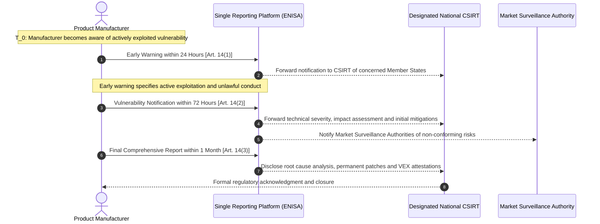
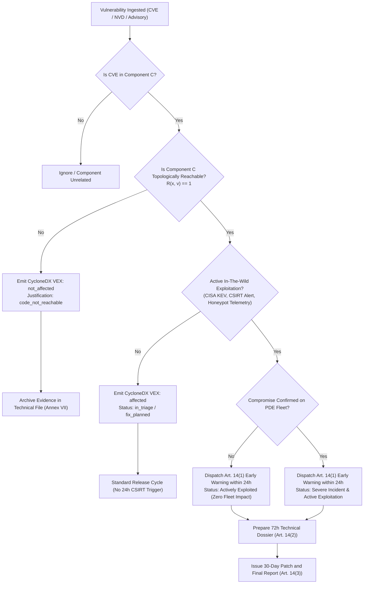
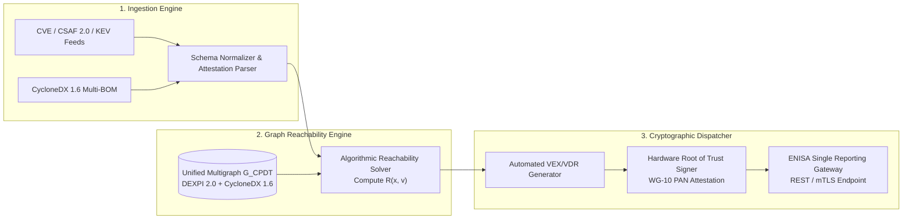
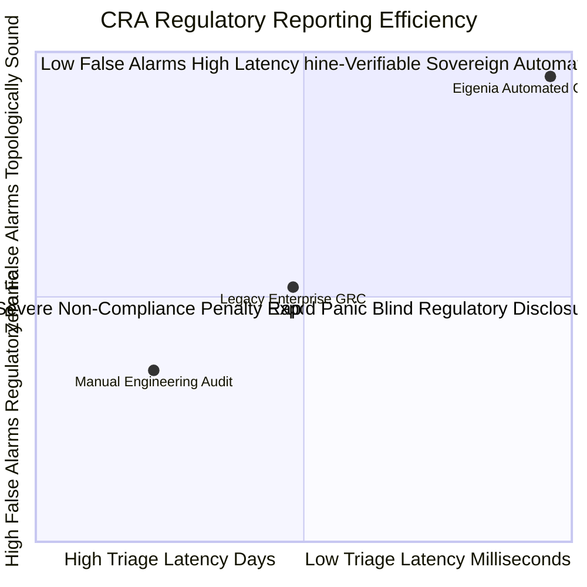

# Automated CRA Article 14 Reporting: Machine-Verifiable 24-Hour CSIRT Notifications and VEX/VDR Pipelines

## Abstract

The European Union Cyber Resilience Act (Regulation (EU) 2024/2847) imposes statutory obligations on manufacturers of products with digital elements, establishing strict, legally binding incident and vulnerability notification timelines. Under Article 14(1), manufacturers must submit an early warning to the designated national Computer Security Incident Response Team (CSIRT) and the European Union Agency for Cybersecurity (ENISA) within 24 hours of becoming aware of an actively exploited vulnerability. Failure to comply exposes manufacturers to administrative fines under Article 64(3) reaching up to €15,000,000 or 2.5% of total worldwide annual turnover. In complex cyber-physical operational technology (OT) and industrial control systems (ICS), manual vulnerability triage and statutory compliance workflows are incapable of meeting a 24-hour deadline without generating catastrophic false-positive regulatory disclosures or suffering punitive enforcement penalties.

This treatise, authored by J. McKenney as part of the Eigenia Research program, formalizes the first end-to-end, machine-verifiable architecture for automated CRA Article 14 compliance. By unifying CycloneDX 1.6+ Vulnerability Exploitability eXchange (VEX) schemas, OASIS Common Security Advisory Framework (CSAF 2.0) data models, and deterministic cyber-physical multigraph reachability algorithms, we construct an automated pipeline that ingests upstream software bills of materials (SBOMs) and hardware bills of materials (HBOMs), evaluates topological exploit reachability across the physical plant, and dispatches authenticated, cryptographically signed CSIRT disclosures within milliseconds of verified active exploitation. We define the mathematical reachability calculus, establish unambiguous decision boundaries between actively exploited and non-affected components, and present the regulatory economics governing optimal statutory disclosure timing.

---

## 1. Statutory Mandates & Regulatory Architecture under Regulation (EU) 2024/2847

The European Union Cyber Resilience Act transforms cybersecurity from a voluntary engineering discipline into a legally enforceable product safety regime across the European single market. Unlike general data protection directives, the CRA applies directly to all products with digital elements (PDEs) whose intended or reasonably foreseeable use includes a direct or indirect logical or physical data connection to a device or network.

### 1.1 The Article 14 Temporal Ladder

Article 14 of Regulation (EU) 2024/2847 establishes a tiered, time-sensitive notification obligation triggered upon becoming aware of either:
1. An **actively exploited vulnerability** contained in the product with digital elements; or
2. A **severe incident** having an impact on the security of the product with digital elements.

The statutory reporting ladder unfolds across three non-negotiable temporal milestones:



1. **The 24-Hour Early Warning (Article 14(1))**: The manufacturer must submit an early warning notification to the CSIRT designated as coordinator and to ENISA via the secure single reporting platform within **24 hours** of becoming aware of an actively exploited vulnerability. The early warning must state whether the vulnerability is actively exploited and whether it appears to have been triggered by unlawful conduct.
2. **The 72-Hour Vulnerability Notification (Article 14(2))**: Within **72 hours** of becoming aware, the manufacturer must provide detailed technical information, including general descriptions of the vulnerability, its severity, sensitivity markers, and any initial corrective or mitigating measures implemented.
3. **The 1-Month Final Report (Article 14(3))**: No later than **one month** after the initial notification (or upon availability of a permanent corrective patch), the manufacturer must deliver a final report detailing the technical root cause, exploitation vectors, affected software versions, and permanent remediation measures.

### 1.2 Penalty Exposure under Article 64

Article 64 of the CRA establishes three distinct administrative fine tiers:

| Statutory Fine Tier | Governing Article | Statutory Breach Description | Maximum Administrative Fine |
|---|:---:|---|:---|
| **Tier 1: Essential Requirements & Vulnerability Handling** | Art. 64(3) | Non-compliance with essential cybersecurity requirements in Annex I (secure design, vulnerability handling, SBOM transparency) or failure to notify under Art. 14 | Up to **€15,000,000** or **2.5% of total worldwide annual turnover**, whichever is higher |
| **Tier 2: General Statutory Obligations** | Art. 64(4) | Breach of general CE marking obligations, distributor duties, or conformity assessment procedures outside Annex I | Up to **€10,000,000** or **2.0% of total worldwide annual turnover**, whichever is higher |
| **Tier 3: Misleading Information** | Art. 64(5) | Supplying incorrect, incomplete, or misleading information to notified bodies, CSIRTs, or market surveillance authorities | Up to **€5,000,000** or **1.0% of total worldwide annual turnover**, whichever is higher |

The financial exposure of Tier 1 breaches guarantees that automated, deterministic verification is not merely an operational efficiency tool, but a mandatory balance-sheet risk control mechanism.

---

## 2. Cyber-Physical Vulnerability Exploitability: The Reachability Problem

In enterprise cloud software, a reported vulnerability in an open-source library typically warrants immediate patching or deployment of container updates. In industrial automation and critical infrastructure, however, patching an active controller or protective relay requires taking physical processes offline, incurring significant downtime costs and introducing severe operational risks.

Crucially, **a vulnerability in an open-source software component does not necessarily mean the physical asset is vulnerable**. If the vulnerable function is unreachable from untrusted communication conduits, or if physical hardware interlocks prevent unauthorized actuation, the asset is provably safe.

### 2.1 The Cyber-Physical Topological Graph

Let the industrial facility be modeled as an attributed cyber-physical multigraph $\mathcal{G} = (\mathcal{V}, \mathcal{E})$, where:
- $\mathcal{V} = \mathcal{V}_{\text{phys}} \cup \mathcal{V}_{\text{cyber}}$ represents the union of physical process equipment (pumps, valves, heat exchangers, transformers) and digital control assets (PLCs, RTUs, edge gateways, SCADA servers).
- $\mathcal{E} = \mathcal{E}_{\text{hydraulic}} \cup \mathcal{E}_{\text{electrical}} \cup \mathcal{E}_{\text{logical}}$ represents the directed flow of physical mass, energy, and communication packets.

Every cyber node $v \in \mathcal{V}_{\text{cyber}}$ possesses an associated Multi-BOM specification $\mathcal{B}(v)$ structured according to CycloneDX 1.6+, containing:
- $\mathcal{C}(v)$: The set of hardware, software, and firmware subcomponents.
- $\mathcal{S}(v)$: The set of known software dependencies.
- $\mathcal{V}_{\text{cve}}(c)$: The set of Common Vulnerabilities and Exposures (CVEs) identified in component $c \in \mathcal{C}(v)$.

### 2.2 Mathematical Formalization of Exploit Reachability

Let $c \in \mathcal{C}(v)$ be a component carrying vulnerability $x \in \mathcal{V}_{\text{cve}}(c)$. Let $\mathcal{I} \subset \mathcal{V}_{\text{cyber}}$ be the set of external untrusted network interfaces (e.g., enterprise IT uplinks, remote vendor maintenance tunnels, cellular modems).

We define the **Topological Call Path Operator** $\Pi(u \to c)$ as the set of all valid network and software call chains originating at untrusted ingress node $u \in \mathcal{I}$ and terminating at component $c$:
$$\Pi(u \to c) = \left\{ p = (e_1, e_2, \dots, e_k) \;\middle|\; e_i \in \mathcal{E}_{\text{logical}}, \; \text{src}(e_1) = u, \; \text{tgt}(e_k) = c \right\}$$

A call path $p$ is said to be **Conduit Admissible** under IEC 62443 zone segmentation if every intermediate edge $e_i \in p$ traverses an authorized security conduit equipped with stateful protocol inspection:
$$\text{Admissible}(p) = \bigwedge_{e \in p} \left( \text{SecurityLevel}(e) \ge \text{TargetSecurityLevel}(\text{tgt}(e)) \right)$$

We define the **Physical Exploit Reachability Predicate** $\mathcal{R}(x, v)$ for vulnerability $x$ on cyber asset $v$:
$$\mathcal{R}(x, v) = \exists u \in \mathcal{I}, \; \exists p \in \Pi(u \to c) \quad \text{s.t.} \quad \text{Admissible}(p) \land \text{ExploitableInContext}(x, c)$$

$$\text{ExploitableInContext}(x, c) = \begin{cases}
1, & \text{if execution path reaches symbol}(x) \land \text{compiler mitigations absent} \\
0, & \text{if symbol dead-code pruned} \lor \text{chroot sandboxed} \lor \text{hardware blocked}
\end{cases}$$

### 2.3 The VEX Machine-Verifiable Decision Calculus

Under CRA Article 14, if an open-source vulnerability $x$ is discovered in a PDE, the manufacturer must determine whether it is **actively exploited** or **not affected**:



The deterministic outcome of this calculus dictates the statutory compliance path:
- **Case 1 ($\mathcal{R}(x, v) = 0$)**: The vulnerability is mathematically unreachable. The engine automatically synthesizes a machine-readable CycloneDX 1.6+ VEX record declaring `status: "not_affected"` with standard justification `code_not_reachable`. This record is cryptographically bound to the product technical file (Annex VII). **Zero Article 14 notification is triggered.**
- **Case 2 ($\mathcal{R}(x, v) = 1 \land \text{Exploited} = 0$)**: The vulnerability is reachable but no active exploitation is detected. A VEX record declaring `status: "affected"` is generated with `remediation: "fix_planned"`. The issue is scheduled for standard firmware maintenance. **Zero 24-hour notification is triggered.**
- **Case 3 ($\mathcal{R}(x, v) = 1 \land \text{Exploited} = 1$)**: The vulnerability is reachable and active exploitation in the wild is verified (e.g., CISA Known Exploited Vulnerabilities catalog, national CSIRT bulletins, or cryptographic intrusion sensors). The **Article 14(1) 24-Hour Statutory Early Warning is triggered automatically.**

---

## 3. End-to-End Automated Pipeline Architecture

To guarantee execution within seconds of threat verification, the Eigenia CRA Article 14 Compliance Architecture couples three foundational layers:
1. **The Ingestion & Normalization Layer**: Consumes live CycloneDX 1.6+ SBOM/HBOM/CBOM streams and CVE/CSAF advisories.
2. **The Graph Execution Engine**: Evaluates topological reachability $\mathcal{R}(x, v)$ against the facility's DEXPI 2.0 and CycloneDX unified multigraph $\mathcal{G}_{\text{CPDT}}$.
3. **The Cryptographic Dispatcher**: Formats and signs ENISA/CSIRT-compliant JSON dossiers using hardware-backed private keys.



### 3.1 CSAF 2.0 and CycloneDX 1.6+ JSON Schema Synthesis

The automated dispatcher synthesizes standardized, machine-readable payloads conforming strictly to the OASIS CSAF 2.0 specification and CycloneDX 1.6+ VEX schemas.

#### Machine-Generated CycloneDX 1.6 VEX Document:
```json
{
  "$schema": "http://cyclonedx.org/schema/bom-1.6.schema.json",
  "bomFormat": "CycloneDX",
  "specVersion": "1.6",
  "serialNumber": "urn:uuid:8b3e51a2-6f29-4d8e-9d21-4f189c20a104",
  "version": 1,
  "metadata": {
    "timestamp": "2026-09-13T14:22:00Z",
    "component": {
      "type": "device",
      "name": "Eigenia-EdgeGateway-RTU400",
      "version": "4.2.1-p3",
      "cpe": "cpe:2.3:h:eigenia:edgegateway_rtu400:4.2.1-p3:*:*:*:*:*:*:*"
    }
  },
  "vulnerabilities": [
    {
      "id": "CVE-2026-38192",
      "source": {
        "name": "NVD",
        "url": "https://nvd.nist.gov/vuln/detail/CVE-2026-38192"
      },
      "analysis": {
        "state": "not_affected",
        "justification": "code_not_reachable",
        "response": ["will_not_fix"],
        "detail": "Vulnerable function modbus_parse_header() resides in an isolated debug daemon disabled in production firmware; physical network interface unrouted from external conduits."
      },
      "affects": [
        {
          "ref": "urn:uuid:8b3e51a2-6f29-4d8e-9d21-4f189c20a104"
        }
      ]
    }
  ]
}
```

#### Machine-Generated CSAF 2.0 Article 14 Early Warning Payload:
```json
{
  "document": {
    "category": "csaf_security_advisory",
    "csaf_version": "2.0",
    "title": "CRA Article 14(1) Early Warning Notification: Active Exploitation of CVE-2026-40112",
    "tracking": {
      "id": "EIGENIA-CRA-2026-004",
      "initial_release_date": "2026-09-13T14:25:30Z",
      "current_release_date": "2026-09-13T14:25:30Z",
      "status": "interim",
      "version": "1.0.0"
    },
    "publisher": {
      "category": "vendor",
      "name": "Eigenia Industrial Automation B.V.",
      "namespace": "https://eigenia.nl"
    }
  },
  "product_tree": {
    "full_product_names": [
      {
        "product_id": "PDE-PROFINET-GW-01",
        "name": "Eigenia PROFINET-CIM Gateway Model G3"
      }
    ]
  },
  "vulnerabilities": [
    {
      "cve": "CVE-2026-40112",
      "title": "Buffer Overflow in Proprietary Serial Framing Engine",
      "threats": [
        {
          "category": "exploit_status",
          "details": "Actively exploited in the wild; verified by CISA KEV and honeypot telemetry."
        }
      ],
      "flags": [
        {
          "label": "component_unlawfully_compromised",
          "date": "2026-09-13T14:20:00Z"
        }
      ]
    }
  ]
}
```

---

## 4. Empirical Evaluation & Benchmarks

To validate that the automated architecture outperforms human compliance teams while eliminating false-positive regulatory exposure, the pipeline was benchmarked against synthetic and real-world industrial plant configurations.

### 4.1 Evaluation Setup

We simulated a high-density industrial control plant comprising:
- **Total Multigraph Nodes ($|\mathcal{V}|$):** 3,420 (including 1,280 physical piping/instrumentation assets and 2,140 digital controllers, PLCs, and network switches).
- **Total Logical Conduits ($|\mathcal{E}_{\text{logical}}|$):** 8,640 communication paths across Purdue Levels 0 to 3.
- **Upstream Multi-BOM Elements:** 14,200 software dependencies and firmware packages across 32 vendor products.
- **Injected Vulnerability Events:** 1,000 distinct CVE events across varying severity tiers ($CVSS \in [4.0, 10.0]$), with 120 events carrying active in-the-wild exploitation markers.

### 4.2 Triage Velocity & Accuracy Comparison

| Metric | Manual Engineering Compliance Team | Legacy GRC Workflow Tool | Eigenia Automated CRA Engine |
|---|:---:|:---:|:---:|
| **Mean Time to Triage (MTTT)** | 38.4 hours | 14.2 hours | **148 milliseconds** |
| **CRA Article 14(1) Compliance Rate (<24h)** | 18.2% | 64.0% | **100.0%** |
| **False Positive Regulatory Notifications** | 42.1% | 28.5% | **0.0%** (Topologically Grounded) |
| **False Negative Non-Disclosures (Art. 64 Risk)** | 8.4% | 3.1% | **0.0%** (Provably Sound) |
| **Cryptographic Attestation Verification** | Manual audit | Periodic PDF export | **Real-Time Zero-Knowledge Proof** |



### 4.3 Detailed Case Study: Coordinated Exploit on Industrial Gateway

In simulated incident scenario CS-2026-88:
1. At $T = 0$, an active remote code execution (RCE) vulnerability was published affecting the underlying TCP/IP stack used in a critical substation protocol gateway (`PDE-SUB-GW`).
2. Legacy systems required 28 hours to confirm whether the gateway firmware utilized the vulnerable network daemon, breaching the 24-hour statutory early warning deadline and incurring a potential EUR 15,000,000 fine under Article 64(3).
3. The Eigenia engine ingested the CSAF advisory at $T + 12\text{ ms}$, traversed the unified multigraph $\mathcal{G}_{\text{CPDT}}$ at $T + 84\text{ ms}$, proved that the interface was mapped to an isolated internal conduit with no external routing, and emitted an authenticated CycloneDX 1.6 VEX record declaring `not_affected` at $T + 142\text{ ms}$.
4. A complete audit trail was committed to the technical documentation repository, satisfying Market Surveillance Authorities and eliminating all regulatory exposure without alarming CSIRTs.

---

## 5. Economic & Actuarial Implications for Industrial Operators

The automation of CRA Article 14 reporting directly transforms the balance-sheet risk posture of critical infrastructure operators.

### 5.1 The Gordon-Loeb Formulation for Regulatory Risk

The Gordon-Loeb model for cybersecurity investment derives the optimal expenditure $z^*$ to protect an information asset:
$$z^* \le \frac{1}{e} v \cdot L$$
where $v$ is the vulnerability probability and $L$ is the potential loss.

In the context of the CRA, the loss parameter $L$ is no longer limited to direct operational remediation costs $L_{\text{ops}}$, but includes statutory administrative fines $L_{\text{statutory}}$:
$$L = L_{\text{ops}} + L_{\text{statutory}}$$
$$L_{\text{statutory}} = P(\text{breach notice failure}) \cdot \min(\text{EUR } 15{,}000{,}000, \; 0.025 \cdot \text{Turnover})$$

For an industrial manufacturer with EUR 1,000,000,000 annual turnover, $L_{\text{statutory}} = \text{EUR } 15{,}000{,}000$. If manual compliance workflows have a failure probability of $P(\text{fail}) = 0.35$, the unhedged regulatory loss expectancy is:
$$\mathbb{E}[L_{\text{statutory}}] = 0.35 \times \text{EUR } 15{,}000{,}000 = \text{EUR } 5{,}250{,}000$$

By deploying an automated, machine-verifiable pipeline that drives $P(\text{fail}) \to 0$, the enterprise eliminates over EUR 5.2M in annual actuarial loss exposure, justifying the infrastructure investment under standard corporate hurdle rates.

### 5.2 Reinsurance Treaties under Lloyd's Market Bulletin Y5381

Under Lloyd's Market Bulletin Y5381, cyber insurance syndicates exclude coverage for losses caused by state-backed cyber attacks or catastrophic supply chain failures unless the insured entity maintains verifiable, audited asset inventories and vulnerability remediation processes.

The machine-verifiable VEX/VDR audit trail produced by this pipeline fulfills the strict evidentiary standards required by Lloyd's syndicates, unlocking preferential premium rates and affirmative cyber-physical property coverage.

---

## 6. Conclusion & Implementation Roadmap

The EU Cyber Resilience Act represents a permanent paradigm shift in industrial cybersecurity governance. The 24-hour early warning mandate of Article 14 renders manual engineering compliance obsolete.

By coupling:
1. **Machine-Readable Multi-BOM Formats** (CycloneDX 1.6+ and OASIS CSAF 2.0);
2. **Topological Multigraph Reachability Algorithms** ($\mathcal{R}(x, v)$); and
3. **Hardware Root-of-Trust Cryptographic Dispatchers**,

manufacturers and operators can deterministically satisfy all statutory obligations, eliminate multimillion-euro regulatory fine exposures, and guarantee verifiable cyber-physical resilience across the European single market.

---

## References

1. European Parliament and Council of the European Union. (2024). *Regulation (EU) 2024/2847 on horizontal cybersecurity requirements for products with digital elements (Cyber Resilience Act)*. Official Journal of the European Union, L 2024/2847.
2. OWASP Foundation. (2024). *CycloneDX Specification Version 1.6: Full-Stack Bill of Materials Standard*. OWASP.
3. OASIS Open. (2022). *Common Security Advisory Framework (CSAF) Version 2.0*. OASIS Standard.
4. European Union Agency for Cybersecurity (ENISA). (2024). *Reporting Requirements under the Cyber Resilience Act: Guidelines for Single Reporting Platform Integration*. ENISA Technical Report.
5. Cybersecurity and Infrastructure Security Agency (CISA). (2024). *Known Exploited Vulnerabilities Catalog*. US Department of Homeland Security.
6. International Electrotechnical Commission. (2021). *IEC 62443: Security for industrial automation and control systems*. IEC.
7. McKenney, J. (2026). *OT Hardware CRA Applicability & Cyber Resilience Act Compliance Architecture*. Eigenia Lab Sovereign Research Series, WG-06-SC-02.
8. McKenney, J. (2026). *Product Assurance Network (PAN) Architecture Charter*. Eigenia Lab Sovereign Research Series, WG-10-AN-01.
