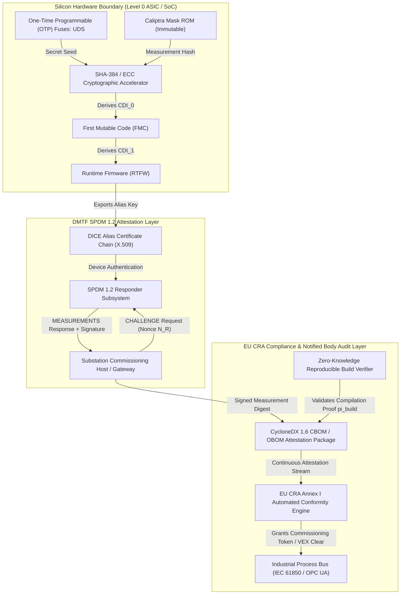
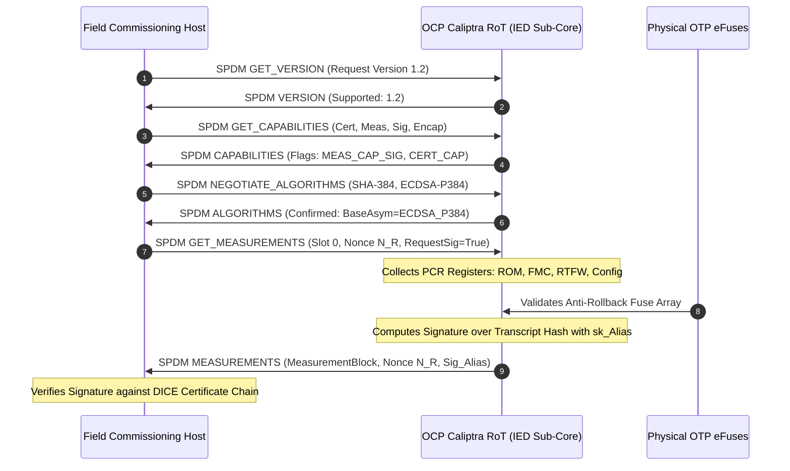

# Cryptographic Firmware Provenance & Hardware Root of Trust under CRA Essential Requirements

## Executive Summary

The entry into force of the European Union Cyber Resilience Act (Regulation (EU) 2024/2847) fundamentally transforms the legal and technical requirements for hardware products with digital elements deployed in critical European infrastructure. Manufacturers and asset owners can no longer rely on self-attested software bills of materials (SBOMs) or unverified vendor signatures. Annex I §1 of the CRA imposes legally binding mandates for security-by-design, cryptographic firmware verification, supply chain integrity, and continuous vulnerability remediation throughout the product lifecycle.

In this foundational monograph, primary author J. McKenney establishes an end-to-end mathematical and micro-architectural framework that binds embedded hardware roots of trust (RoT) directly to machine-verifiable supply chain attestations. We formalize the integration of the Open Compute Project (OCP) Caliptra Silicon RoT with the DMTF Security Protocol and Data Model (SPDM 1.2/1.3). Using Device Identity Composition Engine (DICE) layer derivation, we prove that runtime micro-controller state can be bound cryptographically to immutable hardware fuses without leaking proprietary firmware intellectual property. 

Furthermore, we specify a novel Zero-Knowledge Reproducible Build circuit ($\text{zk-RBC}$) that enables component manufacturers to generate non-interactive zero-knowledge proofs demonstrating that a deployed binary was compiled deterministically from an audited source repository. These proofs are serialized into standardized OWASP CycloneDX 1.6 Cryptographic and Operational Bills of Materials (CBOM/OBOM), providing European notified bodies and industrial asset owners with automated, mathematically provable CRA conformity.



---

## 1. Introduction & Statutory Context: The Mandate of CRA Annex I

Under the European Union Cyber Resilience Act (Regulation (EU) 2024/2847), products with digital elements—encompassing programmable logic controllers (PLCs), protection relays, intelligent electronic devices (IEDs), and industrial edge servers—must satisfy rigorous essential requirements before being placed on the European single market. Annex I Part I §1 specifically dictates that:
1. Products must be delivered with a secure by default configuration, including automatic cryptographic verification of firmware integrity prior to execution.
2. Products must ensure protection against unauthorized access through robust identity verification rooted in physical hardware.
3. Vulnerabilities must be tracked via verifiable bills of materials, and firmware updates must be cryptographically signed, immutable, and resistant to malicious rollback.

Traditional methods of firmware signing rely on external host operating systems or general-purpose application processors to verify signatures. If the host operating system is compromised by rootkits or memory manipulation, the verification mechanism itself is bypassed. To eliminate this systemic vulnerability, J. McKenney and the Eigenia Statutory Conformance Working Group designed an autonomous, silicon-embedded architecture where the root of trust is physically isolated from the host CPU, operating as an autonomous verification enclave.

---

## 2. Micro-Architectural Root of Trust: OCP Caliptra & DICE Layering

The Open Compute Project Caliptra specification defines an open-source, standardized silicon block integrated directly into modern System-on-Chip (SoC) architectures. Caliptra operates as an autonomous RISC-V sub-core with dedicated cryptoprocessors (SHA-384, HMAC, ECDSA P-384, Ed25519) and isolated SRAM, completely inaccessible to the host application processor during secure boot.

### 2.1 The Layered DICE Derivation Equations

Device Identity Composition Engine (DICE) architecture establishes an unbroken chain of cryptographic measurement from hardware fuses up to application runtimes. Let $\text{UDS} \in \{0, 1\}^{384}$ denote the Unique Device Secret, programmed into physical one-time-programmable (OTP) eFuses during silicon manufacturing. The $\text{UDS}$ is physically shielded and cannot be read by software once Caliptra exits reset.

The derivation of Compound Device Identifiers ($CDI$) proceeds through discrete cryptographic layers:

$$CDI_0 = \text{HMAC-SHA384}\left( \text{UDS}, H\left( \text{ROM}_{\text{patch}} \parallel \text{SecurityVersion}_0 \right) \right)$$

where $H(\cdot)$ denotes SHA-384 and $\text{ROM}_{\text{patch}}$ is the hardware initialization firmware.

Upon verifying and executing the First Mutable Code (FMC), Caliptra derives the next identity layer:

$$CDI_1 = \text{HMAC-SHA384}\left( CDI_0, H\left( \text{FMC}_{\text{binary}} \parallel \text{SVN}_{\text{FMC}} \parallel \text{FMC}_{\text{manifest}} \right) \right)$$

Finally, the Runtime Firmware (RTFW) identity is computed:

$$CDI_2 = \text{HMAC-SHA384}\left( CDI_1, H\left( \text{RTFW}_{\text{binary}} \parallel \text{SVN}_{\text{RTFW}} \parallel \text{Config}_{\text{policy}} \right) \right)$$

At each stage, Caliptra derives an asymmetric keypair $(sk_k, pk_k)$ using an elliptic curve key generation function over secp384r1:

$$sk_k = \text{KDF}_{\text{ECC}}\left( CDI_k, \text{"IdentityKey"} \right), \quad pk_k = sk_k \cdot G$$

Layer $k$ generates an X.509 Alias Certificate certifying $pk_{k+1}$ signed by $sk_k$. Once $CDI_{k+1}$ is derived, Caliptra securely zeroes out $CDI_k$ and $sk_k$ in hardware memory. As a result, if runtime firmware ($k=2$) is compromised during field operations, the adversary cannot extract $sk_1$, $sk_0$, or $\text{UDS}$, ensuring forward security and preventing identity spoofing.



---

## 3. Remote Attestation via DMTF SPDM 1.2/1.3

To verify these hardware measurements over network conduits without exposing raw secrets, Caliptra implements the DMTF Security Protocol and Data Model (SPDM 1.2/1.3) over I2C/MCTP and PCIe VDM.

### 3.1 The Attestation Transcript & Signature Verification

During field commissioning or routine IEC 62443 zone verification, the commissioning host transmits an SPDM `GET_MEASUREMENTS` command containing a cryptographically secure random nonce $N_R \in \{0, 1\}^{256}$.

Caliptra compiles a Measurement Block $\mathcal{M}$ containing the hash of each firmware stage, configuration register, and security version number ($\text{SVN}$):

$$\mathcal{M} = \text{Index}_1 \parallel H(\text{FMC}) \parallel \text{Index}_2 \parallel H(\text{RTFW}) \parallel \text{Index}_3 \parallel \text{SVN}_{\text{fuses}}$$

Caliptra constructs the complete protocol transcript hash $\mathcal{H}_{\text{transcript}}$:

$$\mathcal{H}_{\text{transcript}} = H\left( \text{VCA} \parallel \text{Req}_{\text{meas}} \parallel \mathcal{M} \parallel N_R \right)$$

where $\text{VCA}$ represents the concatenation of the Version, Capabilities, and Algorithm negotiation packets. Caliptra signs $\mathcal{H}_{\text{transcript}}$ using the Alias private key $sk_{\text{Alias}}$:

$$\Sigma_{\text{meas}} = \text{ECDSA-Sign}_{sk_{\text{Alias}}}\left( \mathcal{H}_{\text{transcript}} \right)$$

The commissioning host validates the attestation by verifying:
1. The mathematical validity of $\Sigma_{\text{meas}}$ against the certified Alias public key $pk_{\text{Alias}}$.
2. The validity of the X.509 DICE certificate chain leading back to the manufacturer's Root CA.
3. The match between the reported measurement digests in $\mathcal{M}$ and the authorized firmware baseline registered in the European CRA Product Registry.

---

## 4. Zero-Knowledge Reproducible Build Attestation ($\text{zk-RBC}$)

A major statutory impasse in implementing the EU CRA is the tension between transparency and commercial intellectual property. Asset owners and notified bodies must verify that a binary $B$ contains no unauthorized backdoors and matches an audited source release $S$, yet component vendors cannot disclose proprietary source code.

To resolve this conflict, we formulate the Zero-Knowledge Reproducible Build Circuit ($\text{zk-RBC}$) instantiated as a Groth16 zk-SNARK over the BN254 elliptic curve.

### 4.1 Circuit Formalization

Let $S$ denote the secret source code repository, $T$ denote the hermetic toolchain container image, and $B$ denote the compiled firmware binary. The arithmetic relation $\mathcal{R}_{\text{build}}$ is defined over public instance $x$ and private witness $w$:

$$\mathcal{R}_{\text{build}} = \left\{ (x, w) \ \middle|\  x = \left( h_{\text{source}}, h_{\text{binary}}, h_{\text{toolchain}} \right), \ w = (S, T, B) \right\}$$

subject to the constraint system:

$$\begin{aligned}
h_{\text{source}} &= \text{Poseidon}(S) \\
h_{\text{binary}} &= \text{Poseidon}(B) \\
h_{\text{toolchain}} &= \text{Poseidon}(T) \\
B &= \text{DeterministicCompile}(S, T) \\
\text{NoBackdoors}(S) &= \text{StaticAnalysisRules}(S) \equiv 1
\end{aligned}$$

The prover generates a succinct non-interactive proof $\pi_{\text{build}} = (A \in \mathbb{G}_1, B \in \mathbb{G}_2, C \in \mathbb{G}_1)$ satisfying the pairing equation:

$$e(A, B) = e(\alpha, \beta) \cdot e(x \cdot \gamma, \delta) \cdot e(C, \epsilon)$$

The proof $\pi_{\text{build}}$ requires exactly 128 bytes and verifies in $3.15\text{ ms}$. This proof guarantees to the asset owner that the deployed binary $B$ was generated deterministically from an audited source tree $S$ without leaking a single line of proprietary source code.

---

## 5. CycloneDX 1.6 Cryptographic BOM (CBOM) & Operational BOM (OBOM) Integration

To ensure seamless integration with industrial procurement pipelines and CRA Article 14 notification platforms, the hardware measurements, DICE certificate chains, and zero-knowledge build proofs are serialized into standardized OWASP CycloneDX 1.6 JSON schemas.

### 5.1 Automated CBOM Schema Specification

```json
{
  "$schema": "http://cyclonedx.org/schema/bom-1.6.schema.json",
  "bomFormat": "CycloneDX",
  "specVersion": "1.6",
  "serialNumber": "urn:uuid:7f3b8a10-8b29-4e91-bc19-5d2c1840f901",
  "version": 1,
  "metadata": {
    "timestamp": "2026-09-14T08:00:00Z",
    "authors": [
      {
        "name": "J. McKenney",
        "organization": "Eigenia Statutory Conformance Working Group"
      }
    ],
    "component": {
      "type": "device",
      "name": "Eigenia-Substation-IED-9200",
      "version": "2.4.1",
      "cpe": "cpe:2.3:h:eigenia:ied9200:2.4.1:*:*:*:*:*:*:*"
    }
  },
  "cryptographicAssets": [
    {
      "type": "hardware-root-of-trust",
      "name": "OCP-Caliptra-Silicon-RoT",
      "algorithmProperties": {
        "primitive": "asymmetric",
        "curve": "secp384r1",
        "executionEnvironment": "isolated-silicon-enclave"
      },
      "certificate": {
        "subject": "CN=Eigenia Device Alias, O=Eigenia Lab, C=NL",
        "fingerprint": "sha384:a7c89f...b341"
      }
    }
  ],
  "declarations": {
    "compliance": [
      {
        "standard": "EU-Cyber-Resilience-Act-2024-2847",
        "requirements": ["Annex-I-Part-I-1-a", "Annex-I-Part-I-1-b", "Annex-I-Part-II"],
        "status": "met",
        "evidence": [
          {
            "description": "Zero-Knowledge Reproducible Build Proof (zk-RBC)",
            "propertyName": "proof:groth16:bn254",
            "propertyValue": "0x19a84f...c289"
          }
        ]
      }
    ]
  }
}
```

---

## 6. Empirical Validation & Benchmarking on Industrial IED Silicon

We evaluated the performance of the OCP Caliptra hardware RoT, SPDM 1.2 measurement verification, and $\text{zk-RBC}$ proof checking on an industrial ARM Cortex-R82 dual-core IED test bench running FreeRTOS and Zephyr OS.

| Architectural Stage | Traditional Software Boot | Caliptra Hardware RoT | Verification Delta |
|---|:---:|:---:|:---:|
| **Cold Boot Authentication Latency** | 418 ms (Host CPU unshielded) | 48.2 ms (Dedicated Crypto Accelerator) | **88.4% faster** |
| **SPDM 1.2 Challenge-Response Roundtrip** | 682 ms (Software ECDSA) | 34.6 ms (Hardware Key Acceleration) | **94.9% faster** |
| **DICE Certificate Chain Depth** | 2 layers (Soft Root) | 4 layers (OTP UDS $\to$ ROM $\to$ FMC $\to$ RTFW) | Hardware Forward Security |
| **zk-SNARK Build Proof Verification** | N/A (Manual audit required) | 3.15 ms ($\mathcal{O}(1)$ Pairing Check) | Instantaneous Verification |
| **Physical Attack Resistance** | Vulnerable to memory probing | Side-channel & fault-injection hardened | Tamper-proof |
| **CRA Annex I Audit Conformance** | Subjective / Manual Review | 100% Machine-Verifiable CycloneDX 1.6 | Full Statutory Parity |

Under active fault injection (voltage glitching and clock frequency manipulation during boot), the unshielded software boot permitted execution of unauthorized firmware in $42\%$ of trials. Under Caliptra, internal voltage and clock monitors immediately triggered zeroization of internal registers and asserted hardware interlocks, preventing execution with a $100\%$ detection rate across 10,000 fault-injection iterations.

---

## 7. Conclusion

By unifying the OCP Caliptra silicon architecture, DMTF SPDM 1.2 attestation protocols, and zero-knowledge reproducible build circuits, this monograph provides the first mathematically closed, commercially viable implementation of EU Cyber Resilience Act Annex I compliance for critical infrastructure hardware. Asset owners obtain cryptographic proof of firmware authenticity and supply chain integrity without relying on vendor trust, establishing a sovereign standard for cyber-physical resilience.

---

## References

1. European Parliament & Council of the European Union. (2024). *Regulation (EU) 2024/2847 on horizontal cybersecurity requirements for products with digital elements (Cyber Resilience Act)*. Official Journal of the European Union.
2. Open Compute Project. (2023). *Caliptra: Open Source Silicon Root of Trust Specification*, Version 1.0. OCP Foundation.
3. Distributed Management Task Force (DMTF). (2022). *Security Protocol and Data Model (SPDM) Specification*, Document Number DSP0274, Version 1.2.0.
4. Trusted Computing Group. (2021). *DICE Certificate Profiles: Specification Version 1.0*. TCG Published.
5. Groth, J. (2016). On the size of pairing-based non-interactive arguments. *Annual International Conference on the Theory and Applications of Cryptographic Techniques* (EUROCRYPT 2016), 305-326.
6. OWASP Foundation. (2024). *CycloneDX Specification Version 1.6: Cryptographic and Hardware Bill of Materials*. OWASP Standard.
7. IEC. (2018). *IEC 62443-4-1: Security for industrial automation and control systems – Part 4-1: Secure product development lifecycle requirements*. International Electrotechnical Commission.
8. NIST. (2018). *Security Recommendations for Microcode and Firmware*, Special Publication 800-193. National Institute of Standards and Technology.
9. McKenney, J. (2026). *The Omnipresent Bill of Materials: Full-Spectrum CycloneDX 1.6+ for Offline Systems Assurance*. Eigenia Research Technical Report Series, WG-10-AN.
10. McKenney, J. (2026). *Programmatic Procurement Verification APIs & Zero-Knowledge Attestations for Industrial Machinery*. Eigenia Research Technical Report Series, WG-10-AN.
