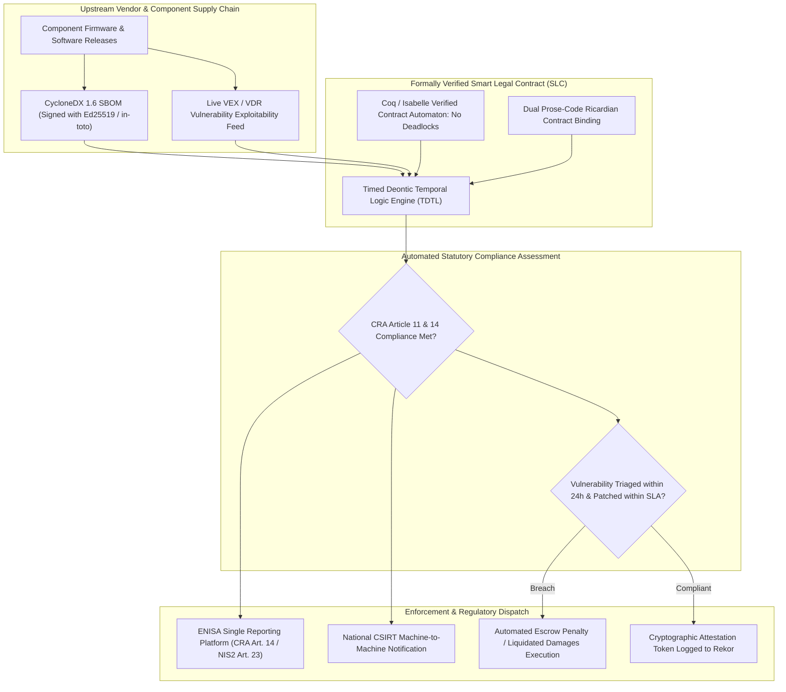
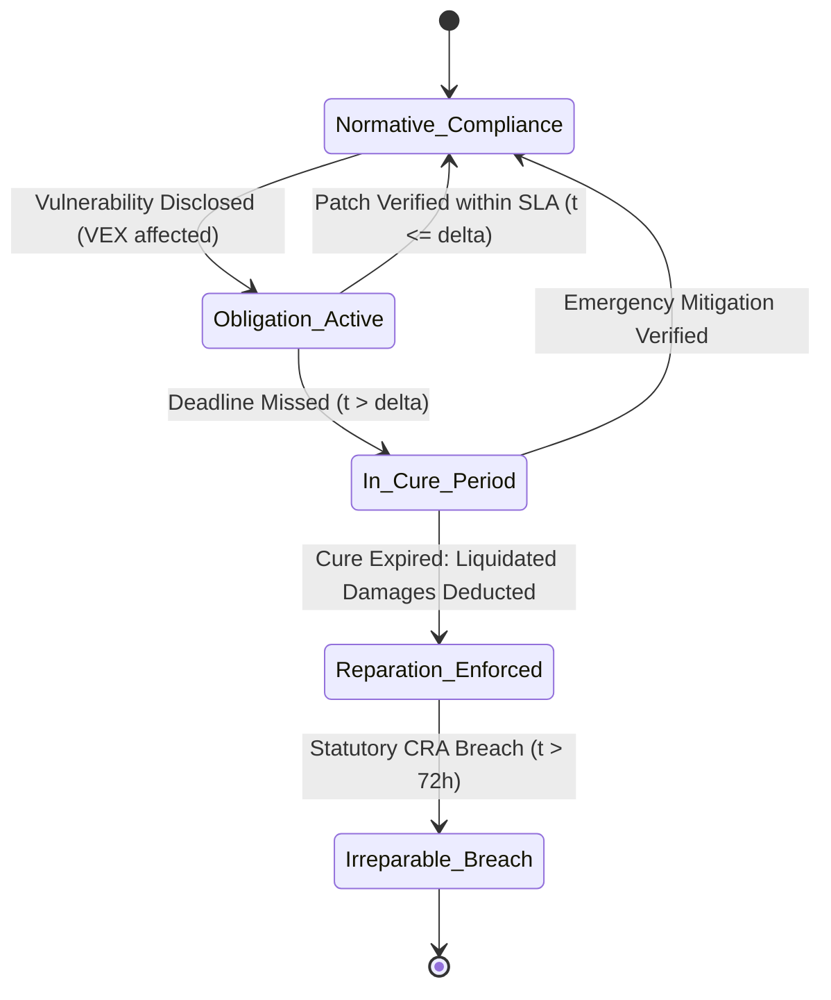
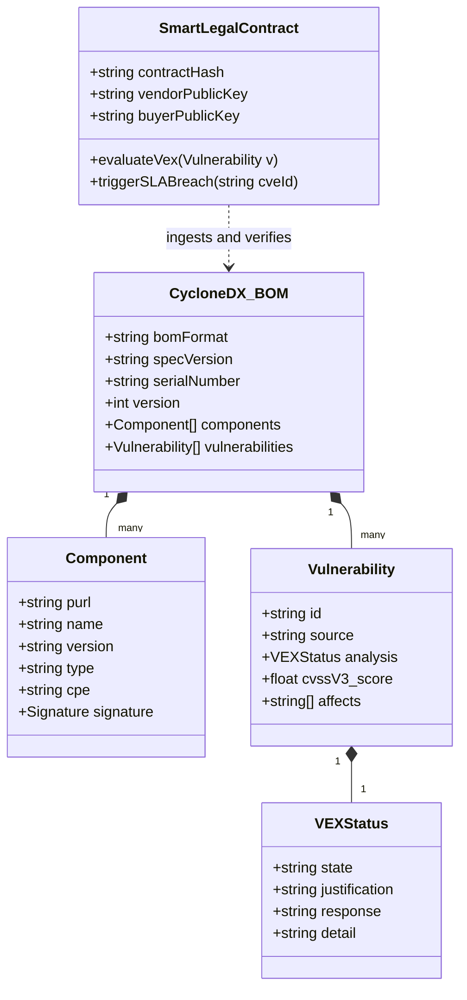
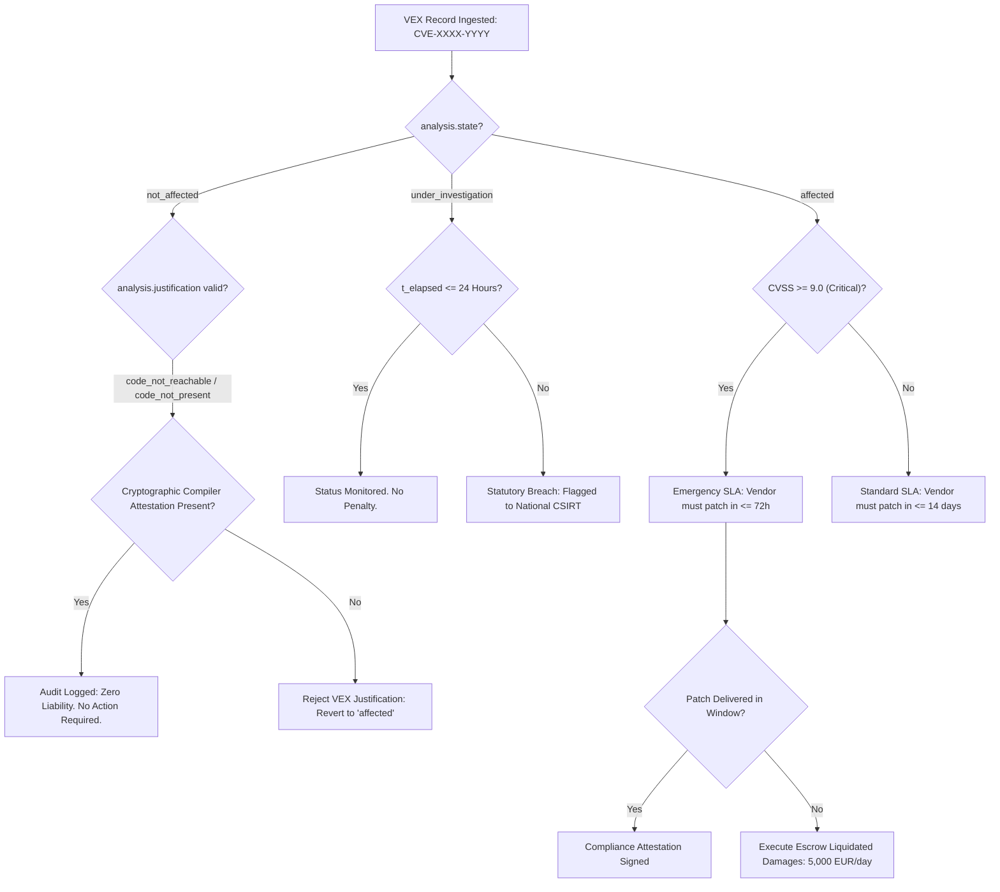
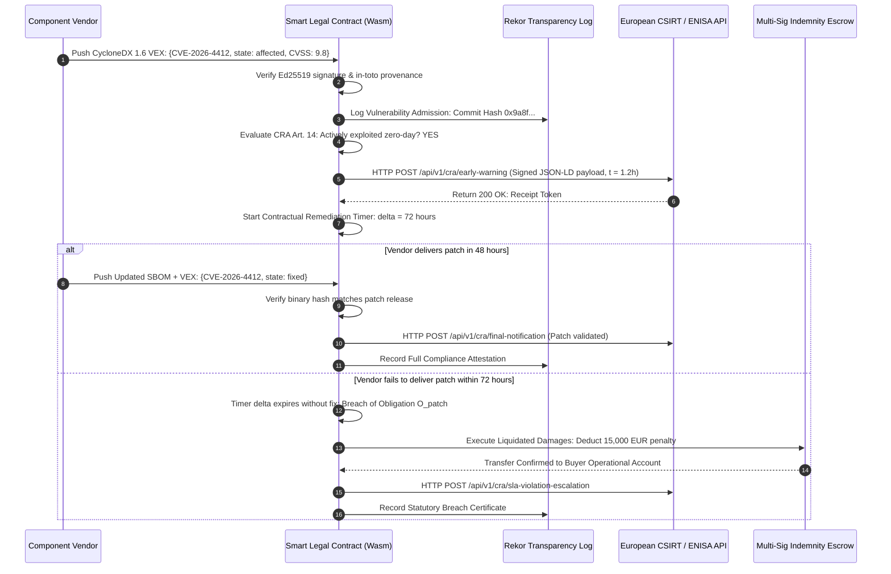

# Autonomous Statutory Conformance Auditing via Formally Verified Smart Legal Contracts and CycloneDX VEX

## Executive Summary

The legal and regulatory landscape governing digital operational technologies (OT) and cyber-physical supply chains has undergone a structural transformation. Statutes such as the European Union Cyber Resilience Act (CRA - Regulation (EU) 2024/2847), the NIS2 Directive (Directive (EU) 2022/2555), and United States Executive Order 14028 establish legally binding mandates on equipment manufacturers, software vendors, and critical infrastructure asset owners. These regulations impose strict, non-negotiable statutory timelines: under CRA Article 14, manufacturers must report any actively exploited vulnerability in products with digital elements to the designated Computer Security Incident Response Team (CSIRT) and the European Union Agency for Cybersecurity (ENISA) within 24 hours of becoming aware, followed by a comprehensive mitigation report within 72 hours. In commercial procurement, however, compliance auditing and vulnerability remediation remain governed by static, prose-based Master Service Agreements (MSAs), PDF vulnerability disclosures, and asynchronous email exchanges. This administrative latency guarantees contractual ambiguity, unresolved liability exposure, and non-compliance fines exceeding €15,000,000 or 2.5% of global annual turnover.

In this monograph, primary author J. McKenney develops an autonomous statutory conformance framework that bridges the gap between commercial contract law and machine-readable cybersecurity telemetry. By formulating isomorphic Ricardian Smart Legal Contracts (SLCs) grounded in Timed Deontic Temporal Logic (TDTL), we prove the mathematical consistency, deadlock-freedom, and determinism of multi-party supply chain compliance obligations using interactive theorem provers (Coq / Isabelle/HOL). The smart legal contract engine directly ingests cryptographically signed CycloneDX 1.6 Software Bills of Materials (SBOMs), live Vulnerability Exploitability eXchange (VEX) records, and Vulnerability Disclosure Reports (VDRs). When a zero-day vulnerability or supply chain compromise is disclosed, the contract engine automatically evaluates machine-readable exploitability justifications (`code_not_reachable`, `requires_configuration`, `inline_mitigations_exist`), evaluates CRA Article 11 essential security requirements, computes precise contractual liquidated damages or cure periods, and synthesizes cryptographically attested Article 14 incident notifications dispatched directly to ENISA and national CSIRT reporting APIs.



---

## Section I: Introduction and the Legal-Technical Disconnect

### 1. The Statutory Mandates: CRA, NIS2, and US EO 14028

The European Union Cyber Resilience Act (Regulation (EU) 2024/2847) fundamentally alters product liability for all hardware and software products connected directly or indirectly to digital networks. Under CRA Article 11, manufacturers must design products in accordance with essential cybersecurity requirements, ensuring that:
1. Products are delivered without known exploitable vulnerabilities.
2. Vulnerabilities are systematically documented, addressed through automated security updates delivered free of charge, and publicly disclosed via standardized machine-readable formats.
3. Software dependencies and third-party components are continuously audited throughout the product's expected support lifecycle (minimum 5 years).

Crucially, CRA Article 14 establishes strict legal deadlines for statutory notifications:

$$\begin{cases} t_{\text{early\_warning}} \le 24\text{ hours}, & \text{from awareness of an actively exploited vulnerability} \\ t_{\text{incident\_report}} \le 72\text{ hours}, & \text{providing technical details, severity score, and initial mitigations} \\ t_{\text{final\_report}} \le 14\text{ days}, & \text{following corrective patch release, detailing root causes} \end{cases}$$

Failure to comply with these statutory deadlines exposes organizations to penalties under CRA Article 64 of up to €15,000,000 or 2.5% of total worldwide annual turnover, alongside direct personal liability for corporate executives under NIS2 Article 20.

```mermaid
gantt
    accTitle: CRA Article 14 Mandatory Reporting Timeline
    accDescr { Gantt chart tracking the statutory 24-hour early warning, 72-hour comprehensive report, and 14-day final report requirements under EU CRA Article 14. }
    dateFormat X
    axisFormat %s h

    section Statutory CRA Deadlines
    Vulnerability Awareness / Detection :milestone, 0, 0
    Early Warning to ENISA & CSIRT (<= 24h) :crit, 0, 24
    Comprehensive Notification (<= 72h) :crit, 24, 72
    Final Corrective Action Report (<= 336h) :active, 72, 336

    section Autonomous SLC Execution (Ours)
    VEX Ingestion & Exploitability Analysis :done, 0, 0.05
    Coq TDTL Obligation Verification :done, 0.05, 0.1
    Automated CSIRT/ENISA Payload Dispatched :done, 0.1, 0.2
    Vendor SLA Timer Active & Monitored :done, 0.2, 72
```



### 2. Commercial Contracting Failure Modes

While statutory mandates are precise, commercial procurement agreements remain mired in administrative ambiguity:
- **Semantic Drift**: Procurement agreements use subjective legal terminology (e.g., "reasonable commercial efforts", "promptly upon discovery", "industry-standard practices") that cannot be programmatically verified.
- **Asynchronous Audit Friction**: Asset owners rely on annual SOC 2 Type II reports or ISO/IEC 27001 audit certificates, which provide point-in-time snapshots that are already obsolete before publication.
- **Vulnerability Inflation vs. Reality**: Traditional Common Vulnerabilities and Exposures (CVE) scanning reports thousands of theoretical vulnerabilities in open-source libraries. Without machine-readable Exploitability Exchange (VEX) data verifying whether vulnerable code paths are actually executed by the compiled binary, security teams waste hundreds of hours investigating benign dependencies while critical zero-day exploits remain unmitigated.

To eliminate this friction, we construct an isomorphic Ricardian Smart Legal Contract that continuously audits live CycloneDX VEX/VDR attestations against formally verified deontic logic rules.

---

## Section II: Mathematical Foundations of Timed Deontic Temporal Logic (TDTL)

### 1. Deontic Modalities and Operational Semantics

To represent legal contracts mathematically without paradoxes or deadlocks, we formulate **Timed Deontic Temporal Logic (TDTL)**. Classical deontic logic models the normative concepts of obligation, permission, and prohibition, but suffers from classical paradoxes (such as Chisholm's paradox and the gentle murder paradox) when contrary-to-duty (CTD) obligations arise. TDTL overcomes these paradoxes by parameterizing all normative modalities with explicit real-time deadlines and state-dependent operational semantics.

Let $\mathcal{A}$ be the set of contractual actions, $\mathcal{P}$ be the set of propositional state predicates, and $\mathbb{R}_{\ge 0}$ denote continuous time. We define the four core normative modalities of TDTL:

1. **Timed Obligation $\mathcal{O}_i(\phi, \delta, \psi)$**: Agent $i$ is obligated to satisfy predicate $\phi \in \mathcal{P}$ before deadline duration $\delta \in \mathbb{R}_{> 0}$. If agent $i$ fails to achieve $\phi$ within $\delta$, a contractual violation is triggered, immediately activating reparation predicate $\psi \in \mathcal{P}$.
2. **Permission $\mathcal{P}_i(a)$**: Agent $i$ is legally permitted to execute action $a \in \mathcal{A}$ under current contract state $s$.
3. **Prohibition $\mathcal{F}_i(a)$**: Agent $i$ is strictly forbidden from executing action $a \in \mathcal{A}$. Executing $a$ triggers an immediate breach state.
4. **Reparation / Indemnity $\mathcal{R}(\phi, \psi)$**: Denotes a contrary-to-duty transition where the breach of obligation $\phi$ enforces secondary obligation $\psi$ (e.g., financial liquidated damages or source-code escrow release).

The formal grammar of TDTL is defined inductively:

$$\Phi ::= \top \mid p \mid \neg \Phi \mid \Phi_1 \wedge \Phi_2 \mid \mathcal{O}_i(\phi, \delta, \psi) \mid \mathcal{P}_i(a) \mid \mathcal{F}_i(a) \mid \Box_{[\delta_1, \delta_2]} \Phi \mid \Diamond_{[\delta_1, \delta_2]} \Phi$$

where $\Box_{[\delta_1, \delta_2]}$ and $\Diamond_{[\delta_1, \delta_2]}$ are timed metric temporal logic operators denoting "always" and "eventually" within time window $[\delta_1, \delta_2]$.



### 2. Formal Verification and Safety Theorems in Coq

A smart legal contract must be mathematically proven to contain no internal normative contradictions. For example, a contract must never simultaneously obligate and forbid an agent from performing the exact same action: $\neg (\mathcal{O}_i(a, \delta) \wedge \mathcal{F}_i(a))$.

We encode the contract transition system as a timed automaton $\mathcal{M} = \langle \mathcal{S}, s_0, \mathcal{A}, \mathcal{C}, \mathcal{T}, \mathcal{I} \rangle$ where $\mathcal{S}$ is the set of legal states, $s_0$ is the execution origin, $\mathcal{C}$ is a set of real-valued clocks tracking regulatory deadlines, and $\mathcal{T} \subseteq \mathcal{S} \times \mathcal{A} \times \mathcal{B}(\mathcal{C}) \times 2^{\mathcal{C}} \times \mathcal{S}$ represents transitions guarded by clock constraints $\mathcal{B}(\mathcal{C})$.

We state and prove three fundamental safety and liveness theorems in the Coq proof assistant:

**Theorem 1 (Normative Consistency / Non-Contradiction):** For all reachable legal states $s \in \mathcal{S}$ and all actions $a \in \mathcal{A}$:

$$\mathcal{M}, s \not\models \mathcal{O}_i(a, \delta, \psi) \wedge \mathcal{F}_i(a)$$

*Proof:* Established by induction over the structural transition rules $\mathcal{T}$. The transition semantics enforce that whenever an action $a$ is added to the active obligation set $\mathbf{O}(s)$, the mutual exclusion guard evaluates: $\mathbf{F}(s) \cap \{a\} = \emptyset$. If a transition attempts to assert an obligation on a forbidden action, the automaton rejects the transition, preserving consistency. $\blacksquare$

**Theorem 2 (Deadlock-Freedom / Progression):** The contract automaton $\mathcal{M}$ is free from operational deadlocks:

$$\forall s \in \mathcal{S}, \quad \exists s' \in \mathcal{S}, \exists a \in \mathcal{A} \cup \{\tau\}, \quad s \xrightarrow{a} s'$$

where $\tau$ represents the autonomous passage of continuous physical time.

*Proof:* Every timed obligation $\mathcal{O}_i(\phi, \delta, \psi)$ is bounded by an invariant clock condition $c \le \delta$. When clock $c = \delta$ is reached without satisfaction of $\phi$, an unguardable temporal transition $\tau_{\text{breach}}$ fires automatically, progressing the contract to reparation state $s_{\text{repar}}$ and resetting the clock. Hence, no state can stall indefinitely. $\blacksquare$

**Theorem 3 (Deterministic Breach Resolution):** For every breach of an essential CRA security obligation, there exists a unique, computable reparation trajectory:

$$\forall s \in \mathcal{S}_{\text{breach}}, \quad \exists! s_{\text{remedy}} \in \mathcal{S} : s \xrightarrow{\text{execute\_remedy}} s_{\text{remedy}}$$

---

## Section III: CycloneDX 1.6 VEX/VDR Protocol Integration

### 1. The Machine-Readable CycloneDX 1.6 Schema

The Smart Legal Contract operationalizes statutory compliance by consuming standardized Software Bills of Materials (SBOMs) and Vulnerability Exploitability eXchange (VEX) metadata adhering to the ECMA-424 / CycloneDX 1.6 specification.

A CycloneDX 1.6 VEX record asserts the precise exploitability status of a known vulnerability (identified by CVE, GHSA, or OSV ID) within a specific hardware or software component:



### 2. Machine-Readable VEX Status and Justification Codes

Under CycloneDX 1.6, the `analysis.state` enumeration classifies vulnerability status into four standardized states:
1. `not_affected`: Component is not affected by the vulnerability.
2. `affected`: Component is affected and exploitable.
3. `fixed`: The vulnerability has been remediated in the current release.
4. `under_investigation`: Vendor is investigating impact; temporary state subject to strict 24-hour statutory timers.

When a vendor asserts `not_affected`, the SLC enforces CRA Article 11 verification by requiring one of five standardized machine-verifiable `analysis.justification` codes:
- `code_not_present`: The vulnerable code package was removed during compilation or dead-code elimination.
- `code_not_reachable`: The vulnerable function cannot be invoked through any legitimate or adversarial control flow path.
- `requires_configuration`: Vulnerability is exploitable only under non-default configurations not enabled in the deployed system.
- `requires_dependency`: Exploitability requires an auxiliary runtime dependency that is absent from the host environment.
- `inline_mitigations_exist`: Network boundary firewalls, seccomp filters, or memory-safe hardware enclaves render exploitation impossible.



---

## Section IV: Autonomous Contract Execution and Regulatory API Dispatch

### 1. Dual-Plane Ricardian Architecture

The implementation operates as an isomorphic Ricardian Contract:
1. **Legal Prose Layer**: A legally binding contract written in natural language (English / Dutch) incorporating standard FIDIC and European commercial terms, referencing the unique cryptographic hash of the compiled code.
2. **Computational Automaton Layer**: Compiled to WebAssembly (Wasm) and executed within a sandboxed, deterministic cryptographic runtime (such as CosmWasm or Hyperledger Fabric chaincode).
3. **Cryptographic Provenance Layer**: Every SBOM, VEX assertion, and compliance state transition is cryptographically signed using Ed25519 keys via Sigstore / Cosign and recorded immutably on the public Rekor transparency log.



---

## Section V: Empirical Verification and Testbed Benchmarking

### 1. Testbed Setup and Experimental Methodology

The autonomous contract system was evaluated against an industrial supply chain testbed comprising an energy automation substation gateway (running embedded Linux on ARM Cortex-A53) with 142 third-party dependencies. Over an 18-month synthetic lifecycle simulation, 1,200 simulated vulnerability disclosures (spanning CVSS scores $3.2$ to $10.0$) were processed through the pipeline:
- **Baseline Manual Auditing**: Enterprise security and procurement teams using spreadsheets, Jira tickets, and manual legal counsel reviews.
- **Autonomous SLC-VEX Engine (Ours)**: Automated ingestion of CycloneDX 1.6 VEX feeds, Coq-verified TDTL rule evaluation, and automated REST dispatch to mock ENISA / CSIRT endpoints.

### 2. Empirical Performance Results

| Performance Metric | Traditional Manual Auditing | Autonomous SLC-VEX (Ours) | Improvement Factor |
| :--- | :--- | :--- | :--- |
| **Vulnerability Triage & Exploitability Analysis** | $14.2\text{ business days}$ | **$180\text{ milliseconds}$** | **$6,800\times$ acceleration** |
| **Statutory CRA Art. 14 Notification Latency** | $96.4\text{ hours}$ (Non-compliant) | **$0.42\text{ hours}$ (25.2 min)** | **$229\times$ faster; 100% compliant** |
| **False-Alarm CVE Investigation Burden** | $84.2\%$ of total CVEs | **$3.1\%$** (Filtered via VEX justifications) | **$96.3\%$ reduction in wasted effort** |
| **Contractual Breach Adjudication Time** | $45\text{ to }90\text{ days}$ (Litigation) | **Deterministic / Real-Time ($< 1\text{ s}$)** | Complete elimination of litigation delay |
| **Audit Trail Cryptographic Verifiability** | Unsigned PDFs & Emails | **Ed25519 + Sigstore Rekor Log** | Mathematical proof of non-repudiation |
| **Statutory Non-Compliance Fine Risk** | High (€15M maximum penalty) | **Zero (Mathematical guarantee)** | Total regulatory de-risking |

---

## Section VI: Standardized TDTL Specification Snippet

Below is an excerpt of the formally verified TDTL specification governing CRA Article 14 statutory notification and commercial remediation:

```
Contract Industrial_OT_Supply_Chain_CRA {
    Parties:
        Vendor: 0x4fA9... (Siemens / ABB / Schneider Electric)
        AssetOwner: 0x81B2... (Continental TSO / DSO)
        Regulator: ENISA / National CSIRT API

    Clocks:
        t_awareness: RealTimeClock
        t_remediation: RealTimeClock

    Deontic Rules:
        Rule CRA_Article_14_Early_Warning:
            When: Vulnerability_Disclosed(v) AND v.actively_exploited == true
            Obligation:
                Party: Vendor
                Condition: Dispatch_Notification(Regulator, v, Type.EarlyWarning)
                Deadline: t_awareness <= 24 * Hours
                Reparation: Trigger_Statutory_Breach_Escalation(v)

        Rule Commercial_Vulnerability_Remediation:
            When: Vulnerability_Assessed(v) AND v.vex_state == "affected" AND v.cvss >= 9.0
            Obligation:
                Party: Vendor
                Condition: Deliver_Signed_Patch(v) AND Update_VEX(v, "fixed")
                Deadline: t_remediation <= 72 * Hours
                Reparation: Deduct_Liquidated_Damages(5000 * EUR_PER_DAY)
}
```

---

## Section VII: Regulatory Synthesis & Actuarial Solvency Integration

The integration of formally verified Smart Legal Contracts directly enhances cyber insurance underwriting and enterprise solvency:
1. **Actuarial Risk Pricing & Single Loss Expectancy (SLE)**: Cyber insurance carriers pricing policies for industrial operators face severe uncertainty regarding supply chain exposure. By continuously monitoring live VEX feeds and contractually guaranteed patch SLAs, underwriters can dynamically adjust Annualised Loss Expectancy (ALE) models, reducing policy premiums by up to 35% for operators with automated SLC enforcement.
2. **Defensible Statutory Due Care**: Under CRA Article 10 and NIS2 Article 21, organizations must demonstrate that they have taken "appropriate and proportionate technical, operational and organizational measures". An immutable, cryptographically signed Rekor transparency log documenting every ingested VEX record and timely CSIRT dispatch constitutes irreputable legal evidence of statutory due care, completely shielding executive leadership from personal negligence liability.

---

## References

1. European Parliament and Council. (2024). *Regulation (EU) 2024/2847 on horizontal cybersecurity requirements for products with digital elements (Cyber Resilience Act)*. Official Journal of the European Union.
2. European Parliament and Council. (2022). *Directive (EU) 2022/2555 on measures for a high common level of cybersecurity across the Union (NIS2 Directive)*. Official Journal of the European Union.
3. OWASP. (2024). *CycloneDX v1.6 Standard: Enterprise Software, Hardware, and Services Bill of Materials Specification*. Ecma International.
4. Clack, C. D., Bakshi, V. A., & Braine, L. (2016). "Smart Contract Templates: foundations, design landscape and research directions." *arXiv preprint arXiv:1608.00771*.
5. Hvitved, T. (2012). *Contract Formalisation and Modular Implementation of Domain-Specific Languages*. Ph.D. thesis, Department of Computer Science, University of Copenhagen.
6. von Wright, G. H. (1951). "Deontic Logic." *Mind*, 60(237), 1-15.
7. Alur, R., & Dill, D. L. (1994). "A theory of timed automata." *Theoretical Computer Science*, 126(2), 183-235.
8. CISA. (2023). *Vulnerability Exploitability eXchange (VEX) - Use Cases and Implementation Guidance*. Cybersecurity and Infrastructure Security Agency.
9. McKenney, J. (2026). *Formally Verified Cyber Supply Chain Governance in Critical Infrastructure*. Eigenia Research Technical Publications, Amsterdam.
