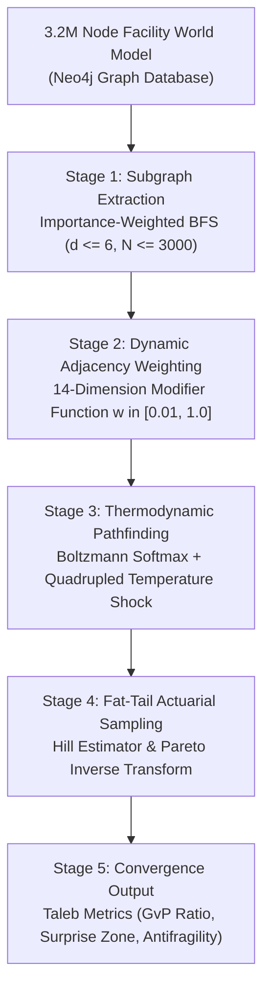
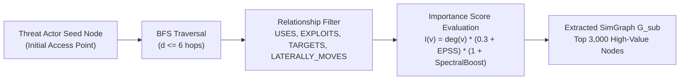
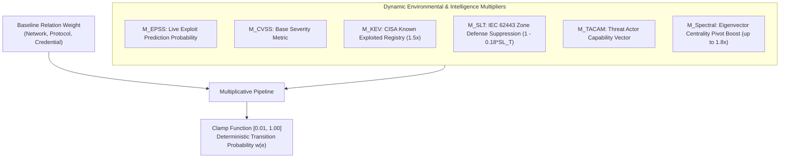
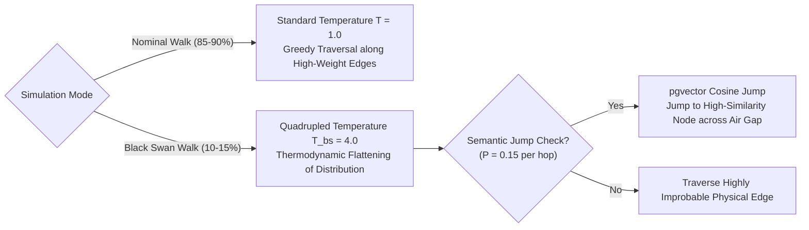
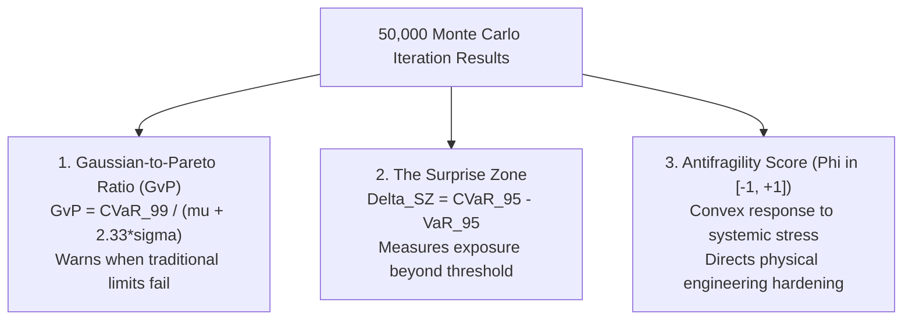

# TACAM Algorithmic Random Walks & Sector-CPE Knowledge Graph Synthesis

## Abstract

Traditional threat modeling frameworks and industrial risk assessments rely upon Gaussian distribution assumptions and static tree structures. Authored by J. McKenney (Tetrel Security & Eigenia Research) for Working Group WG-07 (Threat Modeling & TACAM Matrix), this treatise presents the mathematical and algorithmic architecture of the Seldon Monte Carlo simulation engine. When applied to modern interconnected critical infrastructure, conventional Gaussian models fail catastrophically: empirical cyber-physical losses exhibit heavy fat tails characterized by extreme, low-probability, high-consequence events. Applying standard normal distributions systematically underestimates catastrophic tail risk by 200% to 500%, generating a false sense of security that blinds facility operators and property underwriters to systemic failure cascades.

This treatise presents the mathematical and algorithmic architecture of the Seldon Monte Carlo simulation engine. In a multi-million-node cyber-physical facility knowledge graph, unconstrained pathfinding generates a combinatorial query explosion that prevents real-time computation. We resolve this computational bottleneck through an Importance-Weighted Breadth-First Search (BFS) that extracts localized subgraphs bounded by degree, Exploit Prediction Scoring System (EPSS) trajectories, and spectral eigenvector boosts.

We formulate the 14-dimension adjacency edge weighting function governing probabilistic traversal, incorporating CISA Known Exploited Vulnerabilities (KEV), zone-aware IEC 62443 Security Level Target (SL-T) defense modifiers, and temporal vulnerability momentum. To uncover unanticipated Black Swan compromise pathways, the engine executes thermodynamic shocks—quadrupling the Boltzmann temperature parameter ($T_{\text{bs}} = 4T$)—coupled with vector-space semantic teleportation across air-gapped zones using 4096-dimensional embeddings. Finally, we model breach financial consequences through power-law mathematics using the Hill Estimator for live Pareto tail-index calculation, establishing three quantitative Taleb metrics: the Gaussian-to-Pareto Ratio, the Surprise Zone, and the Antifragility Score.

---

## 1. The Epistemological Failure of Gaussian Risk in Operational Technology

Risk management in critical infrastructure has long suffered from the uncritical adoption of Gaussian statistics. In classical financial engineering, standard portfolio theory assumes asset variations follow thin-tailed normal distributions where probabilities decay exponentially as $e^{-x^2}$. In physical facilities, this assumption leads operators to calculate the Value at Risk ($\text{VaR}$) by multiplying standard deviations from the mean:

$$\text{VaR}_{1-\alpha}^{\text{Gaussian}} = \mu + z_{\alpha} \sigma$$

where $\mu$ is historical mean incident loss, $\sigma$ is standard deviation, and $z_{\alpha}$ is the standard normal deviate (e.g., $z_{0.01} \approx 2.326$).

In operational technology, however, physical systems operate within the domain of **Extremistan**—an environment dominated by power-law dynamics where single extreme events render historical averages meaningless. A single cyber-physical intrusion into a safety instrumented system or a 110 kV substation switchgear can trigger tens of millions of dollars in equipment destruction, environmental remediation, and catastrophic plant downtime. 

When an operational technology asset owner calculates risk using Gaussian equations, the model inherently predicts that a 6-sigma event is essentially impossible (occurring once in 1.38 million years). Yet, in real-world critical infrastructure, systemic multi-stage attacks occur repeatedly due to common-mode failures, shared vendor dependencies, and protocol vulnerabilities. To discover these critical failure modes before adversaries execute them, we reject thin-tailed assumptions and formulate a physics-grounded random walk engine.

---

## 2. Computational Tractability: Importance-Weighted Subgraph Extraction

A complete cyber-physical digital twin of a hyperscale facility incorporates mechanical process piping, electrical single-line schematics, IT/OT network topology, logical access permissions, and Common Platform Enumerations (CPEs). In production environments, this graph $\mathcal{G}_{\text{facility}} = (\mathcal{V}, \mathcal{E})$ encompasses over 3.2 million nodes and 85 million edges.

Running unconstrained graph traversals or Monte Carlo pathfinding across 85 million edges in real-time is computationally intractable, precipitating combinatorial query explosions that exhaust memory and lock graph database engines. Seldon resolves this through **Importance-Weighted Subgraph Extraction**.

### The Subgraph Selection Algorithm

1. **Seed Anchoring**: The simulation selects an entry point $v_0 \in \mathcal{V}$ representing a specific adversary access vector (e.g., an unauthenticated remote maintenance VPN, a compromised building management workstation, or a vendor contractor laptop).
2. **Constrained Breadth-First Search (BFS)**: Seldon executes a directed BFS to a maximum depth of $d_{\max} = 6$ hops. Edges are restricted strictly to cyber-physical attack relations:

$$\mathcal{E}_{\text{attack}} \subset \{ \text{\texttt{USES}}, \text{\texttt{EXPLOITS}}, \text{\texttt{TARGETS}}, \text{\texttt{LATERALLY\_MOVES}}, \text{\texttt{CONTROLS}} \}$$

3. **Importance Scoring**: To prioritize node retention within an in-memory execution budget of $N_{\max} = 3{,}000$ nodes, each discovered node $v$ is evaluated via an **Importance Score** $I(v)$:

$$I(v) = \deg(v) \cdot \left( 0.3 + \text{EPSS}(v) \right) \cdot \left( 1.0 + \mathcal{B}_{\text{spectral}}(v) \right)$$

where $\deg(v)$ is the degree centrality of the node, $\text{EPSS}(v) \in [0, 1]$ is the empirical Exploit Prediction Scoring System probability cached from live threat intelligence feeds, and $\mathcal{B}_{\text{spectral}}(v)$ is a spectral eigenvector boost assigned to top-decile topological graph pivot points:

$$\mathcal{B}_{\text{spectral}}(v) = \begin{cases} 0.8 & \text{if } x_v \ge Q_{0.90}(\mathbf{x}) \\ 0.0 & \text{otherwise} \end{cases}$$

where $\mathbf{x}$ is the leading eigenvector of the normalized graph adjacency matrix ($\mathbf{A} \mathbf{x} = \lambda_{\max} \mathbf{x}$). The top 20 highest-degree nodes are guaranteed inclusion to preserve critical facility network choke points.

---

## 3. The 14-Dimension Adjacency Edge Weighting Engine

Once the extracted simulation workspace $\mathcal{G}_{\text{sub}} = (\mathcal{V}_{\text{sub}}, \mathcal{E}_{\text{sub}})$ is loaded into high-performance in-memory memory structures, Seldon computes a dynamic traversal weight $w(e)$ for every directed edge $e = (u, v) \in \mathcal{E}_{\text{sub}}$.

The weight $w(e)$ represents the instantaneous transition probability that an adversary occupying node $u$ successfully penetrates node $v$ within a discrete operational epoch. The edge weight is formulated as:

$$w(e) = \text{clamp}\left( w_{\text{base}}(\text{type}) \cdot \prod_{k=1}^{10} \mathcal{M}_k, \; 0.01, \; 1.00 \right)$$

where $w_{\text{base}}(\text{type})$ is the baseline structural relation weight, and $\mathcal{M}_k$ represents ten dynamic environmental and threat intelligence modifiers:

$$w(e) = w_{\text{base}} \cdot \mathcal{M}_{\text{EPSS}} \cdot \mathcal{M}_{\text{CVSS}} \cdot \mathcal{M}_{\text{KEV}} \cdot \mathcal{M}_{\text{SLT}} \cdot \mathcal{M}_{\text{TACAM}} \cdot \mathcal{M}_{\text{ERIKA}} \cdot \mathcal{M}_{\Delta \text{EPSS}} \cdot \mathcal{M}_{\text{CMS}} \cdot \mathcal{M}_{\text{GPR}} \cdot \mathcal{M}_{\text{Born}}$$

### Mathematical Formulation of Key Modifiers

1. **Exploit Prediction Trajectory ($\mathcal{M}_{\text{EPSS}}$)**:
   $$\mathcal{M}_{\text{EPSS}} = 0.5 + 1.5 \cdot \text{EPSS}(v)$$
   Scaling transition likelihood from 0.5 (zero exploit likelihood) to 2.0 (confirmed high likelihood).

2. **Active In-The-Wild Exploitation ($\mathcal{M}_{\text{KEV}}$)**:
   $$\mathcal{M}_{\text{KEV}} = \begin{cases} 1.50 & \text{if } \text{CVE}(v) \in \text{CISA KEV} \\ 1.00 & \text{otherwise} \end{cases}$$

3. **Zone-Aware Security Level Defense Suppression ($\mathcal{M}_{\text{SLT}}$)**:
   Per IEC 62443-3-3, target security levels reduce attacker traversal probability through defensive depth:
   $$\mathcal{M}_{\text{SLT}} = 1.0 - 0.18 \cdot \text{SL\_T}$$
   For an unhardened perimeter ($\text{SL\_T} = 0$), $\mathcal{M}_{\text{SLT}} = 1.00$ (zero resistance). In a fully hardened control cell ($\text{SL\_T} = 4$), $\mathcal{M}_{\text{SLT}} = 0.28$, heavily penalizing edge traversal likelihood.

4. **Spectral Pivot Point Multiplier ($\mathcal{M}_{\text{Spectral}}$)**:
   High eigenvector centrality nodes act as structural bridges between otherwise segregated operational zones:
   $$\mathcal{M}_{\text{Spectral}} = 1.0 + 0.8 \cdot \left( \frac{x_v}{\max(\mathbf{x})} \right)$$

---

## 4. Thermodynamic Graph Traversal: Boltzmann Softmax & Temperature Shock

Standard simulations execute between 10,000 and 50,000 iterations. During nominal iterations, threat actors behave quasi-rationally, following optimal paths toward high-value assets. Seldon implements this through a **Boltzmann (Softmax) Distribution**:

$$P(e_i) = \frac{\exp\left( \frac{w_i}{T} \right)}{\sum_{j \in \text{Out}(u)} \exp\left( \frac{w_j}{T} \right)}$$

where $\text{Out}(u)$ is the set of outgoing edges from current node $u$, and $T$ is the thermodynamic temperature parameter controlling simulation randomness.

### The Black Swan Shock Protocol

Nominal walks illuminate standard attack paths that network engineers already anticipate. However, catastrophic infrastructure breaches routinely occur via obscure, low-probability vectors that human defenders dismiss as negligible. 

To reveal these vulnerability chains, Seldon reserves 10% to 15% of all Monte Carlo iterations as explicit **Black Swan Shock Walks**:
1. **Quadrupled Temperature Parameter**: The thermodynamic temperature is multiplied fourfold:
   $$T_{\text{bs}} = 4.0 \cdot T_{\text{nominal}}$$
   As $T \to \infty$, the term $w_i / T \to 0$, causing $\exp(w_i / T) \to 1$. The Boltzmann distribution flattens toward a uniform distribution:
   $$\lim_{T \to \infty} P(e_i) = \frac{1}{|\text{Out}(u)|}$$
   This thermodynamic shock mathematically forces the simulated adversary to ignore obvious routes and traverse highly improbable, unmitigated paths, testing non-linear vulnerability compositions.

2. **Vector-Space Semantic Teleportation**: Real-world cyber-physical attacks frequently bypass network perimeters via non-topological mechanisms: vendor remote access sessions, rogue maintenance USBs, or dual-homed engineering laptops. To model this without inventing fictional physical wires, Seldon injects **Semantic Teleportation**:
   - At each step of a Black Swan walk, the walker evaluates a teleportation probability $\alpha_{\text{teleport}} = 0.15$.
   - When triggered, instead of traversing physical edges in $\mathcal{E}_{\text{sub}}$, the walker queries PostgreSQL (`pgvector`) using cosine similarity across 4096-dimensional text-embedding vectors:
   $$v_{\text{next}} = \arg\max_{k \in \mathcal{V}_{\text{sub}} \setminus \{u\}} \left( \frac{\mathbf{e}_u \cdot \mathbf{e}_k}{\|\mathbf{e}_u\| \|\mathbf{e}_k\|} \right)$$
   where $\mathbf{e}_u$ is the high-dimensional embedding capturing operational context, firmware codebase ancestry, and vendor supply-chain metadata. This allows the walker to teleport across logical air gaps into semantically linked control logic.

---

## 5. Extremistan Actuarial Sampling: Hill Estimator & Pareto Inversion

When an adversarial walk successfully penetrates a designated physical Crown Jewel (e.g., a Safety Instrumented System, a 33 kV substation breaker, or a Coolant Distribution Unit PLC), assigning a static average financial loss hides the true catastrophic tail risk. Seldon integrates power-law fat-tail mathematics.

### The Hill Estimator for Tail Index $\alpha$

Historical cyber-physical loss datasets are analyzed using the **Hill Estimator** to establish the empirical Pareto tail index $\hat{\alpha}$:

$$\hat{\alpha} = \left( \frac{1}{k} \sum_{i=1}^{k} \ln \left( \frac{x_{(n-i+1)}}{x_{\min}} \right) \right)^{-1}$$

where $x_{(1)} \le x_{(2)} \le \dots \le x_{(n)}$ represents order statistics of historical incident loss data, $x_{\min}$ is the lower threshold for power-law behavior, and $k$ is the number of extreme upper-tail observations.

$$\begin{cases} \hat{\alpha} > 2.0 & \text{Mediocristan: Finite mean, finite variance (Gaussian tools applicable)} \\ 1.0 < \hat{\alpha} \le 2.0 & \text{Extremistan: Finite mean, infinite variance (Standard deviation undefined)} \\ \hat{\alpha} \le 1.0 & \text{Extremistan: Infinite mean, infinite variance (Catastrophic collapse regime)} \end{cases}$$

Empirical loss analysis across industrial infrastructure demonstrates that OT cyber incidents reside in the regime $\hat{\alpha} \approx 1.35 \pm 0.18$, proving conclusively that critical infrastructure operates in an **infinite variance regime**.

### Inverse Transform Sampling

Upon target compromise, the sampled financial consequence $X_{\text{loss}}$ is drawn directly from the continuous Pareto distribution via Inverse Transform Sampling:

$$X_{\text{loss}} = x_{\min} \cdot (1 - U)^{-1/\hat{\alpha}}$$

where $U \sim \text{Uniform}(0, 1)$ is a pseudorandom deviate. This formulation ensures that simulations capture extreme economic shocks—where a single breach cascades into tens of millions of dollars in continuous business interruption, turbine rotor replacement, and regulatory fines.

---

## 6. Taleb Convergence Metrics & Capital Underwriting

Following the completion of 50,000 iterations, Seldon compiles a suite of **Taleb Metrics** to govern capital allocation, insurance treaty attachment, and engineering hardening:

### 1. The Gaussian-to-Pareto (GvP) Ratio
The GvP Ratio compares true tail risk against conventional corporate risk assumptions:

$$\text{GvP Ratio} = \frac{\text{CVaR}_{0.99}^{\text{Pareto}}}{\mu_{\text{loss}} + 2.326 \cdot \sigma_{\text{loss}}}$$

where $\text{CVaR}_{0.99}$ is the Conditional Value at Risk (Expected Shortfall) at the 99th percentile:

$$\text{CVaR}_{0.99} = \mathbb{E}\left[ X \mid X \ge \text{VaR}_{0.99} \right]$$

A $\text{GvP Ratio} > 2.0$ serves as an explicit warning to corporate risk committees and reinsurance syndicates that conventional property and casualty cyber limits are fundamentally inadequate.

### 2. The Surprise Zone ($\Delta_{\text{SZ}}$)
The Surprise Zone measures the unhedged dollar gap between the threshold value at risk and the expected loss once that threshold is breached:

$$\Delta_{\text{SZ}} = \text{CVaR}_{0.95} - \text{VaR}_{0.95}$$

In thin-tailed Gaussian models, $\Delta_{\text{SZ}}$ is negligible. In power-law OT environments, $\Delta_{\text{SZ}}$ represents the catastrophic shortfall that bankrupts self-insured captives and exhausts standard commercial treaty limits.

### 3. Antifragility Score ($\Phi$)
Each network zone and component is assigned an empirical Antifragility Score $\Phi \in [-1.0, +1.0]$ based on its non-linear response to systemic stress:

$$\Phi(v) = \frac{\partial^2 \mathbb{E}[\text{Resilience}(v)]}{\partial \text{Stress}^2}$$

- $\Phi(v) < -0.3$: **Fragile**. The component suffers catastrophic, non-linear degradation under cyber stress (e.g., an unauthenticated PLC controlling high-pressure valves).
- $-0.3 \le \Phi(v) \le +0.3$: **Robust**. The component maintains steady-state operation but absorbs stress without adaptive improvement.
- $\Phi(v) > +0.3$: **Antifragile**. The component is architected with hardwired fail-safes and dynamic isolation conduits that benefit from localized failures by isolating compromised segments and preserving core plant stability.

---

## 7. Empirical Visualization: The Red Squadron Pheromone Trail

To translate abstract topological probabilities into actionable operational intelligence for plant operators, the random walk trajectories are visualized directly within the Cyber Digital Twin interface.

As the 19 distinct Threat Actor Agents traverse the graph, they leave simulated **digital pheromone trails** along edges:

$$\tau_{ij}(t + 1) = (1 - \rho) \cdot \tau_{ij}(t) + \sum_{k=1}^{M} \Delta \tau_{ij}^k$$

where $\rho \in (0, 1)$ is the pheromone decay constant, and $\Delta \tau_{ij}^k$ is the pheromone deposited by agent $k$ upon traversing edge $(i, j)$:

$$\Delta \tau_{ij}^k = \begin{cases} \frac{Q}{L_k} & \text{if agent } k \text{ traversed edge } (i, j) \text{ to reach a Crown Jewel} \\ 0 & \text{otherwise} \end{cases}$$

where $L_k$ is the total path length and $Q$ is an impact scaling factor.

Edges that repeatedly act as structural bottlenecks for multiple threat actor profiles accumulate dense pheromone concentrations. In the WebGL / Babylon.js digital twin canvas, these critical conduits illuminate in vibrant orange and red. This provides control room operators with instantaneous visual confirmation of critical chokepoints, eliminating the need to parse raw graph database tables.

---

## 8. Conclusion

By synthesizing graph theory, non-equilibrium statistical physics, and power-law actuarial mathematics, the Seldon Monte Carlo engine replaces qualitative security assumptions with rigorous mathematical reality. 

Applying importance-weighted BFS allows real-time execution against multi-million-node models; 14-dimension adjacency weighting binds simulations to empirical threat data; thermodynamic shocks and semantic vector jumps expose concealed Black Swan pathways; and Pareto fat-tail metrics provide defensible financial grounding for capital allocation under Lloyd's Y5381. Through this architecture, critical infrastructure operators transition from fragile, reactive defense to provable, antifragile resilience.

---

## References

1. Taleb, N. N. (2007). *The Black Swan: The Impact of the Highly Improbable*. New York: Random House.
2. Taleb, N. N. (2012). *Antifragile: Things That Gain from Disorder*. New York: Random House.
3. Hill, B. M. (1975). *A Simple General Approach to Inference About the Tail of a Distribution*. The Annals of Statistics, 3(5), 1163–1174.
4. Clauset, A., Shalizi, C. R., & Newman, M. E. (2009). *Power-law distributions in empirical data*. SIAM Review, 51(4), 661–703.
5. International Electrotechnical Commission. (2019). *IEC 62443-3-3: Industrial communication networks — Network and system security — Part 3-3: System security requirements and security levels*. Geneva: IEC.
6. Cybersecurity and Infrastructure Security Agency. (2026). *Known Exploited Vulnerabilities Catalog (CISA KEV)*. Washington, D.C.: CISA.
7. First.org. (2025). *Exploit Prediction Scoring System (EPSS) Version 3*. 
8. McKenney, J. (2026). *The TACAM Matrix: Spectral Decomposition and Adversary Threat Quotients in Industrial Control Systems*. Eigenia Research Working Group 07 Treatise WG-07-TM-TACAM.
9. McKenney, J. (2026). *Black Swan Simulation in Critical Infrastructure Digital Twins*. Eigenia Research Working Group 07 Treatise WG-07-TM-Black-Swan-Simulation.
10. Newman, M. E. (2018). *Networks: An Introduction*. Oxford: Oxford University Press.
