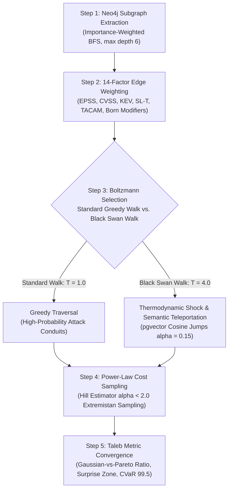

# The Seldon Monte Carlo Engine: Black Swan Random Walks and Extremistan Tail Risks
## Importance-Weighted Subgraph Extraction, Boltzmann Temperature Shocking, and Power-Law Loss Sampling in Cyber-Physical Graphs

### Executive Abstract

Standard actuarial models in corporate risk governance systematically fail when applied to operational technology (OT) and critical infrastructure. Gaussian bell curves assume independent events and thin tails, underestimating extreme cybersecurity losses by two to three orders of magnitude. In cyber-physical systems, failures do not cluster around a well-behaved mean; they reside in **Extremistan** [1], where catastrophic consequences are governed by fat-tailed power-law distributions.

To expose these critical "Black Swan" vulnerability pathways before kinetic damage occurs, the **Seldon Monte Carlo Engine** couples graph theory, statistical physics, and extreme value theory. By combining importance-weighted subgraph extraction, multi-factor Boltzmann edge weighting, thermodynamic temperature shocking, and Pareto tail sampling, the engine identifies non-obvious cascade routes that traditional security scanning overlooks.

---

---

### Step 1: Subgraph Extraction (Importance-Weighted BFS)

In large-scale critical infrastructure environments where facility models contain **millions of nodes and tens of millions of edges**, running unconstrained pathfinding queries in real-time creates a combinatorial explosion. 

To ensure deterministic, low-latency execution, the engine first isolates an in-memory simulation workspace:
1. **Targeted Subgraph Selection:** Seldon executes an importance-weighted Breadth-First Search (BFS) directly against Neo4j, isolating a localized neighborhood around a seed node (e.g., an external perimeter jumpbox or specific adversary archetype) to a maximum depth of 6 hops, bounded to 3,000 active nodes.
2. **Attack-Vector Filtering:** Traversal relationships are restricted to modeled attack pathways (`USES`, `EXPLOITS`, `TARGETS`, `LATERALLY_MOVES`).
3. **Importance-Weighted Priority:** Nodes are scored and prioritized for inclusion using the formula:
   $$\text{Importance Score} = \text{degree} \times (0.3 + \text{EPSS}) \times (1 + \text{SpectralBoost})$$
   The top-20 highest-degree nodes are guaranteed as anchors to preserve structural network choke points.

---

### Step 2: 14-Dimension Adjacency Edge Weighting

Once loaded in-memory, Seldon applies a multi-factor scoring formula to assign a dynamic probability weight $w \in [0.01, 1.0]$ to every edge:

$$w = w_{\text{base}}(\text{relType}) \times M_{\text{EPSS}} \times M_{\text{CVSS}} \times M_{\text{KEV}} \times M_{\text{SLT}} \times M_{\text{TACAM}} \times M_{\text{ERIKA}} \times M_{\Delta \text{EPSS}} \times M_{\text{CMS}} \times M_{\text{GPR}} \times M_{\text{Born}}$$

These modifiers dynamically reflect real-world intelligence:
* **Zone Defensive Hardening ($M_{\text{SLT}}$):** Computes security level resistance ($1 - \text{SL\_T} \times 0.18$). An unsegmented zone ($\text{SL-T} = 0$) offers no resistance ($1.0\times$), whereas a hardened safety zone ($\text{SL-T} = 4$) applies a heavy $0.28\times$ suppression factor.
* **Actively Exploited Flaws ($M_{\text{KEV}}$):** Vulnerabilities on the CISA Known Exploited Vulnerabilities catalog receive an immediate $1.5\times$ traversal boost [4].
* **Spectral Centrality ($M_{\text{Spectral}}$):** Nodes in the top decile of eigenvector centrality receive a weight multiplier up to $1.8\times$, modeling systemic topological choke points.

---

### Step 3: Boltzmann Selection & Thermodynamic Shocking

During standard iterations (typically 10,000 to 50,000 runs), simulated adversary walkers traverse the graph using a **Boltzmann (softmax) selection distribution**. At each step, the probability $P(e_i)$ of traversing an outbound edge $e_i$ is proportional to its calibrated weight:

$$P(e_i) = \frac{\exp(w_i / T)}{\sum_j \exp(w_j / T)}$$

Where $T$ is the temperature parameter governing operational randomness. Under standard operating temperature ($T = 1.0$), threat paths are greedy and follow high-probability attack corridors.

#### Detecting the Black Swan (Quadrupled Temperature)
To expose catastrophic, low-probability failure modes that defenders rarely anticipate, Seldon reserves 10% to 15% of all simulation runs as explicit **Black Swan walks**:
* **Thermodynamic Shock ($T_{\text{bs}} = 4.0 T$):** Quadrupling the temperature flattens the Boltzmann probability distribution. The simulated adversary is mathematically compelled to explore highly improbable, non-obvious combinations of lateral movement conduits.
* **Semantic Teleportation ($\alpha = 0.15$):** At each step, with probability $\alpha$, the walker executes a semantic jump. Instead of traversing physical cables, the engine uses **pgvector cosine distance** across 4,096-dimensional embeddings to jump across logical perimeters to topologically disconnected assets sharing organizational or credential affinities (simulating dual-homed laptops, shadow IT, or compromised maintenance remotes).

---

### Step 4: Pareto Fat-Tail Cost Sampling

Standard risk frameworks multiply an average breach cost by a historical likelihood, hiding catastrophic tail vulnerability. Seldon applies extreme value theory to financial consequence calculation:

* **The Hill Tail Index Estimator:** Historical loss data is analyzed via the Hill estimator [2] to determine the empirical Pareto tail-index parameter ($\hat{\alpha}$):
  $$\hat{\alpha} = \left( \frac{1}{k} \sum_{i=1}^{k} \ln \frac{x_i}{x_{\min}} \right)^{-1}$$
  An empirical index $\hat{\alpha} < 2.0$ mathematically proves that the organization operates in an **infinite variance regime (Extremistan)** [1], where sample standard deviations cannot describe true risk.
* **Inverse Transform Sampling:** When a simulated threat path compromises a Crown Jewel asset (e.g., an OT SCADA HMI or Safety Instrumented System), financial loss is sampled from a heavy-tailed Pareto distribution:
  $$X = x_{\min} \cdot (1 - U)^{-1/\hat{\alpha}}, \quad U \sim \text{Uniform}(0, 1)$$
  This captures rare, multi-million-dollar physical equipment replacement costs, environmental liabilities, and extended plant downtime.

---

### Step 5: Taleb Metrics and Underwriting Convergence

Once the simulations converge, Seldon computes a suite of **Taleb Metrics** to govern capital allocation [1][5]:

1. **Gaussian-vs-Pareto Ratio (GvP):** Measures the divergence between traditional thin-tailed assumptions and fat-tailed reality:
   $$\text{GvP Ratio} = \frac{\text{CVaR}_{99.5}^{\text{actual}}}{\mu + 2.33\sigma}$$
   A ratio $\text{GvP} > 2.0$ demonstrates that commercial cyber insurance limits and contingency reserves are fundamentally inadequate.
2. **The Surprise Zone:** The quantitative dollar gap between the 95th-percentile Value at Risk ($\text{VaR}_{95}$) and the Conditional Value at Risk ($\text{CVaR}_{95}$, or Expected Shortfall). This represents the unmodeled exposure that blinds executive boards.
3. **Antifragility Score:** Evaluates whether defensive zones absorb stress without degradation, scoring nodes on $[-1.0, +1.0]$. Nodes that degrade catastrophically under adversary perturbation are flagged for physical conduit separation.

#### Visualizing the Walks: The Red Squadron
These mathematical trajectories render interactively on the Seldon canvas. Nineteen autonomous threat agents utilizing reinforcement Q-learning navigate the topology, depositing digital pheromone trails along traversed conduits. Network zones and conduits serving as major convergence bottlenecks illuminate in deep orange and red, providing operators with actionable topological hardening priorities before adversary exploitation occurs.

---

## References & Empirical Citations

- [1] **Taleb, N. N. (2007)**: *The Black Swan: The Impact of the Highly Improbable*. Random House.
- [2] **Hill, B. M. (1975)**: "A simple general approach to inference about the tail of a distribution." *The Annals of Statistics*, 3(5), 1163–1174.
- [3] **First.org (2025)**: *Exploit Prediction Scoring System (EPSS) Specification and User Guide*.
- [4] **CISA (2024)**: *Known Exploited Vulnerabilities (KEV) Catalog*. Cybersecurity and Infrastructure Security Agency.
- [5] **Gordon, L. A., & Loeb, M. P. (2002)**: "The economics of information security investment." *ACM Transactions on Information and System Security*, 5(4), 438–457.
