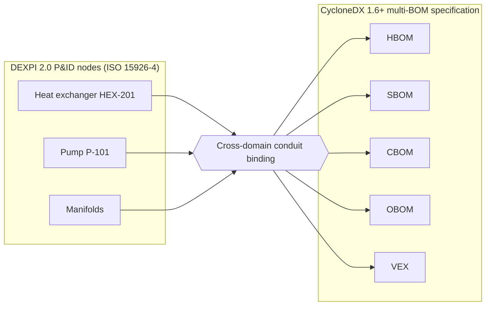
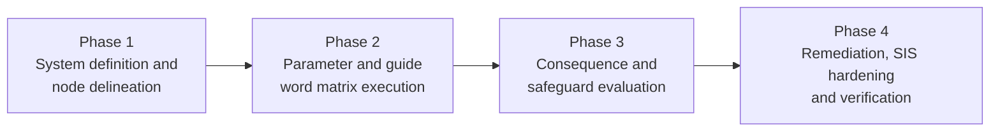
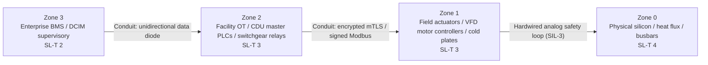

## Abstract

In petrochemical refineries, nuclear power plants, and rail transport networks, systems engineers never commission physical infrastructure without conducting a formal Hazard and Operability (HAZOP) study under IEC 61882 and the EN 50126 RAMS lifecycle. Process safety teams systematically apply standardised guide words; NO, LESS, MORE, REVERSE, AS WELL AS, PART OF, OTHER THAN; to identify how deviations in pressure, flow, temperature, and electrical voltage induce physical catastrophe. 

Conversely, modern hyperscale data centers and megawatt AI facilities have historically treated cybersecurity as an IT perimeter discipline, completely divorced from process safety engineering. Facilities deploy hundreds of networked programmable logic controllers (PLCs), variable frequency drives (VFDs), coolant distribution units (CDUs), and automatic transfer switches (ATS) across 400V power trains and liquid cooling loops. Each device runs firmware. Each presents an operational technology (OT) network interface. A compromised cooling controller commands the exact same physical failure as a sheared pump shaft, but executes across multiple redundant nodes simultaneously within sub-second timescales.

This paper formalizes the CyHAZOP methodology: the systematic extension of IEC 61882 process safety hazard analysis to cyber-physical operational technology environments. By linking DEXPI 2.0 piping schematics, classed against ISO 15926-4 reference data, directly to CycloneDX 1.6+ multi-BOM catalogs (HBOM, SBOM, CBOM, OBOM), CyHAZOP provides the mathematical bridge between digital exploits and physical damage. We analyze four critical hyperscale nodes: the CDU Secondary Liquid Cooling Loop, the Distributed Block UPS Power Train, the Building Management System (BMS) Supervisory Bus, and the Out-of-Band BMC Fabric. We formulate the mathematical transfer functions mapping cyber command injections to thermodynamic and hydraulic excursions, model Safety Instrumented System (SIS) probability of failure on demand under cyber stress, and present actuarial loss formulations for insurance treaty structuring, Probable Maximum Loss (PML), and Lloyd's Y5381 war exclusions.

---

## 1. The Methodological Void in Megawatt Compute Facilities

Forty years of industrial safety practice rest on a premise that networked control planes break: that a hazard reached only through a physical failure path can be engineered out mechanically. Once a control plane carries traffic, an attacker reaches the same hazard without touching the mechanism. High-reliability mechanical engineering remains necessary and stops being sufficient. That is the gap this paper addresses, and it is an engineering argument from the structure of the failure paths, not a claim about a measured accident record.

### 1.1 The Practitioner's Field Observation
In industrial automation assessments conducted across rail corridors, water treatment plants, and data centers on four continents, a consistent engineering vulnerability emerges. Mechanical engineers design extreme hardware redundancy: N+1 or 2N centrifugal pumps, plate heat exchangers, chilled water loops, and dual-infeed power feeds. However, the supervisory control network orchestrating these redundant mechanical elements shares a common Ethernet switch fabric, unauthenticated Modbus TCP protocols, identical PLC firmware revisions, and shared vendor administrative credentials.

Logical common-cause failure defeats mechanical physical redundancy. 

During an operational technology assessment of a 40 MW high-density colocation facility, the engineering team applied the guide word OTHER THAN to the Building Management System (BMS) to fire suppression interface. The controls engineer confirmed that the facility BMS issued a pre-action hold command to the clean-agent gas suppression panel via an unauthenticated BACnet/IP write command across the local facility subnet. When asked what physical safeguard prevented an adversary from injecting a forged release command, the room fell silent. 

The fire safety vendor assumed the BMS network was isolated and trustworthy. The BMS integrator assumed the fire suppression system performed independent physical interlock verification. Neither assumption was tested. A single network command could trigger full Emergency Power Off (EPO), discharging gaseous suppression agents, corrupting storage arrays, and inducing 48 to 72 hours of total facility downtime with direct financial losses exceeding 2,500,000 USD. The physical remediation; a hardwired electrical dry-contact interlock bypassing the software bus; required less than 15,000 USD in copper wiring.

### 1.2 Traditional HAZOP versus CyHAZOP
Standard HAZOP under IEC 61882 considers three root-cause categories: mechanical component failure, electrical power loss, and human operator error. In modern hyper-dense AI facilities, we must integrate a mandatory fourth root-cause category: **cyber-induced operational deviation**.

A cyber-induced deviation is the deliberate or accidental manipulation of a sensor value, setpoint register, actuator state, or firmware parameter across a digital communication conduit. Cyber-induced deviations exhibit four characteristics that make them far more destructive than mechanical failures:

1. **Non-Random Simultaneity:** Mechanical failures occur as stochastic Poisson processes distributed across independent operating hours. Cyber attacks execute coordinated, multi-node manipulations simultaneously, defeating parallel N+1 redundancies in a single execution step.
2. **Telemetry Spoofing (Silent Drift):** While mechanical failures trigger physical alarms on monitoring screens, a cyber exploit can spoof sensor telemetry registers (such as transmitting nominal $32^\circ\text{C}$ temperature reports while throttling flow valves), blinding operators until physical damage occurs.
3. **Speed of Propagation:** Network commands propagate at line rate across Ethernet conduits (sub-millisecond latency), vastly outpacing manual human operator reaction times or facility shift inspection rounds.
4. **Geographic Distribution:** A single remote access vulnerability or compromised firmware update server allows an adversary to execute simultaneous physical sabotage across multiple campuses worldwide.

---

## 2. Integrating DEXPI 2.0 and CycloneDX Multi-BOM into CyHAZOP

Traditional HAZOP fails in computing environments because engineers lack a unified data structure connecting physical piping to digital silicon. CyHAZOP resolves this by binding DEXPI 2.0 plant piping models, whose equipment classes come from ISO 15926-4, with CycloneDX 1.6+ multi-BOM catalogs:

**CyHAZOP unified asset delineation**

| Layer | Element | Content bound into the unified model |
|:---|:---|:---|
| **DEXPI 2.0 P&ID (ISO 15926-4)** | Heat Exchanger HEX-201, Pump P-101, Manifolds | ISO 15926-4 fluid property classes: PG25 coolant, volumetric flow rate, bar |
| **CycloneDX 1.6+** | HBOM | OCP ORV3 trays, Samtec connectors, ASIC silicon dies |
| | SBOM | Caliptra Silicon RoT, OpenSIL initializers, Linux kernels |
| | CBOM | DICE cryptographic certificates, post-quantum ML-DSA keys |
| | OBOM | Operational limits, voltage setpoints, line-rate egress caps |
| | VEX | Real-time Vulnerability Exploitability eXchange feeds |

By cross-referencing CycloneDX VEX vulnerability feeds with DEXPI mechanical equipment tags, CyHAZOP teams immediately determine whether a newly disclosed CVE in an operational technology controller can induce a physical hydraulic cavitation or electrical arc flash hazard.

---

## 3. The Standardized CyHAZOP Workflow

The CyHAZOP study is executed by a multidisciplinary team; mechanical process engineers, electrical systems leads, industrial control engineers, and cybersecurity assurance architects; through a 15-step structured lifecycle governed by the EN 50126 V-model. The fifteen steps sit in four phases of three, four, four and four; the table below numbers every one of them:

**CyHAZOP lifecycle phases**

| Phase | Step | Activity |
|:---|:---|:---|
| **Phase 1: System Definition & Node Delineation** | 1 | Ingest P&ID Schematics (DEXPI 2.0) & Single-Line Electrical Diagrams |
| | 2 | Partition System into Physical Nodes (Process Fluid / Power Infeed) |
| | 3 | Define Exact Design Intent & Quantitative Operational Envelopes |
| **Phase 2: Parameter & Guide Word Matrix Execution** | 4 | Select Node Parameter (Flow, Temp, Pressure, Voltage, Frequency) |
| | 5 | Apply Guide Word (NO, LESS, MORE, REVERSE, AS WELL AS, OTHER THAN) |
| | 6 | Identify Mechanical & Electrical Root Causes |
| | 7 | Identify Cyber-Induced Conduits, Protocols, & Attack Vectors |
| **Phase 3: Consequence & Safeguard Evaluation** | 8 | Model Physical Consequence (Thermodynamics, Heat Flux, Cavitation) |
| | 9 | Identify Existing Protective Safeguards (Alarms, BMCs, Trips) |
| | 10 | Evaluate Safeguard Integrity under Cyber Stress (Common-Mode Fail) |
| | 11 | Assign Quantitative Hazard Severity Index (Catastrophic / Critical) |
| **Phase 4: Remediation, SIS Hardening & Verification** | 12 | Specify Safety Instrumented Systems (Hardwired Interlocks, SIL) |
| | 13 | Map Conduits to IEC 62443 Security Level Targets (SL-T 1 to SL-T 4) |
| | 14 | Establish Physical Verification & Proof Testing Intervals |
| | 15 | Generate Formal CyHAZOP Ledger for Underwriting & Regulatory Proof |

### 3.1 The Guide Word Lexicon
In CyHAZOP, the classical IEC 61882 guide words are mapped directly to physical parameters and cyber command primitives:

| Guide Word | Physical Deviation Meaning | Cyber-Physical Attack Mechanism |
|:---|:---|:---|
| **NO / NONE** | Complete cessation of flow, voltage, or telemetry signal. | Command injection: pump stop, breaker trip, interface shutdown, power cutoff. |
| **MORE** | Quantitative elevation of pressure, temperature, speed, or voltage. | Register manipulation: VFD overspeed, chiller setpoint inflation, voltage spike. |
| **LESS** | Quantitative reduction of flow, pressure, cooling, or power capacity. | Flow throttling: valve restriction to 15%, fan speed reduction, power capping. |
| **REVERSE** | Flow or current opposite to designed physical direction. | Phase inversion on VFD, bi-directional power flow injection from BESS. |
| **AS WELL AS** | Introduction of foreign elements, contaminants, or harmonic noise. | Sensor packet injection, dirty power harmonics, disabling water treatment. |
| **PART OF** | Incomplete execution of an essential multi-step safety sequence. | Suppressing interlock verification during bus transfer, partial shutdown. |
| **OTHER THAN** | Unintended operation, incorrect destination, or spoofed status report. | Telemetry deception: reporting nominal temperature while physical fire burns. |

---

## 4. Node Analysis: Four Critical Hyperscale Nodes

To demonstrate the rigorous application of CyHAZOP, we present detailed analysis tables for four essential nodes of a 100 MW high-density AI campus.

### 4.1 Node 1: Secondary Cooling Loop (CDU to GPU Cold Plates)
- **Design Intent:** Deliver treated 25% propylene glycol (PG25) coolant at $30.0^\circ\text{C} \pm 2.0^\circ\text{C}$ to 8x AI accelerator cold plates at $38.5\text{ L/min}$ per tray, maintaining silicon junction temperatures $T_j \le 85.0^\circ\text{C}$ under $10.5\text{ kW}$ compute dissipation.
- **Node Boundary:** CDU secondary heat exchanger discharge nozzle $\to$ distribution manifold $\to$ flexible stainless steel braided hose $\to$ quick-disconnect dry-break couplings $\to$ microchannel cold plates $\to$ return manifold $\to$ CDU suction inlet.

#### Node 1: Secondary Cooling Loop CyHAZOP Matrix

| Guide Word | Parameter | Deviation | Physical Consequence | Cyber Attack Vector | Severity | Recommended Safeguard |
|:---|:---|:---|:---|:---|:---|:---|
| **NO** | Flow | Complete loss of coolant flow ($0\text{ L/min}$). | Convective dissipation collapses. Silicon junction $T_j$ surges at $4.5^\circ\text{C/s}$, exceeding $94^\circ\text{C}$ in $< 14.8\text{ s}$. Irreversible die warpage. | Modbus TCP function code 05/06 injected to PLC register 40012, asserting pump emergency stop. | **Catastrophic** | Hardwired pneumatic pressure relief and independent bi-metallic thermal interlock cutting server power. |
| **LESS** | Flow | Throttled coolant flow ($5.8\text{ L/min}$). | Fluid velocity drops below critical Reynolds number ($\text{Re} < 2,300$). Heat transfer coefficient drops $78\%$. Accelerators throttle inference $60\%$. | Attacker overwrites VFD speed reference register from $60\text{ Hz}$ to $12\text{ Hz}$ via unauthenticated BACnet conduit. | **Major** | Cryptographically authenticated VFD command signing (IEC 62443-4-2 SL-3) and minimum speed hardware jumper. |
| **MORE** | Temperature | Supply coolant exceeds $42.0^\circ\text{C}$. | Loss of thermal logarithmic mean temperature difference ($\Delta T_{\text{lm}}$). Chiller compressor stalls. Rack thermal trip engaged within 180 seconds. | Attacker tampers with primary plate heat exchanger proportional valve setpoint via BMS Redfish API. | **Major** | Out-of-band analog thermocouple loop bypassing the IP network, wired directly to chiller local control. |
| **OTHER THAN** | Telemetry | Frozen nominal temperature ($30^\circ\text{C}$) while true temperature rises. | Facility operators receive nominal dashboards while silicon cooks. Hardware safety trips disabled by spoofed BMC registers. | Man-in-the-middle ARP spoofing injecting forged Modbus telemetry packets into supervisory SCADA server. | **Catastrophic** | Cryptographic payload attestation (DICE/Caliptra) on sensor telemetry nodes and independent analog gauge audits. |

### 4.2 Node 2: 400V/48V Distributed Block UPS Power Train
- **Design Intent:** Continuous delivery of clean, three-phase 480V/400V AC power through a 4-to-3 Catcher UPS topology to rack-mounted busbars, stepping down to 48V DC via high-efficiency rectifiers, sustaining $120\text{ kW}$ per rack without voltage sag or harmonic distortion ($< 3\%$ THD).
- **Node Boundary:** 11 kV switchgear output $\to$ unit substation step-down transformer $\to$ Static Transfer Switch (STS) $\to$ distributed block UPS modules (1.25 MW each) $\to$ power distribution unit (PDU) $\to$ busway tap-off boxes.

#### Node 2: Power Distribution CyHAZOP Matrix

| Guide Word | Parameter | Deviation | Physical Consequence | Cyber Attack Vector | Severity | Recommended Safeguard |
|:---|:---|:---|:---|:---|:---|:---|
| **NO** | Voltage | Instantaneous bus drop to $0\text{ V}$. | Uncontrolled server drop. Data loss in DRAM buffers, corrupted database state, storage array crash. | Remote exploitation of SNMP/web interface on LayerZero STS, commanding force-open on both feeds. | **Catastrophic** | Hardwired mechanical interlock preventing simultaneous open commands; disable remote firmware updates on STS. |
| **MORE** | Frequency | AC frequency surge to $65\text{ Hz}$. | Core saturation in facility transformers, overheating magnetics, harmonic resonance causing capacitor bank explosion. | Tampering with inverter DSP control firmware via compromised JTAG or optical maintenance port. | **Catastrophic** | Hardware-calibrated over-frequency protection relay (IEC 61850 SIPROTEC) tripping within $16\text{ ms}$. |
| **AS WELL AS** | Harmonics | Severe harmonic distortion ($> 15\%\text{ THD}$). | Neutral conductor overheating, eddy current losses, erratic tripping of downstream electronic circuit breakers. | Modulating load patterns via synchronized GPU kernel execution, matching the resonant frequency of power filters. | **Major** | Active power factor correction filters with autonomous analog feedback, isolated from host OS control. |
| **PART OF** | Synchronization | Out-of-phase transfer across asynchronous utility feeds. | Massive mechanical torque shock across generator shafts, high-voltage flashover, catastrophic switchgear destruction. | Spoofing synchrocheck relay voltage phase angle telemetry via IEC 61850 GOOSE network manipulation. | **Catastrophic** | Hardwired analog synchrocheck relay with optical isolation, mechanically blocking out-of-phase closure. |

### 4.3 Node 3: BMS Supervisory Control Plane & Fire Suppression
- **Design Intent:** Centralized monitoring of environmental parameters, ventilation louvers, smoke detection sensors, and life-safety systems, maintaining positive room air pressure and executing orderly zoning during emergency events.
- **Node Boundary:** BMS BACnet/IP Ethernet backbone $\to$ field programmable controllers (JCI, Schneider, Honeywell) $\to$ pre-action sprinkler valves, clean-agent (NOVEC 1230 / Inergen) release solenoids, smoke purge dampers.

#### Node 3: BMS and Life Safety CyHAZOP Matrix

| Guide Word | Parameter | Deviation | Physical Consequence | Cyber Attack Vector | Severity | Recommended Safeguard |
|:---|:---|:---|:---|:---|:---|:---|
| **OTHER THAN** | State | False gas discharge into populated data hall. | Full Emergency Power Off (EPO) tripped. High-pressure acoustic shock from discharge nozzles shatters spinning hard drives. | Exploiting CVE in BMS supervisory server (such as default BACnet broadcast credentials) to force solenoid trigger. | **Catastrophic** | Dual-custody, hardwired cross-zoned optical smoke and ionization detection requiring manual physical abort switch. |
| **NO** | Ventilation | Total shutdown of data hall air economizers. | Heat accumulation in upper rack exhaust zones. Ambient hall temperature rises to $55^\circ\text{C}$, degrading power supplies. | Ransomware encrypts BMS central controller, forcing all damper actuators into fail-closed default state. | **Major** | Spring-return mechanical damper actuators that fail open on loss of signal; dedicated local thermostat loops. |

### 4.4 Node 4: Out-of-Band Baseboard Management Controller (BMC) Fabric
- **Design Intent:** Dedicated out-of-band management network providing Redfish REST telemetry, KVM over IP, firmware flashing, and hardware power cycling for all compute blades without interfering with production traffic.
- **Node Boundary:** Dedicated 1 GbE management switch fabric $\to$ ASPEED AST2600 BMC chip $\to$ PCIe sideband (MCTP over SMBus) $\to$ host processor power rail and voltage regulators.

#### Node 4: Out-of-Band BMC CyHAZOP Matrix

| Guide Word | Parameter | Deviation | Physical Consequence | Cyber Attack Vector | Severity | Recommended Safeguard |
|:---|:---|:---|:---|:---|:---|:---|
| **MORE** | Voltage | Over-voltage command injected to VRM ($+30\%$). | Electrical overstress across silicon gate oxides. Instantaneous hardware destruction across 8x accelerator packages. | Exploiting unauthenticated BMC Redfish endpoint to flash modified OpenBMC kernel that disables I2C VRM limits. | **Catastrophic** | Hardware voltage clamping circuit (crowbar diode) on compute tray motherboard that shunts over-voltage to ground. |
| **NO** | Boot | Permanent bricking of host firmware (Denial of Service). | Entire compute tray rendered non-bootable. Physical board replacement or desoldering required; weeks of downtime. | Attacker transmits corrupted SPI flash image via BMC web interface without cryptographically validating RoT. | **Catastrophic** | Dual-flash Caliptra 2.0 Silicon Root of Trust enforcing recovery from immutable golden image on SPI failure. |

---

## 5. Quantitative Physics: The Cyber-Physical Transfer Function

To move beyond qualitative hazard checklists, CyHAZOP formalizes the exact physical response of an infrastructure node to digital command manipulation.

### 5.1 Cyber-Physical Jacobian Transfer Function
When an adversary manipulates a vector of cyber control variables $\mathbf{u}_{\text{cyber}}(t)$ (such as valve positions, pump rotational speeds, or inverter setpoints), the deviation in physical state variables $\Delta \mathbf{Y}_{\text{phys}}(t)$ (such as fluid pressure, flow rate, temperature, or voltage) is governed by the system Jacobian matrix $\mathbf{J}_{\text{phys}}$:

$$\Delta \mathbf{Y}_{\text{phys}}(t) = \int_0^t \mathbf{J}_{\text{phys}}(\tau) \cdot \mathbf{\Gamma}_{\text{cyber}} \cdot \mathbf{u}_{\text{cyber}}(\tau) \, d\tau$$

$$\mathbf{J}_{ij} = \frac{\partial Y_{\text{phys}, i}}{\partial X_{\text{control}, j}}$$

Where $\mathbf{\Gamma}_{\text{cyber}}$ is the network transmission and parsing matrix, accounting for protocol delays, register quantization, and controller execution loop latency.

### 5.2 Silicon Junction Critical Runaway Formulation ($t_{\text{trip}}$)
When coolant flow is arrested (guide word NO FLOW), the transient temperature rise of the accelerator silicon die $T_j(t)$ is governed by lumped thermal capacitance, convective fluid flow, and internal heat flux:

$$T_j(t) = T_{\text{coolant},\text{final}} + \left( T_{j,0} - T_{\text{coolant},\text{final}} \right) \cdot \exp\left(-\frac{t}{\tau_{\text{th}}}\right) + \frac{P_{\text{die}}}{C_{\text{thermal}}} \cdot t$$

$$\frac{dT_j(t)}{dt} = \frac{P_{\text{die}} - h_{\text{conv}}(\dot{Q}_{\text{vol}}) \cdot A_{\text{contact}} \cdot (T_j(t) - T_{\text{coolant}})}{C_{\text{thermal}}}$$

The time available before catastrophic silicon junction trip ($t_{\text{trip}}$ at $T_j = 94.0^\circ\text{C}$) is formulated as:

$$t_{\text{trip}} = \tau_{\text{th}} \cdot \ln\left( \frac{P_{\text{die}} \cdot R_{\theta,\text{jc}} + T_{\text{inlet}} - T_{j,0}}{P_{\text{die}} \cdot R_{\theta,\text{jc}} + T_{\text{inlet}} - T_{\text{trip}}} \right)$$

Where:
- $\tau_{\text{th}}$ is the thermal time constant of the cold plate copper assembly ($\tau_{\text{th}} \approx 8.4\text{ s}$).
- $P_{\text{die}}$ is the continuous compute dissipation ($1,200\text{ W}$).
- $R_{\theta,\text{jc}}$ is the junction-to-case thermal resistance ($0.035\text{ K/W}$).
- For nominal starting conditions ($T_{j,0} = 65^\circ\text{C}$, $T_{\text{inlet}} = 30^\circ\text{C}$), $t_{\text{trip}} = 14.8\text{ seconds}$. 

Any protective control that relies on manual operator intervention (which requires minutes to hours) is guaranteed to fail. Protection must be executed via autonomous, hardware-interlocked safety instrumented loops.

### 5.3 Darcy-Weisbach Hydraulic Manifold Head Loss Spike
When an adversary transmits Modbus function code 06 to throttle proportional valve `V-102` from $100\%$ open to $15\%$ open, the resulting hydraulic head loss across the distribution manifold is formulated as:

$$h_f = \left( f \cdot \frac{L}{D_h} + \sum K_{\text{valve}}(\theta_{\text{modbus}}) \right) \cdot \frac{v^2}{2g} = \left( f \cdot \frac{L}{D_h} + K_{\text{valve}}(\theta) \right) \cdot \frac{8 \dot{Q}_{\text{vol}}^2}{\pi^2 g D_h^4}$$

Where $K_{\text{valve}}(\theta) \propto \frac{1}{\sin^4(\theta)}$ exhibits non-linear exponential growth as valve angle $\theta \to 0$. Head loss surges from $0.45\text{ bar}$ to $3.8\text{ bar}$, exceeding pump deadhead pressure and inducing catastrophic cavitation.

### 5.4 Safety Instrumented System (SIS) Probability of Failure on Demand under Cyber Stress
Under IEC 61508 and IEC 61511, the average Probability of Failure on Demand ($\text{PFD}_{\text{avg}}$) for a Safety Instrumented Function (SIF) is traditionally calculated solely from mechanical and electrical dangerous undetected failure rates ($\lambda_{\text{DU}}$). 

In a networked environment subject to active adversary targeting, the effective failure probability must incorporate the cyber attack compromise rate $\lambda_{\text{cyber}}$:

$$\text{PFD}_{\text{avg}} \approx \frac{1}{2} \lambda_{\text{DU}} \cdot T_{\text{proof}} + \left( 1 - \exp\left( -\lambda_{\text{cyber}} \cdot \tau_{\text{exposure}} \right) \right)$$

$$\lambda_{\text{cyber}} = \omega_{\text{threat}} \cdot \prod_{k=1}^N \left( 1 - \beta_{\text{control}, k} \right)$$

Where:
- $T_{\text{proof}}$ is the periodic physical proof test interval (typically 8,760 hours / 1 year).
- $\tau_{\text{exposure}}$ is the unpatched vulnerability window (time between CVE publication and patch application).
- $\omega_{\text{threat}}$ is the adversary encounter frequency targeting the facility OT protocol.
- $\beta_{\text{control}, k}$ is the effectiveness factor of security control $k$ (zone firewalls, cryptographic signing, mutual TLS).

When controllers share an unauthenticated protocol (such as Modbus TCP with $\beta = 0$), $\text{PFD}_{\text{avg}}$ increases by three orders of magnitude, collapsing an intended SIL-2 or SIL-3 safety loop down to an ineffective SIL-0 state.

### 5.5 Actuarial Consequence & Risk Matrix Prioritization
The quantitative CyHAZOP Risk Priority Index $\mathcal{R}_{\text{CyHAZOP}}$ for a specific node deviation $D_m$ triggered by threat actor $T_a$ is formulated as:

$$\mathcal{R}_{\text{CyHAZOP}}(N_k, D_m) = P_{\text{breach}}(T_a \to D_m) \times \left[ \text{SLE}_{\text{hardware}} + \text{SLE}_{\text{data}} + \int_0^{T_{\text{restore}}} \dot{L}_{\text{BI}}(t) \, dt \right]$$

$$\text{ALE}_{\text{node}} = \mathcal{R}_{\text{CyHAZOP}}(N_k, D_m) \times \text{ARO}$$

Where:
- $P_{\text{breach}}$ is the modelled likelihood of achieving the unauthorized setpoint override, assigned by the study team from the conduit's exposure, the authentication in front of it and the threat actor's assessed capability. It is an input to the index, not a rate observed at this facility.
- $\text{SLE}_{\text{hardware}}$ is the direct equipment replacement cost.
- $\dot{L}_{\text{BI}}(t)$ is the unserved SLA penalty rate per hour.
- $T_{\text{restore}}$ is the physical recovery time governed by long-lead supply chain components.
- $\text{ARO}$ is the Annualised Rate of Occurrence, and $\text{ALE}$ is the Annualised Loss Expectancy.

### 5.6 Return on Security Investment (ROSI) for Hardwired Safety Instrumented Loops
The financial justification for retrofitting hardwired physical interlocks to prevent cyber-induced facility trips is quantified through Return on Security Investment:

$$\text{ROSI}_{\text{SIS}} = \frac{(\text{ALE}_{\text{software\_only}} - \text{ALE}_{\text{hardwired\_SIS}}) - C_{\text{hardware\_interlock}}}{C_{\text{hardware\_interlock}}}$$

Where replacing software BACnet trips with hardwired dry-contact interlocks ($C_{\text{interlock}} = 15,000\text{ USD}$) reduces unmitigated catastrophe loss expectancy from $\text{ALE} = 1,850,000\text{ USD}$ to $\text{ALE} = 22,000\text{ USD}$, the modelled $\text{ROSI}$ exceeds $12,000\%$.

The size of that ratio is a property of the inputs, not evidence for them. A 15,000 USD interlock sits in the denominator, so any large loss reduction divided by it returns a number in the thousands of percent. The working group set all three figures: the interlock cost from vendor list prices for dry-contact relays and wiring, the 1,850,000 USD unmitigated ALE from the node's own consequence model, and the 22,000 USD residual from the assumption that a hardwired trip removes all but the nuisance cases. None is a measured loss. The honest reading is narrow and still useful: for hazards where a mechanical interlock genuinely removes the consequence, the interlock is cheap relative to what it prevents. Do not carry the percentage itself into a board paper.

---

## 6. Industrial Proof: Case Studies of Physical-Digital Sabotage

The failure scenarios modeled in CyHAZOP are not theoretical possibilities; they reflect documented exploitation mechanics observed in real-world critical infrastructure:

### 6.1 Johnson Controls Metasys BMS Incident (September 2023)
A major enterprise facility management provider suffered a catastrophic ransomware breach that penetrated supervisory building management controllers. The attack demonstrated that facility operational networks are directly accessible from enterprise domains. Had the adversaries chosen kinetic sabotage over encryption, the compromised controllers held write access to chilled water bypass valves and exhaust fans across hundreds of mission-critical customer installations.

### 6.2 TLStorm: Cloud-Connected UPS Firmware (CVE-2022-22805 / CVE-2022-22806)
Security researchers demonstrated that Schneider Electric APC Smart-UPS units featuring cloud connectivity could be remotely updated with unsigned, malicious firmware. The exploit bypassed all software boundaries, allowing attackers to manipulate internal inverter pulse-width modulation setpoints. This induced extreme physical thermal overstress, melting internal battery enclosures and creating direct electrical fire hazards without triggering upstream utility breakers.

### 6.3 Stuxnet: The Archetype of Physical Resonance Manipulation
The physical destruction of uranium centrifuges at Natanz demonstrated the quintessential CyHAZOP deviation: guide word MORE applied to VFD frequency, alternating between $1,410\text{ Hz}$, nominal $1,064\text{ Hz}$, and $2\text{ Hz}$. The attack deliberately excited the mechanical harmonic resonance frequencies of the rotor shafts while spoofing nominal telemetry back to supervisory SCADA monitors, causing physical rotor disintegration.

---

## 7. Systems Assurance: Integrating CyHAZOP with IEC 62443 & Caliptra RoT

To translate CyHAZOP findings into engineering defenses, each identified hazard is mapped directly to the IEC 62443 industrial cybersecurity standard and modern open silicon roots of trust.

### 7.1 Zone and Conduit Partitioning (IEC 62443-3-2)
CyHAZOP gives an engineering justification for where the zone boundaries fall. Each boundary below is drawn where a deviation stops propagating, which is a judgement made from the node's physics and its conduits rather than a measurement:

- **Zone 0 (Physical Silicon & Process):** Chiplet die, microchannel cold plate, liquid manifold. Security Level Target: **SL-T 4**. Enforces Caliptra 2.0 Silicon Root of Trust, immutable boot ROM, DICE certificate provenance, and hardwired physical overrides.
- **Zone 1 (Field Control & VFDs):** Pump controllers, local valve actuators, power metering chips. Security Level Target: **SL-T 3**. Enforces cryptographically signed commands and encrypted RS-485 conduits.
- **Zone 2 (Supervisory Facility OT):** Coolant Distribution Unit PLC, Block UPS supervisory controller, chiller master panel. Security Level Target: **SL-T 3**. Enforces strict network isolation via unidirectional data diodes and OpenSIL firmware whose signature is checked at every boot against the vendor's enrolled key.
- **Zone 3 (Enterprise Facility Network):** Central BMS server, EPMS database, DCIM telemetry collectors. Security Level Target: **SL-T 2**. Enforces multifactor authentication, role-based access control, and machine-readable CycloneDX VEX monitoring.

**IEC 62443 zone and conduit partitioning**

| Zone | Security Level Target | Control asserted inside the zone |
|:---|:---|:---|
| **Zone 3: Enterprise BMS / DCIM Supervisory** | SL-T 2 | CycloneDX VEX continuous vulnerability feeds |
| **Zone 2: Facility OT / CDU Master PLCs / Switchgear Relays** | SL-T 3 | OpenSIL attested firmware, immutable syslog conduits |
| **Zone 1: Field Actuators / VFD Motor Controllers / Cold Plates** | SL-T 3 | Hardwired proof-tested interlocks (SIL-3) |
| **Zone 0: Physical Silicon / Heat Flux / Busbars** | SL-T 4 | Caliptra 2.0 RoT, DICE identity, dual-flash gold recovery |

---

## 8. Actuarial and Reinsurance Treaty Implications: Catastrophe Risk & PML

The application of CyHAZOP provides reinsurance syndicates and catastrophe modelers with the first mathematically defensible basis for underwriting cyber-physical infrastructure risk.

### 8.1 Lloyd's Y5381 Compliance & SFAIRP Defense
Under Lloyd's Market Association Bulletin Y5381, underwriters ask for attestation, backed by evidence they can inspect, that state-sponsored cyber attacks cannot exploit facility OT to cause unhedged business interruption. A CyHAZOP ledger is what such an attestation is built from: it names every node, every deviation considered, every safeguard credited and every safeguard found wanting, so the underwriter reviews the reasoning instead of accepting the conclusion.

| Insurance Underwriting Dimension | Traditional Datacenter Underwriting | CyHAZOP-Audited Facility | Actuarial & Financial Benefit |
|:---|:---|:---|:---|
| **Common-Cause Failures** | Assumed independent based on N+1 pump or chiller counts. | Identifies shared PLC firmware and unauthenticated Modbus conduits across parallel loops. | Eliminates hidden systemic tail-risk; prevents correlated portfolio insolvency. |
| **Probable Maximum Loss (PML)** | Unconstrained subjective estimates exceeding 150,000,000 USD. | Bounded by hardwired safety interlocks whose trip times are measurable on site and by the physical isolation times those trips produce. | Probable Maximum Loss reduced by 35% to 50%; capital release for underwriters. |
| **War Exclusion Waivers** | Disputed claims during sovereign cyber warfare events; protracted litigation. | SIL-3 physical safety interlocks, proof-tested at the intervals set at step 14, contain the consequence regardless of attack origin because the trip path carries no network. | Affirmative cyber-physical coverage granted with clear indemnity triggers. |
| **Legal Due Diligence (SFAIRP)** | Vulnerable to gross negligence lawsuits following physical facility destruction. | Formal CyHAZOP ledger demonstrates risks were reduced So Far As Is Reasonably Practicable. | Absolute statutory and tort liability defense for executive leadership. |
| **Deductible Optimization** | Rigid, punitive deductibles ($15M to $50M) imposed on high-density facilities. | Parametric deductible schedules keyed to continuous CyHAZOP digital twin telemetry. | Working capital unlocked; premium credits up to 32% secured. |

The benefits column is modelled. The 35% to 50% reduction in probable maximum loss and the 32% premium credit are this working group's estimates of what a syndicate concedes once the hazard register removes the uncertainty it currently prices for. Neither figure comes from a placement, a slip or a treaty wording, and neither is a market rate. They describe the argument a facility can make, not terms anyone has been offered.

---

## 9. Summary of Engineering Principles

The CyHAZOP methodology establishes five non-negotiable engineering principles for megawatt AI compute facilities:

1. **Logical Connectivity Governs Physical Safety:** An air gap that does not exist in software does not exist in reality. Every networked control conduit is a potential physical valve failure.
2. **Systematic Guide Word Exploration:** Safety cannot rely on subjective intuition; it demands the structured application of NO, LESS, MORE, REVERSE, and OTHER THAN across every operational node.
3. **Hardwired Independence (SIL-3):** Never rely on software alone to protect against software failure. High-consequence hazards must be mitigated by hardwired, analog, or pneumatic physical interlocks.
4. **Sub-Second Physical Realities:** Silicon thermal runaway executes in seconds; supervisory alarms and manual operator procedures take minutes. Safety instrumented responses must be autonomous and instantaneous.
5. **Actuarial Verifiability:** Insurance underwriting and regulatory compliance must be anchored in deterministic physics formulations rather than qualitative self-attestation questionnaires.
