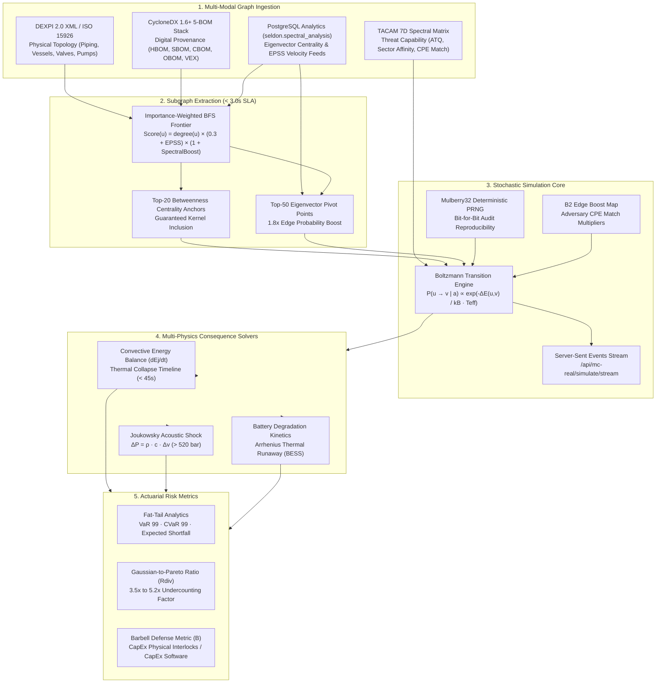

# CDT Monte Carlo Engine: Technical Specification & Engineering Reference
## Stochastic Graph Physics, Importance-Weighted BFS, and Spectral Path Traversal over Unified DEXPI 2.0 and CycloneDX Multi-BOM Graphs

---

## 1. Executive Problem Statement: The Failure of Binary IT Reachability

Traditional industrial cybersecurity tools evaluate vulnerability management on static, unweighted graphs. An asset scanner discovers an unpatched Common Vulnerabilities and Exposures (CVE) identifier on an engineering workstation, queries a network access control list, and concludes that a path to a Programmable Logic Controller (PLC) exists. This binary representation (reachable versus unreachable) fails in mission-critical operational technology (OT) environments for three concrete reasons:

1. **Absence of Traversal Dynamics**: Binary reachability cannot calculate the traversal latency, the required adversary skill, or the probability that an intrusion is detected across an operational conduit before reaching physical equipment.
2. **Disconnection from Physical Laws**: A flat network topology does not encode conservation of mass, momentum, and energy. A compromised controller is treated identically whether it regulates a benign office ventilation baffle or a high-pressure $250\,\text{bar}$ boil-off gas compressor.
3. **Gaussian Risk Distortions**: Traditional risk matrices multiply subjective probability by static impact (1 to 5), assuming losses cluster around a Gaussian mean. In cyber-physical systems, common-cause software vulnerabilities and shared fieldbuses create extreme coupling. Losses follow an Extremistan power law where catastrophic single-event consequences dominate the cumulative tail risk.

The Eigenia Cyber Digital Twin (CDT) Monte Carlo Engine resolves these deficiencies. The Cyber Digital Twin models the entire world across seven architectural layers: from silicon roots and physical processes up through cognitive operator dynamics and actuarial risk. The engine transforms the physical and digital infrastructure of a facility into a unified, attributed directed graph. By executing real-time, Boltzmann-weighted random walks over live graph topologies enriched by spectral graph theory and real-time physical dissipation solvers, the engine calculates the empirical probability density function of cyber-physical catastrophe.



---

## 2. The Unified Graph Schema: Binding DEXPI 2.0 to CycloneDX 1.6+

### 2.1 Formal Graph Definition ($G_{\text{CPDT}}$)
The Cyber-Physical Digital Twin is modeled as a unified attributed directed multigraph:

$$G_{\text{CPDT}} = (V, E, \Phi_V, \Phi_E)$$

The vertex set $V$ represents the union of physical engineering assets ($V_{\text{phys}}$) and cyber components ($V_{\text{cyber}}$):

$$V = V_{\text{phys}} \cup V_{\text{cyber}}$$

Where:
- $V_{\text{phys}} = V_{\text{equipment}} \cup V_{\text{piping}} \cup V_{\text{valve}} \cup V_{\text{instrument}} \cup V_{\text{terminal}}$
- $V_{\text{cyber}} = V_{\text{hardware}} \cup V_{\text{software}} \cup V_{\text{crypto}} \cup V_{\text{operations}} \cup V_{\text{service}}$

The edge set $E$ represents physical fluid/power connections, digital communications conduits, and cross-domain bindings:

$$E = E_{\text{fluid}} \cup E_{\text{electrical}} \cup E_{\text{network}} \cup E_{\text{binding}}$$

### 2.2 Semantic Ingestion of DEXPI 2.0 XML
DEXPI 2.0 unifies the P&ID Specification 1.4 (Plant Model) and the Process Specification 1.0 (Process Model) into standardized DEXPI XML, replacing the legacy Proteus schema. The ingestion parser extracts:
1. **Piping and Instrumentation Topology**: Line numbers, nominal pipe diameters ($DN$), piping materials, valve discharge coefficients ($C_v$), and fail-safe positions (Fail-Closed, Fail-Open, Fail-Locked).
2. **Process State Parameters**: Fluid composition, operating temperatures ($T$), operating pressures ($P$), volumetric flow rates ($Q$), and enthalpy balances.
3. **Instrument Functions**: Sensing elements (temperature transmitters, differential pressure cells), actuators (pneumatic diaphragms, motorized gearboxes), and hardwired trip switches.

### 2.3 CycloneDX 1.6+ Multi-BOM Layering
The digital properties of each asset are captured using a 5-BOM architecture within CycloneDX 1.6:
- **HBOM (Hardware BOM)**: Silicon processors, microcontrollers, field-programmable gate arrays (FPGAs), variable frequency drive (VFD) power stages, printed circuit board (PCB) revisions, and hardware roots-of-trust (Caliptra RoT).
- **SBOM (Software BOM)**: Real-time operating system (RTOS) kernels, embedded firmware binaries, open-source libraries (OpenSIL, OpenBMC), and programmable logic controller (PLC) application programs.
- **CBOM (Cryptographic BOM)**: Device Identity Composition Engine (DICE) certificates, asymmetric key hierarchies, symmetric session keys, and post-quantum algorithms (ML-DSA, ML-KEM).
- **OBOM (Operational BOM)**: Maximum allowable operating pressure (MAOP), critical trip setpoints, permitted actuator slew rates ($|dx/dt| \le \text{limit}$), and safety instrumented function (SIF) response times.
- **VEX (Vulnerability Exploitability eXchange)**: Machine-readable vulnerability status records correlating open CVEs with runtime exploitability, CISA Known Exploited Vulnerabilities (KEV) status, and EPSS scores.

### 2.4 Cross-Domain Property Extension (`dexpi:`)
To bind mechanical equipment to executing firmware, CycloneDX component records incorporate the standardized `dexpi:` property namespace:

```json
{
  "type": "device",
  "bom-ref": "cdu-pump-vfd-01",
  "name": "Coolant Distribution Unit Primary Pump VFD",
  "version": "Rev-4.2",
  "properties": [
    {
      "name": "dexpi:plant:equipmentTag",
      "value": "PMP-CDU-101A",
      "description": "Equipment Tag in DEXPI 2.0 P&ID XML"
    },
    {
      "name": "dexpi:process:designFlowRateLpm",
      "value": "38.5",
      "description": "Nominal Volumetric Flow of PG25 Coolant"
    },
    {
      "name": "dexpi:safety:failState",
      "value": "Fail-Locked",
      "description": "Actuator mechanical state on control loop loss"
    },
    {
      "name": "dexpi:iec62443:zone",
      "value": "Zone-1-Cell-Level",
      "description": "Purdue Model Zone Assignment"
    },
    {
      "name": "dexpi:iec62443:slt",
      "value": "SL-3",
      "description": "Target Security Level per IEC 62443-3-3"
    }
  ]
}
```

---

## 3. Substation & BESS Electrical/OT Reference Architecture

To demonstrate the concrete application of the unified graph schema, the engine maps the Endeavour Energy substation and battery energy storage system (BESS) network specification (`Substation_spec_design.md`) into a topological graph.

### 3.1 Substation & BESS Node Inventory (Table 1)

| Node Tag | Asset Description | System Classification | Purdue Layer | Governing Protocols & Interfaces |
| :--- | :--- | :--- | :--- | :--- |
| **TRF-01** | 132/33kV Step-Down Power Transformer | Primary Electrical | Level 0 | High Voltage AC (132kV to 33kV) |
| **CB-01** | High Voltage Vacuum Circuit Breaker | Primary Electrical | Level 0 | IEC 61850 GOOSE (Trip/Close coils) |
| **BUS-01** | Substation 33kV Medium Voltage Busbar | Primary Electrical | Level 0 | Copper Bar Electrical Distribution |
| **BAT-RACK-01**| 1500V DC LiFePO4 / NMC Battery Rack | BESS Energy Storage | Level 0 | High-Voltage Direct Current Bus |
| **PCS-01** | 2.5MW Bi-Directional Power Inverter | BESS Power Conversion | Level 1 | 1500V DC to 400V AC, Modbus TCP |
| **BMS-01** | Master Battery Management System | BESS Control & Safety | Level 1 | CAN Bus, Modbus TCP, Dry Contacts |
| **IED-01** | Digital Feeder Protection Relay | Substation Automation | Level 1 | IEC 61850-9-2 SV, GOOSE, MMS |
| **MU-01** | Optical Merging Unit (Current/Voltage) | Substation Instrumentation | Level 0 | IEC 61850-9-2 Sampled Values (SV) |
| **RTU-EE** | Utility Remote Terminal Unit | Grid Control Gateway | Level 2 | DNP3 over TCP/IP, IEC 60870-5-104 |
| **RTU-VEN** | OEM Vendor BESS Unit Controller | Asset Management | Level 2 | Modbus TCP, Vendor Fleet Manager |
| **MOD-01** | Cellular Edge Gateway (Private APN) | Communications Transport | Level 3 | IPsec VPN, 4G/5G LTE Dedicated APN |
| **FW-01** | Industrial Deep Packet Inspection Firewall | Network Security Conduit | Level 3 | State-Aware Modbus/DNP3 Rules |
| **DERMS-01** | Distributed Energy Resource Management | Central Operations | Level 4 | Kubernetes Cluster, mPrest Platform |
| **UT-SRV-01** | Utility Cloud Interface Server | Data Gateway | Level 4 | HTTPS, REST API, MQTT Broker |

### 3.2 Graph Edge Traversal Matrix (Table 2)

**Table 2: Substation and BESS attack conduit topology.**

| Source Node | Target Node | Flow Classification | Protocol & Physical Conduit |
| :--- | :--- | :--- | :--- |
| Vendor Engineer | MOD-01 | Remote Ingress | Citrix Jump Host via HTTPS / SSH |
| MOD-01 | FW-01 | Ingress Conduit | Encrypted IPsec Tunnel over Private APN |
| FW-01 | RTU-VEN | OT Control Plane | Modbus TCP (Port 502) / Proprietary OEM |
| RTU-VEN | BMS-01 | Controller Link | Modbus TCP / Unauthenticated RS-485 |
| BMS-01 | PCS-01 | Actuator Setpoints | CAN Bus 2.0B / Modbus RTU |
| PCS-01 | BAT-RACK-01 | Power Inversion | Overvoltage Injection (> 4.4V/cell) |
| IED-01 | CB-01 | Protection Trip | IEC 61850 GOOSE Trip Command |
| MU-01 | IED-01 | Analog Digitization | IEC 61850-9-2 Process Bus Sampled Values |

---

## 4. Subgraph Extraction: The Importance-Weighted BFS Algorithm

Industrial facilities often contain more than $250,000$ logical and physical nodes. Running Monte Carlo simulations across an entire multi-million element matrix violates operational response constraints. To extract the critical operational subgraph in real time without losing systemic hazard fidelity, the engine uses an **Importance-Weighted Breadth-First Search (IW-BFS)**.

### 4.1 Scoring Formulation
The extraction frontier scores candidate nodes by topological centrality, active exploitability, and spectral connectivity:

$$\text{Score}(u) = \text{degree}(u) \times \left( 0.3 + \max(0, \text{EPSS}(u)) \right) \times \left( 1 + \max(0, \text{SpectralBoost}(u)) \right)$$

Where:
- $\text{degree}(u)$ is the total degree of node $u$, serving as a computationally efficient proxy for betweenness centrality.
- $\text{EPSS}(u) \in [0, 1]$ is the Exploit Prediction Scoring System probability attributed to known CVEs residing on that asset.
- $\text{SpectralBoost}(u) \in [0, 1.8]$ is the normalized eigenvector centrality extracted from PostgreSQL (`seldon.spectral_analysis`), prioritizing topological bridgeheads.

```typescript
// Production IW-BFS Scoring Implementation
export function computeImportanceScore(
  degree: number, 
  epssScore: number = 0, 
  spectralBoost: number = 0
): number {
  return degree * (0.3 + Math.max(0, epssScore)) * (1 + Math.max(0, spectralBoost));
}
```

### 4.2 Anchor Nodes and SLA Fallback Mechanics
1. **Top-20 Anchor Guarantee**: The top-20 nodes ranked by global degree centrality are automatically injected into the simulation kernel, ensuring global structural choke points are preserved.
2. **Three-Second SLA Fallback**: If graph scoring and spectral join execution exceed a 3.0-second computational window, the engine gracefully drops spectral joins and executes a uniform topological BFS. This guarantees responsiveness in operational security consoles.

---

## 5. Spectral Graph Physics & Boltzmann Traversal Dynamics

### 5.1 Spectral Graph Theory & Laplacian Decomposition
Let $A$ be the adjacency matrix of graph $G$, and $D$ be the diagonal degree matrix where $D_{ii} = \sum_j A_{ij}$. The unnormalized graph Laplacian is defined as:

$$L = D - A$$

The normalized symmetric graph Laplacian is formulated as:

$$\mathcal{L} = D^{-1/2} L D^{-1/2} = I - D^{-1/2} A D^{-1/2}$$

Eigenvalue decomposition of $\mathcal{L}$ yields:

$$\mathcal{L} v_i = \lambda_i v_i, \quad 0 = \lambda_1 \le \lambda_2 \le \dots \le \lambda_n$$

- **Algebraic Connectivity ($\lambda_2$)**: The Fiedler value ($\lambda_2$) measures the structural robustness of the network. A small $\lambda_2$ indicates sparse conduits connecting IT to OT zones, revealing natural choke points where defensive monitoring must be concentrated.
- **Eigenvector Centrality**: The principal eigenvector $v_n$ of the adjacency matrix provides the relative centrality score for every node:
  $$A v = \lambda_{\max} v \implies v_i = \frac{1}{\lambda_{\max}} \sum_{j \in \mathcal{N}(i)} v_j$$
  Nodes in the top 50 ranks of eigenvector centrality in PostgreSQL (`seldon.spectral_analysis`) receive up to a $1.8\times$ weight boost, identifying critical lateral pivot points.

### 5.2 Physical Energy Barriers & Boltzmann Distribution
Adversary traversal is modeled as a discrete-time Markov random walk governed by a **Boltzmann probability distribution**. Every network edge $e = (u, v)$ presents an energy potential barrier $\Delta E(u, v)$ determined by defensive friction:

$$\Delta E(u, v) = \Delta E_{\text{base}} + \Delta E_{\text{firewall}} + \Delta E_{\text{crypto}} + \Delta E_{\text{airgap}}$$

Where:
- $\Delta E_{\text{base}} = 1.0\,\text{eV}$ baseline protocol hop friction.
- $\Delta E_{\text{firewall}} = 3.5\,\text{eV}$ for stateful deep packet inspection (DPI) matching IEC 62443 conduits.
- $\Delta E_{\text{crypto}} = 4.0\,\text{eV}$ for mutual TLS (mTLS) with hardware-enforced DICE certificates.
- $\Delta E_{\text{airgap}} = 12.0\,\text{eV}$ for physically isolated or serial-switched conduits. Unidirectional hardware data diodes set $\Delta E \to \infty$ in the reverse direction.

The probability of an adversary $a$ transitioning from node $u$ to adjacent node $v$ is:

$$P(u \to v \mid a) = \frac{\exp\left( -\frac{\Delta E(u, v)}{k_B \cdot \mathcal{T}_{\text{eff}}(a)} \right)}{\sum_{w \in \mathcal{N}(u)} \exp\left( -\frac{\Delta E(u, w)}{k_B \cdot \mathcal{T}_{\text{eff}}(a)} \right)}$$

Where:
- $k_B = 1.0$ is the normalized computational Boltzmann constant.
- $\mathcal{T}_{\text{eff}}(a)$ is the adversary's effective excitation temperature:
  $$\mathcal{T}_{\text{eff}}(a) = \mathcal{T}_0 \cdot \left( \frac{\text{ATQ}_a}{100} \right)^{1.85} \cdot \prod_s \mu_s(a)$$
- $\text{ATQ}_a \in [0, 100]$ is the Actor Threat Quotient.
- $\mu_s(a) \in [1.0, 2.5]$ is the TACAM sector-affinity multiplier.

### 5.3 TACAM Product Exposure ($B_2$ Edge Boost Map)
During random walks, the engine correlates the adversary's TACAM product exploit portfolio against the destination node's Common Platform Enumeration (CPE). If the adversary possesses confirmed exploit capability against the target equipment (e.g. Volt Typhoon against Siemens S7, or Sandworm against Schneider Electric Modicon), the $B_2$ edge boost reduces the effective energy barrier:

$$\Delta E_{\text{effective}}(u, v) = \frac{\Delta E(u, v)}{B_2(a, \text{CPE}_v)}$$

Where $B_2 \in [1.5, 3.2]$, substantially increasing the probability of lateral penetration across that conduit.

### 5.4 Temperature Modulated Sweeps (Black Swan Mode)
By modulating simulation temperature $T$, engineers evaluate two distinct failure regimes:
- **Low Temperature ($T \to 0$)**: The adversary follows the path of least resistance. Models opportunistic, automated malware campaigns.
- **Elevated Temperature ($T \ge 3.0$ / Black Swan Mode)**: Stochastic exploration forces paths across high-barrier conduits ($\Delta E > 8.0\,\text{eV}$), discovering non-intuitive lateral attack combinations that standard vulnerability scanners overlook.

---

## 6. Multi-Physics Physical Plant Coupling Solvers

A cyber penetration in critical infrastructure is consequential only when it alters physical state variables. The engine couples graph step traversal to three first-principles physical solvers:

### 6.1 Convective Cooling Thermal Collapse Solver
In high-density liquid cooling ($120\,\text{kW/rack}$ direct-to-chip AI clusters), shutting down secondary coolant distribution unit (CDU) pumps starves liquid flow. Silicon junction temperature $T_j(t)$ is governed by the energy balance:

$$\frac{dT_j(t)}{dt} = \frac{P_{\text{die}} - h_{\text{conv}}(\dot{Q}_{\text{vol}}) \cdot A_{\text{die}} \cdot (T_j - T_{\text{coolant}})}{C_{\text{thermal}}}$$

Where:
- $P_{\text{die}} = 1,200\,\text{W}$ per accelerator ASIC.
- $\dot{Q}_{\text{vol}}$ is the volumetric flow rate ($38.5\,\text{L/min}$ nominal, collapsing to $0.0\,\text{L/min}$).
- $h_{\text{conv}}$ is the convective heat transfer coefficient, which drops exponentially under flow stagnation.
- $C_{\text{thermal}} = 142\,\text{J/K}$ is the lumped thermal capacitance of the cold plate copper package.

Under complete flow stagnation, silicon junction temperature climbs at **$4.2^\circ\text{C/s}$**, breaching irreversible delamination ($94.0^\circ\text{C}$) in **$14.8\text{ to }45.0\,\text{seconds}$**. Because SCADA polling and operator verification take $30\text{ to }90\,\text{seconds}$, software-only alerts cannot prevent hardware destruction.

### 6.2 Cryogenic Joukowsky Acoustic Slugging Solver
In LNG regasification terminals, spoofing suction pre-heater telemetry (+8.5°C false feedback) admits sub-cooled liquid methane droplets into reciprocating compressor cylinders running at $500\,\text{RPM}$. The acoustic pressure shock follows the Joukowsky equation:

$$\Delta P_{\text{shock}} = \rho_{\text{liquid}} \cdot c_{\text{sound}} \cdot \Delta v$$

With liquid methane density $\rho \approx 422\,\text{kg/m}^3$, acoustic velocity $c \approx 1,400\,\text{m/s}$, and piston impact velocity $\Delta v \approx 6.8\,\text{m/s}$:

$$\Delta P_{\text{shock}} = 422 \cdot 1,400 \cdot 6.8 = 4,017,440\,\text{Pa} \approx 40.2\,\text{bar (transient differential)}$$

Superimposed on the nominal $250\,\text{bar}$ discharge pressure, the peak internal stress exceeds **$520\,\text{bar}$**, blowing the cylinder head off the crankcase and causing catastrophic loss of containment.

### 6.3 Electrochemical BESS Thermal Runaway Solver
In battery energy storage systems (BESS), overriding the battery management system (BMS) charging ceiling beyond $4.4\,\text{V/cell}$ triggers self-sustaining exothermic decomposition modeled by Arrhenius kinetics:

$$\frac{dT_{\text{cell}}}{dt} = \frac{\dot{Q}_{\text{joule}} + \dot{Q}_{\text{reaction}} - \dot{Q}_{\text{loss}}}{m_{\text{cell}} \cdot c_p}$$

$$\dot{Q}_{\text{reaction}} = \Delta H_{\text{reaction}} \cdot A_{\text{arr}} \cdot \exp\left( -\frac{E_a}{R \cdot T_{\text{cell}}} \right) \cdot f(\text{SoC})$$

Once cell temperature exceeds the critical solid electrolyte interphase (SEI) decomposition point ($135^\circ\text{C}$), reaction heating outpaces convective cooling, driving cell temperature past $800^\circ\text{C}$ with explosive venting of hydrogen fluoride (HF) and flammable hydrocarbons.

---

## 7. Real-Time Telemetry Streaming & Mulberry32 Determinism

### 7.1 Server-Sent Events Pipeline
The simulation pipeline is exposed over HTTP Server-Sent Events at `/api/mc-real/simulate/stream`. Implemented as a TypeScript generator (`sampleWalkSteps()`), it yields fine-grained state telemetry for every discrete hop:

```typescript
// Production SSE Walk Step Generator
export function* sampleWalkSteps(
  graph: UnifiedGraph,
  seedId: string,
  targetId: string,
  maxHops: number,
  temperature: number,
  rngSeed: number
): Generator<WalkStep, WalkSummary, void> {
  const prng = mulberry32(rngSeed);
  let currentId = seedId;
  let cumulativeCost = 0;
  let cumulativeProb = 1.0;
  const visited = new Set<string>([seedId]);

  for (let hop = 0; hop < maxHops; hop++) {
    const candidates = graph.getOutEdges(currentId);
    const selection = boltzmannSelect(candidates, temperature, visited, prng);
    if (!selection) break;

    const { edge, probability } = selection;
    cumulativeCost += edge.weight;
    cumulativeProb *= probability;
    visited.add(edge.targetId);

    const step: WalkStep = {
      hop,
      sourceId: currentId,
      targetId: edge.targetId,
      edgeType: edge.type,
      probability,
      cumulativeProb,
      cumulativeCost,
      zoneCrossed: edge.sourceZone !== edge.targetZone ? `${edge.sourceZone}->${edge.targetZone}` : null,
      timestamp: Date.now()
    };

    yield step;
    currentId = edge.targetId;
    if (currentId === targetId) break;
  }

  return {
    success: currentId === targetId,
    totalHops: visited.size - 1,
    finalProbability: cumulativeProb,
    totalCost: cumulativeCost
  };
}
```

### 7.2 Bit-for-Bit Determinism via Mulberry32 PRNG
To support forensic audits, EU CRA Annex VII conformity assessments, and Lloyd's Y5381 reinsurance claims, every random walk is bit-for-bit deterministic. Passing a 32-bit unsigned integer `rngSeed` produces identical traversal trajectories across distributed test runners:

```typescript
export function mulberry32(seed: number) {
  return function(): number {
    let t = (seed += 0x6D2B79F5);
    t = Math.imul(t ^ (t >>> 15), t | 1);
    t ^= t + Math.imul(t ^ (t >>> 7), t | 61);
    return ((t ^ (t >>> 14)) >>> 0) / 4294967296;
  };
}
```

---

## 8. Actuarial Risk Metrics & Fat-Tail Mathematics

Traditional IT risk models calculate risk using Gaussian mean and variance. In operational technology, software vulnerabilities exhibit common-cause coupling: a single unauthenticated Modbus command shuts down all redundant cooling pumps or battery cooling loops simultaneously. Losses follow a Pareto fat-tail distribution ($P(L > x) \sim x^{-\alpha}$, where $1 < \alpha < 2$).

The engine computes five rigorous actuarial metrics across $10,000+$ simulation runs:

### Table 3: Fat-Tail Actuarial Metrics

| Metric | Formulation | Operational & Underwriting Interpretation |
| :--- | :--- | :--- |
| **Value-at-Risk ($\text{VaR}_{0.99}$)** | $\text{VaR}_p = \inf \{ l \in \mathbb{R} : P(L > l) \le 1 - p \}$ | The maximum loss expected across 99% of regular operating epochs. |
| **Conditional VaR ($\text{CVaR}_{0.99}$)** | $\text{CVaR}_p = E[L \mid L > \text{VaR}_p] = \frac{\alpha}{\alpha - 1} \text{VaR}_p$ | The Expected Shortfall: average loss magnitude when a catastrophic breach occurs. |
| **Gaussian-to-Pareto Ratio** | $\mathcal{R}_{\text{divergence}} = \frac{\text{CVaR}_{\text{Pareto}}}{\text{CVaR}_{\text{Gaussian}}}$ | Quantifies the severe undercounting factor ($3.5\times$ to $5.2\times$) of legacy IT risk models. |
| **Antifragility Score** | $\mathcal{A}_{\text{node}} = \frac{\partial^2 \text{Loss}}{\partial T^2} \Big\|_{T=1.0}$ | Second derivative of loss with respect to attack temperature. Positive = fragile; Negative = antifragile. |
| **Barbell Defense Score** | $\mathcal{B} = \frac{\text{CapEx}_{\text{Physical Interlocks}}}{\text{CapEx}_{\text{Software Firewalls}}}$ | The capital allocation ratio between hardwired analog cutouts and software security tooling. |

### 8.1 The Barbell Defense Principle
Because software security layers are susceptible to zero-day bypasses, supply chain tampering, and credential theft, relying solely on software firewalls increases tail risk. The **Barbell Defense Principle** mandates allocating security capital to two extremes:
1. **Low-Risk Deterministic Analog Layer (80-90% of budget)**: Hardwired bimetallic switches, spring-loaded mechanical relief valves, pneumatic fail-safe actuators, and physical rupture discs completely decoupled from digital networks.
2. **High-Velocity Digital Monitoring Layer (10-20% of budget)**: Real-time network telemetry, out-of-band optical sensors, and cryptographic hardware roots-of-trust (Caliptra).

Eliminating reliance on complex middle-tier software inspection firewalls ensures that even if an adversary gains root execution on supervisory servers, physical destruction remains impossible.

---

## 9. Regulatory & Standards Traceability Matrix

- **DEXPI 2.0 Specification (2025)**: *Data Exchange in the Process Industry: Process and Plant Model Specification*, DEXPI e.V.
- **OWASP CycloneDX 1.6 / 1.7**: *Universal Software, Hardware, Operations, and Cryptography Bill of Materials Standard*, ECMA-424.
- **IEC 62443-3-3:2018**: *Industrial communication networks: Security for industrial automation and control systems: System security requirements and security levels*.
- **IEC 61511-1:2016**: *Functional safety: Safety instrumented systems for the process industry sector*.
- **Directive 2012/18/EU (Seveso III)**: *Control of major-accident hazards involving dangerous substances*, European Parliament.
- **BRZO 2015**: *Besluit risico's zware ongevallen*, Staatsblad van het Koninkrijk der Nederlanden.
- **EU CRA (Regulation 2024/2847)**: *European Cyber Resilience Act: Essential cybersecurity requirements for products with digital elements*, Annex I & VII.
- **Lloyd's Market Association (2021)**: *Market Bulletin Y5381: Cyber Attack Underwriting Guidelines and Clause LMA5564 Affirmative State-Sponsored Coverage*.