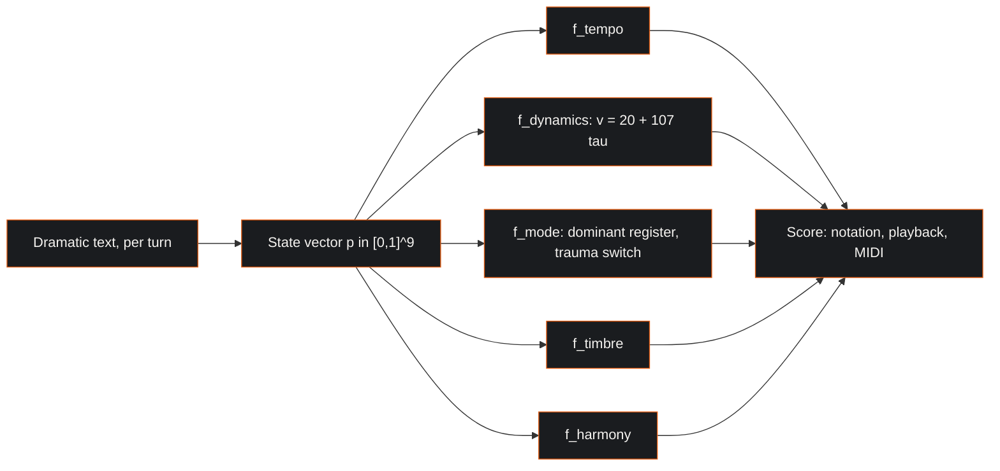
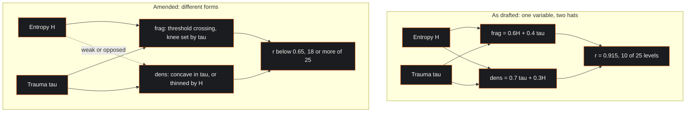
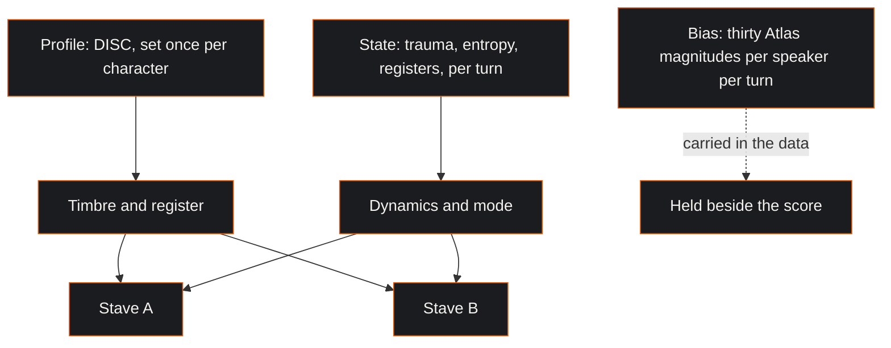

# The McKenney-Lacan Psychometric Calculus: A Theory of Musical Representation for Psychological State

**J. McKenney**

Paper 1 of the Musical Psychometric Notation series. It states the theory; MPN-S2 treats the mathematics and MPN-S3 the mapping from state to musical parameter. MPN-S5 and MPN-S6 apply the engine to dialogue and to the expression surface. MPN-S4, the audit of the reference implementation, is an internal record held in the programme's working corpus and available from the author.

Licence: CC BY 4.0. 15 September 2026.

## Executive Abstract

A film composer decides in a few seconds what a character sounds like, and the decision stays in the ear rather than on the page. This paper proposes that the decision is formalisable: that the transformations professional practice applies to a leitmotif as a character changes are deterministic functions of a psychological state, and that the state can be given a definite composition, a definite geometry and a definite range.

The theory names a nine-component state vector, bounded to the unit interval, carrying trauma, entropy, the three Lacanian registers and the four DISC dimensions. Three of those components, the Real, the Symbolic and the Imaginary, are constrained to sum to one, so that the state lives on a simplex and the registers stand in a competitive relation. A single transformation carries the state to musical parameter space: tempo, dynamics, mode, timbre and harmony, each a function of the state in its own right. Because the functions are separate and explicit, a musical decision can be traced back to the state component that caused it, which is the practical motive for the whole construction.

What the theory takes from others and what it asserts on its own authority are separated throughout. The registers are Lacan's; assigning them magnitudes is McKenney's, and the paper attributes each layer to its own source. The claims are then stated as a numbered register with failure conditions, so that they can be argued with one at a time.

Three results are reported against the theory rather than for it. Two assertions have been withdrawn. One has been amended after an algebraic finding showed that two of the theory's quantities, as originally written, moved as one variable wearing two hats on whatever data they were computed on. And the corpus that has been cited in support of the theory is the system's own output, 31,078 scored rows and 232 analysed frames, computed by the formulae this paper states.

The theory is offered for review and improvement rather than as a finished result, on the principle that a theory stated completely enough to be wrong is more useful to a reader than a theory stated safely.

## Abstract

This paper states the McKenney-Lacan psychometric calculus, a theory of how a specified psychological state can be represented in music. It gives the nine-component state vector, the simplex constraint that binds the three Lacanian registers, the master transformation from state space to musical parameter space, and the provenance of every element, separating what the theory takes from Lacan, from psychometrics, from dynamical systems and from the film-scoring tradition, from what it asserts on its own authority and must therefore defend on its own. The assertions are given as a numbered register of eleven claims about a single subject at a single moment and five about dialogue, each with its failure condition. Nine of the eleven stand, two are withdrawn, one is amended on an algebraic finding, and one carries an assignment that is provisional pending a listening study. The paper closes with the conditions under which the theory would be wrong, a statement of what is implemented and what the implementation takes next, and a consolidated account of the programme's open questions.

The paper is explicit about what it rests on. The two bodies of numbers in the corpus, 31,078 scored rows and 232 analysed frames, are both outputs of the system this paper theorises, and the annotation protocol of section 9 is the instrument that supplies independent values of trauma, entropy and the registers. A blinded listening pack has been built to settle the open questions. Two earlier listener studies are reported, one returning a mean appropriateness rating of 4.2 on a five-point scale and one a null result; both were collected on stimuli from an unseeded generator, and seeding the generator is what makes a restaged study reproducible. Section 10 gathers the open questions.

## 1. Introduction

### 1.1 The problem the theory addresses

Music's effect on a listener's affect is among the better documented findings in psychology. The inverse problem, generating music that represents a specified psychological state, has been solved repeatedly in practice by film composers, and this paper states that practice in a form another person can check.

A composer scoring a scene decides in a few seconds what a character sounds like. Ask why the cue is in Lydian and the answer will be a gesture: the scene is weightless, the character is not yet disillusioned, the sharpened fourth holds the moment open. The judgement is usually right and it stays in the ear. Two composers given the same scene produce different cues, and each is following a practice rather than a rule.

The observation is about the form of the knowledge rather than about the people who hold it. Craft knowledge of this kind is efficient and it works. It becomes a problem only when someone wants to generate music continuously from a state that is itself changing, faster than a composer can score it; or to explain a musical decision to someone who is not a musician, in terms of the psychological content it carries; or to test whether the mapping between a state and a treatment is any good, which becomes possible the moment the mapping is written down and there is something to test.

The theory exists to make the mapping explicit. Its claim is that an explicit version can be inspected, argued with, implemented and corrected, and that those four operations are what the explicit version is for. A composer's ear remains the standard the output is judged against.

The tradition the theory formalises is specific. Wagner established in *Oper und Drama* that music should carry the psychological essence of a character rather than accompany the character's actions, and the leitmotif was the vehicle: a musical idea that accumulates meaning and is transformed as its subject is transformed, so that Wotan's spear motif carries authority and its burden rather than a weapon [1]. Two modern practitioners refined the technique in ways the theory takes as its direct source. John Williams uses modal colour as a semantic device, the raised fourth of the Lydian mode marking the transcendent and the not yet disenchanted. Howard Shore uses progressive fragmentation, the Fellowship theme losing members as the fellowship does, until what remains is an interval rather than a melody. The observation on which this theory rests is that these are transformations, that they are applied under conditions, and that the conditions are psychological. If the conditions can be written down, so can the transformations.

### 1.2 What the theory proposes

The theory can be stated as four propositions. Everything else in this paper is either the content of one of them or the evidence for it.

**Proposition 1.** A character's psychological state, for the purposes of musical representation, can be carried by a small vector of bounded real components, and the components can be named.

**Proposition 2.** Three of those components are the Lacanian registers, and they stand in a competitive relation to one another, so that they are properly represented on a simplex rather than as free coordinates.

**Proposition 3.** The transformations that professional practice applies to a leitmotif, modal recolouring, fragmentation, orchestration growth and harmonic recontextualisation, are functions of that vector, and the functions are total, deterministic and inspectable.

**Proposition 4.** Because the functions are explicit, the resulting system is interpretable, controllable and extensible in a way that follows directly from its explicit functions, even where a system trained to imitate scores from examples produces more idiomatic output.

The fourth proposition gives the theory its practical motive, and it is worth stating plainly what it claims. It claims that when the output is wrong, an explicit system can be interrogated about why, and it leaves the question of which system makes the better music to the ear. For a composer that is the difference between a tool and a slot machine. For a therapist it is the difference between an instrument and an oracle. For a researcher it is the difference between a hypothesis and a black box.

### 1.3 Scope, and the standing caveat

This is a theory paper. The formal apparatus belongs to MPN-S2 and the parameter-by-parameter mapping to MPN-S3; the audit of the system that realises it is MPN-S4, an internal record held in the working corpus and available from the author. The quantities named are dramatic quantities, and they do dramatic work even where they share a word with a clinical term. The theory's own domain is theory and internally held synthetic material, and the material it has been exercised on is a library of dramatic texts.

One thing is worth saying plainly before the theory begins. This is a theory paper, not a report of listener results. What it offers is a theory stated completely enough to be wrong, an implementation whose output can be listened to, and an account of the distance between the two. The listening study described in MPN-S3 is how the open questions get settled, and comment and correction are what this paper is published for. Section 10 gathers the open questions.

Two things follow for the reader. Where a section makes a claim that turns on a choice still to be taken, it says so at that point rather than leaving it to the end. And the assertion register of section 6 should be read as sorting into three kinds: claims that are true by construction, and so settled by inspecting the definition, such as the naming of the nine coordinates and their bounds, the simplex constraint that a line of arithmetic imposes, the five named fragmentation stages, and the composition claim about how the functions are assembled; claims that are analytically settled, by algebra or by reading the source rather than by anybody's ear, which is how the collinearity finding of section 6.2 and the implementation findings of section 9 were reached; and mapping claims that the listening study settles, which is most of the rest.

## 2. The state

### 2.1 The nine components

The theory's working state vector has nine components, each bounded to the unit interval.

$$\vec{p} = (\tau,\; H,\; r,\; s,\; i,\; D,\; I_d,\; S_d,\; C) \in [0,1]^9$$

Trauma, written $\tau$, is the accumulated weight of what has happened to the subject and remains unresolved. It is a dramatic quantity: the difference between a character in the first scene and the same character after the event the play is about. One property of the definition deserves to be stated here rather than discovered later. Weight that is accumulated and unresolved ratchets: the definition makes trauma monotone increasing, so any musical parameter monotone in trauma rises across an act. Whether that is true of the drama is a separate question, and it is open. A parameter that should fall as well as rise is supplied by giving trauma a resolution term, and section 10.6 carries that as work.

Entropy, written $H$, is the disorder of the subject's symbolic organisation. Where trauma asks how heavily the subject is loaded, entropy asks how far the subject's account of their situation has stopped cohering. The two are held to be independent. A character may carry great weight in perfect order, and a character may be scarcely burdened and entirely scattered, and the theory holds that these two should sound different.

The three registers $r$, $s$ and $i$ are the Real, the Symbolic and the Imaginary, treated in section 3.

The four remaining components are the DISC dimensions: dominance, influence, steadiness and compliance. They carry the disposition the subject brings rather than the situation itself, and in the musical mapping they individuate a character's voice across scenes while trauma and entropy move within one.

### 2.2 Why a vector and not a valence

The most common representation of affect in computational work is two-dimensional, valence and arousal, and the theory sets it aside for this task. The dimensional model is the prevalent one and it is reliable on its own terms [2]; the reason for going past it is that this task needs more dimensions than two. Two characters may share a position in the valence-arousal plane and require entirely different music, because what separates them is what kind of subject they are and what has happened to them, which sits beside how pleasant and how activated they are rather than inside it. A dimensional summary discards exactly the material a leitmotif is supposed to carry. The theory's response is to keep the dimensions that do the work and accept the cost, which is that a nine-component state is harder to elicit, harder to visualise and harder to validate than a two-component one.

### 2.3 The wider vector and its reduction

The nine components are the working state. Behind them the theory defines a wider personality space formed from the four DISC dimensions, the five Big Five dimensions, the three Dark Triad dimensions and the cognitive biases. Earlier statements of that space named twelve biases and gave it twenty-four dimensions. **The count is now settled at thirty, the full Cognitive Bias Atlas, so the wider space is forty-two dimensional.** The twelve were a working subset, and the Atlas's thirty is now the classification of record throughout, which puts every part of the theory on one index; section 7.2 applies the same repair to the second place where two indices had grown up side by side.

Two consequences follow and MPN-S2 owes both. The reduction was proposed against a twenty-four dimensional space with a target of roughly eight factors. **It is restated here with a target of twenty-four.** Retaining twenty-four is the decision, and it has a tidy internal logic: twenty-four was the size of the wider vector before the bias count was settled, so reducing forty-two to twenty-four keeps the personality space the size it has always been while carrying the whole bias catalogue behind it. The number is chosen rather than fitted, the annotation corpus of section 9 is the body of data a fitted number would come from, and MPN-S2 states it as a choice. And the per-turn bias layer of section 7 and the per-person bias coordinates here are now indexed to the same thirty, which makes the relation between them checkable: the layer should be the turn-level realisation of the person-level disposition, and if annotation ever shows otherwise the theory has two objects rather than one. That space is standardised per dimension, reduced by principal or independent component analysis to roughly eight factors said to capture the large majority of variance, and normalised to the unit sphere.

Two remarks are owed here, and they are the kind of remark a theory paper should make about itself rather than leave to a critic. First, the reduction is proposed rather than demonstrated: a specific factor structure is named, and naming a factor structure is a hypothesis about a covariance matrix that only data can settle. Second, the constituent inventories stand on different evidence. The Big Five is the replicated, cross-culturally examined taxonomy of trait psychology [3]. DISC is a widely used commercial vocabulary whose validity evidence is the commercial literature, and which is reported to overlap substantially with Big Five extraversion and agreeableness [4]. The source for both statements is tertiary and is labelled as such; a primary loading study would establish the second, and the theory stands independently of the outcome. The Dark Triad instruments are research measures with reported reliabilities and a contested factor structure [5], [6]. A theory that takes all three as inputs inherits all three standings, and the honest position is that the DISC components in the working vector are doing expressive work rather than measurement work: they individuate a character's musical voice, and that is the whole of what the theory asks of them.

## 3. The registers, and what is Lacan's and what is McKenney's

The three registers come from Lacan, and their treatment here is the author's. That distinction matters enough to make in detail, because it is the point at which the theory is most often misread as a psychoanalytic application when it is a formalisation that borrows a vocabulary.

What is Lacan's. The tripartite division itself: the Imaginary as the register of images, identification and the ego, organised by the mirror stage; the Symbolic as the register of language, law and differential meaning, entered through the paternal function; the Real as what resists symbolisation, showing itself in symptom and repetition, and which is a category distinct from reality [7]. Also Lacan's is the topological insistence that the three are interdependent in a specific way, figured as a Borromean link in which cutting any one ring frees all three, so that the three hold together only as three [8]. The seminar in which that figure is developed circulates in unofficial transcriptions, and its edition status is why it is cited here for the figure alone. And Lacan's is the *objet petit a*, the object-cause of desire understood as a remainder that escapes symbolisation rather than as a thing anybody wants.

What is McKenney's. That the registers can be assigned magnitudes at all. That the magnitudes sum to one, so that the state lives on a two-simplex, which encodes a competitive relation between the registers and is a substantive claim about them rather than a normalisation convenience: it says that a subject's investment in fantasy and identification is bought at the cost of their investment in rule and language. That the dominant register selects a musical mode, with trauma acting as a second-stage switch within the register's pair. And that the whole composes into a calculus.

Lacan treated the registers without magnitudes, and the simplex is an addition to his account. The mathemes he did write are ideograms, notational rather than computational, and commentators who otherwise disagree profoundly agree on that reading of them [9]. The numeric layer is therefore entirely McKenney's construction. That is the location of the theory. Formalising a borrowed distinction in a way its author left to others is an ordinary move, and it becomes disreputable only when the borrower claims the original's authority for the formalisation. This paper claims the formalisation for McKenney. The standard critique of Lacan's use of mathematics is a critique of claiming mathematical authority for a metaphor [10], and attributing the numeric layer to its author is what answers that critique.

$$r + s + i = 1, \qquad (r, s, i) \in \Delta^2$$

The consequence for the modal mapping is treated in section 6.3, where the theory currently carries four incompatible tables rather than one claim.

## 4. The transformation

The theory's central object is a single function from psychological state space to musical parameter space.

$$\Phi : \mathcal{P} \rightarrow \mathcal{M}$$

with the psychometric state space a bounded subset of Euclidean space and the musical parameter manifold carrying, at minimum, tempo, dynamics, mode, timbre and harmony:

$$\Phi(\vec{p}) = \big(f_{\text{tempo}}(\vec{p}),\; f_{\text{dynamics}}(\vec{p}),\; f_{\text{mode}}(\vec{p}),\; f_{\text{timbre}}(\vec{p}),\; f_{\text{harmony}}(\vec{p})\big)$$

Three properties of this function are theoretical commitments rather than implementation details.

It is total. Every reachable state produces a score, which is what makes continuous generation possible and which also means that nonsense in produces music out, a property the theory must own rather than hide.

It is deterministic. The same state produces the same musical parameters, so that two implementations agreeing on the equations agree on the output. Any stochastic element in a realisation sits downstream of the transformation, in performance rather than in composition, and is seeded to preserve the property. Section 9 gives the seeding step that realises the property in the running implementation.

It is decomposable. Each musical parameter is a function of the state in its own right. Dynamics is a function of trauma alone in the simplest form, velocity running linearly from the threshold of audibility to the ceiling of the instrument, which in the theory's standard parameterisation gives $v(\tau) = 20 + 107\tau$, discretised to the eight conventional dynamic markings at stated boundaries. That parameterisation is normative here, and it is worth saying at once that the implementation carries two further parameterisations beside it: one path implements the linear velocity and then discretises to five labels, and another uses three fixed velocity entries with a constant fallback. Bringing both to the normative form is the repair, and section 10.5 records it. This is the same defect the paper diagnoses for the modal table in section 6.3 and for the bias list in section 7.2, and it is sitting in the paper's own worked example. Naming the disease three times is better than naming it twice and stepping over the third case. Mode is a function of the register simplex with trauma as a switch. Orchestration density and fragmentation are functions of trauma and entropy, in forms that section 6.2 revises. The decomposition is what makes the system explicable to a composer: a cue is loud because trauma is high, and thin because entropy is high, and in a particular mode because a particular register dominates, and each of those sentences can be checked separately.

Two of the five component functions take their arguments from work now under way. $f_{\text{timbre}}$ takes a timbre space whose perceptual resolution the fourth part of the listening pack measures. $f_{\text{harmony}}$ is re-expressed in MPN-S3 as a position given by a state scalar, and naming that scalar is an open question the theory carries forward. Both are stated here as coordinates of $\Phi$, and settling those two matters is what puts each in a form a reader can check.

## 5. The supporting apparatus, and what each part is for

The theory draws on bodies of work beyond Lacan and the scoring tradition, and MPN-S2 gives the formal treatment of them. What belongs here is the one piece the argument of this paper actually uses, and two cautions about the rest.

The piece in use is simplicial topology, and specifically the difference between a pair and a group. The author's chapter on the diad and the triad argues that a pair has no mediator, so that a disagreement between two voices has nowhere to go and the pair breaks, while three voices are the minimal stable configuration because the third can mediate or can form a coalition [11]. This is Simmel's argument [12] carried into a form the theory can compute with, and it is the structural warrant for the claim in section 7.3 that some quantities belong to a pair rather than to a person. That warrant is the whole of what this paper takes from the chapter.

The rest of the apparatus, Hamiltonian phase space for a state that moves rather than sits, Lyapunov exponents for how unstable a trajectory is, the Ising model for a group that flips rather than drifts, Granovetter thresholds for influence propagating through an ensemble, is real and is developed in MPN-S2. It is named here and developed there, and it enters this paper's argument at the point where an assertion in section 6 or a test in section 8 comes to depend on it. MPN-S2 is where those dependencies are taken up, and naming the apparatus here without arguing from it keeps the two papers' work distinct.

Two cautions belong with that. The first is that borrowing a formalism carries the formalism and leaves its results with the field they were established in. A Lyapunov exponent computed on a trajectory in a stipulated state space is a real number about that stipulated space, and any claim made from it stands or falls on the space being well posed. The second is that the quantity called free energy in the predictive-processing literature is a variational bound on surprise and is a different object from a potential well in a dynamical model of collapse. One name for two objects is how a reader comes to credit a theory with a result that belongs to another field. The term is therefore retired from this corpus. The variational quantity is the **surprise bound** and the dynamical well is the **stability potential**, and MPN-S2 carries a naming table that does the same job for every other borrowed term.

## 6. The assertion register

Section 3 said where the theory's originality lies. This section states it as a register that can be examined one item at a time, because a theory stated as a list of claims with failure conditions can be improved one claim at a time.

Eleven assertions were drafted for the single subject at a single moment. Nine stand. Two are withdrawn, and section 6.4 says why. One of the nine has been amended on evidence, and one carries a mapping table that is provisional rather than settled. The identifiers are kept stable, so A9 and A10 keep their names in the withdrawal record rather than being renumbered, and a reader comparing this paper with the companion register [19] will find the same names attached to the same claims.

### 6.1 The nine live assertions

| Id | Assertion | Formal content | Status |
|:---|:---|:---|:---|
| A1 | The state is nine-dimensional, and these are the nine | $\vec{p} \in [0,1]^9$ | Holds, with the disclosure in section 9 |
| A2 | The Lacanian registers admit magnitudes | $r, s, i \in [0,1]$ per character per frame | Holds as hypothesis; the annotation protocol of section 9 is its instrument |
| A3 | The registers are competitive; the state lives on a simplex | $r + s + i = 1$ | Holds as hypothesis; imposed by construction, observed by the elicitation study of section 8 |
| A4 | The dominant register selects the mode, trauma the darker member | mode $= f(\arg\max(r,s,i),\; \tau > \theta)$ | Mechanism holds; assignment provisional, section 6.3 |
| A5 | Trauma and entropy are separable and act on different parameters | Two free components | Holds; most likely to be confirmed |
| A6 | The transformation typology is a function, not a repertoire | Each transformation a total function of $\vec{p}$ | Holds as hypothesis; carried to output by the rendering work of section 10.7 |
| A7 | Fragmentation has ordered levels | Five stages, selected by a scalar | Levels kept; selector amended with A8 |
| A8 | Orchestration density has ordered levels on a different scalar | See section 6.2 | Amended on evidence |
| A11 | The whole composes: it is a calculus | $\Phi$ total, deterministic, decomposable | Composition holds; determinism realised by seeding |

Each assertion carries its own failure condition in the companion register, and the studies that would settle them are costed there [19].

### 6.2 A8, amended: the two intensity scalars move as one

A8 as drafted said that fragmentation and orchestration density are ordered level sets selected by differently weighted combinations of the same two variables:

$$\text{fragmentation} = 0.6H + 0.4\tau, \qquad \text{density} = 0.7\tau + 0.3H$$

**The finding is algebraic.** Given the standard deviations of the two inputs and the correlation between them, the correlation between the two outputs follows exactly, because both are linear combinations of the same pair. The result follows from the two standard deviations and the correlation alone, whichever plays supplied the frames, whoever annotated them and however many there are. With equal variances and trauma independent of entropy, the two scalars correlate at 0.8376. They are one intensity variable wearing two hats, on any corpus whatever [20].

**The illustration.** The largest set of state values in the corpus is the 232 frames of the play library, thirteen works from fifty frames of *Hamlet* to nine of *Uncle Vanya*. On those the two scalars correlate at $r = 0.9150$, the first principal component carries 95.75 per cent of the joint variance, ten of the twenty-five fragmentation-by-density level pairs are realised, and all thirteen works sit above 0.65, from 0.7403 on *Miss Julie* to 0.9678 on *A Doll's House*. The algebraic expression, given only sd(entropy) = 0.1925, sd(trauma) = 0.2496 and their correlation of +0.2802, returns the same 0.9150.

That agreement is an identity rather than a confirmation, and the paper claims from it exactly what an identity gives. The frames are the system's own output, as the next paragraphs set out, and the finding rests on the algebra, which holds whatever the frames turn out to be.

For the pair to fall below 0.65 with these variances, trauma and entropy would have to correlate at worse than $-0.525$. A corpus like that would refute A5's independence claim rather than rescue A8.

Hence the result worth carrying forward. **A5 succeeding forces A8 to fail as drafted.** The better trauma and entropy separate, the more tightly two similar reweightings of them must track. The theory therefore keeps A5 and amends A8, which is what section 6.2 does below.

**What the corpus is.** Two bodies of numbers in this programme have been cited in support of the theory, and both are the system's own output.

The first is a set of seven files described as scored plays, 31,078 beats. The script that produced them computes trauma as the beat index over the total, times 0.8, plus a count of eight keywords, and entropy as 0.30 plus a tally of question marks, exclamation marks and ellipses. Trauma correlates with beat position at 0.995 to 0.999 in every file, entropy reproduces from the text column with zero error, 72.8 per cent of rows sit at the entropy floor, trauma and entropy are the only state quantities the files carry, and the speaker parser assigns all 3,425 rows of *King Lear* to a single non-speaker.

The second is the 232 frames. Their prose descriptions and chord annotations are the author's, but the state values were produced by the application's own text analyser and calculus, run over that prose. They are the analyser's output rather than hand annotations, and the difference is a substantial one: the analyser assigns the registers by counting the words "real", "symbolic" and "imaginary", among others, in the text it is given, so the frame values are the analyser's reading of the author's commentary rather than a reading of the plays. The correlation of +0.2802 between trauma and entropy on those frames is a fact about two formulae applied to one body of prose.

The consequence is worth stating once, plainly, because it governs section 9 and everything in section 8 that depends on measurement. **Every value of trauma, entropy and the registers in the corpus is the system's own output.** Six of the nine live assertions turn on those quantities, and the annotation protocol named in section 9 is the instrument that supplies the independent values those six are tested against. This is a statement of where the programme has reached and of what the next term of work delivers.

Both sets are kept in the corpus and in the analysis script as labelled illustrations rather than as data, on the reasoning that a construction which produces the same collinearity on a curated frame library and on a punctuation tally is demonstrating its own property rather than being flattered by either.

**The amendment, adopted.** Fragmentation and density become a direction and its orthogonal complement in place of two blends of the same pair. The theory chooses one direction, which is what density means, and the second follows from it: fragmentation is the orthogonal complement of density in the state plane, clipped at zero because a full statement of the motif is the floor, and scaled so that the stage ladder spans the unit interval.

$$\text{density} = 0.3H + 0.7\tau, \qquad \text{fragmentation} = \frac{\max\!\left(0,\; 0.7H - 0.3\tau\right)}{0.7}$$

Density keeps its original weighting, so the theory's claim that density leans on trauma is preserved exactly. What changes is fragmentation, and it changes from a near-parallel projection to a perpendicular one.

On the frame library the pair correlates at $r = +0.0571$, Spearman $+0.0216$, against $+0.9150$ for the pair it replaces. The first principal component falls from 95.8 per cent to 58.8, so the two scalars now carry 41.2 per cent of their variance on the second direction, against 4.2 before and 31.4 in the state itself. Per work the correlation runs from $-0.616$ to $+0.560$ on samples of nine to fifty frames, with every work inside the stipulated bar of 0.65 in absolute value. Twenty of the 232 frames sit at the zero clip, which is the region where weight exceeds disorder and the motif is fully stated.

The corner behaviour is the argument for it, because it is A5 made literal rather than asserted:

| State | Density | Fragmentation |
|:---|---:|---:|
| calm and ordered | 0.00 | 0.00 |
| maximum weight, perfect order | 0.70 | 0.00 |
| no weight, total disorder | 0.30 | 1.00 |
| both at maximum | 1.00 | 0.57 |

A character under great weight whose account of the situation still holds gets a full statement of the theme, loud and thick. A character carrying little weight whose symbolic organisation has failed gets a dissolved theme, thin. The pair A8 replaced asserted that separation and then computed two quantities that moved together; the amended pair computes the separation it asserts.

The stage ladders are declared a priori at even fifths on both scalars, 0.2, 0.4, 0.6 and 0.8, rather than fitted to the corpus. That is a decision and it is recorded as one: even fifths are declarable in advance, hold fixed as the corpus changes, and keep the mapping local, which is the property quintile cuts trade away. They give fifteen of the twenty-five level pairs against ten for the pair replaced. Full dissolution requires near-total disorder with almost no weight and is rare by construction; all 232 frames in the library sit below it.

**What this supersedes.** Two candidate families were built and tested before the change of basis, one making trauma shift the knee of fragmentation and one setting the cross-terms in opposition.

| Form | fragmentation | density | $r$ | PC1 | cells of 25 | works above 0.65 |
|:---|:---|:---|---:|---:|---:|---:|
| As drafted | $0.6H + 0.4\tau$ | $0.7\tau + 0.3H$ | +0.915 | 95.8% | 10 | 13 of 13 |
| C2 knee-shift | $\sigma\!\left(8\left(H - (0.6 - 0.3\tau)\right)\right)$ | $\tau^{0.7}$ | +0.565 | 78.3% | 19 | 5 |
| C3 opposed | $H + 0.25(\tau - 0.5)$ | $\tau\,(1 - 0.4H)$ | +0.295 | 64.7% | 19 | 1 |

C2 says trauma moves the knee of fragmentation rather than adding to it: a burdened theme breaks up sooner, not more, holding until entropy passes 0.60 at zero trauma and coming apart from 0.30 at full trauma, with density concave in trauma so that the orchestra swells early and saturates. C3 says the two cross-terms oppose: trauma adds a little fragmentation while entropy thins the texture, on the claim that a subject whose symbolic organisation is coming apart thins towards a single line. The negative cross-term is what breaks the collinearity, and it is the strongest musical claim of the three.

They reached $r = 0.565$ and $0.295$ respectively. Both are superseded: they repair a blend, and the orthogonal complement removes the need for one. They are kept in the analysis script as the record of how the decision was reached.

The criterion those candidates were measured against, pooled correlation below 0.65 and at least eighteen of twenty-five level pairs, was **stipulated rather than derived**, and the second half of it is now retired. Level coverage was a proxy for dissociation; with the correlation at 0.057 and the second principal component at 41 per cent, the direct measures are available and they replace the proxy.

A7's five fragmentation stages stand exactly as drafted. The amendment falls entirely on the selector.

**One further correction, and it cuts the other way.** The figures above describe the two scalars as the theory states them. On the path the composer actually runs they are sharper still. `composeMelody` declares an entropy default of 0.5 and the orchestrator calls it with five arguments, so the default stands: the orchestration intensity is $0.7\tau + 0.15$ and the fragmentation score is $0.3 + 0.4\tau$. Both are affine functions of trauma alone. Their correlation on the running path is exactly 1, against 0.915 for the stated forms, so the two selectors that the whole of A7 and A8 rests on are one variable with two intercepts. The collinearity finding is stronger on the running path than on the stated one, and passing entropy through to `composeMelody` is the repair.

One property of these figures belongs with them. The frames give trauma twelve distinct values and entropy ten, both in steps of 0.1, across thirteen works carrying between nine and fifty frames each, and they are system output. Per-work correlations on nine frames are noisy in any case and should be read as a range. They are enough to exhibit the collinearity, because the collinearity is algebraic and needs almost nothing from the numbers it is computed on. The choice between C2 and C3 is made by ear, and the listening study is the instrument that settles it empirically.

### 6.3 A4: the register-to-mode assignment

A4 says the largest of the three register magnitudes selects a modal pair and that trauma above a threshold selects the darker member. The assertion stands as a hypothesis, and its assignment is settled by choosing among the four mutually incompatible register-to-mode tables that the corpus and the implementation carry between them. The choice turns on a matter independent of A4's merits, which is why it is treated here first.

The first gives the Real to Dorian or Aeolian, the Symbolic to Lydian or Mixolydian and the Imaginary to Phrygian or Locrian, with the trauma switch selecting the darker member. This is the version in the assertions register, in the transformation rules of the reference implementation and in the training-data generator.

The second gives the Real to Phrygian, the Symbolic to Ionian and the Imaginary to Lydian, with trauma held out of the selection. This is the version in the shipped Python calculus, in the project README and in the core equations document.

The third is a pair table carrying the second's register assignments, giving the Real to Phrygian or Locrian, the Symbolic to Ionian or Mixolydian, and the Imaginary to Lydian or a whole-tone scale, which sits outside the seven modes altogether. It sits in the browser calculus that produces the key and the chord quality.

The fourth derives the mode from trauma alone. Its windows overlap and are resolved in insertion order, so six of the seven modes are reachable and the Lydian entry is dead. Its defect is different in kind from the others: it is a lookup table with a dead entry.

Lydian and Locrian are the brightest and the darkest modes in the set, and between the first table and the second, Phrygian moves from the Imaginary to the Real while Lydian moves from the Symbolic to the Imaginary. That is a partial permutation rather than an inversion, and the point survives the correction: these are wide separations. A composer who learns the theory from one document and listens to the output of another will hear something close to the opposite of what they were taught and will conclude, reasonably, that the tool is broken.

One claim made against A4 is corrected here, because a paper whose method is to report against itself owes the same check to a claim in its own favour as to one against it. It has been said that the trauma threshold $\theta = 0.6$ is implemented nowhere. In fact it is implemented and it runs: the transformation-rules module takes trauma, branches on $\tau > 0.6$ three times, is called inside the professional-transformation path, and its mode is applied to every pitch by the composer. On that path the trauma switch is the live input to mode selection, and the register triple beside it is hard-coded. The threshold is carried on that path, and the other paths select mode by other means.

**Table one is withdrawn, and the reason is worth giving.** A blind panel of eight independent raters was shown the seven modes stripped of their names and given only as interval content, and asked to match them to the three registers paraphrased with every Lacanian word removed [21]. The panel converged: the Real to the mode whose fifth is diminished, seven of eight; the Symbolic to the unaltered reference scale, eight of eight; the Imaginary to the mode with a single raised degree, six of eight. Agreement across seven options, with raters working independently, was 0.69 by Fleiss kappa. The reasons given were structural rather than conventional, and they transferred: shown a synthetic family of scales invented for the test, eight of eight chose, for the Real, the one rotation carrying the same signature, a tritone above the tonic in place of a perfect fifth.

Against that consensus, table three matches on all three registers, table two on two of three, and table one on zero of three. Table one is the assignment A4 states, and the panel's structural support goes to the other three. It is withdrawn here and the assignment the running code uses is adopted as normative pending the listening study: the Real takes the modes whose fifth is diminished, the Symbolic the unaltered reference, the Imaginary the single raised degree.

Two qualifications are owed and both are substantial. The panel failed its own calibration: asked to rank the modes by the happiness a listener would hear, six of eight produced the pure brightness ordering, which the only published listener data on this question reverses, because listeners put the unaltered scale above the brightest one. The panel's standing is therefore structural, and the listening study is what speaks to what a listener hears. And every rater assigned a mode, confidently and unanimously, to a decoy register invented for the check, so the confidence gap and the transfer arm are what separate the three registers from the decoy, and agreement on its own is read as agreement.

What the panel establishes is narrower than settling A4 and is still worth having: which assignment is structurally motivated and which is arbitrary. The listening study remains the instrument, and it now has a manipulation check, a control condition and a directional hypothesis. A listening pack for professional composers and pianists has been built to run it [22], and fielding and scoring that pack is the next step.

### 6.4 A9 and A10, withdrawn

Two assertions are withdrawn, and the theory keeps everything it was using.

A9 operationalised *objet a* as the divergence between an internal model and an observed state. A predictive layer is what supplies the internal model an observation diverges from, so the assertion's own failure condition stands until such a layer exists; what ships under the name is a different formula on different inputs, with a single caller that sits outside the running path. *Objet a* is retained as a conceptual frame, which is how Lacan used it, and it returns to the state calculus when a predictive layer gives it something to measure against. Stating exactly the quantities the system computes is the standard this series holds itself to.

A10 made the audience a term in the model, multiplying the observed subject's state by a factor above one, which breaks A1's unit bound and A3's simplex. The underlying idea, that being watched changes the watched subject and that sensitivity varies by register, is genuinely Lacanian, since the gaze in Lacan is on the side of the object. It belongs to a treatment of live performance rather than to the core calculus, and it is carried forward there.

## 7. The bias layer and the dialogue extension

The assertions above concern a single subject at a single moment. The extension the theory is now taking up reaches two further things: that what distorts a subject's reasoning can be represented alongside what the subject feels, and that a dialogue is a sequence whose turns stand in relations to one another.

### 7.1 The bias classification is the Cognitive Bias Atlas

The corpus contains several bias counts, and the count has to be settled before a bias layer can be built, for the same reason the modal table has to be settled before A4 can be tested. The classification of record is the author's Cognitive Bias Atlas, which catalogues thirty biases, numbered CB-001 to CB-030, and names four domains of distortion: Perception, the filter on incoming data; Decision, the calculation of risk; Social, conformity to the group; and Memory, the account of what happened [13]. Thirty is the count, and the four domains are the classification the theory uses.

One thing has to be said before the Atlas is relied on. It assigns a domain to sixteen of its thirty entries; the remaining fourteen sit in an expanded reference table with a definition and a risk column, among them framing, status quo, bandwagon, recency and fundamental attribution, all of which the next section names. Assigning those fourteen is a small piece of work, and MPN-S3 owes it.

Subject to that, the choice of four domains answers to the rest of the theory. Perception and Memory concern how the subject's account of the situation is formed and held, which is the territory of entropy. Decision concerns what the subject does under weight, which is the territory of trauma. Social concerns what happens between subjects, which is the territory the dialogue extension opens. The domains and the state variables are distinct objects addressed to the same distinctions, and that correspondence is the reason to prefer this classification over a flat list.

### 7.2 The two sets of thirty are different thirties, and this is a defect of the same class as A4

The reference implementation also carries thirty bias entries, each with a musical mapping: a timbre, a rhythmic figure, a texture, a harmonic device or a modal choice attached to a named bias. The Atlas's thirty and the implementation's thirty are two different sets, and the comparison is worth making entry by entry.

Comparing by name, fourteen biases appear in both: confirmation, anchoring, availability, sunk cost, present bias under the name hyperbolic discounting, overconfidence under the name Dunning-Kruger, authority, hindsight, framing, status quo, bandwagon, blind spot, recency and fundamental attribution. Fifteen further traits appear only in the implementation. Sixteen of the Atlas's thirty await a musical mapping, among them groupthink, loss aversion and in-group bias, which the Atlas rates at nine, eight and eight out of ten for activation and which are therefore the first three to map. The implementation's thirty entries cover twenty-nine distinct traits, because framing appears twice, once positively and once negatively framed.

Those four counts are the output of matching by name, and name-matching admits reasonable disagreement. A reader who matched optimism to the planning fallacy, liking to the halo effect and cognitive dissonance to choice-supportive bias would get seventeen shared, twelve implementation-only and thirteen Atlas-only. The stricter reading is used here because it is the one that has to be defended, and the point holds on either reading.

One pattern in the fifteen is worth naming rather than leaving for a reader to spot. Scarcity, social proof, reciprocity, commitment and liking, together with authority, which is counted among the shared fourteen, are Cialdini's six principles of influence, in his order, occupying the implementation's first two tiers. These are techniques applied to a subject rather than distortions arising in one. A persuasion taxonomy has been merged into a bias taxonomy, and the merge is invisible because both sets happen to number thirty.

The two sources share a provenance: the implementation's entries are indexed to a research note itself titled a bias catalogue and referred to Kahneman and Tversky, and the Atlas treats its own entries through the same lens. They are the same genre, and the ground for preferring the Atlas is that it is the author's and is the classification the theory will be held to.

This is a documentation defect of the same class as A4 and is repaired the same way. The Atlas is authoritative. The influence principles move to a separate layer. A technique applied to a subject and a distortion in a subject are different objects and take separate indices, and sharing one index is what allowed a persuasion taxonomy to be absorbed into a bias taxonomy without anyone noticing. The influence layer is defined in MPN-S3 and sits beside the bias vector of section 7.3. The remaining extra traits are matched to Atlas entries or added to it. Mapping the remaining sixteen entries, and assigning domains to the remaining fourteen, are work MPN-S3 owes.

### 7.3 The dialogue assertions

Five assertions carry the extension. They are candidates rather than settled claims, and they are compressed here; the companion register carries each one's formal content, its failure conditions and the study that would settle it [19]. Their apparatus is taken from the author's own chapters on polyphony in dialogue, on adversarial counterpoint and on the topology of the diad and triad, rather than constructed for this paper [11], [14], [15]. Those chapters develop the apparatus against a different application, a crisis meeting rather than a scene, and their semantic vector is dimensioned accordingly. Carrying the formalism across to drama is the author's move and is stated here as one.

**B1. Bias is a layer, not a component of the state.** Each of the thirty Atlas biases takes a magnitude for a speaker at a turn, giving a vector in $[0,1]^{30}$ carried alongside $\vec{p}$ rather than inside it. It fails if raters assign the magnitudes with agreement below the usable bar, or if the state vector largely predicts the bias vector, which would make the bias layer a second view of the first layer rather than a second layer.

**B2. A dialogue is a sequence with relations.** A scene's score is a function of the ordered turns and of the relation each bears to the one before, so that the ordering carries part of the score. The relation vocabulary is the author's and it is musical rather than conversational: parallel motion, which reinforces; contrary motion, which is the balance of a dialectic; and oblique motion, where one voice holds a pedal point while the other moves. Dissonance between speakers is the angle between their semantic vectors, and it resolves in one of three ways, by concession, by both parties modulating, or by suspension, which is the musical name for deferring the decision. It fails decisively if a score computed from the sequence is indistinguishable to listeners from one computed turn by turn.

**B3. Some biases are dyadic.** A named subset has a magnitude only relative to a specific interlocutor, and the partition is declared before any annotation. The warrant is the topology chapter: a pair holds its tension inside itself, because the third party who could mediate is exactly what a triad adds, and a quantity that exists only inside a pair is what that argument predicts. The formal content indexes dyadic biases by speaker, other and turn, keeping each magnitude inside the pair; A10 fell on multiplying one speaker's state by another's, and this construction keeps clear of that. The test is one speaker against several interlocutors in one text, for which *Hamlet* is the natural case.

**B4. The two rendered layers take separate channels.** Profile takes timbre and register, set once per character. State takes dynamics and mode, moving within the scene. The reason is a channel budget rather than a preference: a stave carries two to three independent quantities and a reader recovers them. The working notes give that figure, and it is an estimate rather than a measured one; MPN-S3 owes either its derivation or the recovery study that replaces it. The bias layer is carried in the data rather than rendered, so profile and state have the whole budget between them, which is why this assertion concerns those two. One boundary is worth marking: $f_{\text{harmony}}$ in section 4's definition of $\Phi$ is a coordinate of the state mapping, a different object from any between-stave relation, and it stays.

**B5. A listener can identify a transformed motif as the same motif.** Identification should degrade with transformation distance rather than collapse, which also tests A7's ordering. Seeding the generator gives the listener a stable original to learn, and the study runs once that is in place; section 9 gives the dependency.

## 8. What would show the theory wrong

A theory earns its keep by being able to fail. This one can fail in six ways, and most of them are already stated with the assertion they belong to, so they are gathered rather than argued here.

The simplex could be wrong. If a subject can be strongly invested in fantasy and in symbolic order at once without contradiction, then the constraint that the three components sum to one distorts rather than encodes, and the state should be a cube. The test elicits the three registers freely and then reads the correlation matrix. It is the cheapest decisive test in the programme that needs new data, and it settles the question the theory most needs settled.

The modal assignments could be wrong. If listeners hear the assigned modes as carrying registers other than the assigned ones, in any careful framing of the question, the assignment is a private code that is internally consistent and communicates within the system alone. The evidence base for mode as a carrier of affect is real but conventional and is dominated by tempo [16], [17], [18], so the theory should expect a demanding test rather than a formality.

The separation of trauma and entropy could collapse. If everything a rater calls entropy is predicted by what they call trauma, the state has eight useful components. Section 6.2 has already shown the reverse failure, where the separation holds and forces a different assertion to fail.

The decomposition could fail musically. If musicians reliably judge cues assembled by composing the separate parameter functions incoherent, while judging cues with the same parameter values assembled by a composer coherent, then decomposability is false even where each function is individually reasonable.

The bias layer could fail to be a layer, in the way B1 states.

Proposition 4 could fail on its own terms. If a learned system produces output composers prefer and can also be interrogated about its reasons, the interpretability argument for explicit mapping loses its force.

## 9. Standing: what is theory, what is implemented, and what is evidence

The theory is a proposal about representation. It is stated completely enough to be wrong, which is unusual in this area: the state has a definite composition, the constraint is definite, the functions have definite forms with definite constants, and an implementation exists whose output can be listened to. What follows is the part a reader who ran the system would find out in a few minutes.

**What moves.** The picture is mixed, and it is more favourable to the system than a bare list of its defects would suggest. On the score path the registers vary and are audible: the analyser produces a triple per frame, which sets the key and, through a tension term, the chord quality. Entropy sets the tempo and the time signature. Two places hold fixed, and both are narrow: the composer's own modal transformation takes a hard-coded triple, and its melody routine takes the entropy default, because the caller passes five arguments to a function that takes seven. Passing the remaining two arguments and reading the triple from the analyser are the two repairs.

**Where the state values come from is the disclosure that matters.** The analyser assigns the three register magnitudes by counting keyword hits in the text it is given, and the keyword lists contain the strings "real", "symbolic" and "imaginary" themselves. The text it is given, in the play library, is the author's own critical commentary on each scene. The instrument therefore finds what the analyst wrote. The normalisation that follows, dividing each count by the total of the three, is what produces the simplex constraint that A3 calls a substantive claim about competition between registers; A3's constraint is imposed by a line of arithmetic, and the unconstrained elicitation of section 8 is the study that observes it.

The same holds for the library itself. The 232 frames are the output of this analyser and this calculus, so the largest set of state values in the corpus is the system's reading of the author's prose about the plays. Every figure in section 6.2 that is drawn from them is a fact about the formulae, which is why that section rests on the algebra and treats the frames as illustration. This is the single most important thing in this section, and it is why A2 and A3 are held as hypotheses rather than defended.

**Determinism is specified, and seeding realises it.** Eleven calls to the platform random number generator sit unseeded in the composer and the calculus, and a twelfth in the character-analysis endpoint assigns entropy at random within a band, so a user who presses render twice on one state hears two scores. Seeding those twelve is one to two days of work, and every listening study in the programme follows from it.

**Every coefficient in this theory should be read with its effective contribution beside it.** A weight buys influence in proportion to its variable's dispersion, so a nominal weight is an implicit claim about that dispersion. An audit of every weighted combination in the corpus and the implementation found thirty-four, of which six are degenerate, one input holding constant across the path it runs on, and eight misleading, the nominal and effective splits differing once both dispersions are measured [23]. The published weight table for total stability says sixty per cent on a quantity that is constant on the only path it has. The entropy instrument's largest nominal weight carries under one per cent of the variance and is non-zero on one row in thirty-one thousand. MPN-S2 and MPN-S3 state every coefficient with its effective contribution beside it.

**The transformation typology is computed, and routing it to the score is the next step.** The orchestration level is computed and written to a console log. The instrument assignment and the harmonic context are computed and held in memory. The motif inversion negates an interval array, and wiring that array into the score routine is what makes the inversion audible. A6 stands as a hypothesis, and this rendering work is what puts the implementation in a position to test it.

**The empirical position.** Two listener studies exist and both are reported. Their stimuli came from an unseeded system, and seeding it is what makes a restaged study reproducible. The first gave twenty-four participants a mean appropriateness rating of 4.2 on a five-point scale, and the assignment it tested was Symbolic to Lydian, the first of the four tables in section 6.3, which is the table the programme has since withdrawn: the positive listener evidence in the corpus was collected on that table. The second, at line 1127 of the author's dissertation, is a null result, forty-eight participants, $p = 0.72$, effect size 0.08, and it sits in a document that presents the system as validated.

**What turns this into evidence** is short and it is known. Seed the generator, which is days. Choose the modal table, which is an afternoon at a keyboard. Build an annotation protocol with a codebook, unconstrained anchored scales, a calibration set and a published reliability figure, which is a term of work, which six of the nine assertions depend on, and which is what gives the theory a number from outside itself. Run the unconstrained register correlation, which settles A3. The papers that follow, MPN-S2 on the mathematics, MPN-S3 on the mapping and MPN-S4 on the application, carry the theory to the point where those tests can be run against it.

## 10. Open questions and further work

This section gathers in one place the questions the theory holds open and the work that settles each one. Some appear in the body as well, attached to the claim they qualify, and they are repeated here so that a reader can see the whole set together and judge the programme by it.

### 10.1 The governing question

**Every empirical claim in this paper is settled by the listening study, and the listening study is built.**

That is the whole of it. The theory concerns how music carries psychological content to a person, and a person is the instrument that settles it. A blinded listening pack for professional composers and pianists has been built, with a manipulation check, a control condition and a directional hypothesis [22]. Fielding it and scoring it is what carries every mapping claim in this paper from proposal to result.

This is stated as a property of the presentation rather than an apology for it. A claim stated as conditional on a test that exists is stronger than the same claim stated flatly, because a reader can see what would change it. A reader who wants to know which claims are of that kind will find them sorted in section 1.3 and marked individually in section 6.1.

### 10.2 The corpus is the system's own output

The programme holds two bodies of numbers, and both are the system's output.

The seven files of 31,078 scored beats are the output of a script that computes trauma as a position in the text plus a keyword count, and entropy as a floor plus a punctuation tally. Trauma correlates with beat position at 0.995 to 0.999 in every file, 72.8 per cent of rows sit at the entropy floor, trauma and entropy are the only state quantities the files carry, and the speaker parser assigns all 3,425 rows of *King Lear* to a single non-speaker.

The 232 frames of the play library have the author's prose descriptions and chord annotations, but their state values were produced by the application's own text analyser run over that prose. The analyser assigns the registers by counting the words "real", "symbolic" and "imaginary", among others, so the values are the analyser's reading of the author's commentary rather than a reading of the plays.

Both sets are retained and labelled as illustrations rather than as data. The consequence is the one stated in section 6.2 and section 9: **every value of trauma, entropy and the registers in the corpus is the system's own output**, and six of the nine live assertions turn on those quantities. The instrument that supplies independent values is an annotation protocol with a codebook, unconstrained anchored scales, a calibration set and a published reliability figure, and building it is a term of work.

### 10.3 Claims this programme has withdrawn or amended against itself

Three corrections belong here because each one narrows what the theory may now claim.

A9, which operationalised *objet a* as the divergence between an internal model and an observed state, is withdrawn. A predictive layer is what supplies the internal model the divergence is measured from, and until such a layer exists the assertion's own failure condition stands. *Objet a* survives as a conceptual frame, which is how Lacan used it.

A10, which made the audience a multiplicative term in the model, is withdrawn. It breaks A1's unit bound and A3's simplex. The underlying idea belongs to a treatment of live performance rather than to the core calculus, and it is carried forward there.

A8 is amended, and the amendment was forced by the theory's own correlation evidence rather than by an outside objection. Fragmentation and orchestration density, as originally written, were two weighted blends of the same two variables and therefore tracked each other on whatever data they were computed on: at equal variances and with the inputs independent they correlate at 0.8376, and on the frame library at 0.9150. On the path the composer actually runs, the entropy default stands and the two selectors correlate at exactly 1. The amended forms make fragmentation the orthogonal complement of density, and the pair then correlates at +0.0571 on the same frames. The result that matters beyond this repair is a constraint between two assertions: A5 succeeding forces A8 to fail as drafted, because the better trauma and entropy separate, the more tightly two similar reweightings of them must track.

The first of the four register-to-mode tables, which is the assignment A4 states in its own words, is also withdrawn, on the ground that the blind rater panel gave structural support to the other three and matched table one on zero of three registers. What replaces it is adopted as normative pending the listening study and not as a settled result. The panel that led to the withdrawal failed its own calibration check and assigned a mode confidently to a decoy register invented for that check, so its standing is narrow and precise: it says which assignment is structurally motivated and which is arbitrary, and the listening study says what a listener hears.

### 10.4 The two listener studies

Two listener studies were run before this paper and both are reported here, the favourable one and the null one together. Their stimuli came from an unseeded generator, and seeding it is what makes a restaged study reproducible.

The first gave twenty-four participants a mean appropriateness rating of 4.2 on a five-point scale. It tested the assignment of the Symbolic to Lydian, which is the first of the four tables in section 6.3 and the one the programme has since withdrawn. The positive listener evidence in the corpus was therefore collected on that table.

The second is a null result: forty-eight participants, $p = 0.72$, effect size 0.08. It sits at line 1127 of the author's dissertation, in a document that presents the system as validated. Both facts are stated together, because the pair of them is the whole of the listener record to date.

### 10.5 Inconsistencies in the corpus, and the repair each one takes

The theory is carried in several documents and one implementation, and three places carry more than one version of the same thing.

There are four mutually incompatible register-to-mode tables, set out in section 6.3. They are wide separations: between the first and the second, Phrygian moves from the Imaginary to the Real while Lydian moves from the Symbolic to the Imaginary, and the fourth selects on trauma alone and carries a dead Lydian entry. One of the four is now withdrawn and one is adopted provisionally, which narrows the problem to a choice the listening study closes.

There are two sets of thirty biases, and they are different thirties, set out in section 7.2. Fourteen names are shared on a strict matching, or seventeen on a looser one; sixteen Atlas entries await a musical mapping; and five of the implementation's extra entries, with authority, are Cialdini's principles of influence, which are techniques applied to a subject rather than distortions arising in one. The Atlas is declared authoritative and the influence principles move to a separate layer. Unpicking the merged entries and assigning domains to the remaining fourteen Atlas items is the work that completes the repair, and MPN-S3 owes both.

The dynamics parameterisation exists in three forms: the normative $v(\tau) = 20 + 107\tau$ discretised to eight markings, an implementation path that discretises the same velocity to five labels, and another that replaces it with three fixed entries and a constant fallback. This is the same class of defect as the other two, and it sits inside this paper's own worked example of decomposability.

A fourth item belongs with these. Every coefficient in this theory should be read with its effective contribution beside it, because a weight buys influence in proportion to its variable's dispersion. Of thirty-four weighted combinations audited, six are degenerate and eight are misleading once both dispersions are measured [23].

### 10.6 Decisions the construction has taken

Several of the theory's commitments are decisions rather than findings, and a reader should be able to see which.

Trauma is monotone increasing. Weight that is accumulated and unresolved ratchets, so any musical parameter monotone in trauma rises across an act. Whether that is true of drama is a question the theory has yet to ask, and a parameter that should fall as well as rise is supplied by giving the definition a resolution term.

The simplex is imposed by construction, and the elicitation study observes it. The constraint $r + s + i = 1$ is produced by a line of arithmetic that divides each keyword count by the total of the three, and A3 presents it as a substantive claim about competition between registers. The study that tests that claim, registers rated freely and then read off the correlation matrix, is the cheapest decisive test the programme has.

The inventories behind the wider vector stand on different evidence. The Big Five is a replicated taxonomy [3]; DISC is a commercial vocabulary whose validity evidence is the commercial literature, and which is reported to overlap substantially with Big Five extraversion and agreeableness, on a tertiary source labelled as such [4]; the Dark Triad instruments have reported reliabilities and a contested factor structure [5], [6]. The theory's position is that the DISC components do expressive work rather than measurement work, which is a defensible use of the instrument on its own terms.

The factor reduction is proposed, and data demonstrates it. Naming a factor structure is a hypothesis about a covariance matrix, and the target of twenty-four is chosen rather than fitted; the annotation corpus of section 10.2 is the body of data a fitted figure comes from.

Two coordinates of $\Phi$ take their arguments from work in progress. $f_{\text{timbre}}$ waits on a timbre space whose perceptual resolution the fourth part of the listening pack measures, and $f_{\text{harmony}}$ waits on a state scalar. Naming that scalar is an open question the author carries forward.

Several thresholds are stipulated. The bar of 0.65 for pooled correlation between the two intensity scalars was stipulated rather than derived, and the level-coverage half of the same criterion has been retired as a proxy that is no longer needed. The stage ladders are declared a priori at even fifths rather than fitted, which section 6.2 defends as a choice. The per-stave channel budget of two to three independent quantities is an estimate from working notes rather than a measured figure, and MPN-S3 owes either its derivation or a recovery study in its place.

Finally, the frame values on which the descriptive figures in section 6.2 rest are coarse, and they are the system's own output: trauma takes twelve distinct values and entropy ten, both in steps of 0.1, across thirteen works carrying between nine and fifty frames each. Per-work correlations on nine frames are noisy and should be read as a range. They suffice to exhibit an algebraic property, and the listening study is what chooses between candidate functional forms.

### 10.7 What the implementation takes next

Determinism is specified, and seeding the generator realises it. Eleven calls to the platform random number generator sit unseeded in the composer and the calculus, and a twelfth assigns entropy at random within a band, so one state currently yields two scores across two renders. Seeding those twelve is one to two days of work, and every listening study in the programme follows it.

The transformation typology is computed, and routing it to the score is the next step. Orchestration level is written to a console log; instrument assignment and harmonic context are held in memory; the motif inversion negates an interval array that the score routine reads once it is wired to it. A6 stands as a hypothesis, and this work is what puts the implementation in a position to test it.

### 10.8 What the series takes up next

This paper is addressed to composers and to researchers, and the series is addressed to music therapists as well. What a therapist would do with the system, with which population, and what the failure modes of a generated cue would be in that setting are questions a later paper in the series takes up, and a treatment written for that setting is what answers them. The theory as it stands concerns internally held, synthetic dramatic material, and the plays it has been exercised on are texts.

## 11. References

**On the paths in these entries.** An entry that gives a path in backticks names an artefact in the MPN working corpus rather than a page on this site. That corpus is held privately, so such a path resolves inside the working corpus rather than from this page. The citations are kept as they stand because each names a real artefact and each entry says what the artefact is and what it establishes, which lets a reader see what a claim rests on and ask for the artefact by name. Keeping the citation is what discloses the dependency.

The rest of the series is published in this working group: [MPN-S2](/papers/mpn-s2-formal-apparatus), the formal apparatus; [MPN-S3](/papers/mpn-s3-mapping-state-to-musical-material), the mapping; [MPN-S5](/papers/mpn-s5-dialogue-use-cases), the dialogue use cases; and [MPN-S6](/papers/mpn-s6-expression-aid), the expression aid. Where an entry below also gives a working filename such as `S1-mckenney-lacan-theory.md`, that is the corpus copy of the same document.

[1] R. Wagner, *Oper und Drama*, 1851. Cited for the dramatic warrant of the leitmotif; no pages quoted.

[2] T. Eerola and J. K. Vuoskoski, "A review of music and emotion studies," *Music Perception*, vol. 30, no. 3, 2013.

[3] L. R. Goldberg, "An alternative description of personality: the Big-Five factor structure," *Journal of Personality and Social Psychology*, 1990.

[4] "DISC assessment," Wikipedia. Tertiary source, labelled as such, cited for the history of the instrument and for the reported standing of its validity evidence.

[5] D. L. Paulhus and K. M. Williams, "The Dark Triad of personality," *Journal of Research in Personality*, 2002.

[6] D. L. Paulhus, E. E. Buckels, P. D. Trapnell and D. N. Jones, "Screening for dark personalities: the Short Dark Tetrad (SD4)," *European Journal of Psychological Assessment*, vol. 37, no. 3, pp. 208-222, 2021.

[7] J. Lacan, *Écrits*, W. W. Norton, 2006. Cited for the three registers; no pages quoted.

[8] J. Lacan, *Seminar XXII: R.S.I.* Cited for the Borromean figure only. The seminar circulates in unofficial transcriptions, and its edition status is stated in section 3.

[9] B. Fink, *The Lacanian Subject*, Princeton University Press, 1995. Cited for the reading of the mathemes as ideograms rather than as variables carrying values.

[10] A. Sokal and J. Bricmont, *Fashionable Nonsense*, Picador, 1998. Cited for the charge against claiming mathematical authority for a metaphor.

[11] J. McKenney, "Topology of the diad and triad: the geometry of small group dynamics," core chapter 03, McKenney-Lacan corpus, 2025.

[12] G. Simmel, on the triad as the first stable social form. Cited through [11]; no pages quoted.

[13] J. McKenney, "The cognitive bias atlas: critical infrastructure of the mind," Unified Psychometric Field Theory, volume XV, version .8, 8 December 2025.

[14] J. McKenney, "Polyphony and dissonance in dialogue," core chapter 08, McKenney-Lacan corpus, 2025.

[15] J. McKenney, "Adversarial counterpoint," core chapter 09, McKenney-Lacan corpus, 2025.

[16] K. Hevner, "Experimental studies of the elements of expression in music," *American Journal of Psychology*, vol. 48, no. 2, 1936.

[17] A. Gabrielsson and E. Lindström, "The role of structure in the musical expression of emotions," in *Handbook of Music and Emotion*, Oxford University Press, 2010.

[18] P. N. Juslin and P. Laukka, "Communication of emotions in vocal expression and music performance," *Psychological Bulletin*, vol. 129, no. 5, 2003.

[19] J. McKenney, "The McKenney assertions: a register for examination," `08_PAPERS/ASSERTIONS-REGISTER.md`, version of 12 September 2026. Carries A1 to A11 and B1 to B5 with formal content, failure conditions, tests and the current standing of each.

[20] "Commensurability, scalarisation and the second dimension," MPN-NOTE-01, `08_PAPERS/COMMENSURABILITY-NOTE.md`, 12 September 2026. Reproducible from `05_DATA/03_generators/a8_form_analysis.py`.

[21] "Can A4 be settled without listeners? A blind synthetic rater panel," MPN-SIM-01, `08_PAPERS/A4-SIMULATION-REPORT.md`, 12 September 2026. Materials and raw responses in `06_APPLICATIONS/05_a4_simulation/`.

[22] "Which scale fits which kind of character? A listening test for composers and pianists," `06_APPLICATIONS/06_listening_test/`, 12 September 2026. Fourteen stimuli, notation, response form and answer key.

[23] "Commensurability audit," MPN-AUDIT-01, `08_PAPERS/COMMENSURABILITY-AUDIT.md`, 12 September 2026. Thirty-four weighted combinations with nominal and effective contributions, and the quantities defined more than one way.

Code cited in the text is identified in the companion citation ledger by repository path and line. The figures in section 6.2 are reproducible from `05_DATA/03_generators/a8_form_analysis.py` against `05_DATA/01_scores/`, which carries both the frame library and the generated control files, each labelled for what it is.
