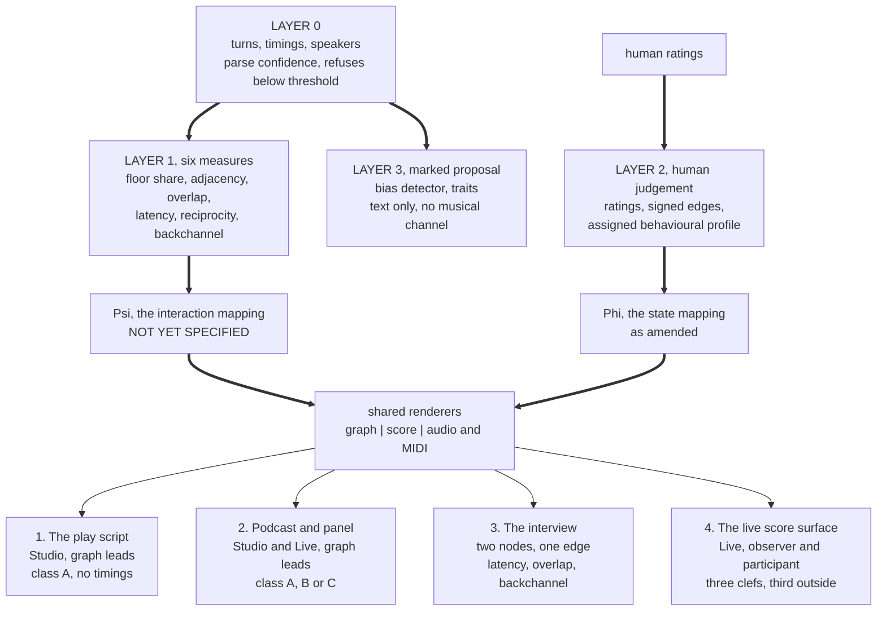

# Decomposing Dialogue: Four Use Cases for One Engine, and What Each Asks of the Interaction Mapping

**J. McKenney**

Paper 5 of the Musical Psychometric Notation series. MPN-S1 states the theory, MPN-S2 the formal apparatus, MPN-S3 the mapping from psychological state to musical material and MPN-S4 the reference implementation; this paper puts the engine to four dialogue use cases, and MPN-S6 is the companion on the expression surface.

Licence: CC BY 4.0. 15 September 2026.

## Executive Abstract

A play script, a recorded panel, an interview and a running screen are four different things to read, and the people who read them have four different questions. A dramaturg wants the relationship network of a whole work as an object they can hold. A podcast producer wants to know who actually held the floor against who seemed to. An interviewer wants to know how the asymmetry of the form is carried and where it slips. A viewer of a live surface wants to know whether an exchange has a shape a person can follow while it is running. This paper takes one engine, the Musical Psychometric Notation engine specified for this programme, and asks what each of those four readers gets from it, what the material costs them, which measures arrive and in which unit, what the output says and where the boundary of it runs, and what has to exist before the output can be produced at all.

The engine decomposes dialogue in four layers. Layer 0 recovers turns, timings and speakers from the material and reports how confident it is, refusing to render below a declared threshold. Layer 1 measures six observable properties of the exchange: floor share, speaker adjacency, overlap, latency, reciprocity and backchannel. Layer 2 is a human rating, where a person judges a state rather than a machine inferring one. Layer 3 is a marked machine proposal, carrying a bias detector that emits text beside the turn that prompted it. Two mappings sit above the layers. The state mapping $\Phi$ turns a rated state into musical material for one voice. The interaction mapping $\Psi$ turns the Layer 1 measures into musical material for the relation between voices. Three renderers share both mappings: a graph, a notated score, and audio.

The findings that matter most to a reader of dialogue are these, and each is a measurement rather than a proposal.

- **Two staves carry between a third and two thirds of a play.** Across three single plays scored for this programme, the two busiest voices carry between 39.0 and 69.2 per cent of the lines, and on one of the three the graph carries the majority of the speaking. Counted in turns instead the same three give 30.0, 40.4 and 64.6 per cent; counted in words, 42.3, 53.2 and 71.0. The unit moves the headline by up to nine points, and on *Hamlet* it moves the answer across the half way line.
- **The unit of floor share changes who the second voice is.** On *Hamlet*, counted by turns the two principal voices are Hamlet and Horatio; counted by words they are Hamlet and the King. The busiest single speaker is stable under both units on all three single plays, and the order below the top moves with the unit, with 17 of 18 substantial speakers changing rank on *Hamlet* and 17 of 22 on *Macbeth*.
- **A script has exact attribution and carries text rather than timings.** Four of the six Layer 1 measures arrive on script text, one of them in a changed unit and one in a changed window, and the two timing measures arrive with the generator's onsets and offsets. A single microphone recording has the complementary property: timings are exact and attribution carries a measured error, with published diarisation error at 19.8 per cent for the best streaming system and 39.1 and 39.2 per cent for the two vendors that bundle diarisation with transcription.
- **At two speakers half the measures go constant by construction.** Adjacency is alternation, reciprocity is 1, and floor share is one number and its complement. What varies is latency, overlap and backchannel, and the first two of those are exactly what a timed transcript supplies.
- **The exchange changes its principal pair slowly enough to render.** Dyad churn across six scored files runs from 8.8 to 44.1 per cent of turn changes, so a stave pinned to the active pair is a stave rather than a flicker. The busiest speaker sits in between 10.2 and 87.0 per cent of all active pairs, which is why choosing the pair is the reader's act and not the engine's.
- **The score is oversubscribed before it reaches the page.** Three staves want eighteen rendered parameters against an estimated budget of six to nine. Every surface in this paper therefore declares which two or three quantities each stave carries and puts the rest in the graph.
- **A score can grow.** A score carries several personas, added and removed as the material requires, and the per stave load flattens as the cast grows rather than diverging. The number of pairs grows quadratically, from one at two personas to ninety-one at fourteen, which is the one place where a larger cast is categorically and not merely proportionally harder.

The paper closes with the four constraints the use cases jointly place on the interaction mapping: it must be partial, defined at arbitrary speaker count, non-degenerate at two speakers or explicitly bounded away from them, and causal. Those four are forced rather than preferred. Each is forced by a measured property of one of the four use cases, and together they turn the open problem of writing an interaction mapping into a bounded one.

## Abstract

This paper sets out four use cases for a single dialogue decomposition engine and derives, from each, a constraint on the engine's interaction mapping, which the four constraints between them bound. The four are a play script read by a dramaturg or director, a podcast or panel read back by its producer, an interview read for its asymmetry, and a live score surface rendering an exchange as it runs. For each, the paper names the user and their question, the surface and renderer that serve it, the ingest class and what it costs in measurement, which of the six Layer 1 measures arrive and in what unit, what the output is, where the boundary of it runs, and what must exist first. Corpus figures are drawn from seven scored play files, 31,078 rows read and 27,653 retained, and cover two stave coverage under three floor share units, event densities across the three moving musical channels, dyad churn and principal voice share, and the capacity of the timbre channel as a function of cast size. The paper then states the current position on per person comparison and on multi persona scores, and collects the four obligations on the interaction mapping together with the single acceptance criterion that serves all four.

---

## 1. Introduction

### 1.1 What this paper is

The engine this paper draws on specifies one architecture, two mappings, four layers and four surfaces, and this paper says what four named readers do with them. For four named readers with four named questions it gives the surface that serves the question, the renderer that leads, what the material costs, which measures arrive and in which unit, what the output looks like, where its boundary runs, and what has to exist first.

This is a theory offered for review and improvement rather than a finished instrument, and the most useful thing a reader can do with it is say where it is wrong.

It is a use case paper and not a second design. Where this paper and the engine specification could be read as disagreeing, the specification governs, and where the specification's own text counts something in two different ways, this paper names the discrepancy rather than choosing silently.

The material throughout is script text and dialogue the programme generates for itself. Every corpus figure in this paper comes from published play texts and from generators whose output is inspectable.

### 1.2 The four readers and their four questions

The four use cases are the author's own, in the author's own framing.

**A play script decomposed into a relationship network** by a dramaturg or a director. The text is fixed, they know it well, and what they come for is the shape of the speaking as an object.

**A podcast or a panel read back** by the producer or the organiser who ran it. They were present, the material is somebody else's, and they arrive with an intuition they want confirmed or broken.

**An interview**, two parties, asymmetric by construction, read by the interviewer reviewing their own work or by a researcher reading a set of them.

**The running score**, which is the picture the author has drawn twice: a near real time transposition of dialogue on a screen, with three clefs and the third set outside, showing tension, and expressing primarily as music.

Two further readers of the same engine are peers of these four rather than extensions of them, and each has its own paper. Music therapy is the therapy instrument's. Communication and expression support, which asks whether an exchange can be made easier to read by rendering it as sound or image rather than inferring it from speech, is the companion paper on the expression aid. Neither is duplicated here.

### 1.3 Why the four are one paper and not four

They consume one engine. They share a state model, a renderer set, an explanation mechanism and a determinism guarantee, which is the whole of what this programme means when it says one engine. They share Layer 0 and its refusal to render below a parse confidence threshold, the Layer 1 measures and the declared settings that change their answers, the vocabulary the product uses to refuse a question, and the rule that every output carries a sentence in the reader's own language naming which mapping produced it.

Where they differ is in arity, ingest class, whether the material is known before a note is rendered, which renderer answers the question, and whether a human has rated anything. Section 7 sets out both halves, because the claim that the four are equal peers is a claim about the engine and not a claim that the four are the same job.

### 1.4 The interaction mapping, stated once

Three of the four use cases consume the interaction mapping $\Psi$, and writing it is the first item of work this paper leads to. It has a domain, the observed measures of Layer 1, and a codomain, musical material. It has constraints: it is a distinct function from the state mapping and is described as one throughout, it renders the shape of an exchange, and its claims are claims about the exchange. Those are constraints on a function, and the function itself is the work, and it is first in the engine's own implementation order for exactly that reason.

That is said here and it is not repeated as a hedge in each section. What each section does instead is the useful thing: it states what that use case needs the interaction mapping to be, so that four of the constraints on it are stated and forced rather than left to be discovered. The four are collected in section 7.3, and in advance they are that the mapping must be defined on a declared sub-domain and must render a measure the material withholds distinguishably from a measured zero; that it must be defined at arbitrary speaker count with the reduction to a pair taken before the mapping rather than inside it; that it must either be non-degenerate at two speakers or declare two speakers outside its domain; and that it must be causal and incremental, computable turn by turn against a declared window. Each of those four is forced by a measured fact about one of the four use cases, and together they narrow the problem from "write a mapping" to "write a mapping satisfying four constraints and validate it against a generator that knows the answer." They narrow the interface and leave the codomain open. What musical material carries what relational quantity stands untouched by all four, and it is the part that is genuinely open.

Two further things belong with that and are not deferred to a later section.

The first is that the mapping's claim to speak about the exchange alone is the largest claim in the design, and the listener test is what checks it. Its codomain is music, music is read affectively by construction, and the therapy instrument's own evidence puts the association of major with happy and minor with sad at 92 per cent in adults [5]. A producer whose panel renders harsh will read that as a verdict on the panel, and a minor key overrides a line of text saying otherwise. Listener testing of the mapping for exactly that unintended reading is a condition of the mapping reaching any surface at all, and what varies between the four use cases is the required result rather than whether the test is run [6].

The second is that working on synthetic material is what makes the mapping testable. A generator that decides a dialogue's relational structure before writing it, which is the first item of the engine's implementation order, is a ground truth, so the question "does the mapping recover the structure the generator put in" has an answer rather than a judgement [6]. Every acceptance criterion this paper asks for is an accuracy figure against that generator, and setting the target is ordinary work once the generator emits turn onsets and offsets, which four of the six Layer 1 measures require.

### 1.5 The six measures of Layer 1, and how they are counted

Layer 1 has six measures: **floor share**, **speaker adjacency**, **overlap**, **latency**, **reciprocity** and **backchannel**. They carry six settings between them, because adjacency has no decision to make and backchannel carries two.

Backchannel is the newest of the six and the current position on it is worth stating at the front, because it changes the arithmetic of every section below. A backchannel is a short supportive utterance made while somebody else holds the floor, and it is what separates the most supportive listener in a room from the most aggressive interrupter, two people a raw overlap detector scores identically. It is **measured lexically on script text**, where the words are exact and the speaker labels are given, and **derived from timings on recorded material**, where a detector is running anyway [24]. That single measure therefore has two definitions, and a count produced by one and a count produced by the other are two different quantities. The consequence is binding: the output declares which definition produced the number, in the same way and for the same reason that the floor share unit is a declared setting shown on every output. A reader comparing two numbers produced by two definitions is comparing the definitions.

The other consequence of the lexical definition is a caution this programme owes itself. A backchannel lexicon is a keyword counter, and a keyword counter is the object this programme's own application audit found being read as a measurement through three revisions of a paper [4]. A keyword counter now sits on script text, which is the primary material. That is defensible and it carries a cost, and it is labelled rather than assumed.

Four of the six measures are timing quantities. Adjacency comes from the turn order alone. Backchannel comes from the words on a script and from the timings on a recording. That distribution is what makes the four use cases fail in four different directions, and section 7.2 collects the pattern.

---
## 2. The play script

### 2.1 The user and the question

A dramaturg preparing a production, or a director deciding a cutting. The text is fixed and they know it well. What they do not have is the relationship network as an object they can hold: who is in contact with whom across the whole work rather than inside the scene they are staging, where the weight of the speaking sits, which pairings carry the play and which exist once, and what a proposed cut costs the network rather than the word count. The question arrives as "show me the shape of this text", and the honest restatement of it is "show me the shape of the speaking in this text", because that is what a script carries.

### 2.2 Surface and renderer

The **Studio** surface, and the **graph** leads.

One thing has to be said here because every later section leans on it. The graph is the primary renderer on Studio and on Live, and specifying it is item 12 of section 8: it takes a layout, a legibility budget, a declared quantity set and a coverage statement, and the design's own inventory of outstanding work gains it here [6]. The comparison study that puts the two renderers in front of real users schedules the comparison, and item 12 supplies the renderer it compares. Every place below where this paper sends a reader to the graph is a place that depends on that item.

The reason the graph leads is a claim about who the readers are: most named users of Studio and of Live are defined by something other than musical literacy, and the dramaturg and the director are two of the four readers that ruling is about [6]. The score and the audio are secondary here, and the design records that demotion as evidence against its own central thesis rather than as a user interface preference. The test that settles it is a study putting a dramaturg, a director, a producer and a discourse researcher in front of the graph and the score on the same material and asking which answered their question.

Studio ships first, and this use case is the reason. Its leading renderer needs no interaction mapping, no audio pipeline and no latency budget, and labelled script text is what the material already is.

### 2.3 Ingest class, and what it costs

**Class A, labelled text.** Play scripts sit in the same ingest class as generated dialogue, on the ground that the speaker labels are given, so the speaker attribution is exact [6]. Attribution is exact and free, and the diarisation error literature bears on the recorded classes rather than on this one.

**What it costs instead is timings.** A play script carries turn order and text. Four of the six measures arrive on it, floor share becomes a line or word count, and reciprocity's window becomes a turn count rather than a duration [6]. Class A is therefore the weaker experience, and the product is required to say so rather than let a reader discover it: a dramaturg who drops in the play they know best on day one meets a header of declared settings and finds a line count [6]. That sentence is written about this reader and it should not be softened here.

**A second cost is specific to the corpus this programme holds.** Three of the seven score files are anthologies, holding eight, five and three works, and their speaker sets are disjoint casts counted as one [4], [10]. Re-running the three clef generator reproduces the effect exactly: the Chekhov second series returns a top two share of 8.2 per cent over 82 speakers, which is a figure about the anthology rather than a coverage figure for any play in it [10]. The product's behaviour is to report the speaker set per contained work where a contents block is detectable, and to label an unsplit file as a file rather than as a work [6]. For this reader that is more than a technicality: a director who drops in a collected edition and is shown one network is being shown eight networks superimposed.

### 2.4 Which Layer 1 measures arrive

| Measure | On a script | Why |
|:---|:---|:---|
| Speaker adjacency | **Available, unchanged** | The one measure that runs on turn order alone [6] |
| Floor share | **Available in a changed unit** | Lines, words or turns, with seconds arriving alongside timings. The unit is a named setting, declared on every output [6] |
| Reciprocity | **Available with a changed window** | The window is a turn count rather than a duration [6] |
| Backchannel | **Available, lexically** | On class A the text is exact and the labels are given, so a backchannel is a lexical object and is available wherever a lexicon exists |
| Overlap | **Arrives with the generator's timings** | A script records the order of turns; simultaneity comes with onsets and offsets |
| Latency | **Arrives with the generator's timings** | A script records the order of turns; a gap comes with onsets and offsets |

So four of the six arrive: adjacency alone survives unchanged, floor share and reciprocity survive in changed units, backchannel survives under its lexical definition, and overlap and latency arrive with the timings the generator supplies. The output names the unit of each.

**The design counts this at three sites and two of the three agree.** The section that defines Layer 1 and the section that describes the Studio surface both count reciprocity over a turn count window as a different measure from reciprocity over a duration, and give one number; the section on what scripts cost counts it as the same measure, and gives one more [6]. Both readings are defensible, and the design's own rule settles the practical question without settling the count: a script analysis and a podcast analysis are two different measurements, and the product says so on the output rather than placing them side by side in one report [6]. This paper uses the second reading, because that is what its own tables and its own partiality obligation state, and it records that the design's restatement rule picks the first. Reconciling the two is item 2 of section 8 and it belongs to the design rather than to this paper.

**The supportive listener failure sits outside this class**, and that is the one mercy of it. The failure where a raw overlap detector scores the most supportive listener as the most aggressive interrupter needs overlaps to misread, and a script carries turn order [6]. What does arise is the lexical backchannel count itself, which is a keyword counter on the programme's primary material and is labelled as one.

### 2.5 What the output is

A graph of the full speaker set, with the play's speakers as nodes and adjacency as edges. Adjacency is rendered as sequence rather than as response, because a transcript marks the order of turns and an addressee is marked in the content; direction is retained in the data and the renderer's default is undirected, labelled "speaks next" [6]. Node weight is the floor share in the declared unit. Edge weight is adjacency count over the declared window.

Above it, a header carrying the mapping sentence in the reader's language, three parse confidence numbers, the ingest class, the six named settings, the resolution floor where the ingest class has one, and the window [6]. Two of those settings, the overlap threshold and the latency turn boundary rule with its medium field, govern measures section 2.4 has just shown arrive with the generator's timings; a third, the backchannel timing rule, stands aside on class A because the lexical definition governs there; and the resolution floor is defined against a deployed diariser's error rate, which makes it a property of the recorded classes. The header states a setting as inapplicable where the material makes it so, and states that the ingest class is floor-free where it is. That header is the page of declared settings a dramaturg meets on day one, and it is correct, and the answer to it is to tell the reader before the afternoon is spent.

**And where the two principal voices are chosen, a coverage figure, before the choice is made rather than after.** This is a sorting rule rather than a warning. The figures are measured, on the three of the seven score files that are single plays, and this paper re-ran them [10], [9], [19]:

| Work | Speakers | Two staves carry, by lines | By turns | By words |
|:---|---:|---:|---:|---:|
| A Doll's House | 14 | 69.2 | 64.6 | 71.0 |
| Hamlet | 44 | 50.1 | 40.4 | 53.2 |
| Macbeth | 49 | 39.0 | 30.0 | 42.3 |

**Counted in lines, two staves render between 39.0 and 69.2 per cent of a single play, and on one of the three less than half.** Counted in turns the same three plays give 30.0, 40.4 and 64.6 per cent, and counted in words 42.3, 53.2 and 71.0, so the unit moves the headline by up to nine points and moves *Hamlet* across the half way line [9], [10], [19]. Excluding the non-speaker token from the denominator gives 69.3, 50.8 and 40.0 on the line count, so the range and the one of three survive the convention [9].

**The unit does more than move a percentage. It changes who the second voice is.** The floor share unit generator measures the disagreement directly on the two units a script can compute, since seconds is unavailable [19]:

| Work | Top two by turns | Top two by words | Coverage, turns | Coverage, words | Speakers at 1 per cent or more | Changing rank between the units |
|:---|:---|:---|---:|---:|---:|---:|
| A Doll's House | Nora, Helmer | Nora, Helmer | 64.6 | 71.0 | 7 | 4 |
| Hamlet | Hamlet, **Horatio** | Hamlet, **the King** | 40.4 | 53.2 | 18 | 17 |
| Macbeth | Macbeth, Lady Macbeth | Macbeth, Lady Macbeth | 30.0 | 42.3 | 22 | 17 |

What that establishes is that the two computable units disagree, and that on one of the three single plays they disagree about **which speaker is second**, which is precisely the pair a two stave reduction renders. They disagree about how much of the work that pair covers by 6.4, 12.8 and 12.3 points.

The narrower claim is the half a reader will assume. On all three single plays the single busiest speaker is the same under both units. The disagreement is about the order below the top. Two files do change their top speaker, and both are anthologies: the Chekhov file, where Irina leads by turns and Lubov by words, and the Strindberg file, where Maurice leads by turns and Adolphe by words and falls from first to fourth. An anthology figure is a figure about the anthology, so both of those sit outside the claim above [10], [19].

Three limits travel with that table. Seconds is not computable on this material at all, and seconds is the unit most unlike the other two, since a speaker with few long turns and a speaker with many short ones are exactly the pair it separates, so every number above is a lower bound. A row in these files is a line rather than a turn, so the turn column merges consecutive rows carrying the same speaker, which is the nearest approximation the material allows. And none of the seven files is a moderated exchange, which is a standing limit on every corpus figure in this programme [10].

A director reducing *Macbeth* is told, while the choice is still open, that two staves will carry 39 per cent of it. A work whose coverage is low is sorted into the first of the four kinds of refusal the product uses, **your material**, whose stated action is real and immediate: use the graph, which carries the full speaker set whether or not the score does [6].

**What the graph carries beside the score.** An earlier revision of the design claimed that the third clef is the one place the other half of the material can go. That claim is deleted twice over: the corrected coverage range is 39 to 69 rather than 8 to 69, and the third stave renders the relation of the **selected** pair, so in *Macbeth* it adds the relation between the two busiest voices and the graph carries the other forty seven [6]. For this reader that is the decisive fact about which renderer to reach for, and it is why the graph leads.

### 2.6 Where the boundary of it runs

It renders a score once the interaction mapping is written, which is item 1 of section 8. It renders a state stave once the dramaturg rates a state, because the state mapping runs where a human has rated one, and that is Layer 2 work the dramaturg does [6].

**It tells the dramaturg who spoke next, and the addressee is a question for the text.** Adjacency is sequence rather than response, and the product says so, because every reader reads an arrow as a response [6].

**Two people who agree and two people in a polite deadlock render alike.** The interaction mapping is content blind and the two produce an identical Layer 1 signature; the engine renders them the same and states it as a known property [6].

**Coalitions are found at Layer 2, where a human signs the edges.** Structural balance needs signed edges and the six measures carry magnitudes; two characters who interrupt each other constantly may be allies [6]. This is the boundary a dramaturg will feel hardest, because coalition is most of what a relationship network is for. The route is stated and it is manual: structural balance is **permitted at Layer 2 where a human signs the edges**, and signing an edge is an ordinary analytic act for exactly this reader. It stays out of Layer 3, so the sign is the reader's.

**A character who leads and a character who refuses render alike, and the director supplies the reading.** The two produce the same floor share, the same turn lengths and the same latencies, and separating them takes something other than a monotone function of turn structure. That is a withdrawal rather than a gap to be closed later [6].

**The timbre channel gives distinct voices up to a computed cast ceiling.** The timbre capacity generator gives the inversion of the separation curve directly: at a perceptual resolution of 0.80 the channel holds fourteen characters, at 0.90 it holds ten, and the table runs to fourteen, which is where the curve was computed to [12]. *A Doll's House* at fourteen speakers is at the edge of the computed table; *Hamlet* at forty four and *Macbeth* at forty nine sit beyond it, and extending the curve is what supplies their figures. The perceptual resolution is fixed by the discrimination experiment, so the fourteen is conditional on it [6], [12]. Separately and independently, the timbre channel is built with four pieces: the contrast map the mapping paper specifies, an input path for a profile, a family selector richer than an argmax over the four behavioural coordinates, and a default other than the centre of the reachable set, which is the one point the channel maps to a single voice [3], [6], [21].

**It renders no bias in music.** The bias layer is a Layer 3 detector emitting marked text beside the Layer 0 turn, and it occupies no musical channel [8].

### 2.7 What the interaction mapping must supply here, and what must exist first

**The obligation this use case puts on the mapping is partiality.** Four of six inputs arrive on this material, one of them in a different unit and one under a different definition, and the remaining two arrive with the generator's timings. A mapping that requires all six is defined on timed material alone, which leaves every play script in the world outside it. So the mapping must be defined on a declared sub-domain, must state which sub-domain a given output used, and must render a measure the material withholds **distinguishably from a measured zero**. That last clause does real work. The general rule is that a flat score from a failed parse and a flat score from a flat conversation are rendered differently [6]. An overlap measure the script leaves unsupplied falls under that rule. The precedent for how such a rendering looks is the treatment of differences below the resolution floor on a mixed recording, which render as *unmeasured* and are visibly distinct from any rendering of an even exchange; it is a precedent for the look, and class A takes the look rather than the floor, a floor being a property of a diariser.

**What must exist first.**

The shared spine on labelled text is the whole of this use case's dependency for its leading renderer: Layer 0 from labelled text, the six Layer 1 measures with their settings, Layer 2's rating store, the graph renderer, the four kinds of refusal, and the credential hygiene rule. The Studio surface on labelled text is the surface. The coverage sorting rule is what puts the 39 per cent in front of the director while the choice is open rather than after it, and the coverage figure it shows is computed in whatever unit the floor share setting currently holds, because showing a figure in one unit at the point where a different unit is selected is the defect that rule exists to prevent. The rating store is what makes signed edges possible, which is the route to the coalition question. And the renderer comparison study is the test that decides whether the graph or the score answered this reader's question, which the design says decides its own central thesis and which no earlier revision had scheduled.

Every item on that list runs ahead of the interaction mapping. This is the one use case of the four that ships ahead of it.

---
## 3. The podcast and the panel

### 3.1 The user and the question

A producer or an organiser reading back an exchange that has already happened. Unlike the dramaturg they did not write the material and, unlike the dramaturg, they were present. The question is almost always comparative and almost always about the middle of the exchange rather than its ends: who actually held the floor against who seemed to, where the exchange turned, who came in over whom, whether the moderator moderated or participated, and which pairing on the panel was the one worth having. The producer arrives with an intuition and wants it confirmed or broken.

### 3.2 Surface and renderer

**Studio** for the analysis, and the **graph** leads, for the same reason as on the play script. The producer is the third of the four readers the renderer comparison study puts the two renderers in front of.

**Live is also available on this material, and that is a finding rather than a convenience.** The correct scoping of the running score is by **whether the material is known in advance** rather than by ingest class. A recorded exchange is known in full before a single note is rendered, so the score is computed ahead and played against the dialogue, which is what a film score is. A producer reviewing last week's panel is therefore in exactly the position the author's picture describes, and no latency argument reaches them. That is the least obvious thing in this section and it is worth the producer knowing: the running score is available on recorded material in principle, and what blocks it is the interaction mapping and nothing about the recording.

One rule travels with the precomputation and constrains what may be shown. **Every quantity rendered at a turn is a function of that turn and of the turns before it, and of those alone.** Whole work precomputation is a convenience of the implementation and not a licence to see forward, and a measure that genuinely needs the whole work, such as a normalisation over total speaking time, is labelled a whole work quantity and rendered as one [6]. A producer watching the score run past minute four must not be shown a floor share that already knows about minute forty.

### 3.3 Ingest class, and what it costs

This use case is the one where the class question decides everything, and the producer usually has a choice they do not know they are making.

**The labelled transcript with timings is class A and is the cheapest good path.** A producer who kept the edit decision list, or who has a per speaker labelled transcript carrying onsets and offsets, carries all six measures. The cost is a caveat rather than an error: the **medium must be recorded** on the latency setting, because edited podcasts remove pauses, video calls add jitter, and subtitle timings are a translator's artefact [6]. A latency distribution computed over an edited podcast is a measurement of the editor. That is a reason to label it rather than to suppress it, and timing measures are suppressed outright only where the timings are a subtitler's [6].

**The multitrack is class B, one channel per speaker, and speaker attribution is exact because attribution is the channel** [6]. This is Studio's first genuinely good experience. Two things must be said with it. Class B settles the attribution problem and leaves the recognition problem where it is: meeting benchmark word error of 35 to 46 per cent is a recognition figure and survives the move to one channel per speaker unchanged, because recognising the words is the same job on one channel as on four [6]. And class B is future work if real audio is ever used, which is said here rather than left to be discovered two sections away.

**The published podcast, one mixed file, is class C, and the panel is precisely the material class C is worst on.** The measured position is this, and the design states all four figures without a reference of its own [6]. Three of the four have since been traced to a single published streaming diarisation benchmark run on the DIHARD III corpus, which supplies the 19.8 figure, both vendor figures and the missed speech finding [23]. The fourth, the meeting benchmark word error range, is traced to no publication and is recorded here as unsourced [22].

The best published streaming diarisation error rate on DIHARD III is 19.8 per cent; the two vendors bundling diarisation with transcription are at 39.1 and 39.2 per cent, with a third real time system at 31.3; meeting benchmark word error runs from 35 to 46 per cent; and a 2025 benchmark scored with overlap included finds missed speech the dominant failure across all models, with unattributed speech at 7.71 per cent for the best system against 19.70 to 25.26 per cent for the others [6], [23]. At a fifth of speech mis-attributed, a true 60/40 floor share reads as an even one, which is the producer's most common question answered with a shrug.

Four consequences follow and all four are the product's stated behaviour rather than advice.

A **resolution floor** is declared, and differences below it are rendered as **unmeasured**, worded so that the reader knows the difference falls below what the recording resolves, and made visibly distinct from any rendering of an even exchange [6].

**The overlap derived measures are not computed at all on class C.** No live API returns per segment diarisation confidence, so a confidence gate has no input; and diarisation is worst exactly at overlap, where many pipelines assign an overlapped span to one speaker, which deletes an interruption rather than mis-scoring it [6]. Backchannel, whose recorded definition is timing derived and patterns with overlap, goes with them.

**The analysis opens by saying so**, ahead of the content rather than in a footnote, because interruption is the dynamic most readers of a single microphone recording are trying to read [6].

And **a multi-party class C surface waits on a better diariser**: a panel of five on one microphone is the material those error rates are measured on [6].

The producer's practical reading of that is short. If you have the multitrack, keep it. If you have only the mix of a panel, the surface waits on a per speaker capture: a multi-party class C surface waits on a better diariser, the answer is sorted as **your ingest class**, and the one action is that capture. On a two party mix the engine tells you about the floor at a stated resolution, and the interruption answer comes with a per speaker capture, which is the honest answer rather than a held-back feature.

### 3.4 Which Layer 1 measures arrive

| Measure | Class A with timings | Class B, multitrack | Class C, mixed, which carries no multi-party surface at all |
|:---|:---|:---|:---|
| Floor share | Available, in seconds | Available, synchronous from channel timings | Available only above the declared resolution floor |
| Speaker adjacency | Available | Available, synchronous | Available, degraded by attribution error |
| Overlap | Available, from the source | Available, from the source | **Not computed at all** [6] |
| Latency | Available, medium recorded | Available, synchronous | Degraded; the boundaries are the diariser's |
| Reciprocity | Available | Available, synchronous | Degraded by the same attribution error |
| Backchannel | Available, timing derived on recorded material | Available, timing derived, synchronous | Arrives with a per speaker capture; it patterns with overlap |

The class C column describes what a class C analysis of a two party exchange carries. At the three to eight speakers this use case is defined by, class C carries no multi-party surface at all, so the column has no instance on this use case's own arity [6].

**The split inside class B is sharper than a class boundary.** On a live capture a per speaker microphone carries a **synchronous interaction score**, because floor share, adjacency, latency, overlap, reciprocity and the timing derived backchannel are all computed from channel timings and need no words at all: the engine knows who started talking and when without knowing what was said [6]. What trails is anything requiring the words, which is every Layer 3 output, since a bias proposal is about what was said. A live surface may therefore run a synchronous interaction stave beside a trailing word dependent text column, and it says which is which on the face of the output [6].

**Backchannel matters more here than anywhere else in this paper.** A panel is full of supportive listening, and a raw overlap detector scores the most supportive listener as the most aggressive interrupter [6]. Backchannel as a measure in its own right is what separates the two, derived from timings on the producer's recorded material and from a declared lexicon on script text.

Two limits travel with the lexical definition, and both are about the word list rather than about the producer's competence. The list is right for the speech community it was built against, and a second community takes a second list, which is the design's own record: gap length and overlap tolerance vary by language **and by speech community**, so a fixed threshold will systematically score some communities as more interruptive than others [6], [19]. And a backchannel lexicon is a keyword counter, the object this programme's application audit found being read as a measurement through three revisions of a paper [4]. The lexicon is a declared and editable setting, which is an expert act, and the producer is one of the few readers in this series who can plausibly perform it; it is worth having, and it is worth having labelled.

### 3.5 What the output is

A graph of the full panel, which is what the graph carries beyond the selected pair and what the producer's question is mostly about. Node weight by floor share in seconds, edges by adjacency over the declared window, with the busiest speaker's position in the graph visible rather than inferred.

Beside it, the two measured quantities that bear directly on how a panel reads, both re-run for this paper [10]:

| Score file | Turn changes | Dyad churn | Distinct dyads | Busiest speaker's share of active pairs |
|:---|---:|---:|---:|---:|
| A Doll's House, single play | 1,281 | 9.4 per cent | 19 | 87.0 per cent |
| Miss Julie file, anthology of 5 | 2,010 | 8.8 per cent | 49 | 25.6 per cent |
| Oedipus file, anthology of 3 | 1,234 | 16.6 per cent | 41 | 62.4 per cent |
| Hamlet, single play | 1,100 | 30.7 per cent | 93 | 61.6 per cent |
| Macbeth, single play | 674 | 43.7 per cent | 137 | 42.7 per cent |
| Cherry Orchard file, anthology of 8 | 2,310 | 44.1 per cent | 253 | 10.2 per cent |

**Dyad churn runs from 8.8 to 44.1 per cent**, nowhere near the rate a flickering stave would need, so an active pair pinned to a third stave would be a stave rather than a flicker [10], [6].

**The busiest speaker sits in 10.2 to 87.0 per cent of all active pairs**, measured on six play files, three of them anthologies and none of them a moderated exchange. It is the number that justifies making the pair selection a reader's act, and the number this use case turns on is what a moderator does to the pair structure of a panel, which the generated moderated exchanges of item 3 supply. In an exchange with a dominant voice, an automatic active pair rule renders that voice against everyone else for most of the runtime and discards the clash the producer came for. That is why the reduction to an active pair is a **reader's act** and not an automatic one, and its justification is now a number rather than an argument [6], [10].

What the ruling leaves to be supplied is how the producer performs the act it protects. On a panel of five there are ten pairs and on six fifteen, and the ordering, the preview and the rule over them are item 15 of section 8, so today the producer selects, renders, looks and selects again. The quantity that would support the act is already computed and already drawn: adjacency count over the declared window is the edge weight of the graph above, and a pair whose weight the producer did not expect is the pair worth rendering. Turning that into a selection aid is item 15 of section 8, and it is left in outline here, because specifying a renderer is the design's work and item 12 supplies the graph's specification.

**And here is the limit that belongs to this use case above all the others.** These are seven Project Gutenberg score files and **all seven are dramatic texts rather than moderated exchanges** [6], [10]. Three of the six in the table are anthologies, and the extremes of both ranges sit on an anthology at one end and a two hander at the other. So the figure the panel producer most wants, what a moderator does to the pair structure of a panel, comes from a corpus of moderated exchanges. The range 10.2 to 87.0 corroborates the general shape of the argument for making the reduction a reader's act, and a claim about moderated panels rests on that second corpus. What supplies it is the synthetic dialogue generator whose relational structure is decided in advance, writing moderated exchanges with the moderator's role known, and that is item 3 of section 8.

The coverage figure appears where the two principal voices are selected, as in section 2, and on a panel of five or six it is the producer's decision rather than the engine's.

### 3.6 Where the boundary of it runs

**On a class C mix the interruption answer comes with a per speaker capture**, and the surface says so before it says anything else [6].

**Agreement and a polite deadlock render alike**, for the same reason as section 2.6.

**It tells the producer who spoke next, and the addressee is a question for the content.** On a panel this boundary bites harder than on a script, because an addressee is most of what a panel exchange means, and adjacency is what the transcript carries.

**It can rank the panellists by name, and that ranking is permitted and untested.** Per person measures are carried in full, including a named comparison on a shared display and on a stave. The restriction two earlier revisions placed on them rested on a premise about real people in a real room that the working material removes. What has to travel with the permission is that the listener test covering the affective reading of the interaction mapping is scoped to that reading, and **a named per person comparison takes a test of its own**, which is a separate question. So a named comparison is permitted, it awaits that test, and it is labelled as untested on the face of the output. Extending the listener test to cover it is a test to run rather than a choice to make, and it is one of the open questions of section 9. Section 6 sets out what the permission means for a score that carries more than two people.

**A bias reaches this surface as text.** On this use case that is the most conspicuous outstanding item in the whole design, because a producer reading a panel is closer than any other reader in this paper to the author's original ask, which was to express biases and psychometric traits. What the surface carries today is the Layer 3 detector: a marked textual proposal beside the Layer 0 turn that prompted it, rendered with that turn and alongside the rest of the output [6], [8].

The bias atlas distributes across four domains as Perception 8, Decision 10, Social 6 and Memory 6 [3], [15]. Running the bias layer generator gives the shape of what the detector would cover: thirty of thirty entries now name a state coordinate with the draft coordinate table loaded, of which three rows are flagged as genuinely undecided and are the author's; eighteen distinct signatures, eight of them carrying more than one bias and twenty of thirty entries involved in a collision; and **twenty two of the thirty detectable within a single frame against eight needing material heard earlier** [11], [9], [16]. The eight are survivorship, the gambler's fallacy, groupthink, the peak end rule, choice supportive bias, outcome bias, recency and the planning fallacy [11]. Under the provisional remap of the one entry written to set the mode, the partition becomes twenty one and nine, and both figures are reported because the remap is provisional [6], [17]. For a panel that partition is directly useful: groupthink is one of the eight, so a detector fires on it only against material it has already heard, and the unit of test for it is a pair of passages rather than a turn.

**What a moderator does comes from the generated moderated exchanges**, for the corpus reason above.

### 3.7 What the interaction mapping must supply here, and what must exist first

**The obligation this use case puts on the mapping is arity.** A panel is several people. The mapping must be defined at arbitrary speaker count, and the reduction to a pair must happen **before** the mapping rather than inside it, because the reduction is a reader's act and a mapping that reduces internally has taken that act away from the reader [6]. Two clauses follow. Every whole exchange normaliser the mapping uses, total speaking time above all, is a whole work quantity and is labelled as one rather than rendered as a running value [6]. And the mapping must accept a declared resolution floor as a parameter, so that a class C analysis renders *unmeasured* through the mapping rather than around it.

**What must exist first.** Specifying the interaction mapping and validating it against the generator unblocks everything musical here [6]. The shared spine and the Studio surface carry the graph. Live capture, class B first and then class C with its resolution floor and suppressed overlap measures, is future work if real audio is ever used, and it is sequenced by measured error. The coverage sorting rule puts the coverage figure at the point of selection. Listener testing gates the mapping on this surface as on every other, and this is the surface where the required result is most demanding, because the producer will read a harsh rendering as a verdict on a panel they convened. And generated moderated dialogue is what would let the programme say anything about moderators at all.

---
## 4. The interview

### 4.1 The user and the question

Two parties, asymmetric by construction: one asks and one answers, and the asymmetry is the form rather than an accident of the occasion. The reader may be the interviewer reviewing their own work, a researcher reading a set of interviews, or the author of the piece. The question is about the asymmetry: how is it carried, how far does it go, where does it slip, and what does it look like when the answering party takes the floor back.

This is the case closest to the two node therapy instrument, and it is worth the comparison, which is section 4.6.

### 4.2 Surface and renderer

**Studio** retrospectively, and **Live** where the material is known in advance, which on a recorded or generated interview it is. The graph leads on both, as it does everywhere in this paper; what this section adds is a prediction about the study already scheduled against that ruling rather than an exception to it.

The prediction is this. The ground for the graph leading is a claim about readers: most named users of Studio and Live are defined by something other than musical literacy, so the graph answers their question in the terms they bring [6]. At two speakers a second and independent fact sits beside that ground, which is that **a two node graph carries one edge**. The renderer that leads everywhere else in this paper has one node pair and one line to draw, and the quantities the reader came for, latency, overlap and backchannel, are properties of that single edge over time rather than of the network's shape. Meanwhile two speakers is exactly the size the three clef layout is built for: two state staves and one interaction stave, with no selection problem at all. So the interview is where the demotion of the score is least likely to be borne out, and the renderer comparison study is where that is settled rather than argued. As written, that study names a dramaturg, a director, a producer and a discourse researcher, and item 7 of section 8 extends it to a reader of interviews.

### 4.3 Ingest class, and what it costs

The same three classes are available and the ranking between them is steeper here than anywhere else in the paper, for a reason section 4.4 makes exact: at two speakers almost all of the Layer 1 content is in the timings, so a class that loses the timings loses almost everything.

A scripted or transcribed interview without timings is class A and is free of attribution error. A recorded interview with two microphones is class B, near exact attribution, future work if real audio is ever used [6]. A recorded interview on one microphone is class C. It would be natural to assume that two speakers are the easy case for a diariser and that class C is therefore tolerable here, and this paper measures rather than assumes: **the evidence base reports corpus-level rates measured on multi-party material**, and a figure broken down by speaker count is what would license a narrower claim for two speakers than for five [6], [23]. The class C rules therefore apply here unchanged, and the one that bites is that overlap on class C comes with a per speaker capture, and overlap is one of the three informative measures this use case has.

### 4.4 Which Layer 1 measures arrive, and the degeneracy that governs this section

**At two speakers, three of the six Layer 1 measures carry no information, by construction and not by accident.** Adjacency is deterministic, reciprocity is 1 by construction, and floor share is one number and its complement; latency, overlap and backchannel still carry information [6].

| Measure | At two speakers | Why |
|:---|:---|:---|
| Speaker adjacency | **No information** | The only possible sequence is alternation. The single edge is known before the material is read |
| Reciprocity | **No information** | It is 1 by construction |
| Floor share | **One degree of freedom** | One number and its complement, so it is a scalar rather than a distribution |
| Latency | **Informative** | The gap before taking the floor is the interview's own material |
| Overlap | **Informative** | Who comes in over whom is where the asymmetry breaks |
| Backchannel | **Informative** | Backchannel given and received carry distinct values at two speakers. They are two numbers about two people and neither determines the other |

**Backchannel is what keeps this use case from being empty, and that is worth saying plainly.** Without backchannel, the two speaker case has two informative quantities and both of them are timing quantities, so a timed transcript is what supplies them. With backchannel counted as a measure in its own right the picture changes, because backchannel is lexical on script text. Compose that with section 2.3 and the result is the sharpest arithmetic in this paper:

**A scripted interview, or an untimed transcript of one, yields one scalar and a lexical backchannel count.** Adjacency is alternation and reciprocity is 1, both constant; floor share survives as one degree of freedom in a changed unit, a line or word count and its complement; latency and overlap, the two measures that carry the asymmetry directly, arrive with timings; and backchannel survives lexically, which is a count of short supportive utterances per party against a declared list. That is a Layer 1 with content, where before backchannel was named a measure it would have been empty. It is still a thin one, and the refusal vocabulary sorts a thin Layer 1 into **your material** with a real action attached: bring timings, or accept that the reading rests on Layer 2 and Layer 3 rather than on Layer 1 [6].

The consequence for the class ranking is exact. A generated interview carrying the generator's own onsets and offsets, which is what the generator must emit, carries three informative measures. Class B carries the same three. Class C carries at most two, latency and floor share above the floor, and the latency degraded because its turn boundaries are the diariser's; overlap waits on a per speaker capture and backchannel goes with it. And class A without timings carries a scalar and a keyword count.

### 4.5 What the output is

Two state staves and one interaction stave, with the arity settling the selection problem. Coverage, which decides so much of sections 2 and 3, is **100 per cent by construction** here: the top two speakers are all the speakers, so the coverage figure is trivially complete and the per stave question shrinks from *which voices* to *which quantities* [6]. That shrinkage is worth stating positively, because it means the interview is the one use case in this paper where the three clef layout renders the whole of the material rather than a measured fraction of it.

On the state staves, a state a person rated, with the sentence saying so on the face of the output [6]. That rating comes from an instrument this programme builds. The state mapping runs where a human has rated a state; the rating apparatus this programme owns belongs to the therapy instrument and stays there; and a rating instrument for a reader of interviews takes gradient definitions written for a non-clinical rater, anchors, a scale and a worked example, all of them producing the nine component state. That is item 13 of section 8, and on this use case it is a larger piece of work than the interaction mapping is.

On the interaction stave, the relation, which is where the asymmetry would land. Everything above this line waits on a Layer 2 rating; the interaction stave waits on the interaction mapping as well.

**And the timbre channel is at its maximum here, exactly.** The timbre capacity generator gives the reachable set as a rhombic dodecahedron of diameter 2, and the two character maximum separation as **2.000000, the full diameter**, attained by any pair of profiles differing by minus one, minus one, plus one, plus one on the four behavioural coordinates; the profiles (1, 1, 0, 0) and (0, 0, 1, 1) are the most audibly separated pair there is [12]. The inversion table makes the consequence plain: the channel holds two characters at every perceptual resolution up to 2.0, where it holds six only at a resolution at or below the square root of two, 1.4142 [12]. **So the interview is the only cast size in this paper immune to the perceptual resolution whatever it measures**, because any resolution finer than the diameter of the whole space suffices for two. That is an exact result and it is the strongest positive thing this paper can say about the timbre channel on any use case.

Two qualifications travel with it and neither is small. The channel **goes live with four pieces** for every surface: the contrast map written into the code, an input path for a profile, a family selector richer than an argmax, and a default other than the centre of the reachable set, which is the one point the channel maps to a single voice [6], [3], [21]. And the assignment rule binds throughout: give two characters profiles that differ in shape rather than by a constant, because the null direction of the map is overall profile magnitude and a pair differing only in magnitude renders identically however far apart their behavioural scores look on paper [12], [3].

Beside the staves, the bias layer's marked text against the Layer 0 turn, with the twenty two frame local entries scorable per turn and the eight historical ones scorable only as passage pairs [11].

### 4.6 The comparison with the two node instrument, which is why this case is here

The interview and a therapy session have the same arity and share an engine, and they are two different jobs. The therapy instrument is a peer of the engine at two speakers rather than the engine itself. It shares the renderers, the state model and the explanation mechanism, and **it rests on Layer 2 where the interview rests on Layer 1** [6]. That is the whole of the difference and it is instructive in both directions.

Reading it toward the instrument: three of the six Layer 1 measures are degenerate at two speakers, which is why a therapy surface can afford to ignore Layer 1 and rest on Layer 2. Reading it toward the interview: the three measures that vary, latency, overlap and backchannel, are exactly the ones the instrument leaves aside and the ones a per speaker capture supplies.

**One piece of structure genuinely crosses between them and it is infrastructural rather than semantic.** Bruscia's Autonomy gradient is defined over the relationship between improvisers, so it is naturally recorded as a directed edge, and a rating instrument shaped that way serves a two node session and an N node panel without redesign [6], [20]. That is a fact about the rating surface. It is a fact about the rating surface rather than a shared semantics between a human rating and a derived quantity, because the derivation is withdrawn: deriving Autonomy from turn structure was withdrawn when Leader and Resister proved inseparable by any monotone function of timings [6]. A rater signs the edge and rates the gradient, and the engine renders both.

**And the withdrawal lands on this use case harder than on any other, because the interview's central question is the withdrawn one.** Whether an interviewee is leading or refusing, whether an interviewer is guiding or dominating, is precisely the Leader against Resister distinction, and it is a Layer 2 question by ruling rather than by present limitation. What the mapping that survives does give is worth having, and the reason it survives the withdrawal that killed its sibling is that the human rated table runs non-monotonically: it takes a path from Imaginary toward Symbolic and then steps off it to send Resister to the Real, so it separates precisely the two gradients the derivation could not, by sending them to different vertices rather than to different points on a line [6]. Partner takes the barycentre and gets no dead band, and must not have one, because a dead band would hold whatever register the preceding gradient selected: an interviewee moving from Resister to Partner would sound Real, and one moving from Dependent to Partner would sound Imaginary, and the same state would sound like two different things depending on where it came from [6].

### 4.7 What the interaction mapping must supply here, and what must exist first

**The obligation this use case puts on the mapping is that it must not be degenerate at two.** A mapping that is a symmetric function of all six Layer 1 measures returns a constant on every interview in the world, because three of its six arguments are constants at that arity. There are exactly two admissible answers and choosing between them is a bounded job. Either **the mapping at two speakers is a declared function of latency, overlap and backchannel alone**, with the other three measures documented as carrying no information at that size and the output saying so; or **the mapping declares two speakers outside its domain** and the interview is served by the state mapping, Layer 2 and Layer 3 with no interaction stave, which is a coherent product and is close to what the therapy instrument already is. What is inadmissible is a mapping that renders a constant and lets the reader take it for a finding, which is the general rule against a flat score from a degenerate input looking like a flat score from a flat exchange [6]. That is item 5 of section 8.

**What must exist first.** The generator, **with turn onsets and offsets**, because with them this use case gains its three varying measures and the validation exercise gains something to check [6]. The **rating store**, because the interview's central question is a Layer 2 question by ruling and the rating is the answer rather than a supplement to one, and with it the rating instrument for a non-clinical rater that item 13 builds. The interaction mapping, under the non-degeneracy obligation above. The Layer 3 detector with its coordinate table and its remap settled first, because a device carries a coordinate in order to be planted in generated material, and a device written off the mode is one the claim it was meant to test can be scored against [6], [11]. And a golden output regression suite over the state mapping path, running in continuous integration against both the pinned build and the head of the tree, because this use case renders two state staves on an engine the therapy instrument pins, and this programme's demonstrated behaviour under divergence is to fork [6], [4].

Two further unfixed numbers belong in this use case's dependency list and are named rather than left implicit: the interpolation margin in the mode channel, which blocks that channel and through it every state stave, and the function inside the harmonic parameter that the author names [3], [8], [17]. Both sit outside the implementation order, both are recorded as owed, and both stay open. So are the settings that decide this use case's surviving measures: the latency turn boundary rule and its medium field, the overlap threshold, and the backchannel lexicon and timing rule. None has a value in any document, and here they govern all three surviving measures rather than one of four. That is item 20 of section 8.

---
## 5. The live score surface

### 5.1 The user and the question

The author's own picture, and the reader is anybody watching an exchange run: a near real time transposition of dialogue on a screen, with the score there instead of the words, three clefs and the third outside, showing tension, and expressing primarily as music. The question is experiential and stays that way: **can I read the shape of this while it is happening.** The reader is asking whether the exchange has a shape a person can follow in the moment, rather than asking for a number.

**Both modes are built.** The observer mode renders to an analyst; the participant mode renders the same surface, while the exchange is running, to the exchange's own participants. Both are in from day one, and the restrictions two earlier revisions placed on the participant mode rested on a premise about real people in a real room that generated material removes [6].

The same sentence is why the participant mode has no human reader yet. On generated material the participants are generated, so participant mode is specified, built and gated on the interaction mapping alone, and its reader within scope is the generator itself under the display conditioning experiment of section 5.6. Its human reader arrives with a live capture, which is future work if real audio is ever used.

### 5.2 Surface and renderer

**Live**, and the **graph** leads here too. This paper states that squarely rather than stepping over it, because it is the one place where the design's own ruling sits at an angle to the author's picture: the picture is a score, and the renderer ruling puts the graph first on the surface the picture describes. The design records this in the same terms. It records the demotion as **evidence against the thesis of its own opening section, not as a user interface decision**, and the renderer comparison study is the test that settles it [6]. The honest position for this paper is that the score is what this use case is for, the graph is what the design currently leads with, and the question of which is right is scheduled rather than argued.

**No class is described as captioning, and the picture survives the word going.** A score computed ahead and played against known material is a **synchronisation** problem whatever the reader experiences, and the framing is delivered by the synchronisation rather than by the word [6]. The surface describes itself as a running score rendered against the dialogue.

### 5.3 Ingest class, and what it costs

**The partition that matters is whether the material is known in advance, not the ingest class.** Generated material and recorded material are known in full before a note renders, so the score is computed ahead and played against the dialogue. That removes the latency objection to the author's picture on exactly the material this programme works with, and the picture then waits on two things: the interaction mapping, which item 1 writes, and on the two state staves a Layer 2 rating, which the rating instrument of item 13 makes possible.

On a live capture the split runs inside the class rather than between classes. A per speaker microphone, class B, carries a **synchronous interaction score** from channel timings, because the six Layer 1 measures need no words on recorded material; what trails is everything needing the words, which is every Layer 3 output [6]. So the surface may run a synchronous interaction stave beside a trailing word dependent text column and says which is which on its face. Class C carries a resolution floor, leaves the overlap derived measures uncomputed, opens by stating which measures it resolves, and takes its multi-party form with a better diariser [6]. Both live classes are future work if real audio is ever used.

The causal rule binds the precomputation, as in section 3.2: everything rendered at a turn is a function of that turn and of turns before it, and a whole work quantity is labelled as one.

### 5.4 Which Layer 1 measures arrive, and what the surface shows by default

On material known in advance and carrying the generator's own onsets and offsets, all six. On a class B live capture, all six synchronously. On class C, floor share above the floor, degraded adjacency and reciprocity, degraded latency, and no overlap and therefore no backchannel.

**The default the surface renders where the reader leaves the choice alone is stated, and this is where those availabilities bite.** The default is **dynamics and tempo on each state stave**, and **floor share and adjacency on the interaction stave**, within a one screen budget [6]. A reader who leaves the configuration untouched gets a defensible score rather than an empty one, the default is preselected, every alternative states what it displaces rather than being offered as a free addition, and the selection is reversible without re-ingest so the cost of choosing wrongly is a click [6].

Three things about that default are unsettled, and they are stated here rather than presented as settled.

**The state stave pair is justified by which channels were measured rather than by legibility.** Dynamics and tempo are the two channels whose event densities section 5.5 reports, which is a statement about what the programme measured rather than about what a reader can hold. The measurement cuts against half of it: the dynamic marking changes on one row in twenty two while metre, which the pair displaces, changes on one in four. Whether a near frozen line is the right default because its excursions are rare, or the wrong one because a reader loses track of a line that holds still, is settled by item 16 of section 8.

**The interaction stave pair is degenerate at two speakers, which is the arity of this surface's two principal voices.** Floor share and adjacency are the two Layer 1 measures that run on turn order alone, and they are therefore the two that survive the largest number of ingest classes in some form. They blank in one place: on class C a below floor floor share renders as unmeasured and adjacency is degraded by attribution error. And at two speakers adjacency is deterministic and floor share is one number and its complement, so a reader who leaves the configuration untouched is shown one degree of freedom and one constant, while latency and backchannel, the two measures that vary at that size, sit outside the default. Re-deriving the default at two speakers is item 19 of section 8, and latency plus floor share is the obvious candidate with adjacency reserved for arity above two.

**The reversibility argument is about one person at one screen, and this surface has several readers.** In participant mode the chooser configures and the participants read, and a reader who did not choose is shown the two or three declared quantities, the twelve to fifteen that were displaced being named on the configuration screen the chooser saw. And the click carries a cost mid-session: changing which quantities a stave carries while a reader is tracking it rewrites what they have been tracking, which is the same object as the mid-session speaker relabel the design refuses, and for the same stated reason. Item 17 of section 8 resolves it.

### 5.5 What the output is, and what has been measured about whether it can be read

Three staves. Two for the two principal voices, each rendering that voice's state through the state mapping. A third, set apart, rendering the relation through the interaction mapping: the author's third outside, and where the tension lands, tension being a property of the exchange rather than of either speaker [6].

**The bias reaches this surface as text.** The layer renders as text in version one and leaves the musical channels to the state mapping, with a stated reopening condition rather than a permanence clause [8], [6]. Running the bias layer generator prints the census that made that decision forced rather than cautious: every one of the eight channels the thirty devices were written for is a channel the state mapping already sets, being TEXTURE 8, HARMONY 7, MELODY 6, RHYTHM 3, DYNAMICS 3, TIMBRE 1, MODE 1 and INTERVALS 1, totalling thirty, and the state mapping maps the state onto the whole musical surface, so a bias rendered in music would necessarily have been a second writer to an occupied channel [11], [6]. The cost is recorded rather than softened: this defers for a second time a capability the author asked for twice, it removes half of the framing sentence this section began with, and the layer meant to be the most musical thing in the design is the one thing on Live that arrives as text [6], [8]. What the surface carries instead is the detector's marked text beside the Layer 0 turn, and the detection rate is the condition on which the channel question reopens.

**Event density, which is what a reader is asked to track.** Under the normative laws of the state mapping, over the 27,653 rows retained after the *King Lear* file is excluded, the dynamic marking changes on **4.5 per cent** of rows, the tempo band on **33.9 per cent** and the metre on **26.6 per cent** [9], [10]. This paper re-ran the three clef generator and reproduces 4.4952, 33.8963 and 26.6491 per cent [10]. The exclusion is the design's own rule applied to its own evidence: the *King Lear* file carries 3,425 rows of which 3,424 are assigned to the non-speaker token, so it is a file the product this design specifies would refuse, and **31,078 rows are read, 3,425 excluded and 27,653 retained** [10], [4].

Read those rates with the levels beside them. Dynamics reaches all eight markings and changes on one row in twenty two. The tempo band reaches three bands, which is **two cuts and not three**, slow on 19,568 rows, middle on 7,517 and fast on 568. Metre reaches **four of its five labels, common time being the fifth**: the second label on 23,086 rows, the third on 3,229, the fourth on 1,182, the fifth on 156 and the first on none, because no row carries entropy below the floor, so the four labels reached exclude the ordered end of the scale, and a reader of this channel sees the four labels the generator emits [9], [13]. So the picture a reader gets is one near frozen line and two lines changing on a quarter to a third of rows.

**Two things must be said about those figures before anybody designs to them.**

The first is provenance. All three are properties of one generator's output distribution rather than of the mapping's laws. The columns came from the Conductor engine, which implements no psychology on the path that produced them: trauma is a row position ramp plus keyword hits, and entropy is a punctuation tally [4], [6]. The entropy column takes fourteen distinct values over the corpus and is exactly 0.3 on 22,611 rows, 72.8 per cent, and 9,482 of the 10,020 tempo band changes have 0.3 on one side, 94.6 per cent [9], [10]. A channel sitting at one value for nearly three quarters of its rows is a constant with spikes, and these figures measure how often that generator's spikes cross a cut.

The second is the explanation, and this paper states the corrected version because the obvious one is deleted. **It is true in the theory that trauma ratchets and entropy moves freely**: the theory's definition makes trauma monotone increasing, so any musical parameter monotone in trauma rises across an act, while entropy is free in both directions [1], [3]. **That asymmetry explains something other than the measured spread between the channels on this corpus, and the sentence claiming otherwise is deleted rather than hedged, because the corpus refutes it directly.** On this corpus the dynamic marking **falls on 597 of 27,416 within speaker steps** against **827 rises**, and the raw column beneath it falls on **822** of the same steps [9], [13]. A quantity that falls on 822 of 27,416 steps is free in both directions. The column is a row position ramp with keyword bumps rather than the theory's trauma, and the application audit records the two as coinciding while each stands on its own [4]. So the design keeps the theory's asymmetry and keeps the measurement, and holds the two apart: this corpus is illustration for the mechanism, and the mechanism is a claim about the theory's trauma. What survives, and it is enough for the legibility argument, is the measurement itself: on this generator's output one stave barely moves and two change on a quarter to a third of rows, which is a fact about what a reader would be asked to track.

**What follows for damping is a specification problem rather than a tuning note.** Damping a channel that sits at its floor for three quarters of the corpus and makes brief excursions removes the excursions, which are its only content [6]. So a live rendering **states what the damping is meant to preserve before it names a constant**. If what is preserved is the reader's ability to track a line, the quantity to damp is the redraw rate rather than the parameter, and a hold and release on the notated value is a different mechanism from a smoothing of the input; if what is preserved is the excursion, no damping of the input is admissible and the surface marks the excursion instead. That constant is one of the numbers the design leaves unfixed.

**How often the third stave's referent changes, which is not how often it redraws.** The dyad churn table of section 3.5 is the same measurement and the same run: churn from 8.8 to 44.1 per cent, so the active pair survives and a third stave pinned to it would be a stave rather than a flicker, and on the two handers it changes on under a tenth of turns [10]. The busiest speaker's 10.2 to 87.0 per cent of active pairs is why the reduction is a reader's act, and the standing corpus limit applies here as it does there: none of the seven files is a moderated exchange [10], [6]. That is the rate at which the pair changes and not the rate at which the stave's contents change, which with a pinned pair move on every turn. The equivalent of the event density measurement follows the interaction mapping, so the third stave takes its legibility budget from that measurement, and the damping question is answered for it once the mapping is written.

**The information budget, which is the constraint on the whole surface.** The theory's own estimate puts the independent state quantities a single stave can carry at two to three, and calls that an estimate rather than a measured figure, so three staves carry six to nine [1], [14]. Against that:

As **rendered parameters** the total is **eighteen**: six per state stave, being mode, dynamics, tempo, metre, texture and timbre, and the six Layer 1 measures on the interaction stave [10], [6]. The three clef generator prints exactly that eighteen, and re-running it for this paper reproduces it.

In the **estimate's own unit**, which counts independent state quantities rather than rendered parameters, the collapses are these: dynamics is a function of trauma alone; tempo and metre are both functions of entropy alone, so those two rendered parameters carry one quantity between them; texture is a function of trauma and entropy jointly and introduces no third; mode is a function of the register triple; and timbre is a function of the assigned profile, which is fixed rather than moving and which the estimate accounts separately as set once per character [3], [6]. Which mode the register triple selects is settled by the listening pack of MPN-S3: four incompatible tables sit in the corpus, two of them inversions of each other, and the choice among them is under test, so what a state stave's mode carries on any surface here is conditional on the result that pack returns [3]. So each state stave carries **three moving state quantities** with the profile beside them, giving **six across two staves against a budget of four to six**, and the interaction stave wants **six interaction quantities against a budget of two to three**.

**The oversubscription survives the recount on either unit, and that is the point.** Eighteen against six to nine as rendered parameters; at or just above the ceiling on the state staves and two to three times the ceiling on the interaction stave in the estimate's own unit. **The surface must choose on either count**, so the rule requiring it to choose depends on the total exceeding the budget and not on the total's value [6]. Each stave therefore carries a declared two or three quantities, chosen before the session and shown on the output, and the rest are in the graph.

And that gives the estimate a place where it bites, since the difference between two and three quantities per stave is the difference between showing the relation and not showing it. **Settling it is now worth the study it has come to justify**, and it is the same kind of study as the timbre discrimination experiment. The design's own record of why is uncomfortable and is carried here rather than dropped: the estimate survived its last gate because the mechanism that would have falsified it was struck, so the last revision left it an estimate carrying more weight than before, and the study is what turns it into a measurement [6].

**What the cast size costs in timbre, if the audio renderer is used.** The two principal voices are two characters, so on the staves the separation is the full diameter of 2.0 [12]. If the surface gives distinct timbres to a larger cast in the audio renderer, the curve binds: the maximum of the minimum separation is **flat at the square root of two, 1.414214, from three characters to six, and strictly lower at seven**, where it is 1.089845. That is established by an exhaustive search over the sixteen corners of the behavioural cube, which needs no seed, and confirmed by a converged continuous search at 600 polished starts identical across three seeds [12], [9]. The curve has exactly one sharp kink and it is between six and seven.

What may be claimed is that **six is the largest cast that costs exactly what a five character cast costs, conditional on the perceptual resolution lying at or below the square root of two**, and the conditional does real work: six is the answer only for a resolution in the window **(1.0898, 1.4142]**, a width of 0.3244 in a space of diameter 2, and outside it the answer changes rather than degrades, holding three at a resolution of 1.45 and two at 1.6 [12], [9]. The figure at a resolution of exactly 1.0 is left out, because the continuous search and the exhaustive corner search disagree there at the sixteenth decimal place and the answer at that one cell is an artefact of which table is read. The window narrows with every improvement rather than widening, because its lower edge is the seven character value and that value has risen under every harder search so far. The resolution is fixed by the discrimination experiment [6].

### 5.6 Where the boundary of it runs

**It is a running score rendered against the dialogue**, and the design holds it to that description [6].

**It renders no bias, anywhere, in version one** [8].

**It shows two or three quantities per stave**, on either count of the information budget, and it asks the reader once which they are [6].

**On a live capture it blanks rather than freezing.** On material known in advance the stave is synchronous and every quantity is in hand, so the staleness horizon has no instance there. On a live capture, participant mode is a delayed feedback loop, and a frozen picture of a conversation that has already ended is worse than a blank one, so after a declared staleness horizon the display blanks and says it is stale [6]. It refuses below the parse confidence threshold. It marks a discontinuity rather than restating prior measures when the speaker set changes mid-session, and it rejects a mid-session speaker relabelling in session, because a relabel silently rewrites floor share for the whole elapsed window; the refusal names post-session re-derivation as where relabelling belongs [6]. Those are three instances of one technical rule, which is that a stale or unsound reading must not be indistinguishable from a sound one. A fourth instance is owed and item 17 supplies it: a mid-session change of the declared quantity set rewrites what a reader has been tracking exactly as a relabel rewrites floor share, so either it is refused in session as a relabel is, or the surface marks the seam as it marks a speaker set discontinuity. Neither is specified.

**Three staves may read as three voices, and a reader who can read music will read the third stave's pitch as pitch, because a stave is a pitch space.** The ontology of relations leaves the choice of notation, and this layout is a proposal with three measured constraints on it rather than a claim [6]. That is the most important caveat in this section and it should reach the author rather than sit in a design document, because the layout is the author's picture and the risk is in the picture rather than in the implementation of it.

**The observer effect on the participant mode is not measurable by the experiment that was written for it.** A fixed transcript through a deterministic engine run twice is bit identical, so the measured difference is zero for reasons independent of whether an observer effect exists [6], [7]. What replaces it is **display conditioning of a generator**: condition the generator on the display, so it writes the next turn with the rendered score available to it as context, and compare against a seed matched paired run without it, over many pairs rather than one dialogue. The name says what it measures, which is display conditioning of a generator and not an observer effect on people, and it is only available because the material is synthetic [6].

### 5.7 What the interaction mapping must supply here, and what must exist first

**The obligation this use case puts on the mapping is that it must be causal and incremental.** Every quantity rendered at a turn is a function of that turn and of turns before it, so the mapping must be computable turn by turn against a declared window, and any quantity of it that genuinely needs the whole exchange is labelled a whole work quantity and rendered as one [6]. Two clauses follow. The interaction mapping is history dependent by nature and the state mapping is frame local, and this design keeps the two apart: the window is a declared parameter of the interaction mapping, stated on every output, and the claim that the state mapping decomposes turn by turn is a claim about the state mapping alone [6]. And the interaction mapping's output must be expressible in **two or three quantities on one stave**, which is the stave budget as the choosing rule applies it, so a mapping emitting all six Layer 1 measures as six rendered parameters is oversubscribed before it reaches the page.

**What must exist first.** The interaction mapping, which unblocks everything musical. The **audio path**, because the primary expression the author asks for is sound rather than notation. Live in both modes with the three clef score, with the damping rule, the coverage sorting rule and the per stave declaration with its default set as parts of the surface rather than as follow on work [6]. The damping mechanism for the third stave is chosen once a mapping exists to measure, which puts it strictly later than the mapping rather than inside the surface. And the coverage figure is computed in whatever unit the floor share setting currently holds, because showing a figure in one unit at the point where a different unit is selected is the defect that rule exists to prevent.

The state mapping's own unfixed parameters belong here too, because this surface renders two state staves: the interpolation margin, which blocks the mode channel and through it every state stave, and the function inside the harmonic parameter that the author names [8], [17]. Both sit outside the implementation order, both are recorded as owed, and both stay open.

Participant mode on generated material is gated on the interaction mapping alone; multi-party live participant mode additionally requires class B, a microphone per speaker, and that requirement is a measurement rather than a preference [6]. Display conditioning is the experiment the restoration makes possible. Listener testing gates the mapping here as everywhere. And the renderer comparison study decides whether the score or the graph should have led this surface at all.

---
## 6. Several personas on one score

### 6.1 What a persona is, and what may be said about one by name

A **persona** is whatever the score carries as a voice. It may be an actor, a character in a play, a speaker in a podcast, a voice in a book, or any persona a score carries. A score carries several of them, and personas are added and removed as the material requires. That is the current position and it governs all four use cases above [24]: the dramaturg's cast, the producer's panel, the interview's two parties and the live surface's principal voices are all personas in the same sense.

**A named per person comparison is permitted on a stave, on every surface** [24]. The earlier restriction on per person measures rested on a premise about real people in a real room, and this programme's material removes that premise. So the producer may be told that this panellist held the floor against that one, by name, on the stave rather than only in a numeric readout beside it.

What has to travel with the permission is what it costs, stated once and plainly. The listener test that gates the interaction mapping is scoped to the affective reading of that mapping, and a named per person comparison takes a test of its own. Permitting the comparison on a stave therefore puts an untested object on the channel where an affective reading lives, attached to a person by name. The papers carry it as a labelled permission awaiting that test rather than as a settled one, which is exactly what section 3.6 already does for the panel producer. Extending the listener test to cover it removes the cost, and it is a test to run rather than a question to argue.

The rest of this section is what a multi persona score costs in the three places where it costs anything: the per stave load, the number of relations, and the timbre channel. Every figure below is computed rather than estimated, by a generator that calls the timbre capacity script's own optimiser rather than reimplementing it [25].

### 6.2 The per stave load flattens as the cast grows

A score of $N$ personas has $N$ state staves and one interaction stave. Each state stave wants six moving quantities, being mode, dynamics, tempo, metre, texture and timbre. Each of the six Layer 1 measures is nameable per person, so the interaction stave wants six per persona rather than six in total.

| Personas | Staves | State staves want | Interaction stave wants | Total | Budget | Over by |
|---:|---:|---:|---:|---:|:---|:---|
| 2 | 3 | 12 | 12 | 24 | 6 to 9 | 2.7x to 4.0x |
| 3 | 4 | 18 | 18 | 36 | 8 to 12 | 3.0x to 4.5x |
| 4 | 5 | 24 | 24 | 48 | 10 to 15 | 3.2x to 4.8x |
| 5 | 6 | 30 | 30 | 60 | 12 to 18 | 3.3x to 5.0x |
| 6 | 7 | 36 | 36 | 72 | 14 to 21 | 3.4x to 5.1x |
| 7 | 8 | 42 | 42 | 84 | 16 to 24 | 3.5x to 5.2x |
| 8 | 9 | 48 | 48 | 96 | 18 to 27 | 3.6x to 5.3x |
| 10 | 11 | 60 | 60 | 120 | 22 to 33 | 3.6x to 5.5x |
| 12 | 13 | 72 | 72 | 144 | 26 to 39 | 3.7x to 5.5x |
| 14 | 15 | 84 | 84 | 168 | 30 to 45 | 3.7x to 5.6x |

**The finding is the shape of the last column and not its size.** The oversubscription runs from 2.7x at two personas to 3.7x at fourteen, against the generous end of the budget. It rises and then flattens, so it converges rather than diverging.

So **scaling the cast makes the per stave legibility problem wider rather than deeper.** The problem at fourteen personas is the problem at two, fourteen times over, and a surface that has solved it at two has solved it at fourteen. That is the useful half of this arithmetic, because carrying several personas multiplies a legibility problem this paper has already recorded at section 5.5 for the live surface rather than introducing a new one.

The oversubscription itself is not new and is not a consequence of permitting the named comparison. What the permission changes is that the interaction stave's want now scales with the cast rather than being fixed at six, which is why the ratio rises at all before it settles.

### 6.3 The relation is what scales badly

The reduction to an active pair is a reader's act and item 15 supplies the ordering over the pairs. The number of pairs the reader chooses among is $N(N-1)/2$.

| Personas | Pairs | Pairs through one moderator |
|---:|---:|---:|
| 2 | 1 | 1 |
| 4 | 6 | 3 |
| 6 | 15 | 5 |
| 8 | 28 | 7 |
| 10 | 45 | 9 |
| 12 | 66 | 11 |
| 14 | 91 | 13 |

Two personas give one pair and fourteen give ninety one. **This is the one place in the arithmetic where a bigger cast is categorically harder rather than proportionally harder**, because the growth is quadratic while everything else here is linear or flat.

A moderated structure collapses it to $N-1$, which is linear. That is a reason to **record whether a score has a moderator** rather than treating every cast as a free graph, and it gives the panel use case a structural property worth declaring rather than discovering. It is item 23 of section 8.

It also changes the status of the selection aid of section 3.5. At ninety one pairs, a reader's act needs an ordering over the options before anybody performs it, so the selection aid moves from a convenience to a requirement.

### 6.4 Adding a persona without re-voicing anyone already on the page

The cast ceiling is not the stave budget. It is the timbre channel, whose capacity at a perceptual resolution $\epsilon$ is the largest cast whose best minimum separation is still at or above $\epsilon$.

**The question a growing score forces is the append only question**, and this paper is where the programme first asks it. An optimal packing for $N+1$ personas is in general a different packing from an optimal packing for $N$ plus one more point. So re-packing can move the timbre of a persona already on the page, and that is a mid-score re-voicing, which is the same object the design refuses as a mid-session relabel. A score that grows therefore uses the append only curve.

The append only curve is the honest one: seed with the optimal pair, then place each new persona at the point farthest from every persona already placed, and never move one.

| Personas | Append only | Re-packed | Loss | Behavioural profile added |
|---:|---:|---:|:---|:---|
| 2 | 2.000000 | 2.000000 | 0.0 % | |
| 3 | 1.414214 | 1.512776 | 6.5 % | (0, 0, 1, 1) |
| 4 | 1.414214 | 1.424955 | 0.8 % | (0, 1, 1, 0) |
| 5 | 1.414214 | 1.414214 | 0.0 % | (1, 0, 0, 1) |
| 6 | 1.414214 | 1.414214 | 0.0 % | (1, 1, 0, 0) |
| 7 | 1.000000 | 1.089845 | 8.2 % | (0, 0, 0, 0) |
| 8 | 0.866025 | 1.000000 | 13.4 % | (0, 0, 0, 1) |
| 9 | 0.866025 | 0.976561 | 11.3 % | (0, 0, 1, 0) |
| 10 | 0.866025 | 0.927764 | 6.7 % | (0, 1, 0, 0) |
| 11 | 0.866025 | 0.898979 | 3.7 % | (0, 1, 1, 1) |
| 12 | 0.866025 | 0.898979 | 3.7 % | (1, 0, 0, 0) |
| 13 | 0.866025 | 0.866598 | 0.1 % | (1, 0, 1, 1) |
| 14 | 0.866025 | 0.866025 | 0.0 % | (1, 1, 0, 1) |

**A score can grow, and the guarantee is cheap.** A score adds one persona at a time, every persona already on the page keeps its voice, and the whole cost of that guarantee across the range from two personas to fourteen is at most **13.4 per cent** of separation, at eight personas. At two, five, six and fourteen it costs nothing at all.

Three things in that table are worth naming to a reader.

**The seventh persona is the flat profile.** Held against a fixed optimal six, the best available point is the behavioural profile $(0,0,0,0)$, the centre of the reachable set, at separation exactly 1.0. So the seventh voice in a six voice score is the neutral one. That is a fact about the geometry and not a design choice, and it is the kind of fact that should be told to a reader rather than discovered by one.

**Every other persona lands on a cube corner.** Positions three through fourteen are all vertices of the behavioural cube. The channel's usable positions for a growing cast are the sixteen corner images, and the interior is used once, for the seventh.

**Removal is free and leaves the placements where they are.** Taking a persona off the page leaves the remaining set exactly where it was, so the separation of what remains holds or improves. The asymmetry between adding and removing is real and worth stating: adding is bounded in cost, removing is free, and both leave every existing voice in place. A cast change is therefore a marked speaker set discontinuity rather than a relabel, which is item 26 of section 8.

### 6.5 The cast ceiling, and the one number that decides it

Read the append only column against a candidate perceptual resolution and it gives the ceiling for a score that grows.

| Perceptual resolution $\epsilon$ | Personas a growing score holds |
|:---|---:|
| $\sqrt{3}/2 \approx 0.866$ | 14 |
| $1.0$ | 7 |
| $\sqrt{2} \approx 1.414$ | 6 |
| $2.0$ | 2 |

Those four values are the plateaus of the curve, so the cast sizes worth designing for are **2, 6, 7 and 14**. Between the plateaus, growth is free. Across six to seven it costs 8.2 per cent and across seven to eight 13.4 per cent, and those are the only two places in the whole range where one more persona costs anything worth naming.

**The perceptual resolution is measured by the discrimination experiment the design schedules.** Until it is run the honest statement about cast size is a range from two to fourteen rather than a number, and the experiment is what turns the range into a number, because it is a question about ears rather than about arithmetic.

That is the sharpest consequence of carrying several personas. Several personas, added and removed as the material requires, is supported by the geometry and is bounded in cost, and **how many "several" is remains the one number the discrimination experiment supplies.** It was already the most valuable single measurement in the programme before the cast was allowed to grow; it is now also the one that decides how large a score can be.

---
## 7. What the four share, and where they differ

### 7.1 One engine, stated as what is actually shared

What the four genuinely share is four things and not more: a state model, a renderer set, an explanation mechanism and a determinism guarantee [6].

They share **Layer 0**, including the rule that parse confidence is a first class output and that the product refuses to render below a declared threshold, so that a flat score from a failed parse is rendered differently from a flat score from a flat conversation.

They share the **six Layer 1 measures and the six named settings** that change the answers, declared on every output. Adjacency is the measure with no decision to make, and backchannel is the measure with two, one for each of its definitions.

They share the **two mapping discipline**, so that no output of the interaction mapping is ever described as the state mapping and each output carries a sentence in the reader's language naming which produced it.

They share the **four kinds of refusal**, so that a reader who meets "not specified yet" waits on the programme and a reader who meets "your ingest class" reaches for a per speaker capture.

And they share the one engineering hygiene rule, which is that no credential belongs in source or in an image, together with the two mechanisms that enforce it, secret scanning in continuous integration and a history purge if one lands. The rule is shared. Whether either mechanism is built is a fact about the tree and is stated in section 8 rather than assumed here. This is the programme's own finding and it has bitten this programme once [6], [4].

What they do **not** share is an input path and a mapping, which is why the unification is infrastructural rather than semantic [6].

### 7.2 Where they differ, in one table

| | 1. Play script | 2. Podcast and panel | 3. Interview | 4. Live score surface |
|:---|:---|:---|:---|:---|
| Typical arity | 14 to 49 speakers | 3 to 8 | exactly 2 | 2 on the staves, N in the graph |
| Known in advance | Yes | Yes if recorded | Yes if recorded | Yes, by the design's scoping |
| Ingest class | A, no timings | A with timings, or B. Class C carries no multi-party surface at this arity | A, B or C | A known in advance, or B live |
| Surface | Studio | Studio and Live | Studio and Live | Live, both modes |
| Renderer that leads | Graph | Graph | Graph, though a two node graph draws one edge and the comparison study is where that is tested | Graph, against the author's picture, which is a score. The comparison study decides |
| Layer 1 available | Adjacency unchanged; floor share and reciprocity in changed units; backchannel lexical; overlap and latency absent | All six on A with timings and on B; overlap and backchannel not computed on C | Latency, overlap and backchannel only; three of six degenerate at two speakers | All six on known material; the word dependent Layer 3 text trails on a live capture |
| Two stave coverage | 39.0 to 69.2 per cent by lines on three single plays; 30.0 to 64.6 by turns; 42.3 to 71.0 by words | Reader's choice. The busiest speaker sits in 10.2 to 87.0 per cent of active pairs on six play files, none of them a moderated exchange, so the range corroborates the reader's act and a claim about panels rests on generated ones | 100 per cent by construction | As the selected pair |
| Timbre separation at that cast size | 14 speakers at 0.866 on the computed curve; no figure exists above 14 | flat at the square root of two up to a cast of six and strictly lower above it, conditional on resolution in (1.0898, 1.4142]; no figure is quoted at a cast above six | 2.000000, the full diameter, immune to the resolution whatever it measures | As the cast the audio renderer carries |
| What blocks it today | Nothing for the graph; the interaction mapping for the score | The interaction mapping; classes B and C are future work if real audio is ever used | The interaction mapping's behaviour at two speakers; the generator's onsets and offsets; a rating instrument | The interaction mapping, the audio path, damping, coverage and the per stave declaration |

**Two asymmetries in that table are worth naming as findings rather than leaving as rows.**

The first is that **the renderer ruling varies across the four, and its ground is stated for two of them**. The graph leads on Studio and on Live on the ground that most named users of those surfaces are defined by something other than musical literacy [6]. That ground holds for the dramaturg, the director, the producer and the discourse researcher. It holds much less well for the interview, where a two node graph draws one edge, and it sits at an angle to the live score surface, whose whole purpose is the score. The comparison study is the resolution, for the design and for this paper, and it should be run on all four use cases rather than on the two whose readers it currently names. That is item 7 of section 8.

The second is that **the four fail in different directions and the failures are complementary.** The play script has exact attribution and no timings. The class C podcast has timings and inexact attribution. The interview has both and very little to measure with them. The live surface has everything and shows two or three quantities per stave, because the information budget is oversubscribed on either count. Each improvement fixes exactly one of those, which is why the implementation order is an order rather than a list.

### 7.3 The four obligations on the interaction mapping, collected

This is what section 1.4 promised and it is the most useful thing this paper produces. Writing the interaction mapping is an open job. With these four constraints it is a bounded one.

| From | Obligation | Because |
|:---|:---|:---|
| The play script | **Partiality.** The mapping is defined on a declared sub-domain, states which sub-domain an output used, and renders an absent measure distinguishably from a zero one | Two of six measures are permanently absent on a script, one more arrives in a different unit and one under a different definition [6] |
| The podcast and the panel | **Arity.** The mapping is defined at arbitrary speaker count; the reduction to a pair happens before the mapping and not inside it; whole exchange normalisers are labelled whole work quantities; a resolution floor is a parameter of the mapping rather than a wrapper around it | The reduction is a reader's act, and a running quantity must not see forward [6] |
| The interview | **Non-degeneracy at two.** Either the mapping at two speakers is a declared function of latency, overlap and backchannel alone, with the other three documented as carrying no information at that size, or it declares two speakers outside its domain | Three of the six measures are constants at that arity, so a symmetric mapping returns a constant on every interview [6] |
| The live score surface | **Causality and incrementality.** Computable turn by turn against a declared window, using that turn and turns before it only, and expressible in two or three quantities on one stave | The causal rule, and the stave budget as the choosing rule applies it [1], [6] |

Those four are necessary and they are not jointly sufficient. Arity an implementer can verify structurally. Partiality and causality close on some of their clauses and not on all. Non-degeneracy at two is a choice nobody has taken, and it is item 5 of section 8.

**And one acceptance criterion serves all four**, which is what working on generated material buys. The generator decides a dialogue's relational structure before writing it, so the question "does the mapping recover the structure the generator put in" has an answer, and setting the target accuracy is ordinary work [6]. What the generator must emit for that to be true of more than one measure is turn onsets and offsets, because four of the six Layer 1 measures are timing quantities, adjacency alone comes from the turn order, and backchannel is lexical only on text.

That criterion is written with three things: the generator, which is item 3; the target accuracy, which is a judgement taken once the generator runs; and the structure the mapping is to recover, which follows from the mapping's stated codomain. So what this section supplies is the shape of the criterion, and writing the criterion is item 4 of section 8.

### 7.4 The relation to the two companion papers

**The therapy instrument** is the therapy surface and is a peer rather than a parent or a child [5]. Section 4.6 draws the one comparison this paper owes it. Two rules cross from it and are recorded here so that a reader of this paper carries the right default across. The instrument's off by default rule governs the instrument, so Layer 3 is off there by default and each input is enabled separately by the clinician, and shared renderers are an implementation fact, with each surface declaring its own defaults [6], [5]. And the instrument pins engine behaviour rather than a deployed artefact, with a behaviour identical security backport lane and a golden output regression suite over the state mapping path in continuous integration, which binds every use case in this paper because they share that path.

**The expression aid** is the companion on communication and expression support, and that paper carries it in full [19]. It asks a different question of the same engine: where this paper asks on all four use cases what shape an exchange has, that one asks whether an exchange can be made easier to read by rendering it as sound or image rather than inferring it from speech.

It is worth recording what that surface renders, because a reader of this paper could otherwise assume the three clef layout reaches it. It carries a different layout. Expression is Layer 1 only. The state mapping runs where a human has rated a state, so a state stave takes its input from a layer that surface leaves out, and the ruling that removes the state stave is a ruling about which mapping renders rather than about how many staves there are. With several personas the layout is **one interaction stave per persona, every stave an interaction stave**, because the per person Layer 1 measures are indexed by speaker.

That restatement reverses a finding in that paper. At two personas, with the overlap derived measures held there and adjacency and reciprocity constant, each persona's stave carries **floor share and latency**, which is two quantities inside a budget of two to three and fits exactly, with every quantity placed and the budget met. Above two personas the question of which measures a reader can hold is open, because four measures then compete for two or three places.

Three of the four obligations of section 7.3 reach that paper unchanged, being partiality, arity and causality, and partiality reaches it hardest. The fourth, non-degeneracy at two speakers, arrives changed in both of the two forms this paper declares admissible: the first form makes the mapping a function of latency, overlap and backchannel alone, and that surface holds the overlap derived measures, so it arrives there as a function of latency alone; the second form removes the interaction stave, and on that surface the interaction staves are the whole of the page. This paper therefore states three obligations as reaching the companion unchanged and refers the fourth to it for restatement.

---
## 8. Open work

Everything below is technical or authorial work inside this programme. Each item names what depends on it, so that the list reads as one plan.

1. **Fix the floor share unit and window defaults for a script**, with the sentence saying what each changes. A dramaturg choosing between lines, words and turns is choosing the answer, and section 2.5 measures by how much: up to nine points of coverage, and on one play a different second voice. Until the default is fixed, every coverage figure in this paper names its unit. This is a default, not a research question.

2. **Reconcile the two counts of what a script yields.** The engine specification counts the measures a script supplies at three separate places, and two of the three give one number while the third gives one more, differing on whether reciprocity measured over a turn count window is the same measure as reciprocity over a duration. The site a reader will treat as normative is the section that defines Layer 1. This is the specification's to resolve, not this paper's.

3. **Generate moderated exchanges with the moderator's role known in advance, and re-measure dyad churn and the busiest speaker's share on them.** This is the figure the panel use case most needs, and it comes from generated material, because all seven Gutenberg files are dramatic texts rather than moderated exchanges.

4. **Write the acceptance criterion for the interaction mapping as four sub-criteria**, one for each obligation of section 7.3, measured against the generator's own ground truth. This is what turns writing the mapping from an open job into a bounded one.

5. **Settle the interaction mapping at two speakers.** Either it is a declared function of latency, overlap and backchannel alone, with the other three measures documented as carrying no information at that size, or two speakers are declared outside its domain. Either is admissible. A constant that reads as a finding is inadmissible. This is a choice between two stated options rather than a research question.

6. **Extend the coverage sorting rule to the trivial case**, where two speakers give 100 per cent coverage, so that the interview displays the trivial coverage figure as a trivial one rather than as a choice. Small.

7. **Extend the renderer comparison study to all four use cases.** As written it puts the graph and the score in front of a dramaturg, a director, a producer and a discourse researcher, which covers the first two use cases and not the third or the fourth. The fourth is the one whose renderer ruling is most in doubt, and the design says that study decides its own central thesis.

8. **Record the medium on every latency setting for recorded material**, and decide whether an edited podcast's latency distribution is reportable or suppressed, as subtitle timings already are. Timing measures are suppressed on subtitled material and the specification is silent on edited audio.

9. **Correct the timbre capacity generator's inversion**, which inverts only its continuous table while holding an exact corner table that dominates it at eight characters. Either the inversion takes the larger of the two at each cast size, or the script prints, beside the inversion, the cast size at which the two tables disagree and by how much. The loose tolerance in its own dominance assertion is what lets the disagreement pass unnoticed, and tightening it with the corner value taken when it wins is the fix.

10. **Settle the numerical dependency of the timbre capacity generator.** The script needs an optimisation library for its polish step, and the corpus machine reaches for it at run time, so a re-run there produces the unconverged table under a five line warning. Either the corpus pins the dependency, or the script exits non-zero when the polish is out of reach rather than printing a table it has just flagged as unconverged. A silent wrong table is the failure mode this programme's method exists to stop, and it is what hides item 9.

11. **Trace the four single microphone error figures to their publications or mark them unsourced**, in the engine specification first and in both use case papers after. Three of the four are now traced to a published streaming diarisation benchmark [23]; the meeting benchmark word error range of 35 to 46 per cent is traced to no publication and both papers record it as unsourced until it is.

12. **Specify the graph renderer**: layout, what a node and an edge carry, a legibility budget at the cast sizes section 2.5 measures, and a coverage statement. This paper routes four use cases' refusals, overflows and fallbacks into the graph, and the graph has no specification anywhere in this programme.

13. **Write a rating instrument for a non-clinical rater**: gradient definitions, anchors, a scale and a worked example, producing the nine component state the state mapping's domain requires. The rating store is the place to put a rating rather than the thing that makes one, and the therapy instrument's rating apparatus belongs to that surface and stays there.

14. **Carry the state mapping's two unfixed parameters in the dependency lists** for the interview and the live surface, which are the two use cases that render state staves. They are the interpolation margin in the mode channel and the unnamed function inside the harmonic parameter, and both are the author's.

15. **Give the pair selection an informed form.** Reducing to an active pair is a reader's act and item 15 supplies the ordering over the pairs. The adjacency count over the declared window already exists as the graph's edge weight and is the obvious candidate. At fifteen pairs on a panel of six this is a convenience; at ninety one pairs on a fourteen persona score it is a requirement, because a reader's act with no ordering over ninety one options is not an act anybody performs.

16. **Re-derive the default pair for the state staves on a legibility ground** rather than on which channels happened to have been measured. The two candidate arguments are stated in section 5.4 and this item settles between them: a near frozen line may be the right default because its excursions are rare, or the wrong one because a reader loses track of a line that holds still.

17. **Rule on a mid-session change of the declared quantity set** on a surface with readers who did not choose. Either it is refused in session as a speaker relabel is, or it is permitted with a marked seam as a speaker set discontinuity is, and either way the ruling states what a non-choosing reader is told about what was displaced.

18. **Record the state of the two credential hygiene mechanisms against the tree**: whether secret scanning runs in continuous integration, and whether the history purge the application audit named has been done. This is engineering hygiene.

19. **Re-derive the default measure set for the interaction stave at two speakers**, where floor share and adjacency are the two measures that carry no information. Latency plus floor share is the obvious candidate, with adjacency reserved for arity above two.

20. **Fix the latency turn boundary rule, the latency medium field, the overlap threshold and the two backchannel settings**, with the sentence saying what each changes. This is the twin of item 1 and it is sharper, because on a script these govern one of four surviving measures and on an interview they govern all three.

21. **Scope the output header to the ingest class**: state the resolution floor where the class has one, state that the class is floor-free where it is, and mark a setting inapplicable where the measure it governs waits on the material.

22. **Re-derive every derived Layer 1 count against six measures and six settings**, using the rule that a backchannel is lexical on script text and timing derived on recorded material. Sixty five sites across four documents carry a derived count of the form "four of the six arrive on a script" or "three of the six carry no information at two speakers": thirty three in this paper, twelve in the companion expression paper, seventeen in the engine specification and three in the therapy instrument's requirements. Each has to be re-derived rather than incremented, because a global substitution of six for five would produce exactly the class of count error this programme keeps finding.

23. **Declare whether a score has a moderator.** A moderated structure collapses the pair count from $N(N-1)/2$ to $N-1$, which turns the one quadratic quantity in section 6 into a linear one, and it gives the panel use case a structural property worth declaring rather than discovering.

24. **State the append only persona rule in the product.** A persona added to a score takes the farthest available point, and no persona already on the page changes voice, at a worst case cost of 13.4 per cent of separation at eight personas and zero at two, five, six and fourteen. Tell a reader that the seventh voice in a six voice score is the neutral one, rather than letting them discover it.

25. **Run the timbre discrimination experiment.** It fixes the perceptual resolution, and through it the cast ceiling for a growing score, the voice count the audio renderer can carry, and whether the six character claim of section 5.5 holds at all. It is the most valuable single measurement in the programme and it is now also the measurement that decides how large a score can be.

26. **Treat adding or removing a persona mid-score as a marked speaker set discontinuity** rather than as a relabel. The append only rule leaves every voice in place, so the seam marks an addition rather than a silent rewriting of what a reader has been tracking.

**Items this paper depends on rather than adds**, listed so that a reader sees the whole dependency and not only the new part. The synthetic dialogue generator, with turn onsets and offsets and its timing model recorded as a choice. The shared spine on labelled text, with the Layer 2 rating store. The interaction mapping. The Studio surface and the audio path. Layer 3 and the bias detector, with its coordinate table and its remap settled first, and the three outstanding debts of that layer paid before it reaches any surface. The timbre channel, after the spine and the Studio surface, with the discrimination experiment that fixes the perceptual resolution. Live in both modes, with damping, coverage and the per stave declaration. Live capture, class B then class C, which is future work if real audio is ever used. The Expression surface, which is the companion paper's. The therapy instrument, on its own gates. The renderer comparison study, which puts both renderers in front of real readers. And the display conditioning experiment, which replaces the observer effect experiment that measured nothing.

---

## 9. Open questions

Seven questions are genuinely open, in the sense that the answer comes from a study rather than from an argument, and no amount of further specification will produce one. They are the places where a reader of this paper can most usefully disagree.

**What musical material carries what relational quantity.** The four obligations of section 7.3 narrow the interface of the interaction mapping and not its codomain. Which musical parameter should carry floor share, which should carry latency, and whether a relation is better heard as an interval, a texture or a rhythmic relation, is untouched by all four, and it is the part that is actually open.

**How many independent quantities a reader can hold on one stave.** Two to three is an estimate the theory paper itself labels as an estimate. The difference between two and three is the difference between showing the relation and not showing it, so this is where an estimated number carries the most weight in the whole design.

**How finely a listener discriminates timbre.** The perceptual resolution fixes the cast ceiling, the voice count of the audio renderer, and how large a growing score can be. Every timbre figure in this paper is conditional on it, and the conditional is narrow: six personas is the answer only for a resolution in a window of width 0.3244 in a space of diameter 2.

**Whether the graph or the score answers the question a reader came with.** The design leads with the graph on the two surfaces most of this paper describes, and records that demotion as evidence against its own central thesis rather than as a preference. On the live score surface the ruling sits directly against the author's picture. Item 7 puts both renderers in front of a reader on the same material.

**Whether a named per person comparison on a stave reads as a verdict on the person.** The comparison is permitted. The listener test that covers the affective reading of the interaction mapping is scoped to that reading, and a minor key attached to a name is a different object from a minor key attached to an exchange, so it takes a test of its own.

**Whether three staves read as three voices.** A stave is a pitch space, and a reader who can read music will read the third stave's pitch as pitch. The ontology of relations leaves the choice of notation, and the three clef layout is a proposal with three measured constraints on it rather than a claim.

**What a moderator does to the pair structure of a panel.** None of the seven scored files is a moderated exchange, so the corpus that supplies every dyad figure in this paper is silent on the one structure a panel producer most wants read back to them.

---
## 10. References

**On the paths in these entries.** An entry that gives a path in backticks names an artefact in the working corpus of this programme rather than a page on this site. That corpus is held privately, so such a path resolves inside the working corpus rather than from this page. The citations are kept as they stand because each names a real artefact and each entry says what the artefact is and what it establishes, which lets a reader see what a claim rests on and ask for the artefact by name. Keeping the citation is what discloses the dependency.

A citation of the form `psychometric_calculus.ts:211` names a file and a line in the Conductor source tree, read at the revision this paper's implementation claims are pinned to.

The rest of the series is published in this working group: [MPN-S1](/papers/mpn-s1-psychometric-calculus-theory), the theory; [MPN-S2](/papers/mpn-s2-formal-apparatus), the formal apparatus; [MPN-S3](/papers/mpn-s3-mapping-state-to-musical-material), the mapping; and [MPN-S6](/papers/mpn-s6-expression-aid), the expression aid. Where an entry below also gives a working filename such as `S1-mckenney-lacan-theory.md`, that is the corpus copy of the same document.

[1] J. McKenney, "The McKenney-Lacan psychometric calculus," MPN-S1, `S1-mckenney-lacan-theory.md`, revision 3, with `MPN-S4-AMENDMENTS.md`. Source of the nine component state, of the trauma ratchet as a property of the definition, and of the assertion at `:317` which puts the independent quantities a stave can carry at two to three and states in its own words that the number is an estimate rather than a measured figure. Section 9.3 carries that assertion and its four siblings; section 9.2 is the two sets of thirty and the Cialdini merge. **MPN-S4 is an internal implementation audit of the reference implementation, held in the programme's working corpus and available from the author.** It is cited throughout this series for the provenance of the 31,078 scored rows, for the *King Lear* parse result, and for the keyword-counter precedent.

[2] J. McKenney, "The formal apparatus," MPN-S2, `S2-mathematics.md`, revision 4 with its post-acceptance correction. Lemma 2, the tripod, is section 4.3. This paper takes that one result from it directly; the reach table and the identifiability bound reach this paper only through [3] and are not consumed in the body above.

[3] J. McKenney, "The mapping," MPN-S3, `S3-mapping-phi-rev10.md`, revision 10, which folds in the four amendments of `MPN-S3-AMENDMENTS-2.md` of 14 September 2026. Section 4.3 is the bias atlas domain census at Perception 8, Decision 10, Social 6 and Memory 6, cited in section 3.6 above; section 7 carries the unnamed function inside the harmonic parameter. Section 2.1 is the dynamics law and the pre-image precedent; 2.2 the tempo bands and the metre lookup with its hole between 0.5 and 0.6; 2.3 the tie rule and the interpolation; 2.4 the two texture ladders at even fifths; 2.5 the harmonic parameter; 2.6 the timbre map, its rank three against a domain of dimension four, its nullity of exactly one, and profile magnitude as the null direction; section 4 the bias layer; section 5 the influence layer.

[4] J. McKenney, "The application," MPN-S4, `S4-application.md`, revision 2, with `ARBITRATION-S4.md`. Section 2 establishes that the score columns came from the Conductor engine, which implements no psychology on the path that produced them; 3.2 is the printed contents block test finding three of the seven files to be anthologies of eight, five and three works; 3.3 is the *King Lear* parse failure at 3,424 of 3,425 rows; 3.5 is the ruling that the artefact is the seven score files or the 31,078 rows rather than seven plays or 31,078 beats; 4.3 is trauma as a clock, correlating with row position at +0.9969 pooled; 4.4 is the entropy floor at 72.8 per cent of rows; section 4 is the Gutenberg licence finding that makes non-dialogue exclusion non-optional; and the committed credential is the finding section 7.1 refers to. **MPN-S4 is an internal implementation audit of the reference implementation, held in the programme's working corpus and available from the author.** It is cited throughout this series for the provenance of the 31,078 scored rows, for the *King Lear* parse result, and for the keyword-counter precedent.

[5] "The instrument," MPN-PRD-01, `PRD-MPN-THERAPY.md`, draft 6. Section 6.2 requires every optional input to be off by default and binds each input separately; 6.3 is the Autonomy to register table; section 7.2 is the evidence on the major happy and minor sad association reaching 92 per cent in adults; 7.6 is the paradigm client who responds to the material itself.

[6] "One engine, several surfaces," MPN-DESIGN-01, `DESIGN-UNIFIED-FRAMEWORK-rev8.md`, revision 8. **The governing specification for this paper.** Section 3 is the two mappings and the boundary between them; 4.1 the three ingest classes, the single microphone error figures and the resolution floor; 4.2 the Layer 1 measures and their settings; 4.3 Layer 2; 4.4 Layer 3's three rules and the positive rule that every Layer 3 output renders as text in version one; 5a the bias layer and its work queue; 5b the timbre channel and its four missing pieces; 6.1 the Studio surface and the class A experience; 6.2 Live, the three clef score, the event densities, the coverage figures, the dyad churn and the information budget; 6.3 the therapy instrument and the two speaker degeneracy; 6.4 Expression; 7.2 scripts have no timings; 7.4 participant mode and the display conditioning experiment; 7.6 live capture sequenced by error; section 8 the edge cases; 8a the four kinds of refusal and the staleness horizon; section 9 the decision log and the rejections; section 10 the design's outstanding work, including the interaction mapping and the inventory of open numeric parameters; 10a the implementation order; section 11 the Autonomy to register ruling.

[7] `ARBITRATION-DESIGN-R7.md`, 14 September 2026. Source of the rescoping of the running score by whether the material is known in advance, of the replacement of the observer effect experiment by display conditioning of a generator, and of the standing limit that none of the seven score files is a moderated exchange.

[8] `DECISION-LOG-2026-09-14.md`, 14 September 2026. The bias layer renders as text on every surface, with a reopening condition read from the detection rate rather than a permanence clause, and a fourth stave rather than articulation if it reopens. Also the rounding pre-image rule and the absolute form of the maximum index, whose arithmetic is in [18].

[9] `05_DATA/03_generators/VERIFICATION-2026-09-14.txt`. Every figure in revision 8 of the specification that originates there rather than in a named paper is confirmed or corrected there with the command that produced it. Section C is the coverage confirmation; section D the event densities, the entropy floor and the within speaker monotonicity counts; section E the timbre tables, including the correction of the seven character value to 1.089845 and the deletion of an earlier claim that separation falls 28 per cent at the seventh; section H records the repairs made to the generators.

[10] `05_DATA/03_generators/s6_three_clef.py`, working copy `gen6/s6_three_clef.py`. **Re-run in full for this paper.** Source of the exclusion counts, 31,078 read, 3,425 excluded and 27,653 retained; the event densities at 4.4952, 33.8963 and 26.6491 per cent; the coverage split into three single plays and three anthologies; the dyad churn table; and the information budget of eighteen rendered parameters across three staves. All corpus tables reproduce.

[11] `05_DATA/03_generators/s6_bias_layer.py`, working copy `gen6/s6_bias_layer.py`, run against `s3_bias_reconciliation.json`. **Re-run in full for this paper.** Source of the thirty assembled entries with no entry left without a device, the thirty of thirty naming a coordinate with the draft coordinate table loaded and the three rows flagged as undecided, the eighteen signatures and eight collisions involving twenty of thirty entries, the channel census, and the partition of twenty two frame local against eight historical entries with the eight named.

[12] `05_DATA/03_generators/s6_timbre_capacity.py`, working copy `gen6/s6_timbre_capacity.py`. **Re-run in full for this paper at 600 polished starts.** Source of the rhombic dodecahedron with volume 2, diameter 2 and fourteen vertices in a six plus eight arrangement; the mean fibre length of 0.5 and the maximum of 2; the two character maximum separation of 2.000000 attained by (1, 1, 0, 0) against (0, 0, 1, 1); the exhaustive corner table and the converged continuous table, flat at 1.414214 from three to six characters and 1.089845 at seven; the inversion table giving the cast the channel holds at a stated resolution; and the argmax family conflict, three distinct families of six at six characters with all six profiles within 0.05 of a tie.

[13] `05_DATA/03_generators/s6_corpus_recount.py`. Independent of [10] in its reading of the data though not in its laws, re-reading the score files and recomputing the coverage figures, the event densities, the entropy census and the within speaker monotonicity counts from scratch. Cited in section 5.5 for the metre per label counts, the tempo band counts and the within speaker monotonicity counts, none of which [10] prints. **Re-run in full for this paper**, with the corpus score directory given explicitly, because the script's built in default path resolves on the corpus machine rather than on the author's.

[14] `ASSERTIONS-REGISTER.md`. The assertion that the bias layer exists and carries variance the state leaves unexplained, now gated on the same reopening condition as the channel; the assertion indexing dyadic biases by speaker, other and turn; and the stave capacity assertion, whose claim, formal content, constraint and falsification clause govern the information budget of section 5.5. That assertion was amended on 15 September 2026 to strike its between stave exemption, so every part of it now falls under the per stave budget and a measured budget differing from two to three falsifies it directly.

[15] `MPN-S3-BL8-OPTIONS.md`, 14 September 2026. Five candidate channels against five tests, and the translation census of how many of the thirty bias devices survive each candidate: sixteen on a dedicated stave carrying chords, ten on a single line, five on articulation and voicing, one on the between stave relation.

[16] `MPN-S3-BL1-DRAFT.md`, 14 September 2026. The fourteen drafted coordinates with three rows flagged, the seven part search of the reference implementation, and the atlas activation ordinal that the five field projection drops. This is the draft coordinate table section 3.6 refers to.

[17] `MPN-S3-BL2-DRAFT.md`, 14 September 2026. The provisional remap of the one bias entry written to set the mode, its two costs, and the condition under which it is adopted.

[18] `MPN-NOTE-05-blocking-numbers.md`, 14 September 2026, headed an estimate for the author's decision and not a ruling. Source of the arithmetic behind the second decision recorded in [8].

[19] MPN-S6, `S6-expression-aid.md`, the companion paper on communication and expression support as a non-clinical aid, drafted in parallel with this one. It is the paper for the Expression surface and for the question that paper asks in place of this one's. It is also the source of the floor share unit measurement of section 2.5, which is new with that paper: `s6_floor_share_units.py` resolves its own corpus, excludes *King Lear*, drops the non-speaker token, prints the three anthologies below the line and labelled, and asserts three of its own results so that a change of corpus fails the script rather than the paper.

[20] K. Bruscia, *Improvisation Assessment Profiles*, 1987, as summarised at https://ifas.thws.de/en/high-m/theory/improvisation-assessment-profiles-iap/ and cited in [5]. Six profiles, five gradients each; the Autonomy gradients are Dependent, Follower, Partner, Leader, Resister.

[21] `mpn-conductor-standalone`, inspected 14 September 2026, working tree at commit `8a3db9f`. `src/lib/play_parser.ts:254` to `:262` for the behavioural profile inference and its `return null` at `:261`; `src/components/mpn-lab/psychometric_calculus.ts:211` to `:213` for the argmax over the four behavioural coordinates and its cast to a single letter; `src/app/mpn-conductor/page.tsx:96` and `:115` for the thirteen name substitution table, corrected from fourteen at [9], and the flat default at the centre of the reachable set.

[22] Independent review of this paper and its companion, `ARBITRATION-S5-S6.md`, 14 to 15 September 2026. Source of the finding that all four single microphone error figures of section 3.3 are stated unreferenced in the engine specification, and of the tightening of this paper's account of the graph renderer's specification, of the class C multi-party rule, and of what an untimed two party transcript actually yields.

[23] Streaming speaker diarisation benchmark on DIHARD III, published by pyannoteAI at https://www.pyannote.ai/blog/streaming-diarization-benchmark, retrieved 15 September 2026. Reports, over all languages on DIHARD III: pyannote API 19.8 per cent diarisation error rate, Speechmatics real-time v2 31.3, Deepgram Nova 3 39.1 and AssemblyAI Universal Streaming v3 39.2; and, on unattributed speech, 7.71 per cent for pyannote against 19.70 to 25.26 per cent for the others. This is the source of three of the four class C figures stated in the engine specification without a reference, and of the missed speech finding. The remaining figure, meeting benchmark word error of 35 to 46 per cent, is not from this benchmark and remains unsourced.

[24] `DECISION-LOG-2026-09-15.md`, 15 September 2026. Source of the positions section 1.5 and section 6.1 state: that a named per person comparison is permitted on a stave, on every surface; that a score carries several personas, added and removed as the material requires, a persona being an actor, a character in a play, a speaker in a podcast, a voice in a book or any persona a score carries; that backchannel is a sixth Layer 1 measure; that a backchannel is lexical on class A and timing derived on classes B and C, so the measure carries two settings and Layer 1 carries six measures and six settings; and that the Expression surface of [19] is an N persona surface with one interaction stave per persona and no state staves.

[25] `MPN-NOTE-06-persona-scaling.md`, 15 September 2026, with `05_DATA/03_generators/s9_persona_scaling.py`, which calls the optimiser of [12] rather than reimplementing it. Source of every figure in section 6: the per stave oversubscription table running 2.7x at two personas to 3.7x at fourteen and then flattening; the pair count table reaching 91 at fourteen personas and collapsing to $N-1$ through one moderator; the append only timbre curve against the re-packed one, with its worst case loss of 13.4 per cent at eight personas and no loss at two, five, six and fourteen; the seventh persona as the flat profile at separation exactly 1.0 and every other persona on a cube corner; and the cast ceiling plateaus at 2, 6, 7 and 14 personas.
