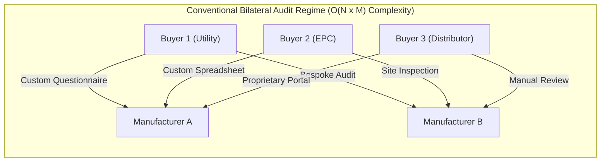
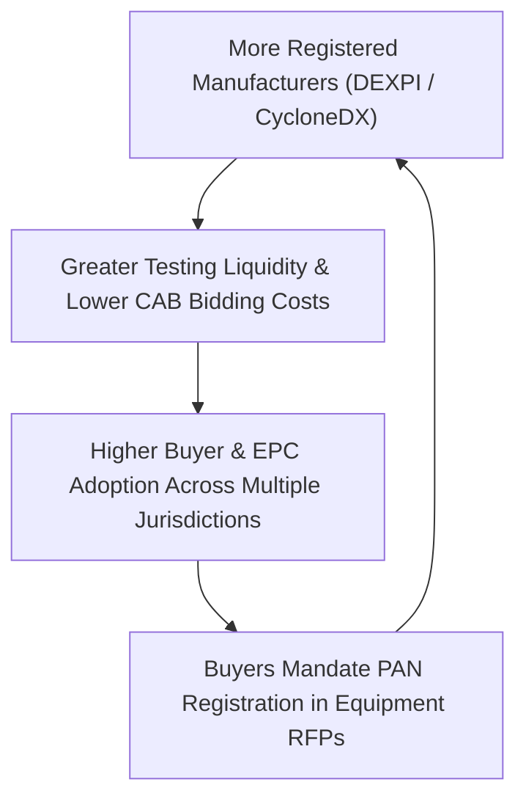
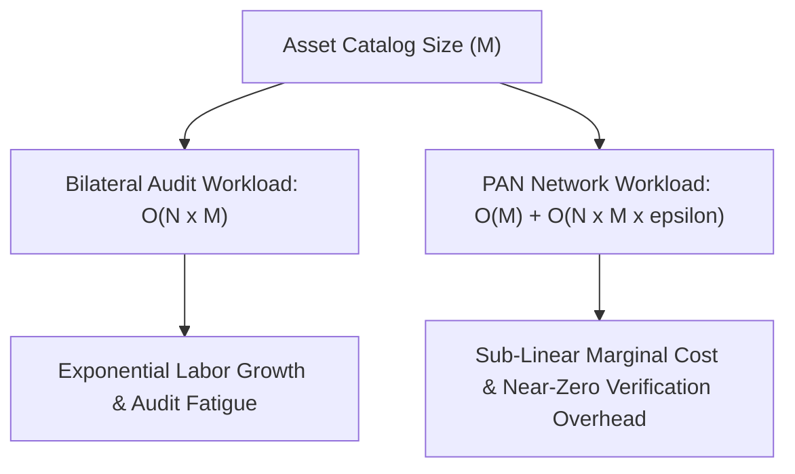

# The Transparent Product Assurance Network: Economic Charter and Architecture

## 1. Executive Summary & Scope

Industrial procurement of cyber-physical assets is burdened by systemic friction. Plant operators, engineering procurement construction (EPC) contractors, and distributors struggle to verify whether equipment meets modern regulatory, physical, and cyber assurance mandates. Every buyer issues proprietary spreadsheets, security questionnaires, and bespoke vendor audits. Concurrently, product manufacturers answer hundreds of duplicative inquiries while attempting to export closed Computer-Aided Design (CAD) and Building Information Modeling (BIM) files into neutral formats. This manual process inflates procurement lead times, obscures supply chain risks, and leaves buyers exposed to severe operational liabilities.

The Transparent Product Assurance Network (PAN), chartered by Eigenia Working Group 10, replaces this fragmented manual regime with an open, two-sided verification marketplace. Anchored in open specifications (CAD-DEXPI 2.0 for physical topology [6, 8], CycloneDX 1.6+ under ECMA-424 for software and cryptography bills of materials [9], and IEC 61970 Common Information Model for electrical connectivity), PAN decouples product qualification from bilateral buyer-vendor relationships. By establishing an independent testing ecosystem modeled on proven commercial supplier networks, PAN enables manufacturers to register products once, receive certified third-party testing bids, and expose cryptographically verified compliance dossiers to global distributors and buyers.

## 2. The Operational Pathology: Bilateral Audit Fatigue and Proprietary Lock-In

In conventional industrial engineering, the procurement of a safety-critical assembly (such as a 140 kW coolant distribution manifold, a high-pressure control valve, or a programmable logic controller) requires extensive technical documentation. Buyers must verify mechanical design limits, hydraulic flow characteristics, material composition, embedded firmware vulnerabilities, and adherence to emerging statutory regimes.

Under this conventional model, the interaction topology scales with order $O(N \times M)$, where $N$ represents the number of prospective enterprise buyers and $M$ represents the number of industrial component manufacturers. If 500 chemical plant operators procure valves from 200 manufacturers, the market must sustain 100,000 discrete bilateral assurance evaluations.

This bilateral structure generates three severe operational failures:

1. **Information Asymmetry and Incomplete Disclosures**: Manufacturers frequently supply static PDF specification sheets and marketing summaries that omit component sub-tier dependencies, software library versions, and dynamic failure limits.
2. **Proprietary Software Lock-In**: Blueprints exported from proprietary CAD suites (Autodesk AutoCAD Plant 3D, Revit, or AVEVA Everything3D) encapsulate engineering metadata inside closed binary structures. When converted to neutral visual vectors (such as standard DWG or PDF), the semantic graph (nozzle dimensions, flow coefficients $C_v$, and instrument loop logic) is lost.
3. **Regulatory Non-Compliance Risk**: With the enactment of statutory mandates like the European Cyber Resilience Act (Regulation (EU) 2024/2847) [5] and the Radio Equipment Directive Delegated Regulation (EU) 2022/30, distributors face direct legal penalties if they sell non-compliant products with digital elements. Recent empirical field studies by Risto, Sethi, and Katara [7] demonstrate that industrial equipment manufacturers face acute operational bottlenecks in software development lifecycle (SDL) tracking, vulnerability notification backlogs, and a total absence of automated tooling for complex cyber-physical assemblies. Manual audits cannot keep pace with dynamic vulnerability disclosures.

## 3. The Industrial Precedent: Amazon APASS and Commercial Assurance Networks

The structural remedy to bilateral audit fatigue does not require speculative theory. A direct operational parallel exists in commercial supply chain packaging: the Amazon Packaging Support and Supplier Network (APASS) [1].

In high-volume e-commerce logistics, damaged packaging and excessive dimensional weight produce significant fulfillment overhead. Rather than inspecting thousands of supplier factories directly, Amazon established an open testing specification grounded in the International Safe Transit Association (ISTA) standards, specifically ISTA 6-Amazon.com for Ships-in-Own-Container (SIOC) and Frustration-Free Packaging (FFP) [2]. The APASS certification program structures packaging into three distinct qualification tiers:
- **Tier 1: Frustration-Free Packaging (FFP)**: Zero prep required, easy to open, fully recyclable, and shipped without an Amazon overbox.
- **Tier 2: Ships-in-Own-Container (SIOC)**: Shipped in original manufacturer packaging without additional boxing, surviving drop and vibration profiles.
- **Tier 3: Prep-Free Packaging (PFP)**: Packaging that does not qualify for SIOC but avoids platform prep handling fees.

```mermaid
flowchart TD
    accTitle: Structural comparison of Amazon APASS and the Eigenia Product Assurance Network
    accDescr {
      Comparative architecture illustrating how APASS and PAN use open standards
      and accredited testing labs to qualify products without direct platform testing.
    }
    subgraph APASS["Amazon APASS Model (Physical Packaging)"]
        A_STD["Open Standard: ISTA 6-Amazon.com (SIOC / FFP / PFP)"]
        A_LAB["Accredited Third-Party Labs (Bureau Veritas, UL Solutions, CSA Group, Smithers)"]
        A_VEND["Product Vendors & Packaging Suppliers"]
        A_PLAT["Amazon Platform & Fulfillment Network"]

        A_STD --> A_LAB
        A_VEND -->|"Submits Package Samples & Pays Testing Fee"| A_LAB
        A_LAB -->|"Issues Certified ISTA 6 Test Report"| A_VEND
        A_VEND -->|"Submits Digital Lab Report"| A_PLAT
        A_PLAT -->|"Waives Prep Fees & Avoids Chargebacks"| A_VEND
    end

    subgraph PAN_MOD["Eigenia Product Assurance Network (Cyber-Physical Systems)"]
        P_STD["Open Standard: Schema G_CPDT (DEXPI 2.0 + CycloneDX 1.6+ + CIM)"]
        P_LAB["Accredited Conformity Assessment Bodies (Bureau Veritas, TUV SUD, DNV, DEKRA)"]
        P_VEND["Industrial Equipment Manufacturers (OEMs)"]
        P_PLAT["PAN Registry Portal & Open Procurement API"]

        P_STD --> P_LAB
        P_VEND -->|"Registers Machine-Readable Asset & Issues RFQ"| P_PLAT
        P_LAB -->|"Submits Competitive Qualification Bid"| P_PLAT
        P_LAB -->|"Executes Module B+C / Physical Falsification"| P_VEND
        P_LAB -->|"Registers Cryptographic in-toto Attestation"| P_PLAT
        P_PLAT -->|"Provides Verifiable Qualification to Buyers"| P_VEND
    end
```

The APASS operational mechanism operates through four distinct phases:

1. **Standardization of Requirements**: Amazon publishes rigorous test procedures detailing drop angles, vibration profiles, and atmospheric conditioning without mandating a specific packaging supplier.
2. **Third-Party Lab Accreditation**: Global testing, inspection, and certification organizations (such as Bureau Veritas, UL Solutions, HQTS-QAI, and CSA Group) undergo official qualification to conduct certified testing and are published in an official APASS referral list [3].
3. **Economic Decoupling**: The manufacturer pays the accredited lab directly for physical evaluations. Amazon avoids the capital and labor expense of maintaining testing facilities for millions of products.
4. **Platform Verification and Commercial Incentive**: Upon receiving a certified laboratory report, Amazon marks the item as qualified in its catalog, eliminating prep charges and packaging chargebacks.

The Product Assurance Network maps this proven economic model directly into cyber-physical systems assurance. Instead of packaging drop tests, PAN validates physical topology against DEXPI 2.0 (ISO 15926 series) [6, 8], cybersecurity posture against CycloneDX 1.6+ (ECMA-424) [9], and grid integration against IEC 61970 CIM. Furthermore, while APASS is a voluntary commercial incentive program, PAN bridges commercial incentives with binding statutory obligations under the EU Cyber Resilience Act [5]:
- **Chapter IV Notification (11 June 2026)**: Member States notify Conformity Assessment Bodies authorized to conduct EU-type examinations.
- **Article 14 24-Hour Notification (11 September 2026)**: Manufacturers must report actively exploited vulnerabilities and severe incidents to designated CSIRTs and the single reporting platform operated by ENISA.
- **Module B and Module C Conformity**: For Important Class I, Class II, and Critical products, independent examination by an accredited Notified Body is legally mandatory prior to placement on the single market [5, 7].
- **NAMUR Alignment**: Guidance under NAMUR NE 159 and NE 192 recognizes DEXPI 2.0 data models for CAE interoperability and functional safety integration [10].

Instead of Amazon waiving packaging fees, the network enables distributors and buyers to satisfy statutory procurement obligations with zero direct bilateral audit overhead.

## 4. Economic Architecture and Warren Buffett Moat Analysis

A durable institutional network must possess compelling microeconomics for all participants. Applying classical value investing and business model principles, the Product Assurance Network is engineered around sustainable competitive advantages, clear capital allocation, and structural network effects [4].

### 4.1 The Five Pillars of the Economic Moat

1. **The Regulatory Tollbooth**: The European Cyber Resilience Act establishes legal obligations across 27 member states. Equipment containing digital elements cannot enter the single market without demonstrated conformity to Annex I essential requirements. By indexing official statutory rules and hosting accredited Conformity Assessment Bodies (CABs), PAN operates as an essential clearinghouse. Transactions must clear this tollbooth to enter regulated industrial markets.
2. **High Switching Costs via Graph Standardization**: When a manufacturer encodes its catalog into the Schema G_CPDT open contract, the asset becomes computable across digital twins, simulation engines, and procurement portals. Once an EPC contractor integrates PAN's OpenAPI into its enterprise resource planning (ERP) system, replacing PAN would require rebuilding custom integrations with hundreds of individual component builders.
3. **Two-Sided Network Effects**: Every registered manufacturer increases the inventory value for prospective buyers. Every distributor mandating PAN qualification compels upstream suppliers to register. The marginal cost of onboarding the $(N+1)$-th asset is negligible, while the total value of the network scales quadratically according to Metcalfe's law:
   $$V \propto k \cdot N_b \cdot M_m$$
   where $N_b$ represents active procurement buyers and $M_m$ represents registered component manufacturers.
4. **Counter-Positioning Against Proprietary CAD Oligopolies**: Legacy CAD software providers depend on recurring seat licenses and proprietary file lock-in. They cannot sponsor an open, neutral assurance network without undermining their proprietary format revenue. PAN counter-positions by offering an open data substrate that makes vendor-locked CAD formats economically disadvantageous.
5. **Capital Efficiency and Negative Working Capital Float**: PAN does not manufacture physical hardware or operate capital-intensive testing facilities. Accredited CABs provide testing capital and personnel. The network operates the digital coordination, bidding engine, and cryptographic ledger. When buyers or manufacturers fund qualification escrows, the network benefits from positive cash float during the verification interval.

## 5. Network Stakeholders and Governance Framework

The network balances incentives across four core classes of participants:

| Participant Class | Core Motivations | Primary Activities | Value Received |
|---|---|---|---|
| **Product Manufacturers (OEMs)** | Eliminate repetitive questionnaire burden; access global distribution channels; prevent customs holds. | Registers products using Schema G_CPDT; requests qualification bids; remediates identified security gaps. | Single registration; accelerated time to market; global multi-jurisdiction visibility. |
| **Buyers & Distributors** | Comply with statutory regulations (CRA, RED, NIS2); de-risk supply chain; accelerate procurement. | Posts procurement assurance policies; queries registry via API; inspects cryptographic dossiers. | Complete verification transparency; automated audit trail; eradication of bilateral audit expense. |
| **Accredited Labs & CABs** | Win commercial testing engagements; automate compliance report generation; expand customer reach. | Bids on qualification RFQs; executes Module B/C inspections; issues cryptographically signed attestations. | Predictable qualified testing pipeline; lower customer acquisition costs; standardized technical inputs. |
| **Insurers & Underwriters** | Quantify systemic cyber-physical aggregation; enforce Lloyd's war exclusions; price parametric warranty riders. | Consumes real-time asset telemetry; calculates dynamic loss curves; underwrites qualification escrows. | Validated technical risk baseline; loss minimization; actuarial pricing accuracy. |

## 6. Mathematical Model of Procurement Efficiency and Cost Reduction

The total cost of procurement assurance under the conventional bilateral audit model ($C_{\text{bilateral}}$) can be formalized as:

$$C_{\text{bilateral}} = \sum_{i=1}^{N_b} \sum_{j=1}^{M_m} \left( c_{\text{audit}}(i, j) + c_{\text{delay}}(i, j) + c_{\text{error}}(i, j) \right)$$

where $c_{\text{audit}}$ is the direct engineering labor required to issue and evaluate bespoke security and mechanical questionnaires (averaging 40 to 80 engineering hours per vendor pairing), $c_{\text{delay}}$ represents the opportunity cost of procurement latency (often 60 to 180 days), and $c_{\text{error}}$ represents the expected loss from undiscovered security defects and regulatory non-compliance.

Under the Product Assurance Network, testing is executed once by an accredited third-party body, and the verified dossier is amortized across all prospective purchasers:

$$C_{\text{PAN}} = \sum_{j=1}^{M_m} \left( c_{\text{test}}(j) + c_{\text{reg}}(j) \right) + \sum_{i=1}^{N_b} \sum_{j=1}^{M_m} c_{\text{query}}(i, j)$$

where $c_{\text{test}}(j)$ is the market-clearing fee for third-party qualification, $c_{\text{reg}}$ is the nominal registration cost, and $c_{\text{query}}$ is the near-zero computational cost of an API call.

Because $c_{\text{query}} \ll c_{\text{audit}}$, the net efficiency gain ($\Delta E$) approaches:

$$\Delta E = C_{\text{bilateral}} - C_{\text{PAN}} \approx \sum_{j=1}^{M_m} \left( (N_b - 1) \cdot c_{\text{audit}} - c_{\text{test}}(j) \right)$$

For any industrial category where the buyer base $N_b \ge 5$, the network achieves substantial economic savings, completely paying for the third-party testing engagement through the elimination of redundant internal engineering reviews.

## 7. Strategic Alignment with Eigenia Working Groups

Working Group 10 coordinates directly with the broader Eigenia research portfolio:

- **WG-01 (Actuarial & Underwriting Foundations)**: Consumes PAN qualification dossiers to calculate operational failure probabilities and adjust cyber-physical property coverage terms.
- **WG-02 (Cognitive Digital Twins)**: Uses verified DEXPI 2.0 and CycloneDX models as the baseline graph for real-time asset behavior modeling and anomaly detection.
- **WG-05 (CAD-DEXPI 2.0 Foundations)**: Provides the semantic parser, ISO 15926-4 reference library mappings, and topological extraction engines required for product onboarding, incorporating the unified P&ID and PFD models formalized by DEXPI and Tolksdorf [6, 8].
- **WG-06 (CRA Product Assurance)**: Defines the statutory gap analysis algorithms, VEX validation routines, and Module B/C conformity assessment workflows, harmonized with NAMUR industrial interoperability guidance [10].
- **WG-07 (Threat Modeling)**: Executes automated STRIDE and MITRE ATT&CK graph traversals against registered asset models to support CAB inspection.

## 8. Conclusion and Charter Mandate

The Transparent Product Assurance Network establishes a neutral, transparent clearinghouse for cyber-physical equipment qualification. By combining the open data contract of Schema G_CPDT with the distributed testing economics of the APASS model, PAN dismantles the proprietary CAD software monopoly and eliminates bilateral procurement friction. Through independent accredited testing, cryptographic transparency, and dynamic statutory indexing, PAN delivers verifiable compliance, accelerated procurement cycles, and uncompromised industrial safety across global supply chains.

## References

- [1] Amazon.com, "Amazon Packaging Support and Supplier Network (APASS) Referral Program and Tier Guidelines," Amazon Customer Packaging Experience (CPEX) Guidelines, Tech. Rep. CPEX-2023-01, 2023.
- [2] International Safe Transit Association, "ISTA 6-Amazon.com-SIOC: Packaged-Products for Amazon.com Distribution System Shipment," ISTA Standard Test Procedure, 2022.
- [3] Bureau Veritas, "Consumer Products Services: ISTA 6-Amazon.com Packaging Verification and Fulfillment Testing Protocols," Technical Bulletin BV-PKG-2024, 2024.
- [4] W. E. Buffett, "Berkshire Hathaway Annual Letters to Shareholders," Berkshire Hathaway Inc., Omaha, NE, 1977–2025.
- [5] European Parliament and Council, "Regulation (EU) 2024/2847 on horizontal cybersecurity requirements for products with digital elements (Cyber Resilience Act)," Official Journal of the European Union, vol. L, 2024.
- [6] DEXPI Consortium, "Data Exchange in the Process Industry: Specification 2.0 Information Model," ProcessNet Working Group, Frankfurt, Germany, Tech. Rep. DEXPI-2.0.1, 2024.
- [7] T. Risto, D. Sethi, and V. Katara, "Navigating the European Cyber Resilience Act: Challenges and Strategies for Industrial Systems," arXiv preprint arXiv:2505.14325, 2025.
- [8] T. Tolksdorf, "DEXPI 2.0: Synergistic Integration of PFD and P&ID in a Unified Digital Model," Chemie Ingenieur Technik, vol. 97, no. 1-2, pp. 45-58, Wiley, 2025.
- [9] Ecma International, "Standard ECMA-424: CycloneDX Bill of Materials Specification," 2nd Edition, Geneva, Switzerland, Dec. 2025.
- [10] NAMUR, "NE 159: Standardised NAMUR Interface for Data Exchange Between CAE Systems," and "NE 192: Functional Safety Information Model," NAMUR Recommendations, Leverkusen, Germany, 2025.
