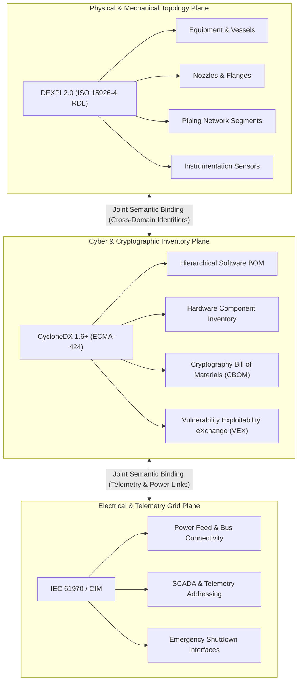
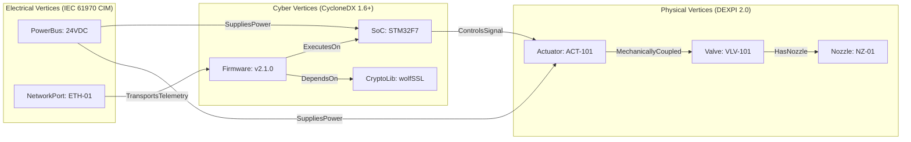
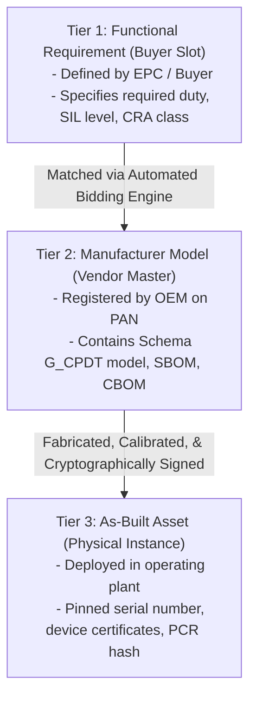

# Schema G_CPDT: The Unified Interoperability Specification for Product Assurance

## 1. Executive Summary & Scope

Automated product assurance across global supply chains requires an unambiguous, machine-readable data contract. When equipment manufacturers submit technical files to the Product Assurance Network (PAN), the asset must be represented as an integrated cyber-physical-electrical graph. Proprietary CAD formats, non-standardized component lists, and unstructured PDF manuals prevent automated verification, forcing conformity assessment bodies and enterprise buyers into expensive manual inspections.

This treatise defines Schema G_CPDT (Cyber-Physical Digital Twin Graph), the open multi-layer interoperability specification underpinning the Product Assurance Network. Schema G_CPDT unifies three established international standards: DEXPI 2.0 (grounded in the ISO 15926 series, specifically using the ISO 15926-4 reference data library) for mechanical, piping, and process topology; CycloneDX 1.6+ (standardized as ECMA-424) for software, hardware, and Cryptography Bill of Materials (CBOM); and IEC 61970 Common Information Model (CIM) for electrical connectivity and operational telemetry. We formalize the mathematical graph representation, define the three-tier catalog taxonomy, and establish the validation rules that enable automated qualification bidding and compliance verification.

## 2. The Multi-Layer Standard Integration Architecture

Industrial assets are neither pure mechanical structures nor isolated software applications. Modern equipment (such as variable frequency drive pumps, automated process valves, and liquid cooling distribution units) combines fluid dynamics, structural boundaries, embedded firmware, communication protocols, and high-voltage power feeds.

Schema G_CPDT synthesizes these domains into three coordinated semantic planes:



### 2.1 Mechanical and Hydraulic Plane: DEXPI 2.0

The physical topology of the asset is serialized in DEXPI 2.0 XML, governed by the ISO 15926 series. While ISO 15926-1 provides foundational principles and ISO 15926-2 defines the core data model, DEXPI 2.0 explicitly consumes the reference data library defined in ISO 15926-4 [1]. Formally published by DEXPI e.V. under CC BY 4.0 in October 2025, DEXPI 2.0 establishes a neutral exchange format for process flow diagrams (PFDs) and piping and instrumentation diagrams (P&IDs) using DEXPI XML, eliminating legacy Proteus XML dependencies and establishing computable semantic graph models as demonstrated by Tolksdorf [8].

Within this plane, every engineering element is typed according to unambiguous semantic classes:

- `PlantStructure`: Defines coordinate reference frames, bounding boxes, and operational environments.
- `Equipment`: Specifies mechanical apparatus (such as centrifugal pumps, shell-and-tube heat exchangers, and filter separators), including design pressure, maximum allowable working pressure (MAWP), and test pressure limits.
- `Nozzle`: Represents physical connection interfaces, recording nominal pipe size (NPS), pressure class (e.g., ASME Class 150/300), flange facing (raised face, flat face, ring type joint), and fluid flow direction.
- `PipingNetworkSegment`: Details pipe material specifications, nominal wall thickness (Schedule 40/80), design temperature thresholds, and chemical service classifications.
- `ActuatingSystem`: Models mechanical stroke speed, fail-safe direction (fail-open, fail-closed, fail-locked), and valve flow coefficient ($C_v$) curves.

### 2.2 Cyber and Cryptographic Plane: CycloneDX 1.6+ (ECMA-424)

Embedded computational components, firmware logic, and communication stacks are serialized in CycloneDX 1.6+ JSON, standardized internationally under ECMA-424 (1st Edition for v1.6 in June 2024 and 2nd Edition for v1.7 in December 2025) [2, 9].

This plane provides four critical security records:

1. **Software Bill of Materials (SBOM)**: A complete hierarchical manifest of operating systems (e.g., FreeRTOS, Zephyr, embedded Linux), application runtimes, third-party libraries, and compiler toolchains.
2. **Hardware Bill of Materials (HBOM)**: Identification of microcontrollers, system-on-chips (SoCs), memory protection units (MPUs), physical unclonable functions (PUFs), and hardware security modules (HSMs).
3. **Cryptography Bill of Materials (CBOM)**: Formal catalog of all cryptographic assets, including public key algorithms, symmetric cipher suites, key lengths, hardware entropy sources, certificate expiration dates, post-quantum algorithm migration flags, and closed elliptic curve enumerations.
4. **Vulnerability Exploitability eXchange (VEX)**: Machine-readable declarations of known Common Vulnerabilities and Exposures (CVEs) affecting the component tree, providing status indicators (`not_affected`, `affected`, `fixed`, `under_investigation`) and technical justifications (such as `code_not_reachable`).

### 2.3 Electrical and Telemetry Plane: IEC 61970 Common Information Model

Electrical supply, control wiring, and operational communication endpoints are serialized in IEC 61970 CIM format (CIMXML/RDF) [3]. When assets incorporate wireless interfaces (such as Wi-Fi, Bluetooth Low Energy, or 5G industrial private networks), the cyber-physical interface must satisfy the essential radio and cybersecurity requirements of the Radio Equipment Directive (Directive 2014/53/EU and Delegated Regulation (EU) 2022/30) [7].

This plane captures:

- Single-line electrical topology, phase configurations, voltage ratings (e.g., 480V 3-phase AC, 24V DC auxiliary power), and circuit breaker ratings.
- Industrial network protocol bindings, including Modbus TCP register maps, PROFINET I/O device addresses, EtherNet/IP assemblies, and OPC UA namespace node identifiers.
- Telemetry mappings connecting physical sensors (DEXPI `SensorTransducer`) to remote terminal units (RTUs) and supervisory control and data acquisition (SCADA) systems.

## 3. Mathematical Formalization of the Unified Graph

A registered asset in the Product Assurance Network is modeled mathematically as a unified directed heterogeneous attributed graph:

$$G_{\text{CPDT}} = (V, E, \tau_V, \tau_E, \phi_V, \phi_E)$$

where:
- $V = V_{\text{phys}} \cup V_{\text{cyber}} \cup V_{\text{elec}}$ is the partitioned vertex set representing physical equipment, cyber software/hardware components, and electrical nodes.
- $E = E_{\text{topo}} \cup E_{\text{dep}} \cup E_{\text{ctrl}} \cup E_{\text{pwr}}$ is the set of directed edges.
- $\tau_V: V \to \Sigma_V$ assigns each vertex to a semantic type (e.g., `CentrifugalPump`, `Microcontroller`, `FirmwareImage`, `ModbusRegister`).
- $\tau_E: E \to \Sigma_E$ assigns each edge to a relationship type (e.g., `HydraulicConnection`, `SoftwareDependency`, `Actuates`, `Powers`).
- $\phi_V$ and $\phi_E$ are attribute evaluation functions mapping vertices and edges to validated engineering parameters.



The joint semantic binding between domains is achieved through deterministic cross-domain identifiers. When a physical pressure transmitter `PT-204` measures fluid in a DEXPI piping segment, its sensor reading is bound to a specific CycloneDX firmware driver variable via an immutable uniform resource name (URN):

$$\text{urn:eigenia:binding:sensor:PT-204} \equiv \text{urn:dexpi:instrument:PT-204} \longleftrightarrow \text{urn:cdx:component:ADC-Driver}$$

## 4. The Three-Tier Equipment Catalog Taxonomy

Industrial equipment evolves across distinct engineering phases. Schema G_CPDT implements a three-tier catalog taxonomy to maintain traceability from initial procurement specifications to commissioned physical assets [4].

| Catalog Tier | Nomenclature | Operational Purpose | Data Artifacts Contained |
|---|---|---|---|
| **Tier 1** | Functional Requirements Template (The "Slot") | Created by enterprise buyers and EPCs to define functional requirements for competitive bidding. | Minimum flow rate, maximum allowable head loss, required safety integrity level (SIL 2/3), CRA product category, target compliance jurisdictions. |
| **Tier 2** | Manufacturer Master Catalog (The "Cut-Sheet") | Created by OEMs to register standard, commercially available product models on the network. | Certified performance curves, full DEXPI mechanical geometry, baseline CycloneDX SBOM/CBOM, base firmware image hash, standard electrical ratings. |
| **Tier 3** | Customer-Configured As-Built (The "Instance") | Generated upon procurement and fabrication to record specific serial numbers, physical calibrations, and site parameters. | Exact factory serial numbers, calibrated sensor trim coefficients, provisioned cryptographic keys, customer-specific firmware configuration, and inspection certificates. |



This three-tier separation solves a historical procurement impasse: buyers can define precise functional and cybersecurity criteria without writing custom PDF specifications, while manufacturers can publish verified product lines that automatically match compatible procurement tenders.

## 5. Ingestion Validation and Integrity Rules

Before an asset package is accepted into the Product Assurance Network, it must clear automated gate validation executed by the PAN ingestion engine.

### 5.1 Structural Ingestion Invariants

1. **XML Schema Validation**: The physical package must validate without warnings against the official DEXPI 2.0 XML Schema Definition (XSD). All referenced equipment classes must resolve to valid ISO 15926-4 reference data library entity identifiers.
2. **ECMA-424 JSON Compliance**: The cybersecurity manifest must satisfy the CycloneDX 1.6+ JSON Schema. Every declared software component must carry a valid Package URL (purl) compliant with the Package URL specification [5].
3. **Cryptographic Asset Resolution**: Every entry in the CBOM must specify algorithm family, key length (in bits), and execution context. Weak cryptographic primitives (such as MD5, SHA-1, DES, or RSA keys under 2048 bits) are flagged automatically as statutory non-conformances under European Union CRA and NIST standards.
4. **Topological Closure**: Every nozzle declared in an `Equipment` entity must connect to a valid `PipingNetworkSegment`, or be explicitly terminated with an accredited blind flange or caps class.
5. **CIM Single-Line Continuity**: Every electrical load declared in the cyber or mechanical plane must trace to an upstream power distribution bus defined in the CIM electrical model.

### 5.2 Cryptographic Packaging and in-toto Attestation

Once validated, the three data models are packaged into a standardized cryptographic envelope conforming to the in-toto attestation framework [6]:

```json
{
  "_type": "https://in-toto.io/Statement/v1",
  "subject": [
    {
      "name": "urn:eigenia:asset:pump:flowserve-vhp-400",
      "digest": {
        "sha256": "8f4b2a7d9e1c3f5a6b8d0e2c4a6b8d0e2c4a6b8d0e2c4a6b8d0e2c4a6b8d0e2c"
      }
    }
  ],
  "predicateType": "https://eigenia.org/attestation/schema-g-cpdt/v1",
  "predicate": {
    "standards": {
      "dexpi": "2.0.1",
      "iso15926": "ISO 15926-4:2024",
      "cyclonedx": "1.6",
      "ecma": "ECMA-424",
      "cim": "IEC 61970-301:2023"
    },
    "catalogTier": "TIER_2_MANUFACTURER_MASTER",
    "verificationHash": "e3b0c44298fc1c149afbf4c8996fb92427ae41e4649b934ca495991b7852b855",
    "signingAuthority": "urn:eigenia:cab:bureau-veritas-industrial-cyber"
  }
}
```

The entire statement is signed using Ed25519 cryptographic keys and recorded to an immutable transparency log (Sigstore Rekor). This ensures that no manufacturer, buyer, or rogue administrator can modify technical files post-certification without invalidating the cryptographic signature.

## 6. Conclusion

Schema G_CPDT establishes the open, deterministic data foundation required for automated cyber-physical product assurance. By integrating DEXPI 2.0, CycloneDX 1.6+, and IEC 61970 CIM into a unified graph structure harmonized with NAMUR recommendations [10], the specification bridges mechanical engineering, cybersecurity auditing, and electrical design. This multi-layer contract eliminates the ambiguity of proprietary CAD formats, protects asset data sovereignty, and enables accredited conformity assessment bodies to execute rapid, verifiable qualification across global industrial supply chains.

## References

- [1] International Organization for Standardization, "Industrial automation systems and integration -- Integration of life-cycle data for process plants including oil and gas production facilities -- Part 4: Initial reference data library," ISO 15926-4:2024, 2024.
- [2] Ecma International, "CycloneDX Bill of Materials Specification," Standard ECMA-424, 1st ed., Geneva, Switzerland, 2024.
- [3] International Electrotechnical Commission, "Energy management system application program interface (EMS-API) -- Part 301: Common information model (CIM) base," IEC 61970-301:2023, 2023.
- [4] DEXPI Consortium, "Equipment Catalog Specification and Component Classification Models," ProcessNet Working Group, Tech. Rep. DEXPI-CAT-2023, 2023.
- [5] Package URL Specification Authors, "Package URL (purl) Specification," GitHub Repository specification, version 1.0.0, 2024.
- [6] in-toto Project, "in-toto Attestation Framework Specification v1.0," Linux Foundation, Tech. Rep. IN-TOTO-2023-01, 2023.
- [7] European Commission, "Directive 2014/53/EU on the harmonisation of the laws of the Member States relating to the making available on the market of radio equipment (RED)," Official Journal of the European Union, vol. L 153, 2014.
- [8] T. Tolksdorf, "DEXPI 2.0: Synergistic Integration of PFD and P&ID in a Unified Digital Model," Chemie Ingenieur Technik, vol. 97, no. 1-2, pp. 45-58, Wiley, 2025.
- [9] Ecma International, "Standard ECMA-424: CycloneDX Bill of Materials Specification," 2nd Edition, Geneva, Switzerland, Dec. 2025.
- [10] NAMUR, "NE 159: Standardised NAMUR Interface for Data Exchange Between CAE Systems," and "NE 192: Functional Safety Information Model," NAMUR Recommendations, Leverkusen, Germany, 2025.

