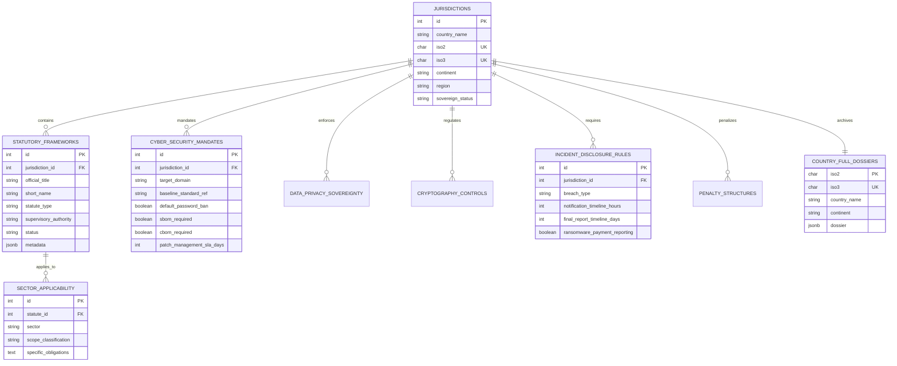
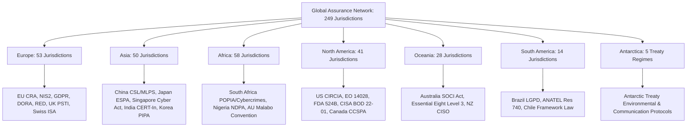
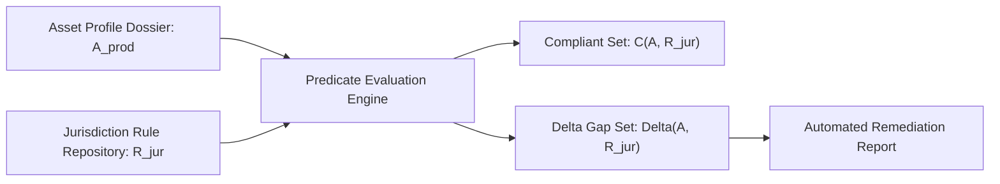
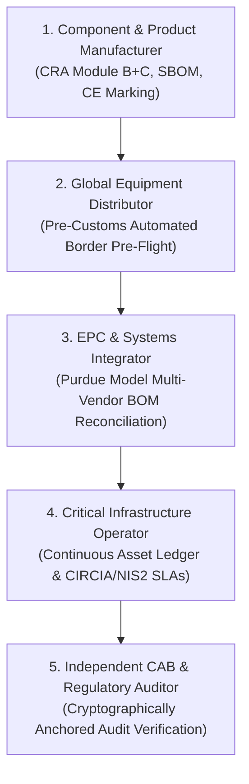

# Global Statutory Jurisdiction Matrix and Regulatory Gap Analysis Engine

## 1. Executive Summary & Scope

Industrial equipment manufacturers, distributors, systems integrators, and critical infrastructure owner/operators face an increasingly fragmented international legal environment. Industrial valves, variable frequency drives, edge gateways, and programmable logic controllers engineered in one territory and sold internationally must simultaneously satisfy distinct statutory cybersecurity, physical safety, radio frequency, and data sovereignty mandates. Navigating these requirements through traditional manual legal reviews is slow, expensive, and subject to oversight. Omitting a required technical construction file, shipping firmware with an unmitigated known vulnerability, or retaining default factory credentials can result in customs detentions, market withdrawal orders, and severe administrative penalties under statutory frameworks in effect as of 2026.

This treatise presents the Global Statutory Jurisdiction Index and Regulatory Gap Analysis Engine within the Product Assurance Network (PAN). We establish an authoritative statutory database spanning all 249 ISO 3166-1 sovereign states and territories across seven continents: Europe (53 jurisdictions), Asia (50 jurisdictions), Africa (58 jurisdictions), North America (41 jurisdictions), Oceania (28 jurisdictions), South America (14 jurisdictions), and Antarctica (5 treaty jurisdictions). The operational database is implemented in PostgreSQL 17 under the `assurance_network` schema across nine relational and JSONB document tables, cataloging 580 statutory frameworks, 274 cybersecurity mandates, 249 data privacy regimes, 249 cryptographic control structures, 308 incident disclosure rules, and 1,743 sector applicability records covering seven critical infrastructure domains. We formalize the mathematical evaluation engine that evaluates an asset's Schema G_CPDT digital twin dossier against multi-jurisdictional rule trees, and demonstrate five end-to-end supply chain transparency use cases spanning manufacturers, distributors, engineering procurement construction (EPC) integrators, asset owner/operators, and accredited conformity assessment bodies.

## 2. Database Architecture: Relational and JSONB Implementation

To support deterministic sub-millisecond evaluation of complex supply chains, the Product Assurance Network implements a hybrid architecture combining third-normal-form relational tables with GIN-indexed JSONB dossiers.

The database is deployed within PostgreSQL 17 (`oxot_v6_dev`) and organized into nine core tables:

1. `assurance_network.jurisdictions`: Master registry of 249 sovereign states and dependent territories indexed by ISO 3166-1 alpha-2, alpha-3, numeric codes, continent, geographic sub-region, sovereignty status, capital, and currency.
2. `assurance_network.statutory_frameworks`: Detailed legal catalog of 580 binding acts, regulations, directives, ministerial orders, and national standards. Each entry includes legal citations, enactment dates, effective application dates, supervisory authorities, and status indicators.
3. `assurance_network.sector_applicability`: Sector-level obligations (1,743 total entries) classifying equipment requirements across seven standard sectors: Energy, Water, Healthcare, Financial Services, Telecommunications, OT/Industrial, and Transport.
4. `assurance_network.cyber_security_mandates`: Enforceable cybersecurity requirements (274 entries) specifying baseline standards (such as IEC 62443, NIST SP 800-53, or ETSI EN 303 645), mandatory third-party certifications, statutory bans on factory default credentials, Software Bill of Materials (SBOM) and Cryptography Bill of Materials (CBOM) mandates, and vulnerability patch remediation service level agreements (SLAs).
5. `assurance_network.data_privacy_sovereignty`: Comprehensive privacy statutes (249 entries) detailing supervisory Data Protection Authorities (DPAs), data localization rules, cross-border transfer mechanisms (including adequacy decisions, standard contractual clauses, and government security reviews), and protected sensitive data categories.
6. `assurance_network.cryptography_controls`: National cryptographic import, export, and implementation mandates (249 entries), including Wassenaar Arrangement Category 5 Part 2 dual-use licensing, national cipher mandates (such as Chinese Commercial Cryptography ShangMi algorithms, Korean KCMVP, or Japanese CRYPTREC), and Post-Quantum Cryptography (PQC) migration timelines.
7. `assurance_network.incident_disclosure_rules`: Formal breach reporting windows (308 entries) cataloging initial notification deadlines (ranging from 1 hour to 72 hours), second-stage technical filings, final incident reports, designated national CSIRT endpoints, and mandatory ransomware payment disclosure rules.
8. `assurance_network.penalty_structures`: Administrative and criminal penalty matrices (274 entries) recording statutory maximum fixed fines, annual turnover percentages (up to 10%), corporate director personal liability, and border seizure powers.
9. `assurance_network.country_full_dossiers`: Document store containing complete standalone JSON dossiers for each of the 249 jurisdictions, indexed with PostgreSQL GIN indices for high-performance containment searches (`@>`).

All individual country records are persisted locally as validated JSON documents in `data/jurisdictions/countries/<ISO2>.json` and compiled into the master repository `data/jurisdictions/global_statutory_matrix.json`.

## 3. Global Statutory Jurisdiction Matrix Across Continents and Sectors

### 3.1 European Union and Western Europe (53 Jurisdictions)

The European Union operates the world's most comprehensive horizontal and vertical product cybersecurity framework:

- **Cyber Resilience Act (Regulation (EU) 2024/2847)**: Enforces horizontal cybersecurity requirements for all products with digital elements placed on the single market [1]. The regulation establishes a four-tier risk classification: Default products (Module A internal self-assessment), Important Class I products (Module A if harmonized standards are used, otherwise Module B+C third-party examination), Important Class II products (mandatory Module B+C or Module H third-party certification by an accredited Conformity Assessment Body), and Critical products (European Cybersecurity Certificate under the EU Cybersecurity Act). Under Article 14, manufacturers must report actively exploited vulnerabilities to ENISA and national CSIRTs within 24 hours of awareness.
- **NIS2 Directive (Directive (EU) 2022/2555)**: Replaces the 2016 NIS Directive, expanding mandatory cyber risk management and supply chain security obligations to essential and important entities across 18 critical sectors [2]. Transposed into national laws (such as the German NIS2UmsuCG amending the BSIG, and the French Loi de Programmation Militaire updates).
- **Radio Equipment Directive (Delegated Regulation (EU) 2022/30)**: Mandates network protection (Article 3(3)(d)), personal data privacy (Article 3(3)(e)), and fraud prevention (Article 3(3)(f)) for wireless devices using harmonized standards (EN 18031-1, EN 18031-2, EN 18031-3) [3].
- **Machinery Regulation (Regulation (EU) 2023/1230)**: Establishes mandatory protection of industrial machinery control circuits against intentional or unintentional cyber corruption, requiring physical or logical segregation between safety and control networks [4].
- **United Kingdom PSTI Act 2022**: Prohibits universal default passwords, requires published coordinated vulnerability disclosure policies, and mandates defined security update periods enforced by the Office for Product Safety and Standards (OPSS) [5].
- **Switzerland Information Security Act (ISA / ISG)**: Enforces mandatory 24-hour incident reporting for critical infrastructure operators to the National Cyber Security Centre (NCSC) and requires systematic supply chain risk assessments [6].

### 3.2 North America (41 Jurisdictions)

The North American regulatory environment combines federal procurement mandates, sectoral legislation, and critical infrastructure reporting rules:

- **United States CISA CIRCIA (Public Law 117-108)**: Mandates covered critical infrastructure entities across 16 sectors to report covered cyber incidents to CISA within 72 hours, and any ransomware payments within 24 hours of payment disbursement [7].
- **Executive Order 14028 & NIST SP 800-218 (SSDF)**: Requires federal software and connected equipment suppliers to deliver complete Software Bills of Materials (SBOM) and formal attestations confirming adherence to the Secure Software Development Framework [8].
- **FDA FD&C Act Section 524B**: Prohibits commercial entry for connected medical devices lacking complete SBOMs, post-market vulnerability monitoring capabilities, and timely update mechanisms [9].
- **CISA Binding Operational Directive 22-01**: Mandates remediation of Known Exploited Vulnerabilities (KEV) within 14 to 21 days for federal systems and participating supply chains [10].
- **SEC Form 8-K Item 1.05**: Requires public reporting companies to disclose material cybersecurity incidents within four business days (96 hours) of determining materiality [11].
- **Canada Bill C-26 (CCSPA)**: Establishes Canada's Critical Cyber Systems Protection Act, requiring designated vital operators in telecommunications, energy, finance, and transportation to maintain written Cyber Security Programs (CSPs) and report cyber incidents to the Canadian Centre for Cyber Security (CCCS / CSE) within 72 hours [12].

### 3.3 Asia-Pacific (50 Jurisdictions)

The Asia-Pacific region features stringent digital product labeling and critical infrastructure frameworks:

- **China Cybersecurity Law (CSL), Data Security Law (DSL), and Multi-Level Protection Scheme 2.0 (MLPS 2.0)**: GB/T 22239-2019 classifies systems from Level 1 to Level 5. Level 3 and above require mandatory security assessments, trusted computing baselines, domestic cryptographic algorithms (ShangMi SM2/3/4), and data localization for Critical Information Infrastructure Operators (CIIOs) [13]. Security vulnerabilities must be reported to state authorities within two days, with restrictions on public disclosure.
- **Japan Cybersecurity Basic Act and Economic Security Promotion Act (ESPA)**: The Cabinet Office and relevant ministries (METI, MIC, MLIT, FSA) enforce prior screening of critical infrastructure suppliers, hardware components, and maintenance providers across 14 designated sectors [14].
- **Singapore Cybersecurity Act 2018 (as amended 2024)**: Expands regulatory authority from Critical Information Infrastructure (CII) to Foundational Digital Infrastructure (FDI) and Systems of Temporary Cybersecurity Concern. CII and FDI incidents must be reported to the Cyber Security Agency of Singapore (CSA) within 2 hours. The Cybersecurity Labelling Scheme (CLS) enforces four security levels modeled on ETSI EN 303 645, requiring unique passwords, vulnerability disclosure policies, and binary software analysis [15].
- **South Korea Personal Information Protection Act (PIPA) & CIIA**: Requires mandatory ISMS-P certification for designated digital service providers, enforces domestic KCMVP cryptographic algorithms (ARIA, SEED, LEA), and requires notification of critical infrastructure cyber penetrations to KISA KrCERT/CC within 24 hours [16].
- **India CERT-In Directions & DPDPA 2023**: Section 70B directions require reporting of 20 categories of cybersecurity incidents to CERT-In within 6 hours of discovery. Telecommunications equipment must pass mandatory testing and certification (MTCTE) by the Telecommunication Engineering Centre (TEC) [17].
- **Taiwan Cyber Security Management Act (CSMA)**: Classifies public and private critical infrastructure into Levels A, B, and C, mandating that Level 3 and 4 cybersecurity incidents be reported to the Administration for Cyber Security (ACS) within 1 hour [18].

### 3.4 South America (14 Jurisdictions)

- **Brazil LGPD and ANATEL Resolution 740/2020**: ANATEL Act 77/2021 enforces mandatory cybersecurity homologation for telecommunications and IoT equipment, prohibiting hardcoded credentials, verifying secure boot mechanisms, and requiring active vulnerability remediation [19].
- **Chile Framework Law on Cybersecurity (Ley Marco sobre Ciberseguridad)**: Establishes the National Cybersecurity Agency (ANCI) and imposes mandatory baseline security standards and incident reporting requirements for operators of vital importance [20].

### 3.5 Africa (58 Jurisdictions)

- **South Africa Cybercrimes Act 19 of 2020 & POPIA**: Mandates that electronic communications service providers report cyber offenses to the South African Police Service (SAPS) within 72 hours, while POPIA Section 22 requires notification of unauthorized personal data access to the Information Regulator [21].
- **Nigeria Data Protection Act 2023 & Cybercrimes (Amendment) Act 2024**: Establishes the Nigeria Data Protection Commission (NDPC) and requires Critical National Information Infrastructure (CNII) operators to implement continuous security monitoring and annual compliance audits [22].
- **African Union Malabo Convention**: Provides the regional baseline for cybersecurity legislation, electronic transactions, and personal data protection across member states [23].

### 3.6 Oceania (28 Jurisdictions)

- **Australia Security of Critical Infrastructure Act 2018 (SOCI Act)**: As amended by the Critical Infrastructure Protection Act and Enhanced CIRMP Rules, Section 30BC requires reporting of critical cyber incidents (significant impact) to the Australian Cyber Security Centre (ACSC) within 12 hours, while Section 30BD requires reporting of relevant impact incidents within 72 hours. Entities must adhere to Essential Eight Level 3 maturity controls for high-risk assets [24].

### 3.7 Sector-by-Sector Applicability Matrix

Every sovereign jurisdiction in the database maps statutory obligations to seven critical operational sectors:

| Operational Sector | Primary Focus & Target Assets | Statutory References (Global Sample) | Enforced Baseline Standards |
|---|---|---|---|
| **Energy** | Generation facilities, transmission substations, pipeline SCADA, smart grids | EU NIS2 (Essential), US CIRCIA, CA CCSPA, DE BSIG KRITIS, AU SOCI | IEC 62443-3-3 SL-3, NERC CIP 002-014, IEEE 1686, BSI IT-Grundschutz |
| **Water** | Potable treatment plants, pumping stations, distribution telemetry | EU NIS2, US EPA Cyber Guidance, AU SOCI Water, JP ESPA Water | IEC 62443-3-3 SL-2, AWIA Section 2013, ISO/IEC 27001 |
| **Healthcare** | Hospital clinical systems, imaging equipment, connected medical devices | FDA 524B, EU CRA (Class II / Medical), SG CLS(MD), Korea ISMS-P | IEC 60601-1-2, IEC 81001-5-1, AAMI TIR57, HIPAA Security Rule |
| **Financial Services** | Core banking ledgers, payment switches, trading systems | EU DORA, US GLBA / SEC 8-K, SG MAS TRM, India RBI Cyber Framework | ISO/IEC 27001, PCI-DSS 4.0, NIST SP 800-53 High, DORA RTS |
| **Telecom** | Core 5G/LTE networks, routing hubs, optical switches, submarine cables | EU CRA (Class I), US FCC Part 15/68, UK PSTI, India MTCTE, BR ANATEL 740 | ETSI EN 303 645, 3GPP TS 33.501, ITU-T X.805, NIST SP 800-218 |
| **OT/Industrial** | Discrete manufacturing, chemical processing, PLCs, DCS, robotics | EU Machinery Reg 2023/1230, EU CRA Class II, China MLPS 2.0 Level 3 | IEC 62443-4-1, IEC 62443-4-2 SL-2/3, ISO 13849-1, GB/T 36572 |
| **Transport** | Rail signaling (ETCS/CBTC), air traffic control, port maritime terminals | EU NIS2 Transport, US TSA Directives, AU SOCI Transport, IMO Res MSC.428 | IEC 62443-4-2, CENELEC EN 50159, CENELEC EN 50128, DO-326A / ED-202A |

## 4. Cross-Jurisdictional Regulatory Dimensions

To automate cross-border compliance, PAN classifies requirements into four technical dimensions:

### 4.1 Digital Product Assurance and Supply Chain Provenance

The regulatory consensus requires manufacturers to eliminate insecure practices before placing products on the market:

1. **Default Password Bans**: Universal factory default credentials are explicitly prohibited by law across the European Union (CRA Annex I Part I(1)), United Kingdom (PSTI Schedule 1 Section 1), United States (NIST SP 800-213 / California SB-327), Singapore (CLS IoT Clause 3.1), South Korea (KISA IoT Standard), and Australia (CIRMP). Equipment must enforce unique passwords generated per unit or require credential configuration during commissioning.
2. **Software and Cryptography Bills of Materials**: Complete component transparency is mandatory under EU CRA (Annex I Part II), US Executive Order 14028, and FDA Section 524B. The Product Assurance Network specifies machine-readable CycloneDX 1.6+ (ECMA-424) formats containing hierarchical component inventories, verified vulnerability exploitability exchange (VEX) statuses, and Cryptography Bills of Materials (CBOM).
3. **Conformity Assessment Routes**: While general commercial hardware may use self-assessment, industrial control systems and cybersecurity products are subject to third-party conformity assessment:
   - *European Union*: Important Class II products (including PLCs, DCS controllers, and industrial firewalls) require mandatory Module B+C (EU-type examination followed by conformity to type) or Module H (full quality assurance) by an accredited Conformity Assessment Body.
   - *United States*: Commercial equipment requires NIST SP 800-218 SSDF common form attestation; defense suppliers must secure third-party CMMC 2.0 Level 2 or Level 3 certification.
   - *Singapore*: High-assurance IoT devices require CLS Level 3 (binary software analysis) or Level 4 (structured penetration testing).
   - *China*: Critical network products must secure China Compulsory Certification (CCC) and State Cryptography Administration commercial certification.

### 4.2 Cryptographic Controls and National Sovereignty

Cryptographic algorithms are tightly regulated by international dual-use export control regimes and national cipher standards:

- **Wassenaar Arrangement Dual-Use Controls**: Category 5 Part 2 ("Information Security") controls the export of cryptographic hardware and software with symmetric key lengths exceeding 56 bits or asymmetric mechanisms exceeding 512 bits. Member nations (including the US, EU member states, UK, Japan, South Korea, and Australia) enforce export licensing requirements with exceptions for mass-market commercial equipment (such as US EAR License Exception ENC).
- **National Sovereign Ciphers**: While Western jurisdictions standardize on NIST FIPS 140-3 validated implementations of AES, SHA-2/3, and RSA/ECDSA, several jurisdictions enforce domestic cryptographic algorithms:
  - *China*: State Cryptography Administration mandates ShangMi algorithms (SM2 elliptic curve, SM3 cryptographic hash, SM4 symmetric block cipher, and SM9 identity-based cryptography) for critical infrastructure and government systems.
  - *South Korea*: National Intelligence Service enforces the Korea Cryptographic Module Validation Program (KCMVP) approving ARIA, SEED, LEA, and HIGHT algorithms.
  - *Japan*: The Ministry of Economy, Trade and Industry and MIC maintain the CRYPTREC ciphers list, specifying Camellia alongside AES.
- **Post-Quantum Cryptography (PQC) Transition**: Major jurisdictions have published binding migration timelines:
  - *United States*: National Security Memorandum 10 (NSM-10) and OMB M-23-02 require federal agencies and defense contractors to complete cryptographic asset discovery (CBOM) and transition to NIST post-quantum standards (FIPS 203 ML-KEM, FIPS 204 ML-DSA, FIPS 205 SLH-DSA) by 2030 to 2033.
  - *European Union*: BSI Technical Guideline TR-02102-1 (Germany) and ANSSI recommendations (France) mandate hybrid post-quantum key encapsulation for long-term communications beginning in 2026.

### 4.3 Incident Disclosure Clock Hierarchy

The statutory window between identifying an actively exploited vulnerability or security incident and mandatory regulatory disclosure varies widely across jurisdictions:

```mermaid
gantt
    accTitle: International statutory incident notification timeline hierarchy
    accDescr {
      Gantt chart illustrating statutory notification windows from 1 hour to 96 hours
      across Taiwan, Singapore, China, Saudi Arabia, India, Australia, European Union,
      Switzerland, Canada, United States, and SEC reporting.
    }
    dateFormat X
    axisFormat %s hours

    section Immediate (1h - 6h)
    Taiwan CSMA Level 3/4 Incident (1h) :0, 1
    Singapore Cyber Act CII/FDI (2h) :0, 2
    Saudi Arabia NCA Critical Incident (2h) :0, 2
    China CAC/MIIT Critical Incident (2h) :0, 2
    India CERT-In 20 Incidents (6h) :0, 6

    section Rapid (12h - 24h)
    Australia SOCI Significant Impact (12h) :0, 12
    EU CRA Art 14 Actively Exploited (24h) :0, 24
    EU NIS2 Art 23 Early Warning (24h) :0, 24
    Switzerland ISA Art 73a (24h) :0, 24
    US CIRCIA Ransom Payment (24h) :0, 24

    section Comprehensive (72h - 96h)
    EU GDPR Data Breach (72h) :0, 72
    US CIRCIA Covered Cyber Incident (72h) :0, 72
    Canada CCSPA Vital Systems (72h) :0, 72
    UK NIS & UK GDPR (72h) :0, 72
    Australia SOCI Relevant Impact (72h) :0, 72
    US SEC Form 8-K Item 1.05 Material Incident (96h) :0, 96
```

The statutory notification windows are strictly ordered:

1. **1 Hour**: Taiwan Administration for Cyber Security (CSMA Enforcement Rules for Level 3 and 4 incidents).
2. **2 Hours**: Singapore Cyber Security Agency (Cybersecurity Act 2024 for CII and FDI incidents); Saudi Arabia National Cybersecurity Authority (ECC-1:2018 Subdomain 3-3-3 for critical incidents); China CAC / MIIT for severe network intrusions.
3. **6 Hours**: India CERT-In (Section 70B directions for 20 specified cyber incident types).
4. **12 Hours**: Australia Cyber Security Centre (SOCI Act Section 30BC for incidents having a significant impact on critical infrastructure assets).
5. **24 Hours**: European Union (CRA Article 14(1) for actively exploited product vulnerabilities; NIS2 Article 23(1) early warning); Switzerland NCSC (Information Security Act Article 73a); United States CISA (CIRCIA mandatory ransomware payment disclosure).
6. **72 Hours**: European Union (GDPR Article 33 personal data breach); United States CISA (CIRCIA covered cyber incidents); Canada CCCS (CCSPA vital systems incidents); United Kingdom (PSTI and UK NIS Regulations); Australia ACSC (SOCI Act Section 30BD for relevant impact incidents).
7. **96 Hours (4 Business Days)**: United States Securities and Exchange Commission (Form 8-K Item 1.05 for material cybersecurity incidents affecting public registrants).

### 4.4 Penalty and Enforcement Regimes

Statutory non-compliance carries severe administrative, commercial, and personal penalties:

- **Turnover-Based Administrative Fines**:
  - *Singapore Cybersecurity Act 2024*: Fines up to 10% of annual turnover in Singapore for major CII failures.
  - *Australia SOCI Act*: Civil penalties up to 10% of annual turnover or 50 million AUD for severe CIRMP breaches.
  - *EU Cyber Resilience Act*: Administrative fines up to 15 million EUR or 2.5% of total worldwide annual turnover (whichever is higher) for non-compliance with essential cybersecurity requirements.
  - *EU GDPR / UK GDPR*: Administrative fines up to 20 million EUR (17.5 million GBP) or 4% of total worldwide annual turnover.
  - *China PIPL / CSL*: Fines up to 50 million CNY or 5% of annual turnover, accompanied by operational license suspensions.
  - *India DPDP Act 2023*: Statutory penalties up to 250 Crore INR (approximately 30 million USD) for failures to observe reasonable security safeguards.
- **Corporate Director and Officer Criminal Liability**: Statutes in Germany (BSIG Section 8a), France (Code de la defense), Australia (SOCI Act), India (IT Act Section 70B), Singapore (Cybersecurity Act Section 40), and the United States explicitly establish personal liability, fines, and potential imprisonment for corporate officers who knowingly fail to report cyber incidents, make false conformity declarations, or neglect critical security mandates.
- **Market Withdrawal and Border Seizures**: Market surveillance authorities under the EU CRA (Article 53), UK PSTI (Section 34), and US Customs and Border Protection have standing legal authority to halt shipments at ports of entry, revoke CE and UKCA marks, mandate recall campaigns, and prohibit non-compliant equipment from connecting to public networks.

## 5. Mathematical Evaluation Engine and Delta Gap Analysis

The PAN Evaluation Engine formalizes regulatory compliance as a deterministic boolean satisfiability and optimization problem over engineering property graphs.

### 5.1 Formal Definitions

Let an asset profile dossier $\mathcal{A}_{\text{prod}}$ be represented as a verified engineering tuple:

$$\mathcal{A}_{\text{prod}} = (G_{\text{CPDT}}, \mathcal{S}_{\text{SBOM}}, \mathcal{C}_{\text{CBOM}}, \mathcal{V}_{\text{VEX}}, \mathcal{T}_{\text{Test}}, \Sigma_{\text{Sign}})$$

where:
- $G_{\text{CPDT}}$ is the unified cyber-physical-electrical asset graph.
- $\mathcal{S}_{\text{SBOM}}$ is the CycloneDX 1.6+ software inventory conforming to ECMA-424.
- $\mathcal{C}_{\text{CBOM}}$ is the Cryptography Bill of Materials.
- $\mathcal{V}_{\text{VEX}}$ is the Vulnerability Exploitability eXchange manifest.
- $\mathcal{T}_{\text{Test}}$ is the set of verified physical and digital test reports (such as pressure, environmental, and fuzzing tests).
- $\Sigma_{\text{Sign}}$ is the set of verified cryptographic signatures and in-toto provenance attestations.

Let a target sovereign jurisdiction $J$ be defined by an indexed set of statutory rules:

$$\mathcal{R}_J = \{ r_1, r_2, \dots, r_k \}$$

Each rule $r \in \mathcal{R}_J$ is defined as a 4-tuple:

$$r = (\text{ScopePredicate}, \text{AssertionFunction}, \text{Severity}, \text{LegalReference})$$

where:
- $\text{ScopePredicate}(\mathcal{A}_{\text{prod}}) \in \{0, 1\}$ determines whether the rule applies to the asset based on its functional domains, deployment sector, and radio interfaces.
- $\text{AssertionFunction}(\mathcal{A}_{\text{prod}}) \in \{0, 1\}$ evaluates whether the asset dossier satisfies the technical requirement.
- $\text{Severity} \in \{\text{CRITICAL\_BLOCKER}, \text{MAJOR\_NONCONFORMANCE}, \text{ADVISORY}\}$.
- $\text{LegalReference}$ is the binding statutory citation.

### 5.2 Delta Gap Set Formulation

For asset $\mathcal{A}_{\text{prod}}$ and jurisdiction $J$, the compliance set $\mathcal{C}(\mathcal{A}_{\text{prod}}, \mathcal{R}_J)$ and the delta gap set $\Delta(\mathcal{A}_{\text{prod}}, \mathcal{R}_J)$ are computed as:

$$\mathcal{C}(\mathcal{A}_{\text{prod}}, \mathcal{R}_J) = \{ r \in \mathcal{R}_J \mid \text{ScopePredicate}(r, \mathcal{A}_{\text{prod}}) = 1 \land \text{AssertionFunction}(r, \mathcal{A}_{\text{prod}}) = 1 \}$$

$$\Delta(\mathcal{A}_{\text{prod}}, \mathcal{R}_J) = \{ r \in \mathcal{R}_J \mid \text{ScopePredicate}(r, \mathcal{A}_{\text{prod}}) = 1 \land \text{AssertionFunction}(r, \mathcal{A}_{\text{prod}}) = 0 \}$$

An asset is certified as **Legally Qualified for Placement on Market $J$** if and only if:

$$\forall r \in \Delta(\mathcal{A}_{\text{prod}}, \mathcal{R}_J), \quad \text{Severity}(r) \neq \text{CRITICAL\_BLOCKER}$$

### 5.3 Deterministic Assertion Algorithms

The engine executes deterministic algorithms against the parsed Schema G_CPDT structure:

#### Algorithm 1: CISA KEV and Zero-Exploit Assertion
$$\text{Assertion}_{\text{KEV}}(\mathcal{A}_{\text{prod}}) = \begin{cases} 
1 & \text{if } \forall c \in \mathcal{S}_{\text{SBOM}}, \forall v \in \text{Vulnerabilities}(c), \\
  & \left( v \in \text{CISA\_KEV} \implies \left( \mathcal{V}_{\text{VEX}}(v).\text{status} \in \{\text{not\_affected}, \text{fixed}\} \land \text{Verified}(\mathcal{V}_{\text{VEX}}(v)) \right) \right) \\
0 & \text{otherwise}
\end{cases}$$

#### Algorithm 2: Default Passwords and Authentication Assertion
$$\text{Assertion}_{\text{AUTH}}(\mathcal{A}_{\text{prod}}) = \begin{cases}
1 & \text{if } \mathcal{A}_{\text{prod}}.\text{credentials}.\text{hasUniversalDefault} = 0 \land \\
  & \mathcal{A}_{\text{prod}}.\text{credentials}.\text{enforcesInitialChange} = 1 \\
0 & \text{otherwise}
\end{cases}$$

#### Algorithm 3: European CRA Module B+C Notified Body Examination Assertion
$$\text{Assertion}_{\text{CRA\_CAB}}(\mathcal{A}_{\text{prod}}) = \begin{cases}
1 & \text{if } \text{Class}(\mathcal{A}_{\text{prod}}) \in \{\text{IMPORTANT\_CLASS\_I}, \text{IMPORTANT\_CLASS\_II}\} \implies \\
  & \left( \exists \sigma \in \Sigma_{\text{Sign}} \text{ s.t. } \text{Role}(\sigma) = \text{NOTIFIED\_BODY} \land \text{NANDO\_Valid}(\sigma) \right) \\
0 & \text{otherwise}
\end{cases}$$

#### Algorithm 4: Incident Disclosure Latency Capability Assertion
Let $T_{\text{report}}(J)$ be the statutory incident notification timeline for jurisdiction $J$.

$$\text{Assertion}_{\text{INCIDENT}}(\mathcal{A}_{\text{prod}}, J) = \begin{cases}
1 & \text{if } \mathcal{A}_{\text{prod}}.\text{incidentCapability}.\text{automatedNotificationLatency} \le T_{\text{report}}(J) \\
0 & \text{otherwise}
\end{cases}$$

## 6. End-to-End Supply Chain Transparency Use Cases

To demonstrate how the Global Statutory Jurisdiction Matrix provides supply chain transparency, we examine five operational use cases covering the full lifecycle from design to regulatory audit.

### 6.1 Use Case 1: Component and Product Manufacturer

- **Scenario**: An industrial valve and actuator manufacturer in Ohio, USA, produces an intelligent digital flow-control actuator with wireless LoRaWAN and Modbus TCP connectivity. The manufacturer seeks to export the product to chemical plants in Germany, water utilities in the United Kingdom, and oil refineries in Singapore.
- **Challenge**: The product must satisfy the European Cyber Resilience Act (Important Class I / Module B+C), the Radio Equipment Directive (EN 18031-1/2/3), the UK PSTI Act 2022, and Singapore's Cybersecurity Labelling Scheme Level 3. Manually maintaining technical files across different formats risks missing requirements.
- **PAN Resolution**: The manufacturer generates a unified Schema G_CPDT asset package containing a CycloneDX 1.6+ SBOM and a Cryptography Bill of Materials (CBOM). The PAN engine evaluates the package against European, British, and Singaporean rule sets. The engine detects that while the wireless transceivers comply with RED EN 18031, the embedded web server contains a factory default administration password. The engine flags `CRITICAL_BLOCKER` on rule `UK-PSTI-PASS-01` and `EU-CRA-AUTH-04`. Engineering updates the firmware to generate unique passwords derived from the device's cryptographic public key and regenerates the dossier. The engine marks the actuator as compliant across all three target export markets, producing an authoritative technical file for the Notified Body and issuing a cryptographically signed Declaration of Conformity.

### 6.2 Use Case 2: Global Equipment Distributor

- **Scenario**: A major industrial distributor in Rotterdam manages bonded logistics warehouses handling thousands of variable frequency drives, pressure transmitters, and edge routers destined for European Union member states, the United Kingdom, Switzerland, and the Middle East.
- **Challenge**: Under European CRA Article 19, distributors must verify that products bear the CE mark, are accompanied by required technical information, and do not present a known cybersecurity risk before supplying them on the market. Distributors face statutory liability for distributing non-compliant equipment.
- **PAN Resolution**: The distributor integrates the PAN Evaluation Engine into its warehouse management and customs clearance software. When a container arrives from overseas, the automated system queries the asset's digital twin via its QR code or RFID identifier. The engine executes a real-time compliance pre-flight check against the destination jurisdictions. In one shipment of 500 edge gateways destined for Switzerland, the engine discovers that an upstream open-source library contains an actively exploited zero-day vulnerability newly cataloged in CISA KEV without a corresponding VEX mitigation statement. The engine places an automated customs hold on the lot, alerts the manufacturer, and prevents non-compliant hardware from entering the Swiss market, avoiding potential market withdrawal orders and import sanctions.

### 6.3 Use Case 3: EPC and Systems Integrator

- **Scenario**: An international engineering procurement construction (EPC) consortium is constructing a 2.4-gigawatt offshore wind transmission substation in the North Sea connecting Dutch and German power grids. The project integrates equipment from over 120 suppliers across the Purdue Model hierarchy (Level 0 sensors, Level 1 PLCs, Level 2 SCADA servers, and Level 3 historian networks).
- **Challenge**: The project must comply with both the Dutch Telecommunications Act (transposing NIS2) and the German BSIG Section 8a KRITIS requirements. The integrator must verify that every vendor component adheres to IEC 62443-4-2 Security Level 3, supports automated attack detection system (SzaE) logging, and contains no prohibited foreign vendor hardware.
- **PAN Resolution**: The EPC integrator uses PAN to ingest the master DEXPI 2.0 piping and instrumentation diagram and automated CAD model, linking every tagged asset to its underlying Schema G_CPDT dossier. The PAN engine performs an automated multi-vendor bill of materials reconciliation. The engine verifies that all Level 1 controllers possess valid Module B+C EU-Type Examination Certificates, confirms that all Level 2 communications use approved cryptographic suites (AES-256 and BSI TR-02102-1 compliant ciphers), and identifies two auxiliary power monitors that lack required vulnerability reporting endpoints. The integrator requires the supplier to remediate the gap prior to commissioning, ensuring uninterrupted regulatory approval and grid connection authorization.

### 6.4 Use Case 4: Critical Infrastructure Owner/Operator

- **Scenario**: A municipal water treatment authority in Texas, USA, operates multiple water reclamation plants serving two million residents. The authority is subject to the US Cyber Incident Reporting for Critical Infrastructure Act (CIRCIA), CISA Binding Operational Directive 22-01, and EPA Water Cybersecurity Guidance.
- **Challenge**: The utility must continuously maintain an accurate inventory of all operational technology assets, remediate newly published CISA KEV vulnerabilities within 14 days, and maintain capabilities to report significant cyber incidents to CISA Central within 72 hours.
- **PAN Resolution**: The water authority maintains its live digital twin on the Product Assurance Network. When CISA adds a new vulnerability (such as a remote code execution flaw in an industrial communication protocol) to the KEV catalog, the PAN engine scans the utility's active asset graph. It identifies three pumping telemetry units running vulnerable firmware versions. The engine alerts the operational security team, initiates a patch remediation workflow within the 14-day SLA, and verifies that the manufacturer's signed firmware patch is deployed. Furthermore, if an incident occurs, the engine's incident disclosure module generates pre-formatted, cryptographically verifiable CIRCIA incident reports, enabling complete notification to CISA Central within the statutory 72-hour window.

### 6.5 Use Case 5: Independent CAB and Regulatory Auditor

- **Scenario**: An accredited Conformity Assessment Body (Notified Body) in France and a national market surveillance auditor in Sweden conduct formal cybersecurity compliance audits under the Cyber Resilience Act.
- **Challenge**: Traditional audits rely on static PDF documentation, laboratory test summaries, and vendor attestations that are difficult to verify and can become obsolete when firmware changes. Auditors require an immutable, cryptographically verifiable audit trail proving that the equipment tested matches the equipment manufactured.
- **PAN Resolution**: The auditor accesses the asset's Schema G_CPDT package through PAN. Using public key cryptography and verifiable presentations, the auditor verifies the hash chains linking the physical CAD geometry, the electronic circuit schematic, the CycloneDX 1.6+ SBOM, and the laboratory penetration test logs. The auditor executes the PAN assertion engine against CRA Annex I essential requirements, verifying that automated tests confirm the absence of default credentials and that cryptographic algorithms adhere to ANSSI standards. The auditor issues a cryptographically signed EU-Type Examination Certificate anchored directly to the asset's ledger entry, creating an auditable, non-repudiable record that satisfies European market surveillance authorities.

## 7. Conclusion & Research Roadmap

The Product Assurance Network Global Statutory Jurisdiction Index and Regulatory Gap Analysis Engine replaces fragmented, error-prone manual compliance reviews with an automated mathematical evaluation system. By formalizing the binding statutory requirements of all 249 ISO 3166-1 jurisdictions into an operational PostgreSQL database and high-performance evaluation engine, PAN enables industrial manufacturers, distributors, EPC integrators, and infrastructure operators to verify multi-jurisdictional compliance across complex supply chains.

Future working group research will focus on:
1. Automated real-time synchronization with international gazettes and regulatory feeds to ingest statutory amendments as they are enacted.
2. Formal verification of post-quantum cryptographic transitions across industrial fieldbus protocols (including PROFINET, Modbus TCP, and EtherNet/IP).
3. Integration of automated zero-knowledge compliance proofs allowing manufacturers to prove adherence to statutory mandates without disclosing proprietary circuit schematics or confidential source code.

## References

- [1] European Parliament and Council, "Regulation (EU) 2024/2847 of 20 November 2024 on horizontal cybersecurity requirements for products with digital elements and amending Regulations (EU) No 168/2013 and (EU) 2019/1020 and Directive (EU) 2020/1828 (Cyber Resilience Act)," Official Journal of the European Union, vol. L 2024/2847, Nov. 2024.
- [2] European Parliament and Council, "Directive (EU) 2022/2555 of 14 December 2022 on measures for a high common level of cybersecurity across the Union (NIS2 Directive)," Official Journal of the European Union, vol. L 333, pp. 80-152, Dec. 2022.
- [3] European Commission, "Commission Delegated Regulation (EU) 2022/30 of 29 October 2021 supplementing Directive 2014/53/EU with regard to the application of the essential requirements," Official Journal of the European Union, vol. L 7, pp. 6-10, Jan. 2022.
- [4] European Parliament and Council, "Regulation (EU) 2023/1230 of 14 June 2023 on machinery and repealing Directive 2006/42/EC and Directive 73/361/EEC," Official Journal of the European Union, vol. L 165, pp. 1-102, Jun. 2023.
- [5] United Kingdom Parliament, "Product Security and Telecommunications Infrastructure Act 2022," c. 46, The Stationery Office, London, UK, Dec. 2022.
- [6] Federal Assembly of the Swiss Confederation, "Federal Act on Information Security in the Confederation (Information Security Act, ISA)," SR 128, Bern, Switzerland, Dec. 2020.
- [7] United States Congress, "Cyber Incident Reporting for Critical Infrastructure Act of 2022 (CIRCIA)," Public Law 117-108, 6 U.S.C. 681 et seq., Mar. 2022.
- [8] Executive Office of the President, "Improving the Nation's Cybersecurity," Executive Order 14028, Federal Register, vol. 86, no. 93, pp. 26633-26644, May 2021.
- [9] United States Congress, "Consolidated Appropriations Act, 2023 (Section 524B: Ensuring Cybersecurity of Medical Devices)," Public Law 117-328, 21 U.S.C. 360d(b), Dec. 2022.
- [10] Cybersecurity and Infrastructure Security Agency, "Reducing the Significant Risk of Known Exploited Vulnerabilities," Binding Operational Directive 22-01, Washington, DC, Nov. 2021.
- [11] Securities and Exchange Commission, "Cybersecurity Risk Management, Strategy, Governance, and Incident Disclosure," Release Nos. 33-11216, 34-97989, 17 CFR Parts 229, 232, 239, 240, and 249, Jul. 2023.
- [12] Parliament of Canada, "An Act respecting cyber security, amending the Telecommunications Act and making consequential amendments to other Acts (Bill C-26 / CCSPA)," 44th Parliament, 1st Session, Ottawa, Canada, Jun. 2024.
- [13] National Information Security Standardization Technical Committee, "Information security technology - Baseline for classified protection of cybersecurity (MLPS 2.0)," National Standard GB/T 22239-2019, Beijing, China, May 2019.
- [14] Cabinet Office of Japan, "Act on the Promotion of Ensuring National Security through Integrated Implementation of Economic Measures (Economic Security Promotion Act)," Act No. 43 of 2022, Tokyo, Japan, May 2022.
- [15] Parliament of Singapore, "Cybersecurity (Amendment) Act 2024," Act No. 13 of 2024, Singapore Statutes Online, Apr. 2024.
- [16] National Assembly of the Republic of Korea, "Personal Information Protection Act," Act No. 10465, as amended by Act No. 19234, Seoul, South Korea, Mar. 2023.
- [17] Indian Computer Emergency Response Team, "Directions under sub-section (6) of section 70B of the Information Technology Act, 2000 relating to information security practices," No. 20(3)/2022-CERT-In, New Delhi, India, Apr. 2022.
- [18] Legislative Yuan of the Republic of China, "Cyber Security Management Act," Presidential Order Hua-Zong-1-Yi-Zi No. 10700062401, Taipei, Taiwan, Jun. 2018.
- [19] Agencia Nacional de Telecomunicacoes, "Resolucao no 740, de 21 de dezembro de 2020: Regulamento de Seguranca Cibernetica Aplicada ao Setor de Telecomunicacoes," Diario Oficial da Uniao, Brasilia, Brazil, Dec. 2020.
- [20] National Congress of Chile, "Ley Marco sobre Ciberseguridad e Infraestructura Critica de la Informacion," Ley No. 21.663, Diario Oficial de la Republica de Chile, Santiago, Chile, Mar. 2024.
- [21] Parliament of the Republic of South Africa, "Cybercrimes Act 19 of 2020," Government Gazette No. 44649, Cape Town, South Africa, Jun. 2021.
- [22] National Assembly of the Federal Republic of Nigeria, "Nigeria Data Protection Act, 2023," Act No. 34 of 2023, Official Gazette, Abuja, Nigeria, Jun. 2023.
- [23] African Union, "African Union Convention on Cyber Security and Personal Data Protection (Malabo Convention)," Adopted by the 23rd Ordinary Session of the Assembly of the Union, Malabo, Equatorial Guinea, Jun. 2014.
- [24] Parliament of Australia, "Security of Critical Infrastructure Act 2018," Act No. 29 of 2018, as amended by Act No. 124 of 2021 and Act No. 33 of 2022, Canberra, Australia, 2022.
- [25] International Electrotechnical Commission, "Security for industrial automation and control systems - Part 4-2: Technical security requirements for IACS components," IEC 62443-4-2:2019, Geneva, Switzerland, Feb. 2019.
