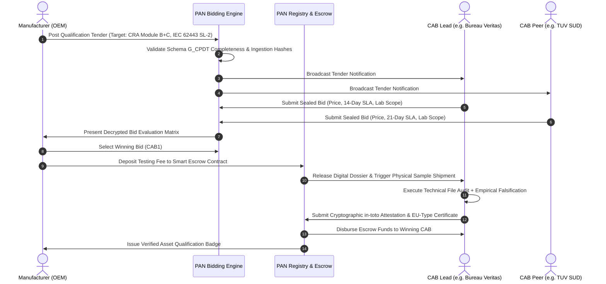
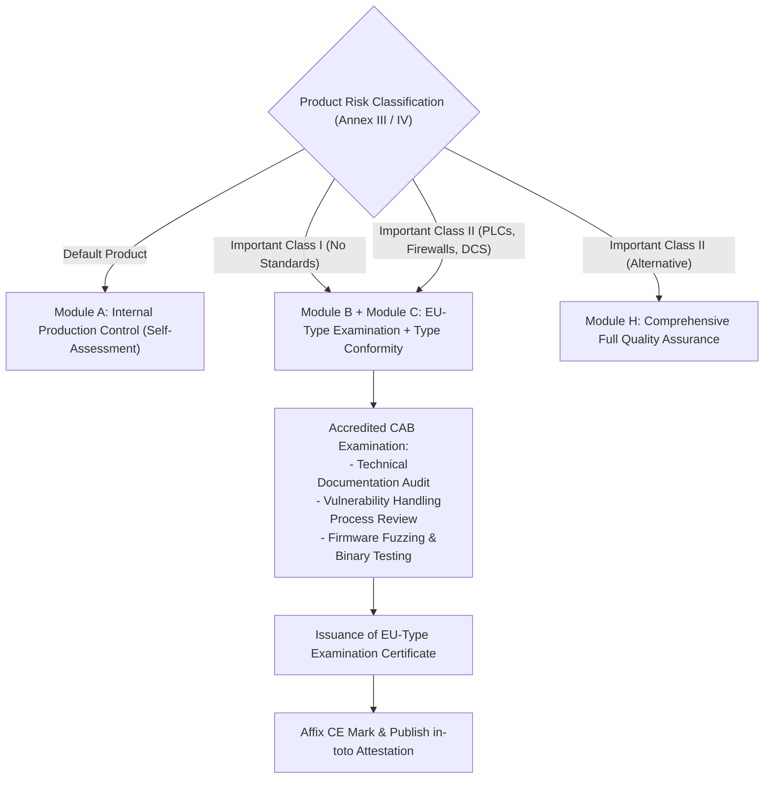
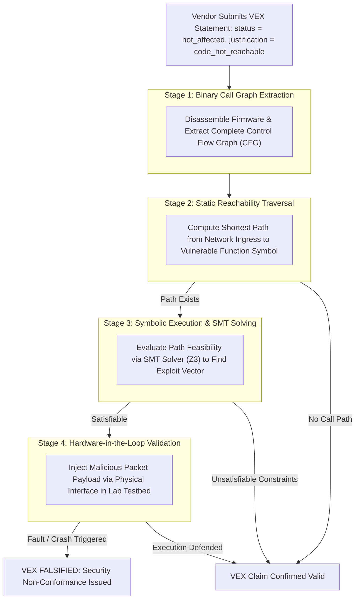

# The Conformity Assessment Bidding Marketplace and VEX Falsification Protocol

## 1. Executive Summary & Scope

Independent testing and verification are essential to credible supply chain assurance. If product qualification relies solely on manufacturer self-attestation, compliance degenerates into an unverified paper exercise. However, traditional third-party certification regimes are plagued by commercial opacity, unpredictable service-level agreements (SLAs), and disjointed laboratory workflows. Manufacturers wait months for testing slots, while accredited test houses struggle with inconsistent, unstructured technical documentation.

This treatise defines the Conformity Assessment Bidding Marketplace and the Vulnerability Exploitability eXchange (VEX) Falsification Protocol within the Product Assurance Network (PAN). The marketplace establishes a competitive clearinghouse where accredited Conformity Assessment Bodies (CABs) and test houses (such as Bureau Veritas, TÜV Rheinland, TÜV SÜD, DNV, DEKRA, and UL Solutions) bid on qualification tenders issued by manufacturers. We specify the bidding state machine, examine the execution of Cyber Resilience Act conformity procedures (Module B, Module C, and Module H under Regulation (EU) 2024/2847), and establish the empirical VEX Falsification Protocol, which uses binary symbolic execution and hardware-in-the-loop stress testing to validate or falsify vendor security claims.

## 2. The Decentralized Qualification Bidding Protocol

To prevent monopolistic pricing and minimize testing latency, PAN structures testing services as a transparent two-sided clearinghouse.



### 2.1 The Tender Lifecycle State Machine

A qualification tender progresses through five deterministic states:

1. **`TENDER_DRAFT`**: The manufacturer packages the product's Schema G_CPDT model (DEXPI 2.0 XML, CycloneDX 1.6+ JSON under ECMA-424, and IEC 61970 CIM), selects target regulatory scopes (e.g., EU CRA Important Class II, RED Delegated Regulation 2022/30, IEC 62443-4-2 SL-2), and specifies testing delivery constraints.
2. **`BIDDING_OPEN`**: The PAN Bidding Engine broadcasts the tender to accredited CABs whose scope of accreditation (verified via the European Commission NANDO database or IECEE CB Scheme) covers the requested technical domains. CABs submit sealed cryptographic bids detailing fixed testing fees, laboratory locations, and guaranteed completion timelines.
3. **`ESCROW_LOCKED`**: The manufacturer evaluates bids based on cost, turnaround time, and CAB reputation score. Upon bid selection, the manufacturer deposits the testing fee into a neutral financial escrow. This guarantees payment to the laboratory upon milestone completion while protecting the manufacturer against unexplained project delays.
4. **`AUDIT_ACTIVE`**: The selected CAB receives the complete digital twin file, cryptographic hashes, and physical equipment samples. The laboratory executes formal technical file reviews and empirical testing.
5. **`SETTLED_QUALIFIED`** or **`SETTLED_REJECTED`**: Upon test completion, the CAB uploads a verifiable test report and signed in-toto attestation. The escrow contract releases payment to the CAB, and the PAN Registry publishes the qualification status to global buyers.

## 3. Conformity Assessment Procedures under the Cyber Resilience Act

For products falling under the scope of Regulation (EU) 2024/2847 (CRA), the marketplace coordinates the formal conformity assessment routes specified in Article 24 and Annex VIII [1].



### 3.1 Module B: EU-Type Examination by Notified Body

Under Module B, the accredited CAB examines the technical design and development of the product with digital elements along with the manufacturer's vulnerability handling processes [2].

The CAB inspection team conducts three mandatory reviews:

- **Technical Documentation Audit**: Verification that the software architecture, hardware bill of materials, and network interfaces satisfy the essential requirements of Annex I, Part I.
- **Vulnerability Handling Process Audit**: Verification that the manufacturer maintains a functioning Coordinated Vulnerability Disclosure (CVD) program, automated internal triage systems, and capability to issue security patches within the 24-hour notification window mandated by Article 14.
- **Representative Type Testing**: Direct physical and cyber examination of a sample unit representing the production run.

### 3.2 Module C: Conformity to Type Based on Internal Production Control

Module C accompanies Module B. While Module B validates the engineering prototype ("the type"), Module C obligates the manufacturer to ensure that every manufactured physical unit conforms to the certified type. The PAN platform verifies Module C by cross-referencing factory firmware hash logs with the Module B certified binary digests.

### 3.3 Module H: Comprehensive Full Quality Assurance

For large OEMs producing continuous product variants, Module H allows conformity assessment based on an audited quality management system. The CAB audits the manufacturer's entire secure development lifecycle (SDL) against standards such as IEC 62443-4-1. Once certified under Module H, the manufacturer can qualify individual derivative models without triggering individual Module B prototype examinations.

## 4. The Empirical VEX Falsification Protocol

A critical vulnerability of modern software security is the prevalence of unverified Vulnerability Exploitability eXchange (VEX) statements. When a Common Vulnerability and Exposure (CVE) is discovered in an open-source library, manufacturers frequently mark the component as `not_affected` using the justification `code_not_reachable` without providing empirical proof [3].

The PAN VEX Falsification Protocol converts subjective vendor claims into falsifiable empirical tests.



### 4.1 Mathematical Formulation of Reachability Falsification

Let the firmware binary of the asset be represented as an executable interprocedural control flow graph (ICFG):

$$G_{\text{firmware}} = (N, E_{\text{call}}, n_{\text{entry}}, N_{\text{vuln}})$$

where $N$ is the set of basic instruction blocks, $E_{\text{call}}$ represents control flow and branch transitions, $n_{\text{entry}}$ represents external network or bus ingress entry points (e.g., Modbus TCP frame parser, HTTP API endpoint), and $N_{\text{vuln}}$ is the set of basic blocks containing the vulnerable library logic (e.g., buffer overflow in a legacy TLS parser).

The static reachability predicate $\mathcal{R}_{\text{static}}$ is defined as:

$$\mathcal{R}_{\text{static}} = \exists p = (n_{\text{entry}}, n_1, n_2, \dots, n_k) \quad \text{such that} \quad n_k \in N_{\text{vuln}} \land \forall i, (n_i, n_{i+1}) \in E_{\text{call}}$$

If $\mathcal{R}_{\text{static}} = 0$, the vulnerable function is dead code and was linked into the binary without being callable. The vendor's `code_not_reachable` claim is statically verified.

If $\mathcal{R}_{\text{static}} = 1$, the CAB activates dynamic symbolic execution. Let $\vec{x}$ represent the symbolic input vector entering $n_{\text{entry}}$. Path constraints along path $p$ are collected as a first-order logic formula:

$$\Phi(p, \vec{x}) = \bigwedge_{j=1}^k \psi_j(\vec{x})$$

The formula is submitted to an automated Satisfiability Modulo Theories (SMT) solver:

$$\text{Result} = \text{Solve}(\Phi(p, \vec{x}))$$

- If $\text{Result} = \text{UNSAT}$, no combination of input network bytes can satisfy the branch conditions required to reach $N_{\text{vuln}}$ under current configuration. The VEX claim stands.
- If $\text{Result} = \text{SAT}$, the solver yields a concrete exploit input $\vec{x}_{\text{witness}}$. The laboratory injects $\vec{x}_{\text{witness}}$ into a physical sample on the test bench. If memory corruption or unauthorized execution occurs, the vendor's VEX claim is **formally falsified**. The tender is suspended, and the non-conformance is logged to the PAN security ledger.

## 5. Physical and Hydraulic Boundary Falsification

In accordance with Schema G_CPDT, physical parameters declared in DEXPI 2.0 files are subjected to physical testing by accredited laboratories:

- **Maximum Allowable Working Pressure (MAWP) Verification**: The laboratory subjects valve bodies and heat exchanger shells to hydrostatic pressure testing at $1.5 \times \text{MAWP}$ in accordance with ASME Section VIII and EN 13445 [4].
- **Nozzle Mechanical Flange Stress Testing**: External piping moment forces are applied to flange nozzles to verify that deflection does not compromise internal seal integrity or cause actuator binding.
- **Fail-Safe Dynamic Validation**: Electrical power and pneumatic control air are severed simultaneously under maximum fluid flow to record whether the valve moves to its declared fail-safe state (fail-closed, fail-open) within the specified stroke time.

## 6. Cryptographic Dossier Issuance and Publication

Upon successful validation of all physical and cybersecurity criteria, the CAB generates a standardized, tamper-evident attestation packet:

```json
{
  "_type": "https://in-toto.io/Statement/v1",
  "subject": [
    {
      "name": "urn:eigenia:asset:actuator:rotork-iq3-cyber",
      "digest": {
        "sha256": "4a5c6d7e8f90123456789abcdef0123456789abcdef0123456789abcdef01234"
      }
    }
  ],
  "predicateType": "https://eigenia.org/attestation/cab-qualification/v1",
  "predicate": {
    "cabIdentifier": "urn:eigenia:cab:bureau-veritas-industrial-cyber",
    "nandoNotifiedBodyNumber": "0062",
    "evaluationModules": ["CRA-MODULE-B", "CRA-MODULE-C", "IEC-62443-4-2-SL2"],
    "certificateNumber": "BV-CRA-2026-09-8841",
    "vexFalsificationResults": {
      "totalCVEsEvaluated": 14,
      "falsifiedClaims": 0,
      "verifiedUnreachable": 12,
      "remediatedPatches": 2
    },
    "issueDate": "2026-09-11T14:45:00Z",
    "expirationDate": "2029-09-11T14:45:00Z"
  }
}
```

The document is cryptographically signed using the lead auditor's hardware-backed Ed25519 key and logged to the Sigstore transparency log. The PAN Registry indexes the certificate, instantly updating the asset's qualification status across all integrated buyer procurement portals.

## 7. Conclusion

The Conformity Assessment Bidding Marketplace and VEX Falsification Protocol establish an objective, market-driven mechanism for industrial product assurance. By decoupling testing from proprietary bilateral relationships and introducing automated competitive bidding, PAN reduces certification turnaround times and lowers qualification costs. Concurrently, the rigorous application of binary symbolic execution and physical stress testing guarantees that verified assets withstand real-world operational and cyber threats across critical infrastructure.

## References

- [1] European Parliament and Council, "Regulation (EU) 2024/2847 on horizontal cybersecurity requirements for products with digital elements (Cyber Resilience Act)," Official Journal of the European Union, vol. L, 2024.
- [2] European Commission, "Blue Guide on the implementation of EU product rules 2022," Official Journal of the European Union, Notice 2022/C 247/01, 2022.
- [3] Cybersecurity and Infrastructure Security Agency, "Vulnerability Exploitability eXchange (VEX) - Use Cases and Implementation Guidance," CISA Technical Report, Washington, DC, 2023.
- [4] American Society of Mechanical Engineers, "ASME Boiler and Pressure Vessel Code, Section VIII: Rules for Construction of Pressure Vessels," ASME Standard BPVC-VIII, 2023.
- [5] Ecma International, "CycloneDX Bill of Materials Specification," Standard ECMA-424, 1st ed., Geneva, Switzerland, 2024.
- [6] in-toto Project, "in-toto Attestation Framework Specification v1.0," Linux Foundation, Tech. Rep. IN-TOTO-2023-01, 2023.
