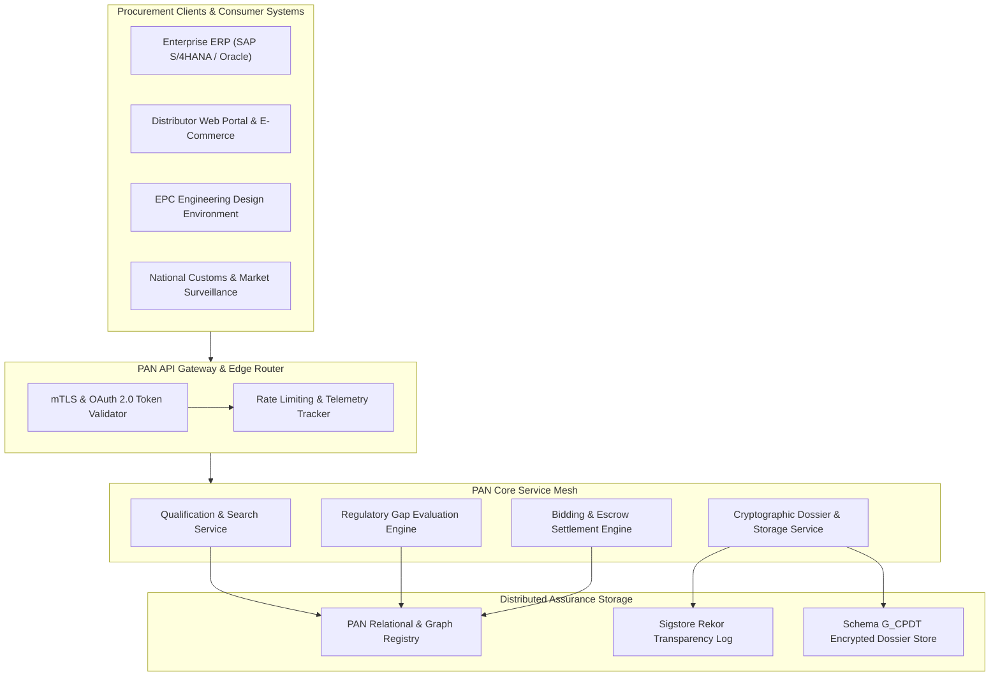
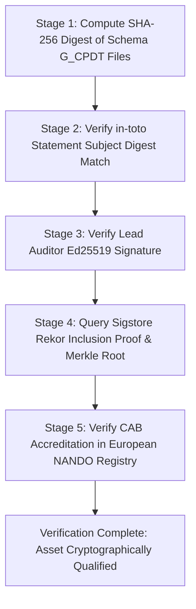
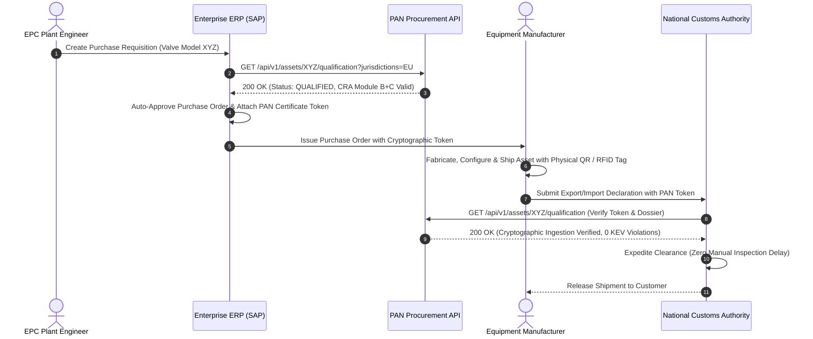

# The Machine-Readable Procurement API and Cryptographic Ingestion Standard

## 1. Executive Summary & Scope

Enterprise procurement workflows in industrial engineering rely on software integration. For the Product Assurance Network (PAN) to replace bilateral audit spreadsheets and proprietary vendor portals, its clearinghouse data must be accessible via high-throughput, machine-readable interfaces. Procurement officers, engineering procurement construction (EPC) estimators, and distributor inventory systems require programmatic application programming interfaces (APIs) to query product qualifications, compute cross-border regulatory gaps, and retrieve cryptographically verified technical dossiers.

This treatise specifies the PAN Procurement API and Cryptographic Ingestion Standard. We define the RESTful and GraphQL interfaces conforming to OpenAPI 3.1.0, specify the JSON-LD semantic payload structures, and outline the cryptographic verification pipeline that proves dossier authenticity. In addition, we establish the integration architectures that link PAN directly into enterprise resource planning (ERP) systems (such as SAP S/4HANA), product lifecycle management (PLM) environments, and national customs declaration platforms, enabling automated compliance verification at the point of commercial transaction.

## 2. API Architecture and Interaction Topology

The PAN Procurement API is structured around stateless, high-performance web standards protected by mutual Transport Layer Security (mTLS) and OAuth 2.0 / OpenID Connect authorization scopes.



The system provides three primary interaction pathways:

1. **Synchronous RESTful Endpoints**: Optimized for discrete lookups, asset registration, and specific regulatory gap queries.
2. **GraphQL Query Engine**: Optimized for complex relational queries, allowing EPC designers to request nested physical, cyber, and electrical properties in a single round-trip.
3. **Asynchronous Webhook Subscriptions**: Emits CloudEvents when an asset's qualification status changes (e.g., when a newly disclosed vulnerability invalidates a prior VEX certificate, or when a CAB issues an EU-Type Examination Certificate).

## 3. Core Resource Model and OpenAPI 3.1.0 Specification

The API exposes a clean, resource-oriented endpoint hierarchy:

| HTTP Method | Endpoint URI | Operational Function |
|---|---|---|
| `GET` | `/api/v1/assets/search` | Search catalog by functional, mechanical, or compliance parameters. |
| `GET` | `/api/v1/assets/{assetId}/qualification` | Retrieve real-time statutory qualification status and gap summary. |
| `GET` | `/api/v1/assets/{assetId}/dossier` | Retrieve full Schema G_CPDT bundle (DEXPI, CycloneDX, CIM). |
| `POST` | `/api/v1/assets/{assetId}/gap-analysis` | Execute on-demand gap analysis against custom jurisdiction sets. |
| `POST` | `/api/v1/tenders` | Create a qualification tender for accredited CAB bidding. |
| `GET` | `/api/v1/tenders/{tenderId}/bids` | Retrieve decrypted CAB competitive bids. |
| `POST` | `/api/v1/tenders/{tenderId}/awards` | Award tender to winning CAB and lock escrow funds. |

### 3.1 OpenAPI Specification Snippet

The following OpenAPI 3.1.0 specification formalizes the asset qualification resource:

```yaml
openapi: 3.1.0
info:
  title: Eigenia Product Assurance Network Procurement API
  version: 1.0.0
  description: Machine-readable API for cyber-physical equipment qualification.
paths:
  /api/v1/assets/{assetId}/qualification:
    get:
      summary: Retrieve Asset Qualification Dossier
      description: Returns multi-jurisdiction compliance status and verified attestations.
      parameters:
        - name: assetId
          in: path
          required: true
          schema:
            type: string
            example: "urn:eigenia:asset:pump:flowserve-vhp-400"
        - name: jurisdictions
          in: query
          required: false
          schema:
            type: array
            items:
              type: string
            example: ["EU", "US", "UK"]
      responses:
        '200':
          description: Qualification record successfully retrieved.
          content:
            application/json:
              schema:
                $ref: '#/components/schemas/QualificationResponse'
components:
  schemas:
    QualificationResponse:
      type: object
      required:
        - assetId
        - globalStatus
        - catalogTier
        - verifiedJurisdictions
        - attestations
      properties:
        assetId:
          type: string
        globalStatus:
          type: string
          enum: [QUALIFIED, RESTRICTED_EXPORT, SUSPENDED, PENDING_AUDIT]
        catalogTier:
          type: string
          enum: [TIER_1_REQUIREMENT, TIER_2_MASTER, TIER_3_AS_BUILT]
        verifiedJurisdictions:
          type: array
          items:
            $ref: '#/components/schemas/JurisdictionStatus'
        attestations:
          type: array
          items:
            $ref: '#/components/schemas/inTotoAttestationReference'
    JurisdictionStatus:
      type: object
      required:
        - jurisdictionCode
        - isCompliant
        - governingStatutes
      properties:
        jurisdictionCode:
          type: string
          example: "EU"
        isCompliant:
          type: boolean
        governingStatutes:
          type: array
          items:
            type: string
          example: ["REG-EU-2024-2847", "DIR-2014-53-EU"]
        identifiedGaps:
          type: array
          items:
            type: string
    inTotoAttestationReference:
      type: object
      required:
        - attestationUri
        - rekorLogIndex
        - signingKeyId
      properties:
        attestationUri:
          type: string
        rekorLogIndex:
          type: integer
          example: 18492041
        signingKeyId:
          type: string
```

## 4. Cryptographic Ingestion and Verification Pipeline

When a client queries an asset dossier or an ERP system ingests a qualification record, the client application must verify the integrity of the data independently. Relying purely on Transport Layer Security (TLS) leaves the client exposed to malicious proxies or compromised network nodes.

The PAN client library implements a five-stage cryptographic verification pipeline:



1. **Payload Hashing**: The client computes the SHA-256 digests of the local DEXPI 2.0 XML, CycloneDX 1.6+ JSON (standardized under ECMA-424), and CIM files.
2. **Subject Matching**: The computed digests are compared against the `subject` array in the downloaded in-toto attestation statement. If any byte was altered, the check fails.
3. **Signature Verification**: The signature attached to the attestation envelope is verified against the public Ed25519 key of the CAB testing lead.
4. **Transparency Inclusion Proof**: The client queries the public Sigstore Rekor transparency log using the attestation's log index to verify that the signature was timestamped and entered into an append-only Merkle tree [1].
5. **Accreditation Status Check**: The client verifies that the signing CAB's unique identifier matches an active, accredited Notified Body listed in the official European NANDO database (for EU CRA/RED) or IECEE CB Scheme directory.

## 5. Enterprise ERP and Customs Integration Workflows

The ultimate commercial value of the PAN Procurement API lies in the automation of enterprise purchasing and physical customs clearance.



### 5.1 Chargeback and Fee Avoidance in Industrial Distribution

Just as the Amazon APASS network protects vendors from packaging chargebacks and prep fees, PAN qualification protects industrial equipment distributors from commercial and statutory penalties:

- **Eradication of Buyer Rejection Chargebacks**: When an EPC contractor receives equipment on-site, missing technical documentation or software vulnerabilities frequently halt installation, triggering contractual liquidated damages. Pre-qualifying equipment through PAN guarantees that technical files and firmware attestations are pre-verified.
- **Automated Customs Pre-Clearance**: Border authorities enforcing the European Cyber Resilience Act can query PAN endpoints directly. Shipments bearing a verified PAN token bypass manual customs inspection holds, reducing maritime and overland transit delays.
- **Insurance Premium Credits**: Property and cyber underwriters integrated with PAN can automatically verify asset resilience, applying lower deductible terms and premium credits to facilities deployed exclusively with PAN-qualified components.

## 6. Conclusion

The PAN Procurement API and Cryptographic Ingestion Standard bridge the divide between technical engineering models and enterprise commercial systems. By exposing open REST, GraphQL, and JSON-LD interfaces backed by hardware-rooted cryptographic proofs, PAN enables buyers, distributors, and regulators to verify cyber-physical compliance programmatically. This automated interoperability eliminates bilateral administrative waste, accelerates industrial project delivery, and establishes an auditable supply chain baseline for global critical infrastructure.

## References

- [1] Sigstore Project, "Rekor: Software Signature Transparency Log Specification," Linux Foundation, Tech. Rep. SIG-REKOR-2023, 2023.
- [2] OpenAPI Initiative, "OpenAPI Specification Version 3.1.0," Linux Foundation, 2021.
- [3] W3C JSON-LD Working Group, "JSON-LD 1.1: A JSON-based Serialization for Linked Data," W3C Recommendation, 2020.
- [4] in-toto Project, "in-toto Attestation Framework Specification v1.0," Linux Foundation, Tech. Rep. IN-TOTO-2023-01, 2023.
- [5] Ecma International, "CycloneDX Bill of Materials Specification," Standard ECMA-424, 1st ed., Geneva, Switzerland, 2024.
- [6] European Parliament and Council, "Regulation (EU) 2024/2847 on horizontal cybersecurity requirements for products with digital elements (Cyber Resilience Act)," Official Journal of the European Union, vol. L, 2024.
