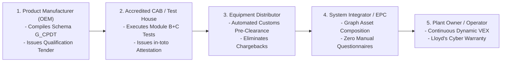
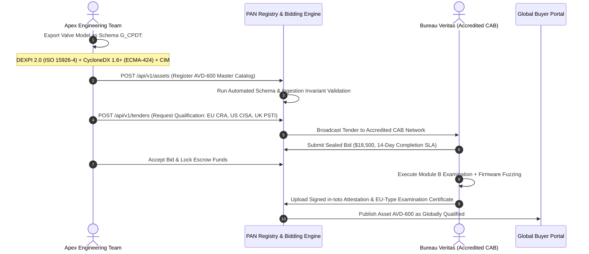
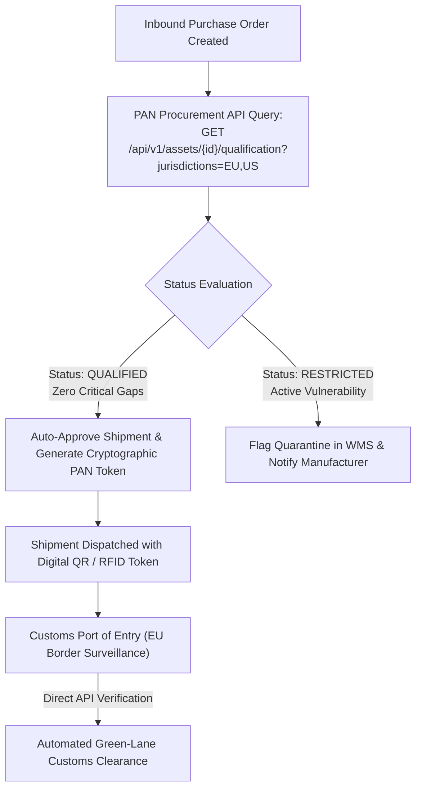
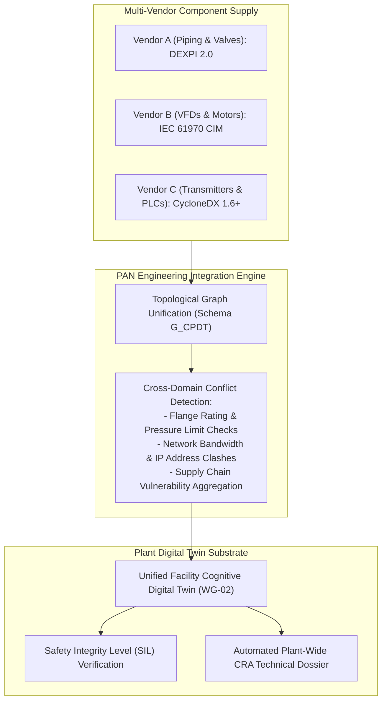
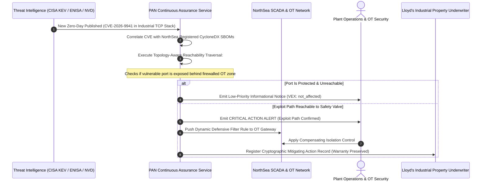
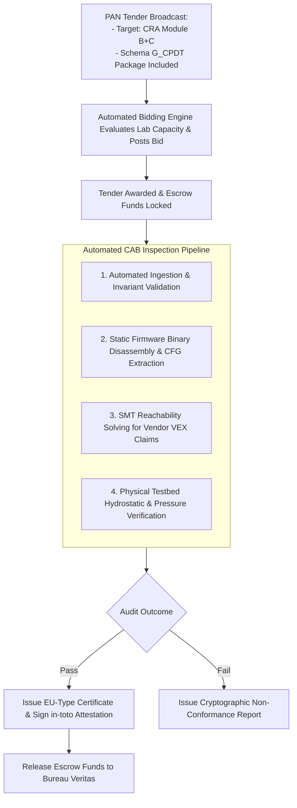

# Five Industrial Supply Chain Assurance Use Cases: From OEM to Operator

## 1. Executive Summary & Scope

Supply chain transparency in cyber-physical industrial equipment cannot remain a theoretical aspiration. As statutory regulations like the European Cyber Resilience Act (Regulation (EU) 2024/2847), the United States FDA Premarket Cybersecurity mandates (Section 524B), and the United Kingdom PSTI Act 2022 take full effect, organizations across the industrial value chain face binding legal responsibilities. Equipment manufacturers must supply comprehensive digital models, distributors must ensure products placed on the market meet statutory baselines, engineering procurement construction (EPC) integrators must assemble complex multi-vendor systems without introducing systemic vulnerabilities, and asset operators must maintain continuous operational integrity over multi-decade lifecycles.

This treatise details five concrete, end-to-end industrial use cases enabled by the Product Assurance Network (PAN) and the Schema G_CPDT open standard (unifying DEXPI 2.0 under the ISO 15926 series and ISO 15926-4, CycloneDX 1.6+ under ECMA-424, and IEC 61970 CIM). We trace the complete operational workflow from the original equipment manufacturer (OEM) registering a component, to the distributor verifying customs compliance, the EPC contractor integrating plant packages, the plant owner enforcing continuous assurance, and the accredited Conformity Assessment Body (CAB) executing independent falsification testing. Each use case demonstrates how PAN eliminates bilateral audit overhead, resolves proprietary software lock-in, and enforces transparency across critical infrastructure.

## 2. Value Chain Integration Architecture

The Product Assurance Network connects every tier of the industrial supply chain through an open, machine-readable digital thread:

## 3. Use Case 1: Industrial Product Manufacturer (OEM)

### 3.1 The Manufacturer Operational Bottleneck
Apex Valve Dynamics manufactures high-pressure, motor-actuated control valves deployed in chemical refineries and hyperscale liquid-cooled data centers. Traditionally, when marketing the `AVD-600` smart valve line, Apex faced severe friction:
- **Bilateral Audit Fatigue**: Every enterprise customer submitted a distinct, proprietary cybersecurity questionnaire (spanning 150 to 300 technical questions) and demanded bespoke mechanical CAD files.
- **CAD Software Hostage**: Apex engineers spent hundreds of hours manually converting internal models from Autodesk AutoCAD Plant 3D and Inventor into proprietary formats requested by European and North American buyers, losing hydraulic flow curves ($C_v$) and instrument wiring diagrams in the process.
- **Regulatory Barriers**: Under European CRA requirements for Important Class I products, Apex could not self-certify without demonstrating full compliance with harmonized European standards, stalling entry into the European single market.

### 3.2 The PAN Solution and Workflow
Apex transitions to the Product Assurance Network:

1. **Open Standard Compilation**: Apex exports the valve model as Schema G_CPDT. The physical geometry, nozzle ratings, and seat materials are serialized in DEXPI 2.0 XML using the ISO 15926-4 reference data library. The embedded ARM Cortex-M4 firmware, FreeRTOS kernel, and wolfSSL cryptographic stack are serialized in CycloneDX 1.6+ JSON (ECMA-424). Electrical connections are mapped in IEC 61970 CIM.
2. **Competitive Tender Issuance**: Apex posts a qualification tender on the PAN marketplace targeting European CRA, United States CISA KEV, and United Kingdom PSTI compliance.
3. **Accredited Verification**: Bureau Veritas submits the winning bid, executes the technical documentation audit, witnesses hydrostatic pressure testing at $1.5 \times \text{MAWP}$, and conducts automated firmware reachability analysis.
4. **Verifiable Credential Publication**: Bureau Veritas signs an in-toto attestation statement using its hardware-backed key and logs the entry to the Sigstore Rekor transparency log.

### 3.3 Economic and Operational Outcome
- **Engineering Hours Saved**: Apex eliminates 85% of redundant compliance engineering labor, replacing bespoke customer surveys with a single verifiable URL.
- **Accelerated Time to Market**: Certification lead time drops from 7 months to 14 business days.
- **Global Commercial Reach**: The `AVD-600` is immediately visible to global EPCs and distributors as a certified, pre-cleared asset.

## 4. Use Case 2: Multi-National Equipment Distributor & Logistics Provider

### 4.1 The Distributor Operational Bottleneck
EuroTrans Industrial Logistics distributes automated fluid handling and electrical equipment across 14 European and North American distribution hubs. Under modern regulations, EuroTrans faces direct statutory and commercial liabilities:
- **Distributor Due Diligence Liability**: Under Article 19 of the EU Cyber Resilience Act, distributors must verify that products bear the CE marking, carry compliant technical documentation, and do not introduce known unpatched vulnerabilities into the single market. Failure to do so exposes the distributor to product recall orders and regulatory penalties up to €10 million or 2% of annual global turnover [1].
- **Customs Holds and Port Delays**: Border authorities increasingly detain shipments of connected industrial equipment lacking verifiable conformity declarations, inflating demurrage and warehouse holding costs.
- **Liquidated Damages and Chargebacks**: When an EPC site rejects a shipment due to missing inspection certificates or unverified firmware revisions, EuroTrans is assessed commercial chargebacks and delay penalties under supply contracts.

### 4.2 The PAN Solution and Workflow
EuroTrans integrates the PAN Procurement API into its enterprise warehouse management system (WMS):

1. **Automated Inventory Qualification**: When a supplier proposes adding a new pump or actuator to EuroTrans catalogs, the WMS queries the PAN `/api/v1/assets/search` endpoint. The system verifies that the product holds an active, unexpired in-toto attestation from an accredited Notified Body.
2. **Customs Pre-Clearance Tokens**: Upon packing an export container, the EuroTrans system generates a cryptographically signed PAN Token containing the asset URN, CAB certificate reference, and Rekor transparency log index.
3. **Automated Border Inspection**: Border surveillance authorities scan the container manifest token against the PAN API gateway. Because the technical documentation, SBOM, and Module B certificates are pre-verified and immutably logged, the shipment bypasses manual customs document holds, moving through automated clearance corridors.

### 4.3 Economic and Operational Outcome
- **Zero Regulatory Fines**: EuroTrans proves strict adherence to distributor due diligence duties under CRA Article 19.
- **Chargeback Elimination**: Paralleling the Amazon APASS model where certified packaging prevents fulfillment chargebacks, PAN qualification guarantees that delivered equipment meets client specifications, eliminating delivery rejection penalties.
- **Logistics Velocity**: Customs dwell time drops from an average of 9 days to under 4 hours.

## 5. Use Case 3: System Integrator & EPC Contractor

### 5.1 The Integrator Operational Bottleneck
Technip-KBR Consortium is executing the engineering, procurement, and construction (EPC) of a €1.2 billion greenfield hydrogen synthesis facility. The project requires integrating over 4,500 discrete mechanical, electrical, and control components sourced from 130 global suppliers:
- **Manual Data Integration**: Mechanical engineers work in AVEVA Everything3D, electrical engineers use ETAP, and control systems engineers work in vendor-specific PLC engineering suites. Merging these designs requires manual data entry from paper cut-sheets, introducing errors in nozzle dimensions, electrical phase ratings, and valve stroke times.
- **Hidden Software Dependencies**: Control valves, flow meters, and variable frequency drives are connected via an industrial Ethernet network. An undocumented open-source software library in a flow meter containing a known vulnerability can compromise the entire plant safety instrumented system (SIS).
- **Commissioning Delays**: Field installation teams discover flange misalignments and protocol incompatibilities during physical assembly, requiring expensive on-site rework and delaying facility startup.

### 5.2 The PAN Solution and Workflow
The EPC contractor establishes the PAN digital clearinghouse as the mandatory procurement interface for all project equipment packages:

1. **Procurement Slot Specification**: The EPC engineering team publishes Tier 1 Functional Requirement Templates (the "Slots") to the PAN Bidding Engine. The template specifies physical boundaries (e.g., 4-inch Class 300 flange, design temperature $180^\circ\text{C}$), cyber posture (IEC 62443-4-2 SL-2, zero CISA KEV entries), and electrical ratings (480V 3-phase).
2. **Automated Catalog Matching**: Suppliers submit Tier 2 Manufacturer Master Models. The PAN engine evaluates topological compatibility automatically:
   $$\text{Match}(\text{Slot}, \text{Model}) = (\text{PipingMatch} \land \text{CyberMatch} \land \text{ElectricalMatch})$$
3. **Plant-Wide Graph Compilation**: As equipment purchase orders are placed, the individual DEXPI 2.0 P&IDs, CycloneDX SBOMs, and CIM electrical networks are compiled into a unified facility digital twin graph.
4. **Automated Cross-Domain Clash Detection**: The engine automatically detects operational discrepancies: for example, flagging a high-pressure pump whose maximum shut-off head exceeds the downstream DEXPI pipe segment design pressure, or identifying a transmitter firmware image that relies on deprecated TLS 1.0 ciphers.

### 5.3 Economic and Operational Outcome
- **Elimination of Bilateral Questionnaires**: The EPC issues zero manual cybersecurity spreadsheets across 130 vendors.
- **Rework Prevention**: Automated physical-cyber clash detection eliminates up to 90% of field piping and control network rework during commissioning.
- **Instant Plant Regulatory Filing**: Technip-KBR generates the facility's complete technical dossier for regulatory authorities directly from the compiled PAN graph, accelerating commercial operating licenses.

## 6. Use Case 4: Critical Infrastructure Plant Owner / Operator

### 6.1 The Operator Operational Bottleneck
NorthSea Energy operates offshore gas production platforms and onshore carbon capture networks. The operating life of these facilities spans 30 years:
- **Dynamic Vulnerability Vulnerability**: A digital valve controller certified in 2026 will encounter hundreds of newly discovered software vulnerabilities across its operating life. Operating staff have no automated way to determine whether a vulnerability published in the National Vulnerability Database (NVD) is reachable or exploitable in their specific installed plant topology.
- **Statutory Reporting Pressures**: Under the EU NIS2 Directive (Directive (EU) 2022/2555) and CRA Article 14, operators of essential entities must report significant cyber threats and incidents within 24 hours. Manual tracking across thousands of field devices makes compliance impossible [2].
- **Insurance Underwriting and War Exclusions**: Under Lloyd's Market Association war exclusions (bulletins Y5381/Y5382), cyber insurers require proof that catastrophic physical failures were not caused by unpatched, state-sponsored cyber operations on unmaintained assets [3].

### 6.2 The PAN Solution and Workflow
NorthSea Energy subscribes its installed asset base to the PAN Continuous Assurance Service:

1. **Digital Asset Registry Ingestion**: NorthSea imports the Tier 3 As-Built Schema G_CPDT models of its offshore platforms directly into its enterprise asset management system.
2. **Continuous Dynamic VEX Ingestion**: When CISA or ENISA publishes a new Common Vulnerabilities and Exposures (CVE) advisory, PAN automatically queries the facility graph. Instead of alerting on every theoretical vulnerability, the PAN engine cross-references the DEXPI instrumentation loop and CIM network topology to verify whether the affected component is exposed to untrusted networks.
3. **Automated Regulatory Incident Logging**: If an exploitable vulnerability impacts a critical process system, the engine automatically formats the technical incident notification required under NIS2 and CRA Article 14, ready for one-click submission to national CSIRTs.
4. **Parametric Insurance Maintenance**: By maintaining a continuously verified asset ledger, NorthSea Energy provides insurers with cryptographic proof of proactive maintenance, securing discounted premiums and avoiding coverage disputes under Lloyd's cyber war exclusion clauses.

### 6.3 Economic and Operational Outcome
- **Vulnerability Noise Reduction**: Eliminates 80% of alert fatigue by mathematically falsifying unreachable vulnerabilities.
- **Audit-Proof Statutory Compliance**: Real-time compliance with NIS2 and CRA Article 14 reporting requirements.
- **Insurance Premium Reductions**: Up to 15% reduction in commercial property and cyber business interruption premiums.

## 7. Use Case 5: Accredited Conformity Assessment Body (CAB) & Testing House

### 7.1 The CAB Operational Bottleneck
Bureau Veritas Industrial Cyber & Physical Inspection Division is an accredited European Notified Body (NB 0062) and global testing organization:
- **High Business Development Costs**: Traditional certification engagements require prolonged bilateral sales cycles, customized scoping proposals, and high administrative friction.
- **Inconsistent Client Documentation**: Clients submit technical documentation in arbitrary formats: unstructured PDF manuals, spreadsheets, scanned schematics, and fragmented code repositories. Auditors spend up to 40% of billable project time structuring customer data before technical evaluation can begin.
- **Subjective Vendor VEX Claims**: Manufacturers declare complex firmware vulnerabilities as `not_affected` using ambiguous justifications (`code_not_reachable`) that are labor-intensive to falsify through manual reverse engineering.

### 7.2 The PAN Solution and Workflow
Bureau Veritas integrates with the PAN Bidding Marketplace:

1. **Automated Tender Ingestion**: The Bureau Veritas bidding agent monitors the PAN API. When a manufacturer posts a qualification tender matching Bureau Veritas laboratory capabilities (such as CRA Module B for Important Class II valve controllers and pressure vessels), the system generates an algorithmic bid based on real-time bench availability.
2. **Standardized Technical Input**: Upon tender award, Bureau Veritas ingests an authoritative Schema G_CPDT package. The auditor receives verified DEXPI 2.0 geometry, ECMA-424 CycloneDX software inventories, and CIM electrical schematics that compile cleanly into automated audit tools.
3. **Automated VEX Falsification**: The laboratory uses automated symbolic execution tools to verify vendor VEX reachability claims. If a vendor claims a vulnerable OpenSSL function is not callable, the SMT solver proves or disproves the claim mathematically in minutes.
4. **Verifiable Credential Issuance**: The lead auditor signs the digital certificate using an Ed25519 hardware key, logs the statement to Sigstore Rekor, and triggers immediate escrow fund release.

### 7.3 Economic and Operational Outcome
- **Testing Throughput**: Laboratory evaluation capacity increases by 300% due to standardized machine-readable inputs.
- **Zero Receivables Risk**: Testing fees are locked in neutral escrow before laboratory work begins and released immediately upon attestation publication.
- **Global Commercial Pipeline**: The CAB gains access to a worldwide stream of industrial manufacturers without sustaining expensive direct sales forces.

## 8. Comparative Value Realization Matrix

The following matrix summarizes the quantifiable operational benefits delivered across all five supply chain stakeholders:

| Stakeholder Role | Primary Pre-PAN Friction | PAN Mechanism | Key Quantitative Benefit |
|---|---|---|---|
| **Product Manufacturer (OEM)** | Trapped in proprietary CAD; 200+ custom spreadsheets per year; 7-month certification delay. | Single Schema G_CPDT registration; competitive CAB qualification bidding engine. | 85% reduction in compliance labor; time-to-market reduced from 7 months to 14 days. |
| **Equipment Distributor** | Border customs holds; liability under CRA Article 19; liquidated damages from buyer rejections. | PAN Procurement API integration; automated customs pre-clearance tokens; chargeback avoidance. | Zero shipment rejections; customs dwell time reduced from 9 days to under 4 hours. |
| **System Integrator / EPC** | Manual data entry across CAD tools; undetected cyber-physical clashes; multi-month audits. | Topological graph composition; automated multi-vendor conflict checks; instant plant filings. | Zero manual questionnaires across 130+ suppliers; 90% reduction in field piping rework. |
| **Plant Owner / Operator** | Vulnerability alert fatigue; 24h incident reporting under NIS2/CRA; Lloyd's war exclusions. | Continuous dynamic VEX monitoring; automated CSIRT notification; parametric warranty ledger. | 80% reduction in alert noise; up to 15% reduction in industrial property insurance premiums. |
| **Accredited CAB / Test Lab** | Protracted sales cycles; unstructured client PDF files; manual reverse engineering of VEX claims. | Automated marketplace bidding; standardized Schema G_CPDT inputs; automated SMT falsification. | 3x increase in laboratory audit throughput; zero receivables delay via escrow settlement. |

## 9. Conclusion

The Product Assurance Network bridges the critical gap between international regulatory mandates and day-to-day industrial engineering operations. By anchoring the verification lifecycle in open, machine-readable specifications (Schema G_CPDT) and establishing a transparent two-sided testing marketplace, PAN delivers tangible economic and operational benefits to every participant in the supply chain. From the component builder seeking global distribution, to the logistics provider avoiding customs holds, the EPC contractor integrating complex facilities, the operator defending critical infrastructure, and the accredited laboratory scaling assurance services, PAN establishes a unified, auditable, and resilient foundation for global industrial manufacturing.

## References

- [1] European Parliament and Council, "Regulation (EU) 2024/2847 on horizontal cybersecurity requirements for products with digital elements (Cyber Resilience Act)," Official Journal of the European Union, vol. L, 2024.
- [2] European Parliament and Council, "Directive (EU) 2022/2555 on measures for a high common level of cybersecurity across the Union (NIS2 Directive)," Official Journal of the European Union, vol. L 333, 2022.
- [3] Lloyd's Market Association, "Cyber War and Cyber Operation Exclusion Clauses (LMA5564, LMA5565, Y5381, Y5382)," LMA Bulletin, London, UK, 2023.
- [4] Ecma International, "CycloneDX Bill of Materials Specification," Standard ECMA-424, 1st ed., Geneva, Switzerland, 2024.
- [5] International Organization for Standardization, "Industrial automation systems and integration -- Integration of life-cycle data for process plants including oil and gas production facilities -- Part 4: Initial reference data library," ISO 15926-4:2024, 2024.
- [6] in-toto Project, "in-toto Attestation Framework Specification v1.0," Linux Foundation, Tech. Rep. IN-TOTO-2023-01, 2023.
- [7] United States Congress, "Consolidated Appropriations Act, 2023 (Section 524B: Ensuring Device Cybersecurity)," Public Law 117-328, 136 Stat. 4459, 2022.
