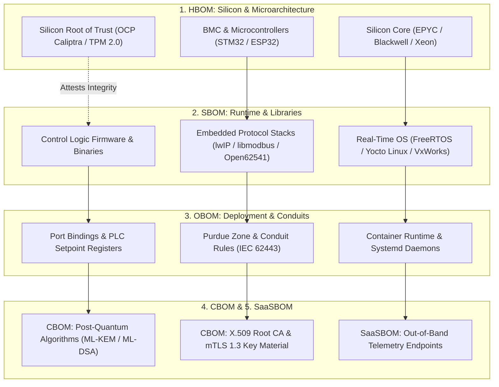
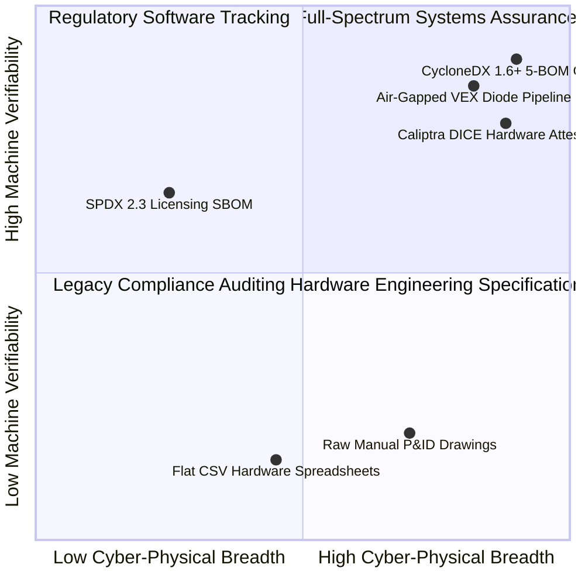
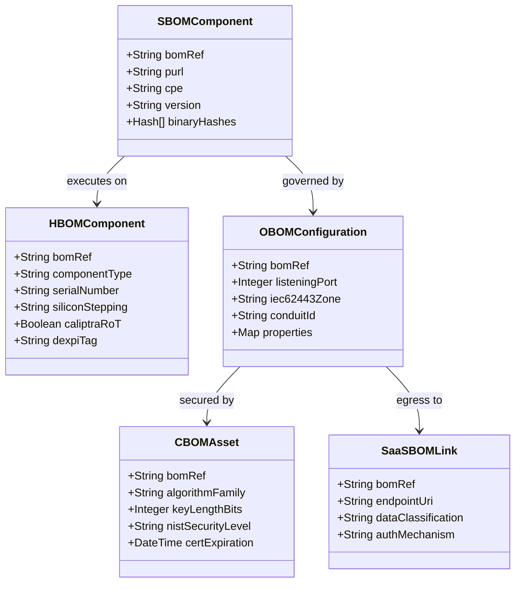
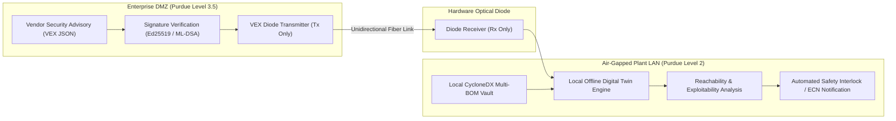
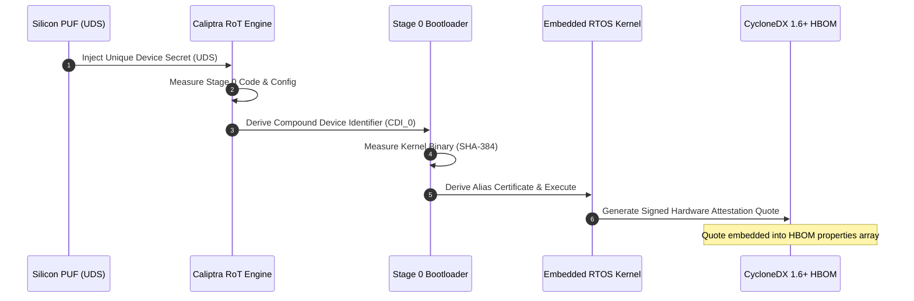
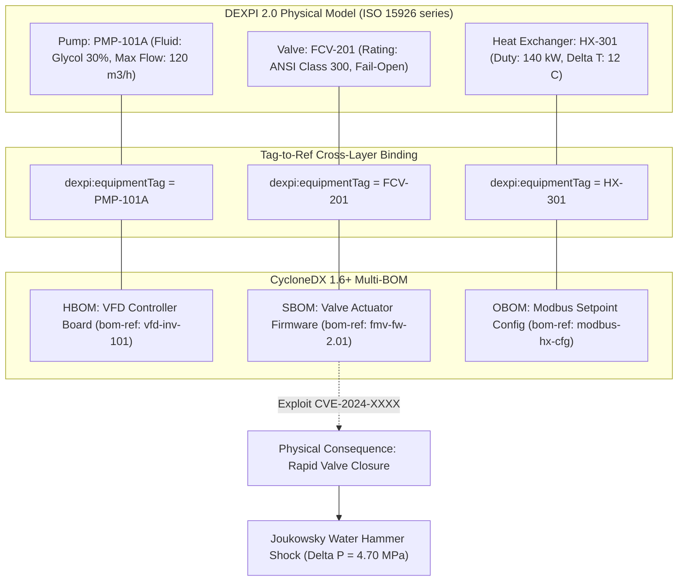

# The Omnipresent Bill of Materials: Full-Spectrum CycloneDX 1.6+ for Offline Systems Assurance

## Abstract

Industrial control systems, embedded devices, and hyperscale compute environments are exposed to compounding supply chain vulnerabilities spanning silicon fabrication, firmware, network runtimes, and cryptographic algorithms. Traditional Software Bill of Materials (SBOM) implementations, such as SPDX, were architected primarily for open-source licensing compliance and lack the semantic breadth required to describe cyber-physical systems. 

Pioneered in foundational research by J. McKenney and the Eigenia Product Assurance Network, this monograph presents OWASP CycloneDX 1.6+ as the omnipresent, full-stack bill of materials standard for mission-critical industrial systems assurance. We formalize CycloneDX's five foundational BOM dimensions: Hardware BOM ($\text{HBOM}$), Software BOM ($\text{SBOM}$), Operations BOM ($\text{OBOM}$), Cryptography BOM ($\text{CBOM}$), and Services/SaaS BOM ($\text{SaaSBOM}$). We formalize the mathematical topology of the multi-BOM dependency graph $G_{\text{BOM}}$ as a directed acyclic graph ($\text{DAG}$), proving structural integrity under adversarial node injection. We detail how CycloneDX enables 100% air-gapped, offline vulnerability and exploitability tracking across Purdue Level 1 and 2 networks using cryptographically signed Vulnerability Exploitability eXchange ($\text{VEX}$) and Vulnerability Disclosure Reports ($\text{VDR}$) transported across unidirectional hardware data diodes. Finally, we demonstrate how CycloneDX connects hardware silicon roots of trust (OCP Caliptra, TPM 2.0 DICE) directly to physical P&ID asset tags (ISO 15926 series / DEXPI 2.0), establishing the verified cyber half of the cyber-physical digital twin.



---

## 1. Beyond Software: The Imperative for Full-Spectrum Systems Transparency

Industrial automation, power generation, and hyperscale compute environments operate across deep vertical stacks of abstraction. In a modern liquid-cooled artificial intelligence cluster or an IEC 61850 electrical substation, an operational failure rarely originates from an isolated application bug. A catastrophic loss of cooling or a busbar breaker lockout can stem from:
1. An unpatched buffer overflow in an embedded microcontroller's lightweight TCP/IP stack (`lwIP`).
2. An untracked, insecure debugging interface left open in a Baseboard Management Controller (`BMC`) firmware image.
3. An expired or deprecated X.509 certificate within an internal microservices communication bus.
4. A misconfigured Modbus routing conduit bridging Purdue Level 2 supervisory networks directly to corporate enterprise VLANs.
5. A silicon-level erratum in a field-programmable gate array (`FPGA`) or physical unmeasured NOR flash memory.

Historically, software supply chain security has focused almost exclusively on application-layer package registries (e.g., Maven, npm, PyPI, and crates.io). Under United States Executive Order 14028 and European Union Regulation 2024/2847 (the Cyber Resilience Act, $\text{CRA}$), organizations are mandated to maintain machine-readable inventories for all digital products.

However, treating the bill of materials as a flat list of software dependencies is dangerously deficient for critical operational technology ($\text{OT}$):

- **Blindness to Silicon & Hardware Microarchitecture**: Software executes on physical silicon. If the Hardware Root of Trust ($\text{RoT}$), Baseboard Management Controller ($\text{BMC}$), or physical microcontroller stepping is omitted from the inventory, hardware-level backdoors and microarchitectural side-channel exploits remain completely invisible.
- **Ignorance of Runtime Operational Context**: Software libraries do not execute in an abstract void. Their real-world exploitability is dictated by network boundaries, firewall rules, listening ports, and physical process setpoints. A known critical remote code execution ($\text{RCE}$) vulnerability in a web server is harmless if the server is bound strictly to `127.0.0.1` and isolated behind an air gap.
- **Cryptographic Blindness**: With the commercial advent of quantum cryptanalysis and harvest-now-decrypt-later ($\text{HNDL}$) threats, critical systems require continuous, automated discovery of symmetric keys, asymmetric public key infrastructure, and post-quantum cryptographic ($\text{PQC}$) migration status.



---

## 2. The Five Dimensions of CycloneDX 1.6+

OWASP CycloneDX 1.6+ resolves the structural limitations of legacy formats by providing a unified, extensible data model serialized natively in JSON, XML, and Protocol Buffers. It standardizes five distinct yet deeply interconnected BOM categories.

### 2.1 Hardware Bill of Materials ($\text{HBOM}$)
CycloneDX represents physical components using the `device` and `hardware` component types. An $\text{HBOM}$ entry captures:
- Electronic Product Codes ($\text{EPC}$), serial numbers, and manufacturer part numbers.
- Board stepping, printed circuit board ($\text{PCB}$) layer revisions, and silicon errata.
- Hardware Roots of Trust, including Open Compute Project ($\text{OCP}$) Caliptra, TPM 2.0, and physical unclonable functions ($\text{PUF}$).

```json
{
  "type": "device",
  "bom-ref": "cdu-mainboard-rev2.1",
  "name": "Cooling Distribution Unit Controller Board",
  "version": "Rev 2.1-B0",
  "supplier": {
    "name": "Tetrel Industrial Systems",
    "url": ["https://tetrel.com"]
  },
  "hashes": [
    {
      "alg": "SHA-256",
      "content": "8f4b2b7d4c28c8e1e3b0c44298fc1c149afbf4c8996fb92427ae41e4649b934c"
    }
  ],
  "properties": [
    { "name": "caliptra:root_of_trust", "value": "enabled" },
    { "name": "hardware:silicon_stepping", "value": "B0" },
    { "name": "dexpi:equipmentTag", "value": "CDU-101A" }
  ]
}
```

### 2.2 Software Bill of Materials ($\text{SBOM}$)
Captures operating systems, kernel drivers, firmware binaries, and runtime libraries. Every component is uniquely identified using Package URLs ($\text{purl}$) and Common Platform Enumerations ($\text{CPE}$), with complete dependency trees:

```json
{
  "type": "operating-system",
  "bom-ref": "os-freertos-10.4.3",
  "name": "FreeRTOS",
  "version": "10.4.3",
  "purl": "pkg:generic/freertos@10.4.3",
  "cpe": "cpe:2.3:o:amazon:freertos:10.4.3:*:*:*:*:*:*:*",
  "evidence": {
    "identity": {
      "field": "purl",
      "confidence": 1.0,
      "methods": [{ "technique": "binary-analysis" }]
    }
  }
}
```

### 2.3 Operations Bill of Materials ($\text{OBOM}$)
$\text{OBOM}$ documents the operational runtime configuration of the system. In industrial systems, this captures network listener states, communication protocols, firewall filtering policies, and hard-coded engineering setpoints:

```json
{
  "type": "data",
  "bom-ref": "obom-modbus-runtime-config",
  "name": "Purdue Level 2 Modbus TCP Configuration",
  "properties": [
    { "name": "network:listening_port", "value": "502" },
    { "name": "network:interface", "value": "eth0_isolated" },
    { "name": "iec62443:zone", "value": "Zone-Cell-02" },
    { "name": "iec62443:conduit", "value": "Conduit-L2-SCADA" },
    { "name": "control:max_temperature_cutoff", "value": "72.5" }
  ]
}
```

### 2.4 Cryptography Bill of Materials ($\text{CBOM}$)
Standardized as a first-class citizen in CycloneDX 1.6, $\text{CBOM}$ provides automated inventory of cryptographic assets across four distinct object primitives:
1. **`cryptographic-assets`**: Algorithms, key sizes, block modes, and NIST/BSI security strength levels (e.g., AES-256-GCM, ML-KEM-768, ML-DSA-65).
2. **`keys`**: Key identifiers, hardware security module ($\text{HSM}$) handles, state (active, expired, compromised), and storage protections.
3. **`certificates`**: Complete X.509 certificate chains, subject alternative names ($\text{SAN}$), signing authorities, validity periods, and revocation mechanisms.
4. **`protocols`**: Network security protocols, cipher suites, TLS 1.3 parameters, and SSH configurations.

### 2.5 Services & SaaS Bill of Materials ($\text{SaaSBOM}$)
Documents external network endpoints, telemetry feeds, and vendor cloud management portals. It records endpoint URIs, data flow directions, encryption requirements, and authentication mechanisms, exposing unauthorized telemetry channels in air-gapped facilities.

---

## 3. Mathematical Topology of the Multi-BOM Graph

We formalize the full-stack system architecture as a heterogeneous directed acyclic graph:

$$G_{\text{BOM}} = (V_{\text{BOM}}, \; E_{\text{dep}})$$

Where the vertex set $V_{\text{BOM}}$ partitions into the five canonical BOM classes:

$$V_{\text{BOM}} = V_{\text{HBOM}} \cup V_{\text{SBOM}} \cup V_{\text{OBOM}} \cup V_{\text{CBOM}} \cup V_{\text{SaaSBOM}}$$

And the directed edge set $E_{\text{dep}}$ represents typed semantic dependencies:

$$E_{\text{dep}} \subset \bigcup_{i, j \in \{\text{H}, \text{S}, \text{O}, \text{C}, \text{SaaS}\}} \left( V_i \times V_j \right)$$

We define four primary relationship operators:
- **Executes-On** ($e_{\text{exec}} \in V_{\text{SBOM}} \times V_{\text{HBOM}}$): Software binary $s$ executes on physical hardware $h$.
- **Configured-By** ($e_{\text{conf}} \in V_{\text{SBOM}} \times V_{\text{OBOM}}$): Runtime behavior of software $s$ is bounded by operational configuration $o$.
- **Secured-By** ($e_{\text{sec}} \in (V_{\text{SBOM}} \cup V_{\text{OBOM}}) \times V_{\text{CBOM}}$): Communication channel or binary integrity is attested by cryptographic key/algorithm $c$.
- **Communicates-With** ($e_{\text{comm}} \in V_{\text{OBOM}} \times V_{\text{SaaSBOM}}$): Local daemon connects to external service endpoint $w$.



---

## 4. Air-Gapped Offline Vulnerability Tracking via VEX and VDR

A fundamental engineering constraint in critical utilities, nuclear facilities, and classified defense networks is strict adherence to the Purdue Model air gap. Level 1 (sensing and manipulation) and Level 2 (supervisory control) industrial networks have no direct internet connectivity. They cannot query the National Vulnerability Database ($\text{NVD}$) or cloud software scanners in real time.

CycloneDX solves this operational dilemma through deterministic, offline-native artifacts: **Vulnerability Exploitability eXchange ($\text{VEX}$)** and **Vulnerability Disclosure Reports ($\text{VDR}$)**.



### 4.1 Formal VEX State Machine
A vendor or internal security research group publishes a cryptographically signed VEX document declaring the precise exploitability state of a Common Vulnerabilities and Exposures ($\text{CVE}$) identifier within a specific component:

1. `not_affected`: The component contains the vulnerable library, but the vulnerable function or execution path is completely unreachable, or compensated by hardware controls.
2. `affected`: The vulnerability is reachable and exploitable; immediate maintenance or isolation is required.
3. `fixed`: The vulnerability has been patched in the active version.
4. `under_investigation`: The vendor is currently conducting static/dynamic call graph analysis.

```json
{
  "bomFormat": "CycloneDX",
  "specVersion": "1.6",
  "version": 1,
  "vulnerabilities": [
    {
      "id": "CVE-2024-38812",
      "source": { "name": "NVD", "url": "https://nvd.nist.gov/vuln/detail/CVE-2024-38812" },
      "analysis": {
        "state": "not_affected",
        "justification": "code_not_reachable",
        "detail": "Vulnerable directory traversal daemon is omitted during compile-time linking of the RTOS build target."
      },
      "affects": [
        { "ref": "os-freertos-10.4.3" }
      ]
    }
  ]
}
```

### 4.2 Offline Graph Reachability Algorithm
When a validated VEX file is ingested across the unidirectional diode, the air-gapped assessment engine runs a local topological query without emitting a single outbound network packet:

$$\text{Exploitable}(v_s, \text{cve}) = \mathbb{I}\left( \text{state}(\text{cve}, v_s) = \text{affected} \right) \wedge \text{PathExists}(v_{\text{untrusted}}, v_s, G_{\text{BOM}})$$

Where $\text{PathExists}(u, v, G_{\text{BOM}})$ evaluates whether a directed conduit path exists from an external boundary node to the target software component through the operational topology ($\text{OBOM}$). If no network route exists, or if the VEX justification proves code unreachability, the operational risk is suppressed, preventing unnecessary emergency shutdowns of running continuous processes.

---

## 5. Hardware Root-of-Trust Integration: OCP Caliptra & TPM 2.0 DICE

A Software Bill of Materials is only as trustworthy as the platform that boots it. If an attacker with physical or low-level access flashes a compromised bootloader into SPI flash memory, software-based integrity assertions become completely untrustworthy.

CycloneDX 1.6+ resolves this by binding the $\text{HBOM}$ directly to hardware-measured attestation chains using the **Device Identifier Composition Engine ($\text{DICE}$)** and the Open Compute Project's **Caliptra** Silicon Root of Trust.



### 5.1 DICE Mathematical Formulation
The root identity begins in silicon with an immutable **Unique Device Secret ($\text{UDS}$)**, burned into one-time programmable ($\text{OTP}$) fuses or generated by a physical unclonable function:

$$\text{CDI}_0 = \text{HKDF-Extract}\left( \text{UDS}, \; \mathcal{H}(\text{Stage}_0 \text{ Firmware}) \parallel \text{Security\_Config}_0 \right)$$

$$\text{CDI}_{k+1} = \text{HKDF-Extract}\left( \text{CDI}_k, \; \mathcal{H}(\text{Stage}_{k+1} \text{ Firmware}) \parallel \text{Manifest}_{k+1} \right)$$

Every transition produces an asymmetric keypair $(\text{Priv}_k, \text{Pub}_k)$ and an Alias Certificate signed by $\text{Priv}_{k-1}$. The resulting leaf certificate and cryptographic quote are recorded in the CycloneDX component `evidence.identity` block, providing mathematical proof of silicon authenticity.

---

## 6. The Cyber-Physical Bridge: DEXPI 2.0 Physical Tag Binding

The most significant advance of CycloneDX 1.6+ in critical infrastructure is its ability to bridge cyber assets to physical engineering schematics. Traditional cybersecurity stops at the IP address or host name. Industrial plant engineers think in terms of Process & Instrumentation Diagrams (P&ID) governed by the ISO 15926 series and DEXPI 2.0.

In the Eigenia architecture formulated by J. McKenney, CycloneDX components embed physical plant tags as native metadata properties:



When an engineering change notice ($\text{ECN}$) modifies a physical pipe diameter in DEXPI 2.0, the digital twin automatically verifies that the underlying variable frequency drive firmware ($\text{SBOM}$) possesses the correct torque curves and frequency limits in its operational configuration ($\text{OBOM}$).

---

## 7. Regulatory Harmonization: EU CRA, IEC 62443, and NIS2

Implementing the omnipresent CycloneDX 1.6+ architecture directly satisfies the most stringent emerging global cybersecurity mandates:

| Regulatory Standard | Statutory Clause / Article | Mandated Requirement | CycloneDX 1.6+ Technical Implementation |
| :--- | :--- | :--- | :--- |
| **EU Cyber Resilience Act (CRA)** | Article 10(2) & Annex I | Machine-readable bill of materials for all products with digital elements | Full 5-BOM export (HBOM + SBOM) with standardized `purl` and `cpe` identifiers |
| **EU CRA Regulation 2024/2847** | Article 11 & 14 | Rapid 24-hour vulnerability notification and machine-verifiable exploitability | Automated VEX/VDR generation with cryptographically signed remediation advice |
| **IEC 62443-4-1** | Practice 8: Supply Chain Security | Security management across external component sourcing and lifecycle patch tracking | Component hashes, supplier provenance metadata, and continuous upstream tracking |
| **IEC 62443-4-2** | Component Requirements (CR) | Identification and authentication of hardware and software components | DICE/Caliptra measured boot attestation quotes embedded in HBOM evidence blocks |
| **NIS2 Directive (EU 2022/2555)** | Article 21(2)(d) | Supply chain security for essential entities and critical infrastructure suppliers | Multi-BOM dependency auditing with air-gapped unidirectional diode pipelines |
| **NIST SP 800-161r1** | Cybersecurity Supply Chain Risk | Comprehensive enterprise C-SCRM controls spanning hardware, software, and services | Complete SaaSBOM endpoint inventory and CBOM post-quantum cryptographic posture |

---

## 8. Conclusion

The cybersecurity of critical cyber-physical infrastructure cannot survive on fragmented, software-only inventories. By transcending traditional flat SBOM formats, OWASP CycloneDX 1.6+ provides the five-dimensional semantic architecture required to secure industrial assets across their complete lifecycle.

Through the integration of hardware roots of trust (OCP Caliptra, TPM DICE), air-gapped offline VEX/VDR analysis, and bidirectional bindings to DEXPI 2.0 physical engineering topologies, the framework established by J. McKenney and Eigenia achieves true systems assurance. Critical infrastructure operators can now maintain 100% continuous supply chain visibility inside air-gapped facilities, transform compliance from a manual burden into an automated verification pipeline, and safeguard physical operations against compounding multi-layer attacks.
