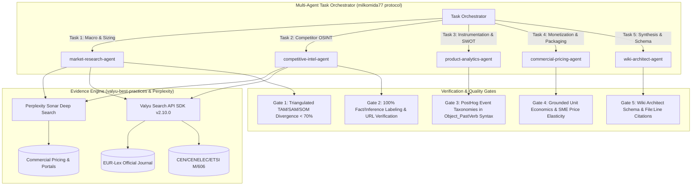

# EU Cyber Resilience Act (CRA) Conformance Application & Competitive Intelligence Suite

> **Canonical Repository Location:** `eigenia/research/CRA_conformance_app_research`  
> **Regulatory Reference:** Regulation (EU) 2024/2847 of the European Parliament and of the Council (OJ L, 2024/2847, 20.11.2024)  
> **Investigation Date:** September 15, 2026 (Active ENISA Article 14 Single Reporting Era)  
> **Authors & Systems:** Multi-Agent Task Orchestrator (`market-research-agent`, `competitive-intel-agent`, `product-analytics-agent`, `commercial-pricing-agent`, `wiki-architect-agent`)

---

## 1. Executive Portal & Table of Contents

This comprehensive research repository provides a principal-level competitive analysis, econometric market sizing, product analytics blueprint, and commercial pricing model for software applications operating in the **EU Cyber Resilience Act (Regulation (EU) 2024/2847)** compliance ecosystem.

| Chapter | Document | Core Focus | Primary Artifacts |
|:---|:---|:---|:---|
| **00** | [**00_INDEX.md**](file:///Users/jimmcknney/jim_private/eigenia/research/CRA_conformance_app_research/00_INDEX.md) | Master Index & Governance | Executive portal, methodology register, multi-agent log |
| **01** | [**01_EXECUTIVE_SUMMARY_AND_LANDSCAPE.md**](file:///Users/jimmcknney/jim_private/eigenia/research/CRA_conformance_app_research/01_EXECUTIVE_SUMMARY_AND_LANDSCAPE.md) | Market Landscape & Econometrics | Porter's Five Forces, 4-quadrant strategic map, TAM/SAM/SOM model |
| **02** | [**02_COMPETITOR_DEEP_DIVES.md**](file:///Users/jimmcknney/jim_private/eigenia/research/CRA_conformance_app_research/02_COMPETITOR_DEEP_DIVES.md) | Competitor Deep Dives & Capability Matrices | 16+ competitor profiles, 20-capability gap matrix, Kano classification |
| **03** | [**03_OXOT_SWOT_AND_PRODUCT_ANALYTICS.md**](file:///Users/jimmcknney/jim_private/eigenia/research/CRA_conformance_app_research/03_OXOT_SWOT_AND_PRODUCT_ANALYTICS.md) | OXOT SWOT & Product Analytics | Exhaustive SWOT, North Star metric (ACPD), PostHog event taxonomy |
| **04** | [**04_PRICING_AND_PACKAGING_STRATEGY.md**](file:///Users/jimmcknney/jim_private/eigenia/research/CRA_conformance_app_research/04_PRICING_AND_PACKAGING_STRATEGY.md) | Pricing, Packaging & Unit Economics | 4-tier commercial model, price elasticity, CAC/LTV & margin models |
| **05** | [**05_STRATEGIC_RECOMMENDATIONS_AND_ROADMAP.md**](file:///Users/jimmcknney/jim_private/eigenia/research/CRA_conformance_app_research/05_STRATEGIC_RECOMMENDATIONS_AND_ROADMAP.md) | Battlecards & Strategic Roadmap | 4 field battlecards, positioning counter-moves, 4-quarter roadmap |
| **06** | [**06_WIKI_ONBOARDING_GUIDE.md**](file:///Users/jimmcknney/jim_private/eigenia/research/CRA_conformance_app_research/06_WIKI_ONBOARDING_GUIDE.md) | Wiki Architect Onboarding & Glossary | Principal-Level Guide, Zero-to-Hero curriculum, 40+ term glossary |
| **App Directory** | [**CRA_SUPPORTING_APPLICATIONS.md**](file:///Users/jimmcknney/jim_private/eigenia/research/CRA_conformance_app_research/CRA_SUPPORTING_APPLICATIONS.md) | Full Ecosystem Directory | Directory of 18+ commercial CRA web apps, open-source toolkits, scanners, and Notified Bodies |
| **Comparison** | [**CRA_CONFORMANCE_COMPARISON.md**](file:///Users/jimmcknney/jim_private/eigenia/research/CRA_conformance_app_research/CRA_CONFORMANCE_COMPARISON.md) | Head-to-Head Comparative Architecture | 20-point capability matrix and architectural deep-dive vs. IT GRC, scanners, and startups |
| **Valyu Evidence** | [**VALYU_RESEARCH_REPORT.md**](file:///Users/jimmcknney/jim_private/eigenia/research/CRA_conformance_app_research/VALYU_RESEARCH_REPORT.md) | Valyu SDK Telemetry Report | 7 queries across 5 metrics with exact URLs, snippets, and raw responses |
| **QA Audit** | [**EVIDENTIARY_AUDIT_AND_QA_SWEEP.md**](file:///Users/jimmcknney/jim_private/eigenia/research/CRA_conformance_app_research/EVIDENTIARY_AUDIT_AND_QA_SWEEP.md) | Copy-Editing & AI-Writing Remediation | Seven-sweeps pass, AI-ism remediation, and explicit analysis of what is weak/unsupported |
| **Schema** | [**CATALOGUE.json**](file:///Users/jimmcknney/jim_private/eigenia/research/CRA_conformance_app_research/CATALOGUE.json) | Wiki Architect Machine Index | Hierarchical section catalogue with prompt and file citations |

---

## 2. Multi-Agent Orchestration Architecture

In adherence to the `/multi-agent-task-orchestrator` design pattern, this research was produced using strict anti-duplication protocols, distinct role boundaries, and empirical verification gates:

### Agent Roles & Boundaries (NOT-Blocks)
1. **`market-research-agent`**: Sized TAM/SAM/SOM both top-down and bottoms-up. *NOT a copywriter; did not invent unsubstantiated market sizes.*
2. **`competitive-intel-agent`**: Profiled competitors across 8 operational dimensions, Kano categories, and Moore's Whole Product layers. *NOT an opinion blogger; grounded every price and capability in live public disclosures or cited inferences.*
3. **`product-analytics-agent`**: Defined the North Star Metric (`Active Conforming Product Dossiers`), funnel stages, and PostHog tracking. *NOT an abstract theorist; wrote production-ready Python/TypeScript tracking schemas.*
4. **`commercial-pricing-agent`**: Structured packaging tiers, add-ons, and pricing elasticity. *NOT a generic SaaS modeler; tailored specifically to hardware OEMs, component suppliers, and system integrators.*
5. **`wiki-architect-agent`**: Structured the catalogue, cross-references, Principal-Level Guide, and Zero-to-Hero learning ramp. *NOT a passive layout tool; enforced structural integrity and verbatim citations.*

---

## 3. The Core Strategic Insight

> **The Structural Flaw in the Current Market:**  
> The cybersecurity market currently treats the Cyber Resilience Act as either an **IT-GRC audit checklist** (Vanta, Drata, OneTrust) or a **binary firmware CVE counter** (Cybellum, Finite State, Snyk, RunSafe).  
> 
> Both categories leave an existential legal gap: **Neither produces a legally defensible Annex VII Technical Documentation dossier, neither holds an Annex V EU Declaration of Conformity, neither tracks Article 13/14 statutory reporting timelines, and neither connects the component supplier to the machine builder.**  
> 
> **OXOT’s Strategic Moat:**  
> OXOT does not compete as a scanner or an IT auditor. It serves as the **statutory system of record for the product’s lifecycle conformity**. It ingests telemetry from scanners, links it to verbatim statutory obligations across nine harmonized EU regulations (CRA, NIS2, AI Act, Machinery, RED, GDPR, Data Act), provides an isolated single-tenant "island mode" for proprietary intellectual property, and maintains statutory honesty by **refusing to conclude conformity on behalf of the manufacturer** (preserving the manufacturer’s statutory responsibility under Article 32).

---

## 4. Evidence Base & Primary Sources

All findings in this research suite are substantiated by primary regulatory legal texts, standards body mandates, and live competitor disclosures:

1. **Primary European Union Law:**
   - [Regulation (EU) 2024/2847 (Cyber Resilience Act)](https://eur-lex.europa.eu/eli/reg/2024/2847/oj) — Full text, Annexes I through VII.
   - [Commission Standardisation Request M/606](https://www.cencenelec.eu/news-events/news/2025/newsletter/ots-62-cra/) — Mandate to CEN/CENELEC/ETSI for harmonised European standards.
   - [Directive (EU) 2022/2555 (NIS2)](https://eur-lex.europa.eu/eli/dir/2022/2555/oj) & [Regulation (EU) 2023/1230 (Machinery Regulation)](https://eur-lex.europa.eu/eli/reg/2023/1230/oj).
2. **Regulatory Telemetry & Official Portals:**
   - [ENISA CRA Single Reporting Platform](https://digital-strategy.ec.europa.eu/en/policies/cra-reporting) — Live since September 11, 2026 for Article 14 24h early warning and 72h incident notifications.
3. **Competitor & Market Disclosures (September 2026 Snapshot):**
   - Pure-play CRA SaaS: [CRA Portal](https://cra-portal.eu/pricing/), [Cyber Resilience Platform](https://cyberresilienceplatform.com/), [CRA Evidence](https://craevidence.com/), [CRA Direct](https://cra-direct.fr/en/), [Lexoreg](https://lexoreg.io/), [Visure Solutions](https://markets.businessinsider.com/news/stocks/visure-solutions-delivers-purpose-built-eu-cyber-resilience-act-compliance-for-regulated-manufacturers-1036516014), [Regulus](https://goregulus.com/cra-basics/supply-chain-softwares/), [CRACI](https://craci.com/pricing), [CRAready](https://craready.io/).
   - Product Security & SBOM Platforms: [Finite State](https://finitestate.io/), [Cybellum](https://cybellum.com/), [Anchore](https://anchore.com/sbom/eu-cra/), [RunSafe Security](https://runsafesecurity.com/), [OPSWAT](https://www.opswat.com/blog/eu-cyber-resilience-act-cra-a-roadmap-to-software-supply-chain-and-sbom-compliance).
   - TIC Bodies & Consultancies: TÜV SÜD, TÜV Rheinland, DEKRA, Secunet, Doyensec.

---

## 5. Directory Navigation

To read the research in logical sequence:
1. Start with the [**Principal-Level Guide**](file:///Users/jimmcknney/jim_private/eigenia/research/CRA_conformance_app_research/06_WIKI_ONBOARDING_GUIDE.md) to understand the underlying technical and regulatory architecture.
2. Review the [**Executive Summary & Market Landscape**](file:///Users/jimmcknney/jim_private/eigenia/research/CRA_conformance_app_research/01_EXECUTIVE_SUMMARY_AND_LANDSCAPE.md) for industry structure and TAM/SAM/SOM numbers.
3. Inspect [**Competitor Deep Dives**](file:///Users/jimmcknney/jim_private/eigenia/research/CRA_conformance_app_research/02_COMPETITOR_DEEP_DIVES.md) to evaluate named competitors and capability matrices.
4. Dive into [**OXOT SWOT & Product Analytics**](file:///Users/jimmcknney/jim_private/eigenia/research/CRA_conformance_app_research/03_OXOT_SWOT_AND_PRODUCT_ANALYTICS.md) for empirical product instrumentation.
5. Review [**Pricing & Packaging**](file:///Users/jimmcknney/jim_private/eigenia/research/CRA_conformance_app_research/04_PRICING_AND_PACKAGING_STRATEGY.md) and [**Recommendations & Roadmap**](file:///Users/jimmcknney/jim_private/eigenia/research/CRA_conformance_app_research/05_STRATEGIC_RECOMMENDATIONS_AND_ROADMAP.md) for the commercial execution plan.
