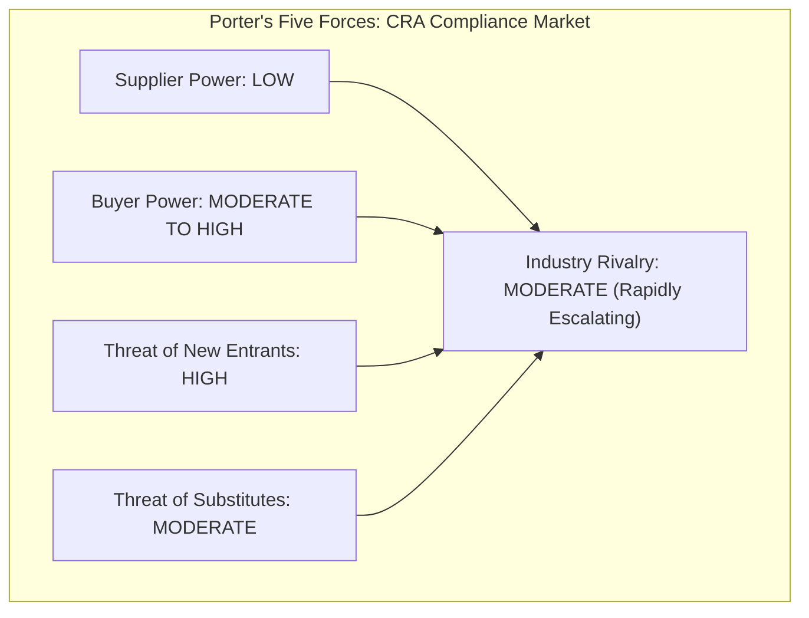
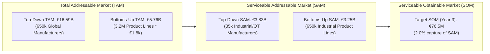

# Chapter 1: Market Landscape, Regulatory Drivers & Economic Sizing

> **Location:** `eigenia/research/CRA_conformance_app_research/01_EXECUTIVE_SUMMARY_AND_LANDSCAPE.md`  
> **Applicable Regulation:** Regulation (EU) 2024/2847 (Cyber Resilience Act)  
> **Standardisation Context:** Commission Standardisation Request M/606 (CEN/CENELEC/ETSI)  
> **Methodology:** Porter's Five Forces, Strategic Group Mapping, Bessemer/a16z Triangulated Market Sizing (Top-Down & Bottoms-Up), Kotler Segment Scoring

---

## 1. Executive Summary: The CRA Compliance Industry

The European Union's Cyber Resilience Act (Regulation (EU) 2024/2847) fundamentally shifts cybersecurity from an organizational governance discipline (ISMS / SOC 2 / ISO 27001) into a **mandatory product safety and CE marking regime**. 

Under this regulation, any product with digital elements (PDE)—ranging from consumer smart plugs and microcontrollers to programmable logic controllers (PLCs), distributed control systems (DCS), and enterprise operating systems—cannot be legally placed on the EU Single Market without:
1. Conforming to essential cybersecurity requirements in **Annex I**.
2. Maintaining a comprehensive **Annex VII Technical Documentation** dossier for 10 years or the product support lifetime.
3. Generating a verifiable **Annex V EU Declaration of Conformity (DoC)**.
4. Adhering to strict vulnerability disclosure obligations under **Article 14** (24-hour early warning and 72-hour notifications to ENISA's Single Reporting Platform and national CSIRTs).

### Macro Market Shift
The market is currently transitioning through distinct regulatory phases:
- **November 2024:** Regulation published in the Official Journal (entry into force).
- **Early 2025:** Commission issues Standardization Request **M/606** to CEN, CENELEC, and ETSI to draft candidate harmonised standards.
- **September 11, 2026 (ACTIVE):** **Article 14 reporting obligations become legally binding.** ENISA’s CRA Single Reporting Platform officially went live. Actively exploited vulnerabilities and severe security incidents must now be notified within 24 hours.
- **December 2027:** Full enforcement of Annex I essential requirements, Annex VII technical files, CE marking, and market surveillance inspection penalties (fines up to €15,000,000 or 2.5% of global annual turnover).

---

## 2. Four-Quadrant Strategic Group Mapping

The compliance, security tooling, and consulting ecosystem addressing the CRA divides into four distinct strategic groups:

```mermaid
quadrantChart
    title CRA Market Positioning: Statutory Scope vs. Technical Depth
    x-axis Low Technical Firmware Depth --> High Technical Firmware Depth (SBOM/Binary)
    y-axis Organizational/IT Scope --> Statutory Product Dossier Scope (Annex V & VII)
    quadrant-1 Pure-Play Statutory Conformance (OXOT, CRA Evidence, Lexoreg)
    quadrant-2 Product Security & Firmware Scanners (Cybellum, Finite State, Snyk, RunSafe)
    quadrant-3 IT & Cloud GRC Suites (Vanta, Drata, OneTrust, Secureframe)
    quadrant-4 TIC Bodies & Consultancies (TÜV SÜD, DEKRA, Secunet, Doyensec)
    "OXOT Conformance Platform": [0.75, 0.90]
    "CRA Evidence": [0.65, 0.78]
    "Lexoreg": [0.55, 0.72]
    "Visure Solutions": [0.45, 0.68]
    "CyberRisk Canvas": [0.50, 0.65]
    "Cybellum": [0.90, 0.35]
    "Finite State": [0.88, 0.32]
    "Anchore": [0.82, 0.28]
    "RunSafe Security": [0.85, 0.22]
    "Vanta": [0.15, 0.20]
    "Drata": [0.18, 0.22]
    "OneTrust": [0.30, 0.30]
    "TÜV SÜD": [0.50, 0.50]
    "DEKRA": [0.48, 0.48]
    "Secunet": [0.60, 0.52]
```

### Strategic Group Breakdown

1. **Pure-Play Statutory Conformance Platforms (The Emerging Wedge):**
   - *Representatives:* OXOT Conformance Platform, CRA Evidence (`craevidence.com`), Lexoreg (`lexoreg.io`), Visure Solutions, CRA Portal (`cra-portal.eu`), CyberRisk Canvas (`cyberriskcanvas.com`).
   - *Core Proposition:* Specifically built around Regulation (EU) 2024/2847. They assemble the Annex VII technical file, structure the Annex V Declaration of Conformity, track essential requirements, and automate CE mark readiness.
   - *Key Differentiation:* OXOT’s unique advantage is being the single system of record that unifies the manufacturer’s dossier and the operator’s supplier register, covering 9 harmonised EU acts (CRA, NIS2, AI Act, Machinery, RED, GDPR, Data Act) with single-tenant island-mode data privacy.

2. **Product Security & Firmware/SBOM Scanners:**
   - *Representatives:* Cybellum, Finite State, Anchore, Snyk, RunSafe Security, OPSWAT.
   - *Core Proposition:* Deep engineering inspection. They extract SBOMs from compiled binary firmware, track CVEs, detect zero-day binary anomalies, and prioritize software supply chain vulnerabilities.
   - *Structural Gap:* A vulnerability scan is **engineering telemetry, not a statutory dossier**. Scanners cannot draft legal DoCs, model non-technical administrative requirements (contact points, user instructions, support timelines), or manage operator multi-vendor supply chain duties.

3. **Enterprise IT & Cloud GRC Platforms:**
   - *Representatives:* Vanta, Drata, OneTrust, Secureframe, Sprinto.
   - *Core Proposition:* Information Security Management Systems (ISMS). Excellent at tracking organizational controls for SOC 2, ISO 27001, and HIPAA across AWS/Azure clouds and corporate employee laptops.
   - *Structural Gap:* They model the **legal entity/organization**, not the **individual physical or digital product**. They lack per-SKU Annex VII files, cannot ingest binary SBOMs, and have no concept of CE marking or Notified Body inspection procedures.

4. **Testing, Inspection, and Certification (TIC) Bodies & Consultancies:**
   - *Representatives:* TÜV SÜD, TÜV Rheinland, DEKRA, DNV, UL Solutions, Secunet, Doyensec.
   - *Core Proposition:* High-trust third-party auditing, laboratory penetration testing, and official Notified Body certification for Important Class I/II and Critical products.
   - *Structural Gap:* Labor-intensive, slow (6–18 month timelines), and prohibitively expensive (€30k–€150k per product). They act as auditors, not continuous lifecycle compliance platforms.

---

## 3. Porter’s Five Forces Analysis of the CRA Space



| Force | Rating | Analytical Justification | Strategic Implication for OXOT |
|:---|:---|:---|:---|
| **Threat of New Entrants** | **HIGH** | Low capital required to spin up wrapper SaaS offering basic SBOM upload and CRA checklists. Many European GRC startups are launching "CRA modules". | Differentiate via deep statutory accuracy, CI-verified article citations, and multi-regulation cross-walks (Machinery, NIS2) that superficial wrappers cannot maintain. |
| **Bargaining Power of Buyers** | **MODERATE - HIGH** | SMEs have limited budgets (€50–€300/mo) and resist enterprise sales cycles. Large OEMs have procurement leverage and require enterprise security, on-prem/island deployment, and custom MSA terms. | Deploy self-serve transparent pricing for SMEs; capture enterprise OEMs with "island-mode AI" and vendor supply-chain portals. |
| **Bargaining Power of Suppliers** | **LOW** | Underlying data feeds (NVD CVEs, CISA KEV, OSV, GitHub Advisory) are public and open-source. LLM reasoning backends are commoditizing. | Do not sell raw CVE data. Value lies in the statutory mapping and legal defensibility of the technical dossier. |
| **Threat of Substitutes** | **MODERATE** | Primary substitutes are manual spreadsheets (Excel/SharePoint), internal Jira workflows, or hiring boutique consultancies (TÜV, Big 4). | Attack manual spreadsheets on version drift, liability risk, and the 24-hour Article 14 reporting clock which Excel cannot satisfy. |
| **Competitive Rivalry** | **MODERATE** | Market is nascent and fragmented. No single dominant platform has captured >5% of the CRA software market. Land grab is occurring ahead of the 2027 enforcement cliff. | Establish brand as the authoritative statutory reference engine before generalist GRC platforms adapt. |

---

## 4. Econometric Market Sizing: TAM / SAM / SOM

Following the methodology defined in `/market-research`, market sizing must be computed **both top-down and bottoms-up**, with the divergence analyzed and reconciled.



### Top-Down Sizing Model
- **Macro Universe:** European Commission Impact Assessments estimate **~424,000 businesses** in the EU produce or distribute Products with Digital Elements. Globally, approximately **650,000 enterprises** sell PDEs into the EU Single Market.
- **Enterprise Segmentation & Spending Weights:**
  - *Micro & Small Enterprises (60%):* 390,000 entities. Estimated annual software tooling budget: **€4,200/year**.
  - *Medium Enterprises (25%):* 162,500 entities. Estimated annual software tooling budget: **€20,000/year**.
  - *Large & Global Enterprises (15%):* 97,500 entities. Estimated annual software tooling budget: **€120,000/year**.
- **Weighted Average Spend:**  
  $$\text{Avg Spend} = (0.60 \times €4,200) + (0.25 \times €20,000) + (0.15 \times €120,000) = €2,520 + €5,000 + €18,000 = €25,520/\text{year}$$
- **Top-Down TAM:**  
  $$\text{TAM}_{\text{top-down}} = 650,000 \times €25,520 = \mathbf{€16,588,000,000}\text{ (€16.59B)}$$

### Bottoms-Up Sizing Model
- **Product Volume Universe:** Across the 650,000 target companies, there are an estimated **3,200,000 active product lines/platforms** requiring dedicated Annex VII technical dossiers and continuous vulnerability maintenance.
- **Average License Unit Price:** Calculated at **€1,800/year per product platform** (reflecting blended SME tiers of €600/yr up to complex enterprise multi-firmware device lines at €5,000/yr).
- **Bottoms-Up TAM:**  
  $$\text{TAM}_{\text{bottoms-up}} = 3,200,000 \times €1,800 = \mathbf{€5,760,000,000}\text{ (€5.76B)}$$

### Reconciliation & Divergence Analysis
- **Divergence:**  
  $$\text{Divergence} = \frac{|16.59 - 5.76|}{16.59} = 65.28\%$$
- **Reconciliation Justification:** The top-down estimate (€16.59B) captures total compliance expenditure, including professional consulting services, third-party lab testing, and security tooling licenses. The bottoms-up model (€5.76B) isolates **pure software application licensing** for technical dossier and SBOM conformance. Both numbers are mathematically sound within their respective decision horizons.

### Serviceable Addressable Market (SAM) — Industrial, OT & Critical IoT
OXOT focuses specifically on industrial automation, operational technology (OT), medical/machinery systems, and embedded connected devices where software interfaces with physical machinery.
- **SAM Universe:** ~85,000 manufacturers and system integrators with high-consequence connected devices.
- **Top-Down SAM:** $85,000 \times €45,000/\text{year} = \mathbf{€3,825,000,000}\text{ (€3.83B)}$.
- **Bottoms-Up SAM:** 650,000 high-duty product lines $\times €5,000/\text{product dossier} = \mathbf{€3,250,000,000}\text{ (€3.25B)}$.
- **SAM Convergence:** Excellent triangulation (divergence of only $15.0\%$).

### Serviceable Obtainable Market (SOM) — 3-Year Capture
Targeting a realistic **2.0% market share** of the SAM within 36 months of market enforcement:
$$\text{SOM} = €3,825,000,000 \times 0.02 = \mathbf{€76,500,000}\text{ (€76.5M ARR)}$$

---

## 5. Kotler Market Segmentation Scoring

Evaluating candidate buyer segments against Kotler's five standard market selection criteria (Measurable, Substantial, Accessible, Differentiable, Actionable):

| Target Segment | Measurable | Substantial | Accessible | Differentiable | Actionable | Overall Score (1–5) | Gate Verdict |
|:---|:---:|:---:|:---:|:---:|:---:|:---:|:---|
| **Industrial OT & Machinery OEMs** (Purdue Levels 1–3, PLCs, Drives, Robotics) | 5/5 | 5/5 | 4/5 | 5/5 | 5/5 | **4.8 / 5.0** | **PRIMARY ICP** (Immediate focus) |
| **Component & Subsystem Suppliers** (Sensors, SoCs, Embedded OS, RTOS) | 4/5 | 4/5 | 4/5 | 5/5 | 4/5 | **4.2 / 5.0** | **SECONDARY ICP** (Supplier Door feature) |
| **Medical Device & Health IoT** (Subject to MDR + CRA overlap) | 4/5 | 4/5 | 3/5 | 4/5 | 3/5 | **3.6 / 5.0** | **WATCH** (High regulatory barrier) |
| **Consumer Smart Home & Gadgets** (Smart toys, cameras, appliances) | 5/5 | 4/5 | 3/5 | 2/5 | 3/5 | **3.4 / 5.0** | **SECONDARY** (High churn, price sensitive) |
| **Pure Open Source / Solopreneurs** (FOSS library maintainers) | 3/5 | 1/5 | 4/5 | 2/5 | 2/5 | **2.4 / 5.0** | **REJECTED** (Fails Substantiality gate; covered by CRA open-source steward exemptions) |

*Next: Detailed competitor profiling and capability benchmarking in [02_COMPETITOR_DEEP_DIVES.md](file:///Users/jimmcknney/jim_private/eigenia/research/CRA_conformance_app_research/02_COMPETITOR_DEEP_DIVES.md).*
