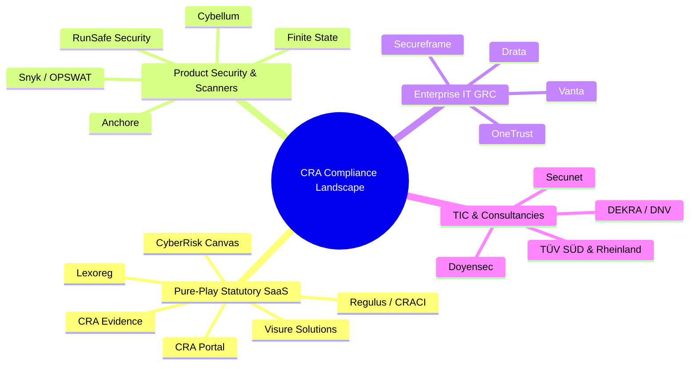
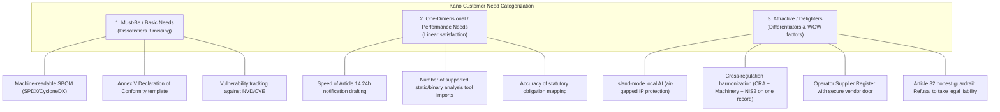
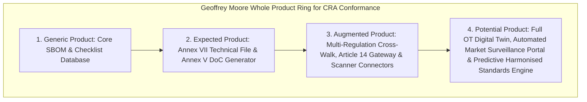

# Chapter 2: Competitor Deep Dives & Capability Matrices

> **Location:** `eigenia/research/CRA_conformance_app_research/02_COMPETITOR_DEEP_DIVES.md`  
> **Applicable Regulation:** Regulation (EU) 2024/2847 (Cyber Resilience Act)  
> **Methodology:** 8-Dimension OSINT Tracking, 20-Point Feature Gap Analysis, Kano Model Categorization, Geoffrey Moore Whole Product Analysis

---

## 1. Competitor Landscape Overview

The market for Cyber Resilience Act compliance tools has segmented into four distinct vendor types. This chapter profiles 16 active market entrants, identifies their structural limitations, and evaluates their capabilities against statutory mandates.

---

## 2. In-Depth Competitor Profiles

### Group A: Pure-Play CRA Compliance SaaS & Workflow Engines

#### 1. CRA Evidence (`craevidence.com`)
- **HQ / Origins:** EU-focused compliance startup.
- **Product Architecture:** Cloud SaaS platform designed explicitly for CRA technical file compilation.
- **Core Capabilities:** SBOM and Hardware Bill of Materials (HBOM) ingestion, automated vulnerability matching, CE mark technical dossier document generation, incident response templates.
- **Strengths:** Explicitly targets CRA terminology (Annex VII, Annex V). Good template generation for CE marking files.
- **Limitations & Weaknesses:** Closed cloud architecture (creates sovereignty concerns for defense/industrial OEMs); limited native multi-regulation cross-walks (e.g., does not deeply model Machinery Regulation 2023/1230 or NIS2 entity linkages); lacks deep industrial protocol knowledge (IEC 62443).
- **Pricing:** Quote-based "Professional Custom" and "Enterprise Custom" tiers.

#### 2. CRA Portal (`cra-portal.eu`)
- **HQ / Origins:** Germany / EU.
- **Product Architecture:** Lightweight web portal targeting SMEs.
- **Core Capabilities:** Guided CRA compliance questionnaires, product classification wizards (Default vs. Important Class I/II vs. Critical), basic SBOM upload, Annex V DoC template generation.
- **Strengths:** Low price barrier (€49–€149/month); clear, simple UI for micro-enterprises.
- **Limitations & Weaknesses:** Highly manual self-assessment checklist. No deep binary inspection, no automated supply chain supplier register, limited continuous monitoring after document generation.
- **Pricing:** Basic €49/mo, Professional €149/mo, plus €29/mo SBOM add-on and €49/mo incident notification add-on.

#### 3. Lexoreg (`lexoreg.io`)
- **HQ / Origins:** EU regulatory tech startup.
- **Product Architecture:** Multi-regulation compliance platform covering the CRA, EU AI Act, and DORA.
- **Core Capabilities:** Automated SBOM management, vulnerability scanning integration, and early ENISA incident reporting workflows.
- **Strengths:** Strong vision on intersecting EU digital regulations (AI Act + CRA).
- **Limitations & Weaknesses:** Early-stage product maturity; lacks specialized OT/ICS industrial hardware focus; cloud-only deployment.

#### 4. Visure Solutions (`visuresolutions.com`)
- **HQ / Origins:** US / EU enterprise requirements management vendor.
- **Product Architecture:** Requirements ALM platform expanded to include a dedicated CRA module.
- **Core Capabilities:** Bidirectional traceability between CRA Annex I essential requirements and software engineering artifacts, Article 14 workflow support, 10-year audit file retention.
- **Strengths:** High penetration in safety-critical industries (aerospace, automotive, medical). Excellent requirements traceability.
- **Limitations & Weaknesses:** Heavy, legacy enterprise ALM user experience. Extremely complex to set up; requires significant services and training. Prohibitive pricing for SMEs.

#### 5. CyberRisk Canvas (`cyberriskcanvas.com`)
- **HQ / Origins:** European open-core / commercial security engineering tool.
- **Product Architecture:** Threat Analysis and Risk Assessment (TARA) platform.
- **Core Capabilities:** Threat modeling aligned with ISO/SAE 21434 and IEC 62443, SBOM import/export, Statement of Applicability (SoA) generation.
- **Strengths:** Strong engineering-first threat modeling interface.
- **Limitations & Weaknesses:** Primarily a pre-market engineering design tool. Lacks operational supplier management and post-market live incident dispatch.

#### 6. Regulus (`goregulus.com`) & CRACI (`craci.com`)
- **HQ / Origins:** EU supply chain compliance platforms.
- **Core Capabilities:** Tracking upstream supplier component risk and producing CRA-aligned documentation.
- **Pricing:** Regulus Basic €1,500, Pro €5,500/year; CRACI €330/month.

---

### Group B: Product Security & Firmware/SBOM Platforms

#### 7. Cybellum (`cybellum.com`)
- **HQ / Origins:** Israel / US (Acquired by LG Electronics).
- **Core Capabilities:** "Product Security Platform" generating a "Cyber Digital Twins" of compiled firmware. Automated SBOM generation, vulnerability management, license compliance, compliance policy engine (including CRA and UNECE R155).
- **Strengths:** World-class binary analysis. Does not require source code; inspects compiled binaries, RTOS kernels, and embedded Linux.
- **Limitations & Weaknesses:** Built for firmware security analysts, not regulatory compliance officers. Does not produce the legal Annex V Declaration of Conformity or manage the administrative technical file. Very high cost (€40k–€150k+/year).

#### 8. Finite State (`finitestate.io`)
- **HQ / Origins:** US.
- **Core Capabilities:** Unified software supply chain risk management. Ingests static code, dynamic testing results, and binary firmware to produce unified SBOMs and risk scores.
- **Strengths:** Deep integration across the DevSecOps pipeline; strong support for US Executive Order 14028 and EU CRA SBOM guidelines.
- **Limitations & Weaknesses:** US-centric product perspective; focuses primarily on vulnerability scoring (EPSS, CVSS) rather than European CE-marking legal duties.

#### 9. Anchore (`anchore.com`)
- **HQ / Origins:** US.
- **Core Capabilities:** Container and software supply chain security; Syft (SBOM generator) and Grype (vulnerability scanner).
- **Strengths:** Industry standard open-source tooling (Syft/Grype) widely used by developers.
- **Limitations & Weaknesses:** Purely software and container-focused; poor fit for bare-metal microcontrollers, PLCs, or OT industrial hardware.

#### 10. RunSafe Security (`runsafesecurity.com`)
- **HQ / Origins:** US.
- **Core Capabilities:** Memory protection and binary diversification (Alkemist). Prevents memory corruption exploits at runtime.
- **Strengths:** Actively mitigates exploits rather than just documenting vulnerabilities.
- **Limitations & Weaknesses:** Runtime security control, not a compliance platform. Cannot generate statutory documentation.

---

### Group C: Enterprise IT & Cloud GRC Platforms

#### 11. OneTrust (`onetrust.com`)
- **HQ / Origins:** US / UK.
- **Core Capabilities:** Enterprise compliance mega-suite (GDPR privacy, third-party risk, ESG, ethics).
- **Strengths:** Dominant brand recognition among corporate legal, DPOs, and CISOs.
- **Limitations & Weaknesses:** Incapable of deep technical product analysis. Cannot read an SBOM, parse a firmware binary, or evaluate hardware bus security. Extremely expensive.

#### 12. Vanta (`vanta.com`) & Drata (`drata.com`)
- **HQ / Origins:** US.
- **Core Capabilities:** Automated evidence collection for cloud SaaS (SOC 2, ISO 27001, HIPAA).
- **Limitations & Weaknesses:** Built exclusively for cloud infrastructure (AWS/GCP/GitHub). Fundamentally incapable of addressing embedded devices, IoT hardware, or European product liability regimes.

---

### Group D: TIC Bodies & Specialized Cybersecurity Consultancies

#### 13. TÜV SÜD & TÜV Rheinland
- **Core Capabilities:** Notified Body services, lab penetration testing, IEC 62443 certification, CE marking assessment.
- **Strengths:** Absolute statutory authority and European brand trust.
- **Limitations & Weaknesses:** No software platform of their own; slow, manual, billable-hour consulting model. Fees start at €20,000 for basic advisory and exceed €100,000 for Class II certifications.

#### 14. Secunet Security Networks AG (`secunet.com`)
- **Core Capabilities:** High-assurance cybersecurity consulting and systems integration for German federal agencies and critical infrastructure.
- **Strengths:** Deep technical and regulatory rigor in Germany/DACH.
- **Limitations & Weaknesses:** Project-based professional services; no self-serve multi-tenant software product.

---

## 3. 20-Point Feature Gap Analysis Matrix

Comparing the four competing categories against the **OXOT Conformance Platform**:

| # | Capability / Statutory Requirement | IT GRC (Vanta/Drata) | Scanners (Cybellum/Finite) | CRA Startups (CRA Evidence) | TIC Bodies (TÜV) | OXOT Conformance Platform |
|:---|:---|:---:|:---:|:---:|:---:|:---:|
| 1 | **Annex VII Per-Product Technical File** | ❌ No | ⚠️ Partial | ✅ Yes | ⚠️ Manual | ✅ **Native System of Record** |
| 2 | **Annex V EU Declaration of Conformity** | ❌ No | ❌ No | ✅ Yes | ⚠️ Manual | ✅ **Native Auto-Dossier** |
| 3 | **9-Regulation Harmonized Cross-Walk** (CRA, NIS2, AI, RED, Machinery, GDPR, etc.) | ❌ No | ❌ No | ❌ No | ⚠️ Advisory | ✅ **Native Multi-Act Record** |
| 4 | **Verbatim Character-Exact Statutory Text** | ❌ No | ❌ No | ⚠️ Partial | ✅ Yes | ✅ **CI-Verified Exact Text** |
| 5 | **Article 14 ENISA/CSIRTs 24h/72h Gateway** | ❌ No | ⚠️ Partial | ⚠️ Partial | ❌ No | ✅ **Automated 3-Stage Clocks** |
| 6 | **Annex I Essential Requirements Audit** | ⚠️ Generic | ⚠️ CVE only | ⚠️ Checklists | ✅ Manual | ✅ **Statutory Gap Engine** |
| 7 | **Single-Tenant Island-Mode AI** (Zero IP leakage) | ❌ Cloud | ⚠️ On-prem | ❌ Cloud | N/A | ✅ **Local Island Mode** |
| 8 | **Operator Multi-Vendor Supplier Register** | ❌ No | ❌ No | ❌ No | ❌ No | ✅ **Native Fleet Register** |
| 9 | **Secure Supplier Portal Door** (Tier-1/2 ingest) | ❌ No | ⚠️ Partial | ⚠️ Partial | ❌ No | ✅ **Zero-Knowledge Portal** |
| 10 | **Refusal to Conclude Conformity** (Art. 32 Honesty) | ❌ Claims | ❌ Claims | ❌ Claims | ✅ Audits | ✅ **Statutory Honesty Guardrail** |
| 11 | **Automated Binary Firmware Extraction** | ❌ No | ✅ Native | ❌ Ingest only | ⚠️ Lab | ⚠️ **Ingest & Link Rails** |
| 12 | **Software Bill of Materials (SPDX / CycloneDX)** | ❌ No | ✅ Native | ✅ Ingest | ⚠️ Review | ✅ **Full Ingestion & Lifecycle** |
| 13 | **Hardware BOM (HBOM) & Purdue Model OT Scope** | ❌ No | ⚠️ Partial | ⚠️ Partial | ⚠️ Manual | ✅ **Native OT 7-Layer Model** |
| 14 | **IEC 62443 / ISO 21434 Standard Mapping** | ❌ No | ⚠️ Partial | ⚠️ Partial | ✅ Manual | ✅ **Bidirectional Matrix** |
| 15 | **Post-Market 10-Year Lifecycle Vault** | ❌ No | ⚠️ Partial | ⚠️ Partial | ⚠️ Manual | ✅ **Cryptographic Tamper-Proof** |
| 16 | **Substantial Modification Trigger Check** (Art. 18) | ❌ No | ❌ No | ❌ No | ⚠️ Manual | ✅ **Automated Differential Gate**|
| 17 | **SME Turnover Fine Simulator** (Art. 53 relief) | ❌ No | ❌ No | ❌ No | ❌ No | ✅ **Built-in Economic Sandbox**|
| 18 | **Machine-Readable VEX Ingestion / Publishing** | ❌ No | ✅ Native | ⚠️ Partial | ❌ No | ✅ **VEX + Statutory Context** |
| 19 | **Notified Body Digital Inspection Package** | ❌ No | ❌ No | ⚠️ PDF export | ⚠️ Paper/PDF | ✅ **Structured Audit Dossier** |
| 20 | **Multi-Lingual EU Language Dossier Generation** | ❌ No | ❌ No | ⚠️ Limited | ⚠️ Manual | ✅ **24 EU Official Languages** |

*Legend: ✅ Native Feature | ⚠️ Partial / Manual / Add-on | ❌ Out of Scope / Not Supported*

---

## 4. Kano Model Classification

Categorizing CRA compliance capabilities according to buyer satisfaction psychology:

---

## 5. Geoffrey Moore Whole Product Model Analysis

To win the mainstream market across European hardware and software OEMs, the product must fulfill all four concentric rings of Geoffrey Moore's Whole Product model:

1. **Generic Product (The Core):** A database linking software components to CRA Annex I cybersecurity requirements.
2. **Expected Product (The Minimal Buyer Expectation):** Automated generation of Annex V EU Declaration of Conformity, Annex VII technical documentation binder, and exportable audit reports.
3. **Augmented Product (OXOT’s Current Commercial Offering):**
   - Multi-act statutory harmonization (CRA + NIS2 + Machinery + AI Act).
   - Article 14 ENISA/CSIRTs automated 3-stage reporting clocks.
   - Secure Supplier Portal Door for Tier-1 component suppliers.
   - Single-tenant island-mode deployment for proprietary firmware IP.
4. **Potential Product (OXOT Future Vision):**
   - Full OT Cyber Digital Twin simulating operational physical resilience (Purdue Levels 0–3).
   - Real-time synchronization with CEN/CENELEC M/606 published harmonised standards.
   - Machine-to-machine integration directly into Notified Body assessment platforms.

*Next: Internal SWOT evaluation and product telemetry design in [03_OXOT_SWOT_AND_PRODUCT_ANALYTICS.md](file:///Users/jimmcknney/jim_private/eigenia/research/CRA_conformance_app_research/03_OXOT_SWOT_AND_PRODUCT_ANALYTICS.md).*
