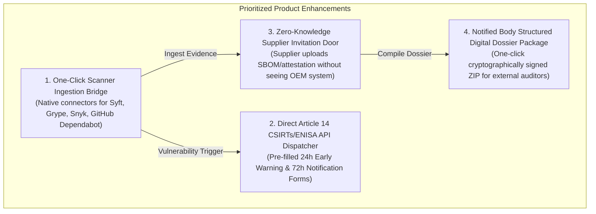
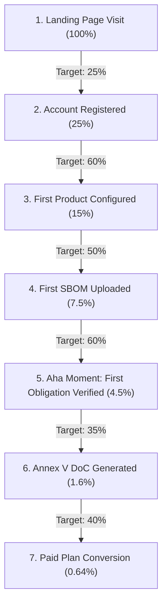

# Chapter 3: OXOT Product Analytics, Instrumentation & SWOT

> **Location:** `eigenia/research/CRA_conformance_app_research/03_OXOT_SWOT_AND_PRODUCT_ANALYTICS.md`  
> **Applicable Regulation:** Regulation (EU) 2024/2847 (Cyber Resilience Act)  
> **Methodology:** Exhaustive SWOT Analysis, North Star Metric Formulation, PostHog/Mixpanel Event Taxonomy (`[object]_[past_verb]`), Activation Funnel Optimization, Cohort Retention Modeling

---

## 1. Exhaustive SWOT Analysis: OXOT Conformance Platform

```mermaid
quadrantChart
    title OXOT Conformance Platform SWOT Matrix
    x-axis Internal Factors (Weaknesses to Strengths) --> External Factors (Threats to Opportunities)
    y-axis Negative Factors --> Positive Factors
    quadrant-1 STRENGTHS (Internal Positives)
    quadrant-2 OPPORTUNITIES (External Tailwinds)
    quadrant-3 WEAKNESSES (Internal Gaps)
    quadrant-4 THREATS (External Risks)
    "Statutory System of Record": [-0.85, 0.85]
    "9-Act Cross-Walk": [-0.80, 0.75]
    "Island-Mode Privacy": [-0.75, 0.65]
    "Supplier Portal Rails": [-0.70, 0.55]
    "Article 14 24h Panic": [0.85, 0.90]
    "2027 Enforcement Cliff": [0.80, 0.80]
    "Notified Body Capacity Crunch": [0.75, 0.70]
    "Supply Chain Flowdown Mandates": [0.70, 0.60]
    "No Native Binary Scanner": [-0.80, -0.65]
    "Nascent Brand Recognition": [-0.75, -0.55]
    "High Regulatory Cognitive Load": [-0.65, -0.45]
    "Dependency on Third-Party Evidence": [-0.60, -0.35]
    "Generic GRC Checklists": [0.80, -0.70]
    "OpenSSF Free Tooling": [0.70, -0.60]
    "Regulatory Enforcement Softening": [0.65, -0.50]
    "Competitor M&A Consolidation": [0.75, -0.40]
```

### Strengths (Internal Defensible Assets)
1. **Statutory Integrity & Exactness:** Built from the verbatim legal text of Regulation (EU) 2024/2847. Obligation IDs, article cross-references, and Annex structures are character-exact and CI-verified.
2. **Harmonized 9-Act Architecture:** Unifies compliance across the entire European digital legislative suite on a single product record: CRA, NIS2, AI Act, Machinery Regulation (EU) 2023/1230, Radio Equipment Directive (RED), GDPR, Data Act, Product Liability Directive, and Critical Entities Resilience (CER).
3. **Statutory Honesty ("Refuses to Conclude Conformity"):** Adheres strictly to Article 32 by making clear that the manufacturer alone bears statutory responsibility. Unlike competitors offering dubious "automated certification badges", OXOT protects clients from false-security litigation.
4. **Single-Tenant Island-Mode AI:** Solves the core enterprise OEM security blocker: proprietary source code, firmware architecture, and confidential SBOMs never leave the client's infrastructure.
5. **Operator & Supplier Dual-Perspective Rails:** Bridges the gap between the component supplier (delivering an attested sub-assembly) and the OEM/operator (managing a fleet of multi-vendor machines).

### Weaknesses (Internal Gaps Requiring Mitigation)
1. **Lack of Native Binary Firmware Scanning:** OXOT does not decompile raw ELF/ARM binaries into SBOMs in-house. It relies on ingesting SPDX/CycloneDX files generated by tools like Syft, Cybellum, or Finite State.
2. **Nascent Brand Awareness:** Lacks the enterprise marketing footprint and venture-backed war chests of Snyk, Vanta, or OneTrust.
3. **High Cognitive Surface Area:** Covering 9 regulations creates an overwhelming user experience if not segmented carefully by user persona (e.g., hardware engineer vs. compliance officer vs. procurement lead).
4. **Self-Service Onboarding Friction:** Assembling a compliant Annex VII technical dossier requires substantial engineering documentation that cannot be fully automated without human input.

### Opportunities (External Market Tailwinds)
1. **September 2026 Article 14 Activation:** The mandatory ENISA Single Reporting Platform went live on September 11, 2026. Manufacturers facing 24-hour notification deadlines are actively seeking automated incident dispatch tools.
2. **December 2027 Enforcement Cliff:** Over 424,000 EU manufacturers face market expulsion and €15M fines. The demand curve will go vertical between Q4 2026 and Q3 2027.
3. **Notified Body Capacity Bottleneck:** Europe has fewer than 40 accredited Notified Bodies capable of CRA assessments. Tools that automate structured digital audit packages will be favored by both manufacturers and auditors to compress audit cycles.
4. **Supply Chain Flowdown Pressure:** Large tier-1 automotive and industrial machinery OEMs are requiring all component vendors to deliver CRA-ready dossiers as a contractual condition of purchase.

### Threats (External Market Risks)
1. **Incumbent Feature Commoditization:** Established GRC suites (Vanta, Drata) or scanner vendors (Snyk) bolting on basic "CRA checklist" modules to lock in existing enterprise accounts.
2. **Free / Open-Source Tool Bundling:** Initiatives by OpenSSF, OWASP, or Eclipse Foundation providing free minimum-viable SBOM and DoC generators.
3. **Regulatory Softening / Enforcement Lenience:** National market surveillance authorities granting informal grace periods for SME enforcement in late 2027.

---

## 2. Recommended High-Impact Product Improvements

Based on the competitive gap analysis and SWOT matrix, OXOT should prioritize four strategic product enhancements:



1. **One-Click Scanner Ingestion Bridge:** Provide native REST and CI/CD CLI plugins for Syft, Grype, Snyk, and GitHub Dependabot so developers can push SBOMs directly into the product record on every `git tag`.
2. **Direct Article 14 CSIRTs/ENISA API Dispatcher:** Integrate directly with ENISA’s CRA Single Reporting Platform API to allow pre-filled, one-click 24h early warnings and 72h incident disclosures.
3. **Zero-Knowledge Supplier Invitation Door:** Expand the supplier portal so tier-1 component suppliers can upload SBOMs and answer conformity attestations via a secure magic link without viewing the OEM’s internal files.
4. **Notified Body Digital Audit Package:** Generate a standardized, SHA-256 hashed audit bundle that Notified Bodies (TÜV SÜD, DEKRA) can ingest directly into their audit workstations.

---

## 3. Product Analytics Architecture & Instrumentation

Following the `/analytics-product` guidelines, we design the telemetry, metrics, and event taxonomy required to manage product-led growth and enterprise retention.

### North Star Metric (NSM)
> **Active Conforming Product Dossiers (ACPD)**  
> *Definition:* The total number of distinct product lines in the platform that have reached $\ge 80\%$ Annex VII technical documentation completeness, have an active Annex V DoC on record, and have undergone a vulnerability review within the last 30 days.

- **Supporting Velocity Metric:** **Weekly Dossier Actions (WDA)** — The volume of evidence uploads, obligation verifications, or supplier attestations completed across all accounts per week.

---

## 4. PostHog / Mixpanel Event Taxonomy

All events follow the mandatory `[object]_[past_verb]` naming convention:

```python
# oxot_telemetry_events.py
"""
PostHog Event Taxonomy for OXOT Conformance Platform
Syntax: [object]_[past_verb]
"""

OXOT_EVENTS = {
    # 1. Acquisition & Onboarding
    "user_signed_up": {
        "props": ["company_name", "industry_sector", "country", "source"]
    },
    "workspace_created": {
        "props": ["workspace_id", "tier", "multi_tenant_or_island"]
    },
    "onboarding_started": {
        "props": ["wizard_step", "initial_product_type"]
    },
    "onboarding_completed": {
        "props": ["duration_seconds", "products_configured"]
    },

    # 2. Product Registration & Scoping
    "product_registered": {
        "props": ["product_id", "cra_category", "purdue_level", "is_hardware"]
    },
    "regulations_selected": {
        "props": ["product_id", "acts_count", "included_acts"]
    },
    "conformity_route_selected": {
        "props": ["product_id", "route", "notified_body_name"]
    },

    # 3. Evidence & Technical File Construction
    "sbom_uploaded": {
        "props": ["product_id", "format", "component_count", "source_tool"]
    },
    "obligation_mapped": {
        "props": ["product_id", "obligation_id", "status", "evidence_type"]
    },
    "technical_file_compiled": {
        "props": ["product_id", "annex_vii_completeness_pct", "time_to_compile_days"]
    },

    # 4. Supplier Register & Collaboration
    "supplier_invited": {
        "props": ["supplier_id", "product_id", "door_type", "component_name"]
    },
    "supplier_attestation_submitted": {
        "props": ["supplier_id", "product_id", "has_sbom", "turnaround_hours"]
    },

    # 5. Incident Reporting (Article 14)
    "incident_recorded": {
        "props": ["product_id", "severity", "cve_id", "is_actively_exploited"]
    },
    "early_warning_dispatched": {
        "props": ["product_id", "elapsed_hours_since_awareness", "channel"]
    },
    "incident_notification_dispatched": {
        "props": ["product_id", "elapsed_hours_since_awareness", "enisa_ack_id"]
    },

    # 6. Commercial Conversion & Retention
    "doc_generated": {
        "props": ["product_id", "annex_v_valid", "pdf_downloaded"]
    },
    "plan_upgraded": {
        "props": ["previous_tier", "new_tier", "annual_or_monthly", "seat_count"]
    },
    "audit_bundle_exported": {
        "props": ["product_id", "notified_body_target", "file_hash"]
    }
}
```

---

## 5. Activation Funnel & Benchmark Drop-Offs

Tracking the progression from initial website discovery to the **Aha Moment** (first compliant Annex VII dossier section verified):



### Funnel Optimization Levers
- **Drop-off 1 (Registration $\to$ Product Setup):** Minimize form fields. Offer pre-loaded templates for common devices (e.g., "Industrial Gateway", "Smart Meter", "PLC Controller").
- **Drop-off 2 (Product Setup $\to$ SBOM Upload):** Provide a sample CycloneDX file for testing so users without immediate access to engineering files can experience the value prop instantly.
- **Drop-off 3 (SBOM Upload $\to$ Obligation Verification):** Automatically map discovered components to Annex I essential requirements so the user sees immediate audit progress.

---

## 6. Retention Benchmarks & Cohort Matrix

For B2B compliance and regulatory infrastructure software, benchmarks differ substantially from consumer apps:

| Retention Milestone | Poor | Good | Elite (Enterprise Benchmark) | OXOT Target |
|:---|:---:|:---:|:---:|:---:|
| **Month 1 (W4)** | $<40\%$ | $60–75\%$ | $>85\%$ | **80%** |
| **Month 3 (W12)** | $<30\%$ | $50–65\%$ | $>75\%$ | **72%** |
| **Month 6 (W24)** | $<25\%$ | $45–60\%$ | $>70\%$ | **68%** |
| **Month 12 (W52)** | $<20\%$ | $40–55\%$ | $>65\%$ | **65% (Net Negative Churn)** |

*Retention Rationale:* Because the CRA mandates a **10-year retention period** for the technical file and continuous vulnerability handling over the product's support lifetime, churn in this category is structurally low once a product's statutory record is established on the platform.

*Next: Commercial packaging, pricing models, and price elasticity in [04_PRICING_AND_PACKAGING_STRATEGY.md](file:///Users/jimmcknney/jim_private/eigenia/research/CRA_conformance_app_research/04_PRICING_AND_PACKAGING_STRATEGY.md).*
