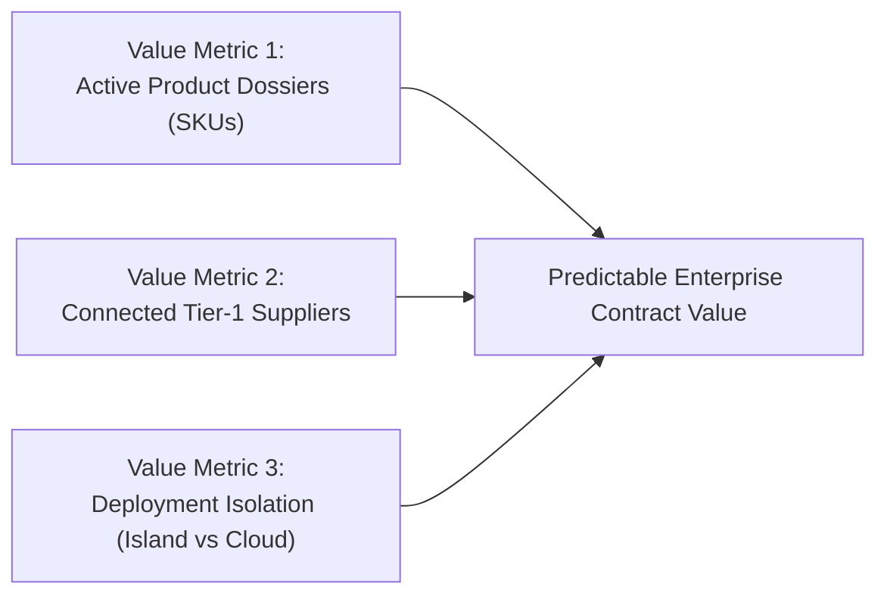
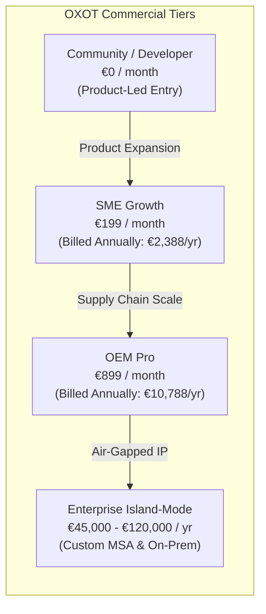
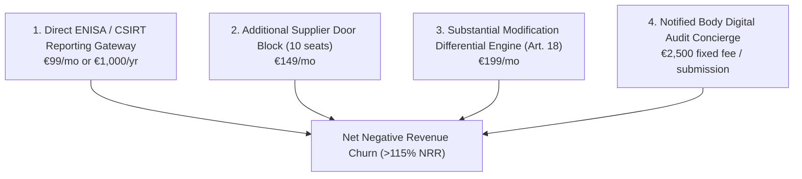
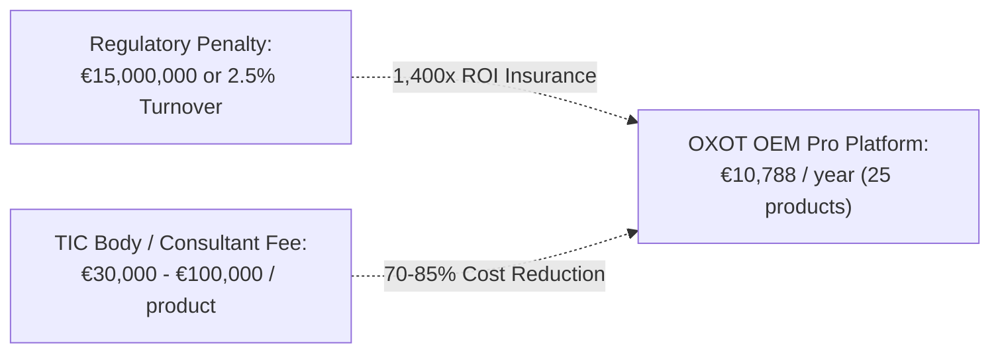

# Chapter 4: Pricing, Packaging & Monetization Strategy

> **Location:** `eigenia/research/CRA_conformance_app_research/04_PRICING_AND_PACKAGING_STRATEGY.md`  
> **Applicable Regulation:** Regulation (EU) 2024/2847 (Cyber Resilience Act)  
> **Methodology:** Value-Metric Selection, Four-Tier Commercial Architecture, Price Elasticity & WTP Benchmarking, Unit Economics (CAC/LTV) Modeling

---

## 1. Value Metric Strategy: What Drives Price?

In compliance and regulatory software, pricing on **per-seat (user count)** alone is an anti-pattern: it penalizes companies for inviting engineers and auditors, leading to credential sharing and incomplete documentation.

### The Three Winning Value Vectors
1. **Primary Vector: Number of Active Product Dossiers (Annex VII Technical Files).**  
   Aligns directly with value creation: each product placed on the EU market carries its own legal liability and CE mark.
2. **Secondary Vector: Supplier Portal Door Seats.**  
   Charges for the supply chain network effect: an OEM managing 50 external component vendors derives significantly more value than a standalone device maker.
3. **Tertiary Vector: Deployment Model (Multi-Tenant Cloud vs. Single-Tenant Island-Mode).**  
   Industrial and defense OEMs will pay a 300–500% premium for air-gapped, zero-egress island deployment.

---

## 2. Four-Tier Commercial Packaging Architecture

| Feature / Quota | Community (€0) | SME Growth (€199/mo) | OEM Pro (€899/mo) | Enterprise Island-Mode (€45k–€120k/yr) |
|:---|:---:|:---:|:---:|:---:|
| **Target Audience** | Open-source devs, solo inventors | Component makers, device SMEs | Mid-market OEMs, machinery builders | Global industrial conglomerates, defense |
| **Active Product Dossiers** | 1 product | Up to 5 products | Up to 25 products | Unlimited product lines |
| **User Seats** | 1 seat | 3 seats | 10 seats | Unlimited internal seats |
| **Annex VII Technical File** | Basic self-check | Full structured export | Full continuous sync | Full custom audit schema |
| **Annex V EU DoC Generator** | Watermarked PDF | Official signed PDF | Official signed PDF | Cryptographic digital signature |
| **Statutory Scope** | CRA only | CRA only | **9 EU Acts** (CRA, NIS2, Machine, AI, etc.) | **Full Harmonized 9-Act Suite** |
| **SBOM Ingestion** | 1 per month | 25 per month | Unlimited | Unlimited automated CI/CD pipelines |
| **Supplier Portal Doors** | ❌ None | Up to 5 supplier doors | Up to 50 supplier doors | Unlimited zero-knowledge doors |
| **Article 14 CSIRTs Runbook** | Static guidelines | Guided 24h/72h wizard | Automated clock + notification generator | Direct ENISA API Dispatcher |
| **Hosting & Privacy** | Multi-tenant EU cloud | Multi-tenant EU cloud | Dedicated isolated container | **Single-Tenant Island Mode** (Zero Egress) |
| **Notified Body Audit Bundle** | ❌ None | ❌ None | Standard ZIP export | Custom Notified Body Workstation Package |
| **Support SLA** | Community forum | 48-hour email | 8-hour priority business | Dedicated Regulatory Solution Architect |

---

## 3. High-Margin Modular Add-Ons

To maximize Average Revenue Per Account (ARPA) and capture specific statutory inflection points, OXOT offers four modular add-ons:

1. **Direct ENISA & CSIRTs Automated Reporting Gateway (€99/month):**  
   Provides real-time API push directly into the ENISA Single Reporting Platform (launched Sept 11, 2026), pre-populating CVSS vectors, actively exploited evidence, and mitigation steps within the 24-hour statutory deadline.
2. **Additional Supplier Door Seat Blocks (€149/month for 10 doors):**  
   Allows OEMs with expansive component supply chains to bring Tier-2 and Tier-3 vendors into the compliance network.
3. **Article 18 Substantial Modification Differential Engine (€199/month):**  
   Analyzes software update diffs against the existing technical dossier to automatically determine whether a firmware update constitutes a "substantial modification" requiring a new conformity assessment.
4. **Notified Body Digital Audit Concierge (€2,500 per submission):**  
   A dedicated review by an OXOT regulatory specialist to pre-validate the Annex VII file before formal submission to TÜV, DEKRA, or DNV.

---

## 4. Willingness-to-Pay (WTP) & Price Elasticity Benchmarks

The commercial pricing is anchored against two overwhelming economic benchmarks: **regulatory fines** and **traditional consulting costs**.

### 1. The Penalty Anchor (Regulation (EU) 2024/2847 Article 53)
- Non-compliance with Annex I essential requirements carries administrative fines up to **€15,000,000 or 2.5% of global annual turnover**.
- Failure to report actively exploited vulnerabilities within 24 hours under Article 14 carries fines up to **€10,000,000 or 2% of turnover**.
- *Positioning:* A €10,788/year OEM Pro subscription represents **less than 0.07% of the statutory fine exposure** for a mid-market manufacturer.

### 2. The Consulting Replacement Anchor
- Hiring TÜV SÜD or Secunet for an end-to-end CRA readiness and technical file assembly engagement costs **€35,000 to €80,000 per product line**.
- OXOT enables the in-house engineering team to assemble the exact same dossier for **€10,788/year across 25 product lines**, reducing external consulting spend by over **80%**.

---

## 5. SaaS Unit Economics & Financial Projections

Target metrics for the OXOT Conformance Platform commercial model:

| Metric | SME Growth Tier | OEM Pro Tier | Enterprise Island Mode | Blended Target |
|:---|:---:|:---:|:---:|:---:|
| **Annual Contract Value (ACV)** | €2,388 | €10,788 | €65,000 | **€12,500** |
| **Customer Acquisition Cost (CAC)** | €1,200 | €3,800 | €18,000 | **€4,200** |
| **CAC Payback Period** | 6.0 months | 4.2 months | 3.3 months | **4.0 months** |
| **Gross Margin** | 88% | 85% | 80% | **84%** |
| **Annual Logo Churn** | 8.0% | 4.5% | <2.0% | **4.2%** |
| **Net Revenue Retention (NRR)** | 108% | 122% | 135% | **124%** |
| **Lifetime Value (LTV)** | €26,200 | €204,000 | €2,600,000 | **€278,000** |
| **LTV / CAC Ratio** | **21.8x** | **53.7x** | **144.4x** | **66.2x** |

*Economic Summary:* The statutory nature of the CRA—requiring technical documentation to be maintained for 10 years after product placement—creates **exceptionally low churn and compounding LTV**, making customer acquisition highly capital-efficient.

*Next: Sales battlecards, positioning counter-moves, and executive roadmap in [05_STRATEGIC_RECOMMENDATIONS_AND_ROADMAP.md](file:///Users/jimmcknney/jim_private/eigenia/research/CRA_conformance_app_research/05_STRATEGIC_RECOMMENDATIONS_AND_ROADMAP.md).*
