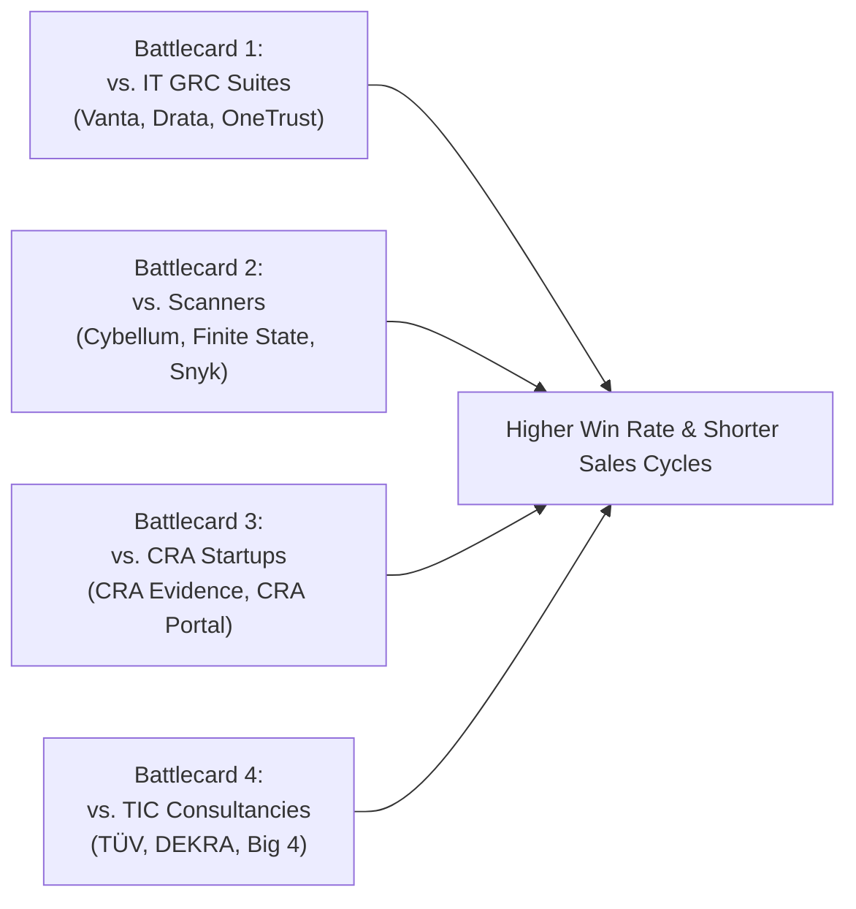
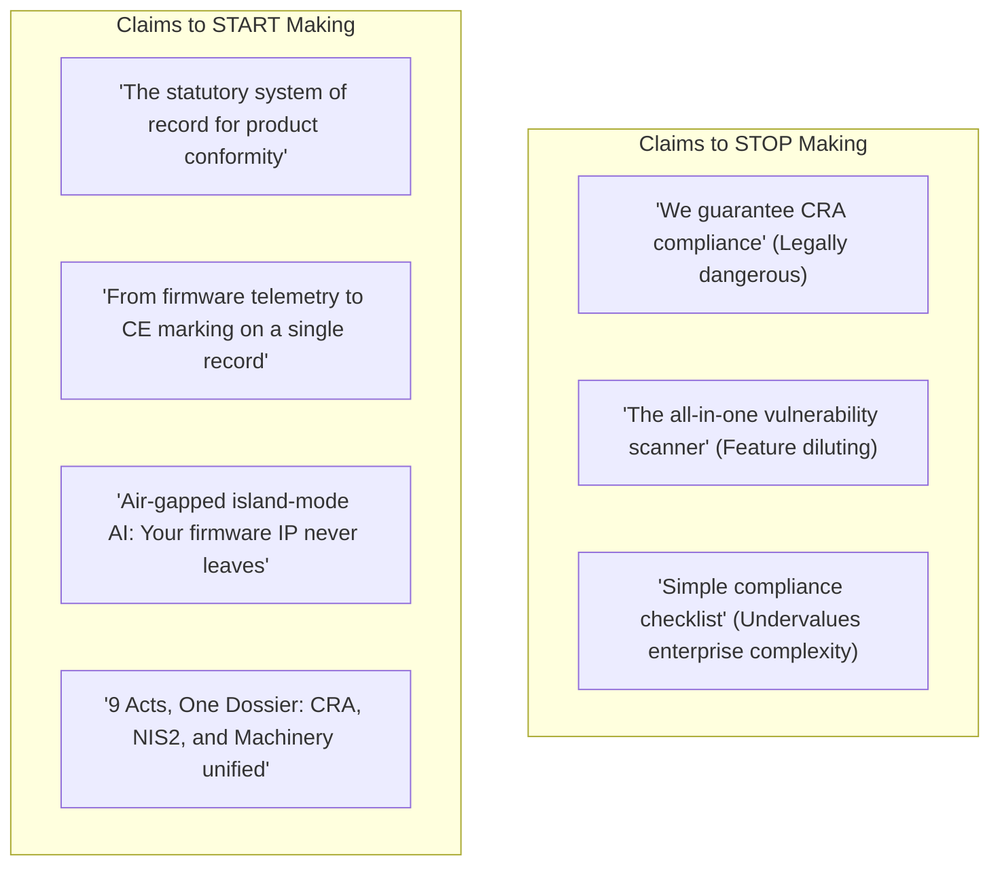
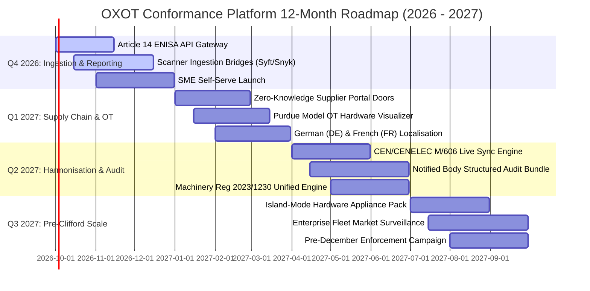

# Chapter 5: Sales Battlecards, Positioning & Executive Roadmap

> **Location:** `eigenia/research/CRA_conformance_app_research/05_STRATEGIC_RECOMMENDATIONS_AND_ROADMAP.md`  
> **Applicable Regulation:** Regulation (EU) 2024/2847 (Cyber Resilience Act)  
> **Target Audiences:** CRO (Sales Battlecards), CMO (Positioning Counter-Moves), CPO (12-Month Product Roadmap), CEO/Board (Threat Assessment Brief)

---

## 1. Field Battlecards for Sales (CRO & Account Executives)

---

### Battlecard 1: OXOT vs. Enterprise IT GRC (Vanta, Drata, OneTrust)

- **Prospect Persona:** CISO, Head of Governance, VP of Quality.
- **The Competitor's Pitch:** *"We already handle your SOC 2 and ISO 27001 compliance, so just activate our CRA control checklist module."*
- **The Core Flaw in Their Pitch:** IT GRC tools model the **organization** (who has a laptop, which HR policies exist, AWS bucket encryption). They have zero comprehension of **product-level statutory files**, cannot read a binary SBOM, and cannot draft a legally binding CE marking Declaration of Conformity.

#### Trap-Setting Questions
1. *"Can Vanta/Drata generate the official Annex V EU Declaration of Conformity with per-product SKU identifiers, hardware component boundaries, and harmonised standard citations?"*  
   *(Answer: No, they only manage organizational policy checklists.)*
2. *"How does your current GRC platform track an Article 14 24-hour vulnerability notification for a specific firmware binary deployed in a customer's water treatment plant?"*  
   *(Answer: It doesn't; it only tracks corporate IT security incidents.)*

#### The Killer Soundbite
> *"IT GRC tools prove your company is well-governed. OXOT proves your physical and software products can legally cross the European border with a CE mark. You need both, but a SOC 2 report will not stop customs from seizing your shipments."*

---

### Battlecard 2: OXOT vs. Firmware & SBOM Scanners (Cybellum, Finite State, Snyk)

- **Prospect Persona:** VP of Engineering, Chief Product Security Officer (CPSO), Lead Firmware Architect.
- **The Competitor's Pitch:** *"We extract your SBOM, scan your binaries for CVEs, and score your vulnerabilities. That's your CRA compliance right there."*
- **The Core Flaw in Their Pitch:** A list of CVEs is **engineering telemetry, not a statutory dossier**. Scanners do not draft technical documentation, do not track the 10-year support lifecycle, do not maintain the DoC, and do not provide legal defense against market surveillance authorities.

#### Trap-Setting Questions
1. *"When a market surveillance inspector audits your product under Article 41, will you hand them a 4,000-line raw CVE dump, or a structured Annex VII technical dossier explaining how your design satisfies Annex I essential requirements?"*  
   *(Answer: A CVE dump invites immediate regulatory scrutiny; you need the structured dossier.)*
2. *"How does your scanner handle non-technical duties, like publishing end-of-life support dates, providing contact points for security researchers, and binding supplier contracts?"*  
   *(Answer: It doesn't—scanners stop at the code level.)*

#### The Killer Soundbite
> *"Scanners count your problems; OXOT assembles your legal defense. We ingest the SBOMs and CVE data your scanners produce and transform them into the statutory record European inspectors require."*

---

### Battlecard 3: OXOT vs. Generic CRA Startups (CRA Evidence, CRA Portal)

- **Prospect Persona:** CEO, CTO of Hardware SME, Regulatory Affairs Director.
- **The Competitor's Pitch:** *"We are an agile, low-cost CRA portal that automatically certifies your compliance."*
- **The Core Flaw in Their Pitch:** Superficial web forms that claim to "conclude conformity" for you violate the core tenet of European product liability: **the manufacturer alone bears statutory responsibility**. Furthermore, they do not bridge into OT/ICS industrial machinery or multi-regulation frameworks (Machinery Regulation, NIS2).

#### Trap-Setting Questions
1. *"Does your platform run on public multi-tenant cloud where our proprietary firmware architectures are indexed, or can it operate in an isolated island-mode where our IP never leaves our infrastructure?"*  
   *(Answer: Almost all competitors are public multi-tenant SaaS.)*
2. *"When your product is an industrial machine with rotating mechanical parts and digital controllers, does your tool reconcile the CRA with the new Machinery Regulation (EU) 2023/1230 on the same record?"*  
   *(Answer: No, they only look at CRA in isolation.)*

#### The Killer Soundbite
> *"Any tool claiming to 'guarantee compliance' is a liability hazard. OXOT is built with statutory honesty: we provide the unshakeable evidence rails, CI-verified legal text, and air-gapped security, while refusing to compromise your legal standing under Article 32."*

---

### Battlecard 4: OXOT vs. TIC Bodies & Consultancies (TÜV SÜD, DEKRA, Big 4)

- **Prospect Persona:** Managing Director, Chief Legal Officer.
- **The Competitor's Pitch:** *"Hire us for an end-to-end consulting audit to ensure your products are fully certified."*
- **The Core Flaw in Their Pitch:** Prohibitively expensive (€30k–€100k+ per product line), takes 6–12 months, and results in a static point-in-time paper report that becomes obsolete the moment software is patched.

#### Trap-Setting Questions
1. *"What happens to your €50,000 TÜV audit report when your engineering team pushes a security patch next month? Does the consultant return to re-evaluate it for free?"*  
   *(Answer: No, you must pay another consulting engagement.)*
2. *"How does a consulting firm help you meet the mandatory 24-hour Article 14 notification clock at 2 AM on a Sunday?"*  
   *(Answer: They can't; you need an automated, always-on software platform.)*

#### The Killer Soundbite
> *"Consultants give you a snapshot of yesterday at enterprise rates. OXOT gives you continuous, living compliance for the entire 10-year lifetime of the product, at a fraction of the cost of a single audit."*

---

## 2. Positioning Brief for Marketing (CMO)

### Key Messaging Pillars
1. **The Product vs. Organization Distinction:** Emphasize that SOC 2 and ISO 27001 will not save physical devices from customs detention. The CRA is a CE marking regime.
2. **Statutory Honesty as a Trust Anchor:** Highlight OXOT's refusal to conclude conformity on behalf of the client as proof of institutional regulatory maturity.
3. **The Supplier Door Advantage:** Market directly to OEMs as the only platform that solves their vendor supply chain liability by providing suppliers with an isolated, secure door.

---

## 3. Executive Threat Assessment Brief (CEO & Board)

**Date:** September 15, 2026  
**Subject:** CRA Market Dynamics & Competitive Threat Environment  

### 1. Macro Threat Level: HIGH (Enforcement Window Compressing)
With ENISA's CRA Single Reporting Platform officially activated on September 11, 2026, manufacturers are experiencing immediate friction regarding Article 14 24h early warning readiness. The window between now and December 2027 represents an unprecedented land grab.

### 2. Emerging Competitor Vectors
- **GRC Incumbent Expansion:** Vanta, Drata, and OneTrust have announced "EU Regulatory Expansions". However, their product DNA remains corporate IT; their risk of successfully building deep OT/embedded product dossiers is low.
- **Product Security M&A:** Expect vendors like Snyk or Synopsys to acquire early-stage CRA startups (e.g., CRA Evidence or Lexoreg) to bridge the gap between CVE scanning and regulatory documentation.

### 3. Strategic Counter-Measures
1. **Accelerate Partner Channel with Notified Bodies:** Establish formal digital integration partnerships with TÜV SÜD, DEKRA, and DNV to position OXOT as the preferred pre-audit preparation workstation.
2. **Lock in OT Machinery Ecosystem:** Capitalize on the January 2027 enforcement of Machinery Regulation (EU) 2023/1230 by marketing the combined CRA/Machinery unified dossier to German, Italian, and Dutch machine tool manufacturers.

---

## 4. 12-Month Executive Product & GTM Roadmap

### Quarter-by-Quarter Execution Focus
- **Q4 2026 (Focus: Active Article 14 Response):** Roll out direct ENISA CSIRTs automated reporting connector and one-click scanner ingestion (Syft/Grype/Snyk). Launch self-serve SME Growth tier (€199/mo).
- **Q1 2027 (Focus: Supply Chain Network Effects):** Deploy the Zero-Knowledge Supplier Door. Add native Purdue Level 0–3 OT hardware modeling. Localize UI into German and French for core manufacturing heartlands.
- **Q2 2027 (Focus: Harmonised Standards & Notified Bodies):** Ingest candidate standards from CEN/CENELEC/ETSI M/606. Deliver one-click cryptographically signed audit bundles for TÜV SÜD/DEKRA auditors.
- **Q3 2027 (Focus: The Final Enforcement Surge):** Target enterprise OEMs with turnkey on-prem Island-Mode appliances ahead of the December 2027 regulatory deadline.

*Next: Onboarding guide and regulatory glossary in [06_WIKI_ONBOARDING_GUIDE.md](file:///Users/jimmcknney/jim_private/eigenia/research/CRA_conformance_app_research/06_WIKI_ONBOARDING_GUIDE.md).*
