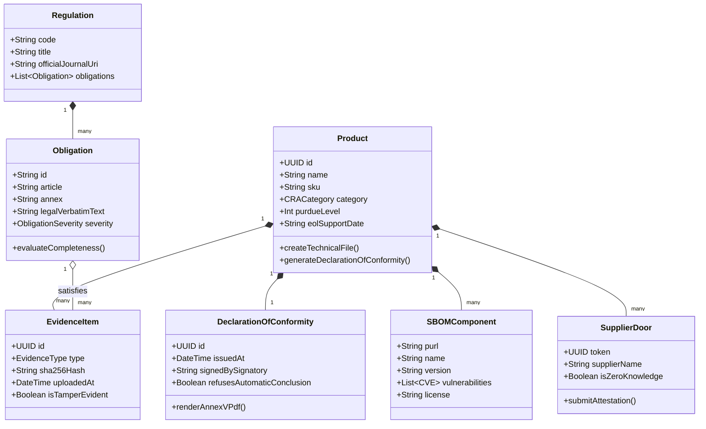
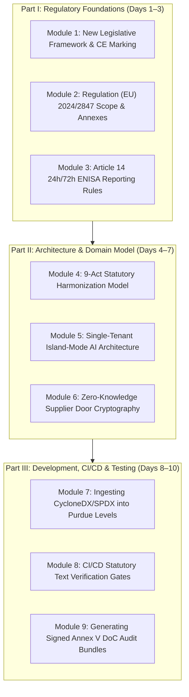

# Chapter 6: Wiki Architect Onboarding Guide & Regulatory Glossary

> **Location:** `eigenia/research/CRA_conformance_app_research/06_WIKI_ONBOARDING_GUIDE.md`  
> **Applicable Regulation:** Regulation (EU) 2024/2847 (Cyber Resilience Act)  
> **Framework:** Wiki Architect Onboarding Standard (Principal-Level Guide + Zero-to-Hero Curriculum + 40-Term Lexicon)

---

## 1. Principal-Level Architectural Guide

This section is written for Principal Engineers, Software Architects, and Regulatory Officers building systems of record for European product conformity.

### The Core Architectural Insight
> **The Non-Delegable Statutory Responsibility Invariant:**  
> In traditional IT-GRC and AppSec tooling, software assumes an authoritative posture: it "passes" an audit or "certifies" a build.  
> Under European Product Law (Decision No 768/2008/EC and Regulation (EU) 2024/2847 Article 32), **concluding conformity is a non-delegable legal act reserved exclusively to the manufacturer or a designated Notified Body**.  
> 
> Therefore, a compliant CRA architecture must treat compliance as an **asymmetric verification ledger**: it verifies the completeness and cryptographic provenance of evidence against statutory obligations, but **strictly refuses to conclude legal conformity**.



### Core Pattern Implementation: TypeScript vs. Python Comparison

#### TypeScript (Platform Engine Core):
```typescript
// oxot_statutory_engine.ts
export type CRACategory = 'DEFAULT' | 'IMPORTANT_CLASS_I' | 'IMPORTANT_CLASS_II' | 'CRITICAL';

export interface StatutoryEvidence {
  id: string;
  sha256: string;
  obligationId: string; // e.g. 'CRA-ANNEX-I-PART-1-REQ-2'
  verifiedByEngineer: string;
  timestamp: string;
}

export interface TechnicalDossier {
  productId: string;
  category: CRACategory;
  evidenceItems: StatutoryEvidence[];
  isComplete: boolean;
  refusesAutomaticConclusion: true; // Invariant
}

export class StatutoryDossierEngine {
  /**
   * Evaluates technical documentation completeness without presuming legal conformity.
   * Statutory Rule: Regulation (EU) 2024/2847 Article 24 & Article 32.
   */
  public evaluateDossierCompleteness(dossier: TechnicalDossier, requiredObligationIds: string[]): {
    completenessRatio: number;
    missingObligations: string[];
    canIssueDeclarationOfConformity: boolean;
    legalDisclaimer: string;
  } {
    const fulfilledIds = new Set(dossier.evidenceItems.map(e => e.obligationId));
    const missing = requiredObligationIds.filter(id => !fulfilledIds.has(id));
    const ratio = (requiredObligationIds.length - missing.length) / requiredObligationIds.length;

    return {
      completenessRatio: ratio,
      missingObligations: missing,
      canIssueDeclarationOfConformity: missing.length === 0,
      legalDisclaimer: "Conformity is concluded solely by the manufacturer upon signing the Annex V DoC."
    };
  }
}
```

#### Python (Alternative Comparison Language):
```python
# oxot_statutory_engine.py
from dataclasses import dataclass
from typing import List, Set

@dataclass(frozen=True)
class StatutoryEvidence:
    id: str
    sha256: str
    obligation_id: str
    verified_by: str

class StatutoryDossierEngine:
    """Enforces non-delegable legal verification under Regulation (EU) 2024/2847."""
    
    @staticmethod
    def evaluate(evidence: List[StatutoryEvidence], required_ids: Set[str]) -> dict:
        fulfilled_ids = {e.obligation_id for e in evidence}
        missing_ids = required_ids - fulfilled_ids
        ratio = (len(required_ids) - len(missing_ids)) / len(required_ids) if required_ids else 1.0
        
        return {
            "completeness_ratio": round(ratio, 4),
            "missing_obligations": sorted(list(missing_ids)),
            "ready_for_signature": len(missing_ids) == 0,
            "statutory_honesty_invariant": True,
            "refuses_concluding_conformity": True
        }
```

---

## 2. Zero-to-Hero Learning Path

A progressive three-part curriculum for onboarding engineers and product specialists onto the OXOT Conformance Platform:



---

## 3. Comprehensive 40-Term Regulatory & Technical Glossary

1. **Active Conforming Product Dossier (ACPD):** Platform North Star Metric measuring an Annex VII technical dossier with $\ge 80\%$ completeness and active 30-day vulnerability monitoring.
2. **Actively Exploited Vulnerability:** A security vulnerability for which there is reliable evidence that execution of malicious code by an actor has occurred without authorization (triggers 24h Article 14 report).
3. **Annex I Essential Requirements:** The mandatory cybersecurity properties (Part I: properties; Part II: vulnerability handling) specified in Regulation (EU) 2024/2847.
4. **Annex V EU Declaration of Conformity (DoC):** The formal legal document signed by the manufacturer declaring that the product satisfies all applicable EU harmonisation legislation.
5. **Annex VII Technical Documentation:** The comprehensive dossier describing the design, manufacture, risk assessment, SBOM, test reports, and operational security of the product.
6. **Article 13 Duties of Manufacturers:** Statutory requirements governing product lifecycle, technical documentation maintenance, support timelines, and customer instructions.
7. **Article 14 Notification Obligations:** The legal mandate requiring early warning within 24 hours and formal notification within 72 hours for actively exploited vulnerabilities or severe incidents.
8. **Article 18 Substantial Modification:** Any modification of a product after placement on the market affecting compliance or risk profile, causing the modifier to assume full manufacturer liabilities.
9. **Article 32 Presumption of Conformity:** Presumption granted when a product adheres to harmonised standards cited in the Official Journal under standardisation request M/606.
10. **Article 53 Penalties & Fines:** Administrative fines up to €15,000,000 or 2.5% of total worldwide annual turnover for essential requirements violations.
11. **CEN / CENELEC / ETSI:** The European standardisation organizations mandated under M/606 to produce harmonised cybersecurity standards for the CRA.
12. **CE Marking:** The European conformity mark affixed to products indicating compliance with all applicable European Union directives and regulations.
13. **CSIRTs Network:** The network of Computer Security Incident Response Teams designated by Member States to receive Article 14 notifications.
14. **Critical Product with Digital Elements:** Highest-risk product tier subject to mandatory third-party European Cybersecurity Certificate (EUCC) certification.
15. **CycloneDX:** A lightweight software bill of materials (SBOM) standard developed by OWASP, natively supported by OXOT.
16. **Data Act (Regulation (EU) 2023/2854):** European legislation regulating fair access to and use of connected product data, mapped alongside the CRA.
17. **Early Warning (24h):** The initial notification submitted to ENISA and CSIRTs within 24 hours of becoming aware of an actively exploited vulnerability.
18. **ENISA (EU Agency for Cybersecurity):** The European agency hosting the central CRA Single Reporting Platform.
19. **ENISA Single Reporting Platform (SRP):** The centralised secure web portal launched on September 11, 2026 for Article 14 notifications.
20. **Hardware Bill of Materials (HBOM):** An inventory of physical microchips, microcontrollers, communication buses, and sensors composing a device.
21. **Harmonised Standard:** A European standard adopted by CEN/CENELEC/ETSI on the basis of a request from the European Commission (M/606).
22. **IEC 62443:** The global benchmark standard series for industrial automation and control systems (IACS) cybersecurity, mapped directly to Annex I.
23. **Important Product with Digital Elements (Class I):** Identity management systems, password managers, network interfaces, firewalls, and microcontrollers.
24. **Important Product with Digital Elements (Class II):** Operating systems, hypervisors, public key infrastructure, programmable logic controllers (PLCs), and industrial routers.
25. **Island-Mode AI:** An architectural pattern where LLM and vector processing execute entirely on single-tenant client infrastructure without external telemetry egress.
26. **ISO/SAE 21434:** Automotive road vehicles cybersecurity engineering standard.
27. **Machinery Regulation (Regulation (EU) 2023/1230):** New EU safety regulation for machinery, harmonized on the same product record as the CRA.
28. **Market Surveillance Authorities (MSAs):** National authorities designated by Member States empowered to inspect technical files, issue recalls, and impose fines.
29. **Module A (Internal Production Control):** The self-assessment conformity route available for Default category products.
30. **Module H (Full Quality Assurance):** Conformity assessment route based on full quality assurance conducted by an accredited Notified Body.
31. **New Legislative Framework (NLF):** The modern EU regulatory architecture established in 2008 governing CE marking, accreditation, and market surveillance.
32. **Notified Body:** An independent conformity assessment organization accredited by an EU Member State to assess Class I/II and Critical products.
33. **Open-Source Software Steward:** A legal entity that supports open-source software placed on the market, subject to tailored CRA governance.
34. **Purdue Enterprise Reference Architecture (PERA):** The 7-layer structural model for industrial control systems (Levels 0 through 5).
35. **Radio Equipment Directive (RED - Directive 2014/53/EU):** Directive covering wireless devices; cybersecurity articles 3(3)(d)(e)(f) merge into the CRA regime.
36. **SPDX (Software Package Data Exchange):** An ISO/IEC standard format (ISO/IEC 5962:2021) for communicating SBOM data.
37. **Standardisation Request M/606:** The European Commission mandate directing CEN, CENELEC, and ETSI to draft harmonised standards for the CRA.
38. **Supplier Portal Door:** A secure, isolated magic link enabling component suppliers to deposit SBOMs and attestations without seeing internal OEM records.
39. **Technical Dossier:** The comprehensive collection of records mandated under Annex VII proving product conformity.
40. **Vulnerability Exploitability eXchange (VEX):** A machine-readable security advisory format indicating whether a product is affected by a specific CVE.

---

## 4. Key File Architecture Reference

| Repository Relative Path | Primary Language | Description | Key Architectural Anchors |
|:---|:---:|:---|:---|
| [`artifacts/oxot-web/src/pages/competitors-page.tsx`](file:///Users/jimmcknney/Downloads/OXOT_Website_Conformity_Application/artifacts/oxot-web/src/pages/competitors-page.tsx) | TSX / React | Category-level competitive comparison page | Lines 25–70: Category definitions; Lines 58–68: Capability matrix |
| [`artifacts/oxot-web/src/pages/trust-center-page.tsx`](file:///Users/jimmcknney/Downloads/OXOT_Website_Conformity_Application/artifacts/oxot-web/src/pages/trust-center-page.tsx) | TSX / React | Trust, privacy, and island-mode security page | Lines 20–55: Statutory honesty; Lines 80–120: Island architecture |
| [`docs/wiki/`](file:///Users/jimmcknney/Downloads/OXOT_Website_Conformity_Application/docs/wiki/) | Markdown | Regulatory thesis and technical dossiers | Complete Annex I, V, and VII regulatory breakdowns |
| [`eigenia/research/CRA_conformance_app_research/`](file:///Users/jimmcknney/jim_private/eigenia/research/CRA_conformance_app_research/) | Markdown & JSON | Complete competitive intelligence suite | Chapters 00 through 06 + `CATALOGUE.json` |

*This concludes the EU Cyber Resilience Act Conformance Application Research Suite.*
