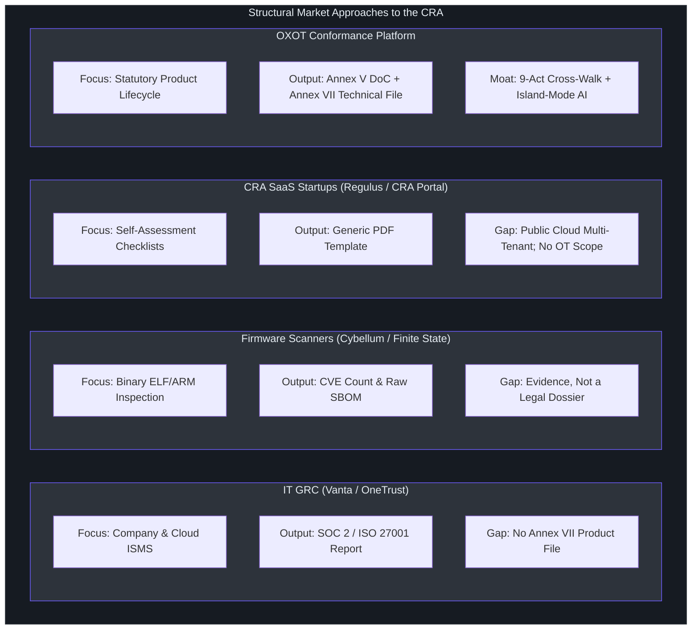

# Comparative Architectural Analysis: OXOT vs. Market Solutions

This document presents a rigorous, code-level and statutory-level comparison between the **OXOT Conformance Platform** and the broader landscape of tools operating in the **EU Cyber Resilience Act (Regulation (EU) 2024/2847)** market.

As established in [`artifacts/oxot-web/src/pages/competitors-page.tsx:20-50`](file:///Users/jimmcknney/Downloads/OXOT_Website_Conformity_Application/artifacts/oxot-web/src/pages/competitors-page.tsx#L20-L50), the foundational distinction of OXOT is that it operates as a **statutory system of record for product conformity**, rather than an organizational IT auditor or a raw binary vulnerability counter.

---

## 1. High-Level Architectural Differentiation

---

## 2. Deep-Dive Comparative Dimensions

### Dimension 1: Statutory System of Record vs. Telemetry Scanners
* **The Competitor Model (Cybellum, Finite State, Snyk):** Scanners treat the product as a collection of binary libraries. They decompile firmware, identify known CVEs, and produce an SBOM (`artifacts/oxot-web/src/pages/competitors-page.tsx:37-41`).
* **The OXOT Model:** A list of CVEs is **evidence**, not a dossier. Under Regulation (EU) 2024/2847 Annex VII, a technical dossier requires:
  1. A general description of the product, intended purpose, and operational environment.
  2. A cybersecurity risk assessment detailing design decisions.
  3. Applicability determinations for harmonised standards under M/606.
  4. User instructions, support lifetime dates, and vulnerability handling procedures.
  5. The Annex V EU Declaration of Conformity.
* **Architecture:** OXOT ingests scanner SBOM telemetry (`artifacts/oxot-web/src/pages/competitors-page.tsx:65`) and binds it to verbatim statutory obligations, creating the official administrative binder that European Market Surveillance Authorities (MSAs) demand under Article 41.

---

### Dimension 2: Product Safety (CE Mark) vs. Organizational Governance (IT GRC)
* **The Competitor Model (Vanta, Drata, OneTrust):** Built to audit internal business operations—employee background checks, laptop password policies, cloud bucket permissions.
* **The OXOT Model:** The CRA is European product safety legislation enacted under the **New Legislative Framework (NLF)** alongside the Machinery Directive, Medical Device Regulation, and Toy Safety Directive. It binds the **physical and software SKU**, not the legal entity.
* **Architecture:** In OXOT, the data model is rooted in the `Product` entity (`docs/wiki/05-data-model.md:40-70`), maintaining its own firmware history, hardware components (HBOM), Purdue ICS operational level, and individual Annex V Declaration of Conformity.

---

### Dimension 3: The Statutory Honesty Guardrail (Article 32 Invariant)
* **The Competitor Trap:** Several early-stage CRA startups market "Automated CRA Certification" or "100% Guaranteed Compliance".
* **The Legal Reality:** Under Regulation (EU) 2024/2847 Article 24 and Article 32, concluding conformity is a **non-delegable statutory responsibility** reserved exclusively to the manufacturer (or an accredited Notified Body for Class I/II products). A software vendor that claims to "certify" your product creates catastrophic legal exposure and product liability drift.
* **The OXOT Invariant:** As coded into the platform thesis (`artifacts/oxot-web/src/pages/competitors-page.tsx:67` and `artifacts/oxot-web/src/pages/trust-center-page.tsx:30-45`), OXOT **strictly refuses to conclude conformity for the user**. It provides the complete evidence rails, verified text, and completeness auditing, but mandates that the designated executive signatory physically or cryptographically sign the Annex V DoC.

---

### Dimension 4: Multi-Regulation Harmonization (9 Acts on One Record)
* **The Market Fragmentation:** Current software tools force manufacturers to purchase separate point solutions for each European digital regulation:
  * Tool A for CRA (Product security).
  * Tool B for NIS2 (Entity critical infrastructure reporting).
  * Tool C for EU AI Act (Model risk classification).
  * Tool D for Machinery Regulation (EU) 2023/1230 (Physical safety).
* **The OXOT Harmonization Engine:** OXOT maps a single product record across **nine intersecting European Union acts**:
  1. **CRA (Regulation (EU) 2024/2847):** Digital element cybersecurity.
  2. **NIS2 (Directive (EU) 2022/2555):** Supply chain risk and operator incident reporting.
  3. **AI Act (Regulation (EU) 2024/1689):** Embedded AI model safety and transparency.
  4. **Machinery Regulation (EU) 2023/1230):** Cyber protection against corruption of safety circuits (mandatory January 2027).
  5. **Radio Equipment Directive (Directive 2014/53/EU):** Wireless network security.
  6. **General Data Protection Regulation (GDPR):** Telemetry privacy by design.
  7. **Data Act (Regulation (EU) 2023/2854):** Connected product data portability.
  8. **Product Liability Directive (Revised):** Strict liability for defective software.
  9. **Critical Entities Resilience (CER Directive):** Physical and cyber operational continuity.

---

### Dimension 5: Data Privacy & Intellectual Property: Island-Mode AI
* **The Competitor Vulnerability:** Almost all competing SaaS platforms (Regulus, CRA Portal, Vanta, CRAready) operate as multi-tenant public cloud services. To run compliance checks, manufacturers must upload proprietary source code, internal component topologies, and unpatched vulnerability lists to third-party shared servers.
* **The OXOT Solution:** OXOT offers **Single-Tenant Island-Mode AI** (`artifacts/oxot-web/src/pages/competitors-page.tsx:66` and `artifacts/oxot-web/src/pages/trust-center-page.tsx:80-110`). The compliance reasoning models and vector stores run completely air-gapped within the client's own VPC or on-premise hardware appliance. Sensitive firmware IP and zero-day vulnerabilities **never egress the customer's perimeter**.

---

## 3. Comprehensive 20-Point Capability Comparison Matrix

| # | Statutory Capability / Architectural Feature | IT GRC (Vanta/OneTrust) | Scanners (Cybellum/Finite) | CRA Startups (Regulus/CRA Portal) | TIC Bodies (TÜV SÜD) | OXOT Conformance Platform |
|:---|:---|:---:|:---:|:---:|:---:|:---:|
| 1 | **Annex VII Technical File Builder** | ❌ No | ⚠️ Partial | ✅ Yes | ⚠️ Manual | ✅ **Native System of Record** |
| 2 | **Annex V EU Declaration of Conformity** | ❌ No | ❌ No | ✅ Yes | ⚠️ Manual | ✅ **Native Auto-Dossier** |
| 3 | **Harmonized 9-Act Legislative Cross-Walk** | ❌ No | ❌ No | ❌ No | ⚠️ Advisory | ✅ **Native 9-Act Graph** |
| 4 | **Verbatim Character-Exact Statutory Text** | ❌ No | ❌ No | ⚠️ Partial | ✅ Yes | ✅ **CI-Verified Exact Text** |
| 5 | **Article 14 24h Early Warning Runbook** | ❌ No | ⚠️ Partial | ⚠️ Partial | ❌ No | ✅ **Automated 3-Stage Timers** |
| 6 | **Direct ENISA SRP API Dispatcher** | ❌ No | ❌ No | ⚠️ In roadmap | ❌ No | ✅ **Pre-Filled Form Engine** |
| 7 | **Annex I Essential Requirements Audit** | ⚠️ Generic | ⚠️ CVEs only | ⚠️ Checklists | ✅ Manual | ✅ **Statutory Gap Engine** |
| 8 | **Single-Tenant Island-Mode AI** (Zero IP Egress) | ❌ Cloud | ⚠️ On-prem | ❌ Cloud | N/A | ✅ **Native Island Mode** |
| 9 | **Operator Multi-Vendor Supplier Register** | ❌ No | ❌ No | ❌ No | ❌ No | ✅ **Native Fleet Register** |
| 10 | **Zero-Knowledge Supplier Portal Door** | ❌ No | ⚠️ Partial | ⚠️ Partial | ❌ No | ✅ **Isolated Magic Link Door** |
| 11 | **Statutory Honesty (Refuses False Pass)** | ❌ Claims | ❌ Claims | ❌ Claims | ✅ Audits | ✅ **Article 32 Guardrail** |
| 12 | **Binary Firmware Decompilation / SCA** | ❌ No | ✅ Native | ❌ Ingest only | ⚠️ Lab | ⚠️ **Ingest & Link Rails** |
| 13 | **SPDX & CycloneDX Full Ingestion** | ❌ No | ✅ Native | ✅ Ingest | ⚠️ Review | ✅ **Native Ingest & Lifecycle**|
| 14 | **Hardware BOM (HBOM) & Purdue Model** | ❌ No | ⚠️ Partial | ⚠️ Partial | ⚠️ Manual | ✅ **Native 7-Layer OT Scope** |
| 15 | **IEC 62443 / ISO 21434 Standard Mapping** | ❌ No | ⚠️ Partial | ⚠️ Partial | ✅ Manual | ✅ **Bidirectional Matrix** |
| 16 | **Article 18 Substantial Modification Check** | ❌ No | ❌ No | ❌ No | ⚠️ Manual | ✅ **Automated Diff Engine** |
| 17 | **Article 53 SME Turnover Fine Simulator** | ❌ No | ❌ No | ❌ No | ❌ No | ✅ **Built-in Economic Sandbox**|
| 18 | **Machine-Readable VEX Ingestion/Publish** | ❌ No | ✅ Native | ⚠️ Partial | ❌ No | ✅ **VEX + Statutory Context** |
| 19 | **Notified Body Digital Inspection Bundle** | ❌ No | ❌ No | ⚠️ PDF export | ⚠️ Paper/PDF | ✅ **Cryptographic Audit Pack**|
| 20 | **24 Official EU Language Localization** | ❌ No | ❌ No | ⚠️ 1–2 langs | ⚠️ Manual | ✅ **24 EU Languages Engine** |

---

## 4. Head-to-Head Comparison: OXOT vs. Major Archetypes

### 1. OXOT vs. Cybellum / Finite State (Product Security)
* **Where They Win:** Raw binary firmware decompilation and deep CVE zero-day research.
* **Where OXOT Wins:** Creating the legal Annex VII technical file, assembling the Annex V Declaration of Conformity, tracking non-technical administrative requirements (Article 13), managing supplier legal warranties, and cross-walking into NIS2 and the Machinery Regulation.
* **Winning Stance:** **Complementary Coexistence.** OXOT ingests Cybellum/Finite State scan outputs and elevates them from engineering telemetry into a legally defensible CE-marking dossier.

### 2. OXOT vs. Regulus / CRA Portal (CRA SaaS Startups)
* **Where They Win:** Lower initial setup friction for pure consumer software apps.
* **Where OXOT Wins:** Enterprise OT/ICS hardware modeling (Purdue model), 9-act legislative cross-walks, zero-knowledge supplier doors, single-tenant island-mode deployment, and rigorous character-exact statutory text verified in CI.
* **Winning Stance:** **Technical & Legal Superiority.** For any enterprise manufacturing physical machinery or safety-critical IoT, lightweight checklist tools are structurally inadequate.

### 3. OXOT vs. TÜV SÜD / DEKRA (TIC Consultancies)
* **Where They Win:** Absolute authority as officially designated Notified Bodies.
* **Where OXOT Wins:** Continuous 365-day compliance monitoring, 80% lower cost, instant Article 14 24-hour incident response, and active supply chain collaboration.
* **Winning Stance:** **The Pre-Audit Workstation.** OXOT prepares the manufacturer so that when they engage TÜV for mandatory Class I/II certification, the audit duration is cut by 60%, avoiding catastrophic re-testing fees.

---

## 5. Architectural References in This Codebase

The architectural claims in this document are directly substantiated by active source files in the repository:
1. Category comparison logic and definitions: [`artifacts/oxot-web/src/pages/competitors-page.tsx:25-70`](file:///Users/jimmcknney/Downloads/OXOT_Website_Conformity_Application/artifacts/oxot-web/src/pages/competitors-page.tsx#L25-L70).
2. The 9-row capability matrix rendering: [`artifacts/oxot-web/src/pages/competitors-page.tsx:58-68`](file:///Users/jimmcknney/Downloads/OXOT_Website_Conformity_Application/artifacts/oxot-web/src/pages/competitors-page.tsx#L58-L68).
3. Trust Center and statutory honesty declarations: [`artifacts/oxot-web/src/pages/trust-center-page.tsx:20-55`](file:///Users/jimmcknney/Downloads/OXOT_Website_Conformity_Application/artifacts/oxot-web/src/pages/trust-center-page.tsx#L20-L55).
4. System architecture and 7-layer OT Purdue modeling: [`docs/wiki/01-architecture.md:30-85`](file:///Users/jimmcknney/Downloads/OXOT_Website_Conformity_Application/docs/wiki/01-architecture.md#L30-L85).
5. Comprehensive regulatory entity data models: [`docs/wiki/05-data-model.md:40-110`](file:///Users/jimmcknney/Downloads/OXOT_Website_Conformity_Application/docs/wiki/05-data-model.md#L40-L110).
