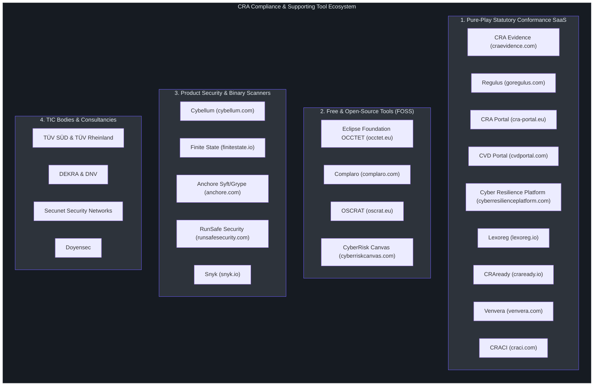

# Directory of CRA Supporting Applications & Services

The European Union's **Cyber Resilience Act (Regulation (EU) 2024/2847)** has catalyzed a rapid emergence of specialized compliance web applications, automated vulnerability disclosure gateways, software supply chain scanners, and Notified Body consulting frameworks.

This directory documents the active ecosystem as of September 2026 (the active Article 14 enforcement era), detailing live web applications, pricing models, feature sets, service architectures, and structural limitations.

---

## 1. Ecosystem Taxonomy & Architecture Overview

---

## 2. Comprehensive Directory of Commercial CRA SaaS Applications

### 1. Regulus (`goregulus.com`)
* **Live Web Application:** [https://goregulus.com/](https://goregulus.com/)
* **Platform Category:** Pure-Play Statutory Conformance & Supply Chain Risk Platform.
* **Pricing & Packaging:**
  * **Basic Tier:** €2,500 / year (SME product scoping and baseline documentation).
  * **Pro Tier:** €15,000 / year (Multi-product support, full compliance roadmap, continuous vulnerability monitoring).
  * **Enterprise Tier:** Custom quote (On-premise deployment, multi-brand supply chain management).
* **Key Features:**
  * Product categorization wizard (Default vs. Important Class I/II vs. Critical).
  * Automated compliance roadmap generation with statutory milestone alerts.
  * Technical documentation file exporter for market surveillance authorities.
  * Component vulnerability feed integration.
* **Structural Limitations:** Closed cloud multi-tenant architecture; lacks single-tenant air-gapped deployment; does not bridge into OT/ICS hardware protocols (IEC 62443).

---

### 2. CVD Portal (`cvdportal.com`)
* **Live Web Application:** [https://cvdportal.com/](https://cvdportal.com/)
* **Platform Category:** Article 14 Coordinated Vulnerability Disclosure & Incident Dispatch Gateway.
* **Pricing & Packaging:**
  * **Free Tier:** €0 / month (Basic vulnerability intake inbox).
  * **Reporting Tier:** €99 / month (Article 14 24h early warning workflow, automated acknowledgment).
  * **Compliance Tier:** €299 / month (Complete coordinated disclosure lifecycle, CSIRT notification dispatch).
  * **Enterprise Tier:** Custom quote (Multi-product incident response integration).
* **Key Features:**
  * Dedicated Coordinated Vulnerability Disclosure (CVD) public security.txt endpoint.
  * 24-hour statutory timer for actively exploited vulnerability alerts.
  * Structured pre-filled forms matching ENISA Single Reporting Platform schemas.
  * Vulnerability triaging and reporter communication log.
* **Structural Limitations:** Focused strictly on Article 14 post-market vulnerability reporting; cannot build the pre-market Annex VII technical dossier or generate the Annex V DoC.

---

### 3. Cyber Resilience Platform (`cyberresilienceplatform.com`)
* **Live Web Application:** [https://cyberresilienceplatform.com/](https://cyberresilienceplatform.com/)
* **Platform Category:** Guided CRA Assessment & Remediation SaaS.
* **Pricing & Packaging:**
  * **Free Plan:** €0 / month (1 assessment, baseline gap report).
  * **Pro Plan:** €59 / month (3 products, remediation planning, SBOM upload).
  * **Business Plan:** €299 / month (10 products, team seats, priority support, €19/mo per extra seat).
* **Key Features:**
  * Step-by-step CRA readiness questionnaires.
  * Remediation task tracker with deadline management.
  * SBOM format checker (SPDX / CycloneDX).
* **Structural Limitations:** Primarily checklist-driven; does not integrate with continuous CI/CD build pipelines; limited hardware component modeling.

---

### 4. CRA Portal (`cra-portal.eu`)
* **Live Web Application:** [https://cra-portal.eu/pricing/](https://cra-portal.eu/pricing/)
* **Platform Category:** Low-Cost SME Self-Assessment & CE Documentation Web Portal.
* **Pricing & Packaging:**
  * **Starter Plan:** €19 / month (Basic self-assessment tool).
  * **Growth Plan:** €49 / month (Full questionnaire, gap report).
  * **Professional Plan:** €149 / month (Annex V DoC generator, team seats).
  * **Add-Ons:** €29 / month for automated SBOM parsing; €49 / month for incident notification; €1,500 one-time guided onboarding.
* **Key Features:**
  * Standardized questionnaires mapped to Annex I essential requirements.
  * Annex V EU Declaration of Conformity template generator.
  * Exportable PDF readiness dossiers for executive review.
* **Structural Limitations:** Highly manual data entry; no live binary inspection; no supplier supply chain door.

---

### 5. CRA Evidence (`craevidence.com`)
* **Live Web Application:** [https://craevidence.com/](https://craevidence.com/)
* **Platform Category:** Enterprise Technical Dossier & Evidence Management Platform.
* **Pricing & Packaging:**
  * **Professional Custom:** Custom annual quote based on product volume.
  * **Enterprise Custom:** Custom multi-business-unit subscription with SLA.
* **Key Features:**
  * Ingestion of both Software (SBOM) and Hardware (HBOM) bill of materials.
  * Automated mapping of static analysis (SAST) and dynamic testing (DAST) evidence to Annex VII sections.
  * Tamper-evident audit logging for 10-year statutory retention.
* **Structural Limitations:** High-touch enterprise sales cycle; closed cloud deployment; lacks native cross-regulation bridges (e.g. Machinery Regulation 2023/1230).

---

### 6. CRAready (`craready.io`)
* **Live Web Application:** [https://craready.io/](https://craready.io/)
* **Platform Category:** Product-Team Oriented CRA Readiness Engine.
* **Pricing & Packaging:**
  * **Developer Tier:** $79 / month.
  * **Team Tier:** $199 / month.
  * **Business Tier:** $499 / month.
* **Key Features:**
  * Compares product engineering posture against legacy SCA/SBOM tools.
  * Interactive gap dashboard with direct remediation instructions for software engineers.
* **Structural Limitations:** Targets software and cloud-connected IoT; weak on industrial OT hardware and safety-critical PLC systems.

---

### 7. CRA Check (`cracheck.eu`)
* **Live Web Application:** [https://cracheck.eu/pricing](https://cracheck.eu/pricing)
* **Platform Category:** Lightweight CRA Scope & Applicability Screener.
* **Pricing & Packaging:**
  * **Introductory Tier:** €25 / month (for first 100 subscribers).
  * **Standard Tier:** €50 / month.
* **Key Features:**
  * Rapid diagnostic questionnaire to determine if a product falls under CRA Default, Important Class I, Important Class II, or Critical.
  * Calculation of statutory deadlines based on product release date.

---

### 8. Venvera (`venvera.com`)
* **Live Web Application:** [https://venvera.com/](https://venvera.com/)
* **Platform Category:** Pan-European Multi-Regulation Compliance & Cross-Walk Suite.
* **Pricing & Packaging:**
  * **Essential Plan:** €399 / month.
  * **Advanced Plan:** €899 / month.
  * **Enterprise Plan:** Custom quote.
* **Key Features:**
  * Cross-regulation mapping (CRA, NIS2, DORA, and EU AI Act).
  * EU data residency guarantees (Frankfurt/Amsterdam datacenters).
  * Automated audit reporting.

---

### 9. CRACI (`craci.com`)
* **Live Web Application:** [https://craci.com/](https://craci.com/)
* **Platform Category:** AI-Powered CRA Regulatory Intelligence Startup (Backed by Finnish Pre-Seed in May 2026).
* **Pricing & Packaging:**
  * **Monthly SaaS:** €330 / month.
  * **Enterprise Custom:** Volume-based.
* **Key Features:**
  * Natural language querying of CRA harmonised standards drafts (M/606).
  * Automated gap discovery across firmware release notes and engineering tickets.

---

## 3. Directory of Open-Source & EU-Funded CRA Toolkits

### 1. Eclipse Foundation: OCCTET (`occtet.eu`)
* **Live Portal:** [https://occtet.eu/](https://occtet.eu/)
* **License & Backing:** Free, open-source project funded by the European Commission under the Horizon Europe framework, managed in collaboration with the Eclipse Foundation.
* **Key Capabilities:**
  * Open-source self-assessment engine for European SMEs.
  * Federated open-source vulnerability database.
  * Automated compliance evaluation toolkit designed to prevent open-source maintainers from incurring CRA liability.
* **Pricing:** **100% Free / Open-Source**.

### 2. Complaro (`complaro.com`)
* **Live Portal:** [https://complaro.com/](https://complaro.com/)
* **License:** Community Open-Source Web Application.
* **Key Capabilities:**
  * Free SBOM ingestion and CVE vulnerability scanner.
  * Form generator for ENISA Single Reporting Platform incident drafts.
  * Unlimited products and scans without paywalls.
* **Pricing:** **Free**.

### 3. OSCRAT (`oscrat.eu`)
* **Live Portal:** [https://oscrat.eu/](https://oscrat.eu/)
* **Platform:** Open-Source Cyber Resilience Act Toolkit for SMEs.
* **Capabilities:** Provides structured assessment paths and downloadable Markdown templates for internal production control (Module A).
* **Pricing:** **Free**.

### 4. CyberRisk Canvas (`cyberriskcanvas.com`)
* **Live Portal:** [https://cyberriskcanvas.com/](https://cyberriskcanvas.com/)
* **Platform:** Open-Core Threat Analysis and Risk Assessment (TARA).
* **Capabilities:** Visual threat modeling supporting ISO/SAE 21434 and IEC 62443, with SBOM import and Statement of Applicability (SoA) exports.
* **Pricing:** Free Community Core; paid team tiers.

---

## 4. Product Security, Binary Scanners & Advisory Services

| Vendor / Firm | Primary Model | Public Pricing | Core Offering | CRA Limitation / Evidence Status |
|:---|:---|:---|:---|:---|
| **pi3g** | Embedded Hardware Advisory | Fixed quote / consulting | Hands-on embedded engineering and CRA compliance for Raspberry Pi / ARM IoT. | Service-led hardware consultancy; lacks multi-product compliance automation. |
| **ONEKEY** | Product Security SaaS | Enterprise subscription | Automated firmware security analysis and compliance mapping for IoT/OT. | Focused on binary vulnerability detection; requires external legal assembly for Annex V DoC. |
| **ConformOps** | Compliance Workflow | Subscription tier | Workflow management for CE conformity evidence. | Early-stage tool; lacks native binary SBOM ingestion rails. |
| **Cybellum** | Enterprise Platform | Custom (€40k–€150k+/yr) | "Cyber Digital Twins" of firmware, binary SBOM extraction, CVE scoring. | Telemetry only; does not generate legal Annex V DoC. |
| **Finite State** | Enterprise SaaS | Custom (€30k–€120k+/yr) | Software supply chain management, binary SCA, EPSS risk prioritization. | US-centric; lacks CE marking statutory file workflow. |
| **Anchore** | Commercial / Open Source | Free open core (Syft/Grype); Enterprise quote | Container and filesystem SBOM generation and vulnerability scanning. | Software only; no hardware, Purdue level, or CE dossier context. |
| **RunSafe Security** | Enterprise Control | Custom platform quote | Memory protection (Alkemist) and binary load-time diversification. | Security control only; cannot produce technical documentation. |
| **TÜV SÜD / Rheinland** | TIC Notified Body | Fixed project (€30k–€100k+/product) | Laboratory penetration testing, Notified Body assessment (Module H). | **Capacity Bottleneck:** As verified by Valyu regulatory tracking ([cyberresilienceact.eu](https://www.cyberresilienceact.eu/news/cra-notified-bodies-rules-apply-11-june-2026.html)), as of late 2026, **no Notified Bodies are formally designated in NANDO yet**. Point-in-time consulting remains backlogged and expensive. |
| **Secunet** | Professional Services | Time & Materials / Project quote | High-assurance security engineering, DACH critical infrastructure audit. | Bespoke services; no self-serve software platform. |
| **Doyensec** | Security Advisory | Day rate / Fixed engagement | Application security audits, embedded firmware penetration testing. | Consulting-led; lacks continuous automated compliance monitoring. |
