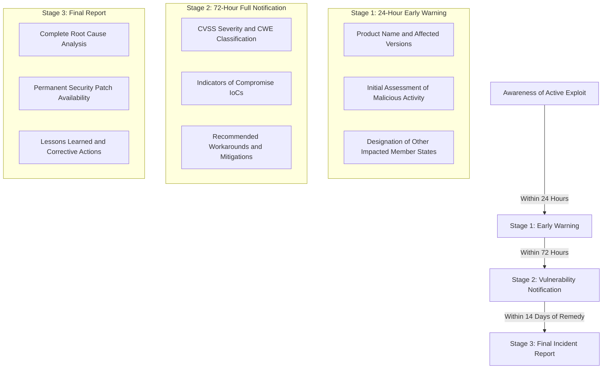

# Article 14 Early Warning Playbook: Notifying ENISA and CSIRTs in 24 Hours

Contents

Introduction
Truth Box
The Statutory Triggers: Actively Exploited Vulnerabilities
The Three-Stage Notification Timeline
The ENISA Single Reporting Platform Architecture
Required Data Fields for the 24-Hour Early Warning
Preventing Accidental Vulnerability Leaks During Triage
Common Misconceptions
FAQ
Conclusion
Image SEO Section
SEO Section (Yoast)
Schema Markup

---

## Introduction

On September 11, 2026, Article 14 of the Cyber Resilience Act, Regulation (EU) 2024/2847, officially became active law across all 27 European Union member states. 

While the full conformity assessment rules and CE marking requirements take effect in December 2027, the vulnerability reporting mandate is active today. Any manufacturer placing products with digital elements on the EU market must comply with strict notification clocks when a security flaw is actively exploited.

Under Article 14, manufacturers have exactly 24 hours from becoming aware of an actively exploited vulnerability to submit an official early warning to the European Union Agency for Cybersecurity (ENISA) and the relevant national Computer Security Incident Response Teams (CSIRTs).

Failing to submit an early warning exposes manufacturers to administrative penalties up to 15 million euros or 2.5% of global annual turnover. 

This playbook provides incident response teams, product security leads, and legal counsel with an operational procedure for managing the 24-hour notification window without leaking sensitive exploit details to unauthorized parties.

---

## Truth Box

| Key Point | Insight |
|:---|:---|
| Active Legal Deadline | Article 14 took full effect on September 11, 2026, making 24-hour vulnerability reporting mandatory before other CRA provisions. |
| Strict Trigger Condition | The 24-hour clock begins the moment the manufacturer becomes aware that a vulnerability is being actively exploited in the wild, not when an internal fix is ready. |
| Dual Recipient Route | Submissions made through the ENISA Single Reporting Platform automatically route data simultaneously to ENISA and designated national CSIRTs. |
| Penalty Ceiling | Failure to report within statutory deadlines carries administrative fines up to €15,000,000 or 2.5% of total worldwide annual turnover. |
| Sensitive Exploit Data | The 24-hour early warning does not require delivering weaponized exploit code or complete root-cause analyses that could jeopardize ongoing containment. |

---

## The Statutory Triggers: Actively Exploited Vulnerabilities

Not every security bug triggers an Article 14 notification. Understanding the statutory threshold is critical to prevent flooding authorities with irrelevant bug reports while avoiding non-compliance.

Article 14 establishes two distinct notification triggers:

1. **Actively Exploited Vulnerabilities**: A vulnerability is classified as actively exploited when reliable evidence demonstrates that an unauthorized actor has executed code, bypassed security controls, or extracted data using the flaw without user authorization. Theoretical security research, controlled penetration test findings, or responsible bug bounty disclosures do not trigger Article 14 unless active exploitation in the wild is confirmed.
2. **Severe Incidents Impacting Product Security**: An incident that impacts the security or operational availability of the digital product, leading to significant financial loss, critical infrastructure disruption, or potential loss of life.

| Event Type | Triggers 24-Hour Article 14 Early Warning? | Statutory Action Required |
|:---|:---|:---|
| Internal QA team discovers buffer overflow | **No** | Log in internal defect tracker and patch via normal development lifecycle. |
| External researcher reports zero-day via CVD policy | **No** (unless active exploitation confirmed) | Acknowledge report within 7 days; coordinate fix timeline. |
| Threat intelligence detects public exploit used against customers | **YES** | Submit 24-hour Early Warning to ENISA Single Reporting Platform. |
| Denial of service attack disables cloud remote processing | **YES** (if severe operational impact occurs) | Submit 24-hour Incident Notification to ENISA and CSIRTs. |

---

## The Three-Stage Notification Timeline

Article 14 outlines a phased disclosure cycle designed to give authorities early visibility while providing the manufacturer adequate time to conduct digital forensics and author patches.



### Stage 1: The 24-Hour Early Warning
The early warning is an alert rather than a detailed forensic dossier. It informs ENISA and the national CSIRT that an actively exploited flaw exists, allowing authorities to monitor broader systemic threats across critical infrastructure.

### Stage 2: The 72-Hour Vulnerability Notification
Within 72 hours of becoming aware of the active exploit, the manufacturer must provide updated information. This update includes technical severity ratings (CVSS v3.1 or v4.0), common weakness enumerations (CWE), indicators of compromise (IoCs), and preliminary corrective actions taken to protect users.

### Stage 3: The Final Remediation Report
No later than 14 days after a permanent corrective measure or security update is made available to users, the manufacturer must submit a final report. This document includes full technical details, root cause analysis, and confirmation that patches were distributed.

---

## The ENISA Single Reporting Platform Architecture

To simplify compliance across 27 distinct European jurisdictions, the European Commission tasked ENISA with establishing a secure **Single Reporting Platform (SRP)**.

Instead of requiring companies to locate, format, and transmit separate encrypted reports to 27 different national computer emergency response teams, the SRP provides a centralized endpoint:

1. **Authentication and Access**: Incident responders authenticate using digital certificates issued by qualified European trust service providers (eIDAS) or multi-factor corporate credentials.
2. **Automated Regional Routing**: When a manufacturer enters the affected product type and customer distribution, the platform automatically routes the encrypted alert to the national CSIRT of the manufacturer's main European establishment, as well as CSIRTs in all member states where the product is distributed.
3. **End-to-End Cryptographic Security**: Notification payloads are encrypted using national CSIRT public keys to ensure that sensitive zero-day telemetry cannot be intercepted in transit.

---

## Required Data Fields for the 24-Hour Early Warning

When the 24-hour clock is running, engineering and legal teams cannot afford to debate what information to submit. 

The ENISA SRP requires six mandatory data points for the initial early warning:

1. **Manufacturer Identification**: Legal entity name, registered European business address, and unique VAT or EORI identifier.
2. **Designated Point of Contact**: Name, direct telephone number, and secure PGP-encrypted email address of the incident response lead.
3. **Product Identification**: Commercial product name, model numbers, hardware revisions, and specific firmware or software build versions affected.
4. **Nature of Malicious Exploitation**: Brief factual summary of how the exploit was identified (for example, telemetry alert, external threat intelligence report, or customer incident).
5. **Initial Risk Indicator**: Indication of whether the vulnerability is suspected of being exploited by state-sponsored actors or organized ransomware groups.
6. **Cross-Border Geographic Scope**: List of European member states where the product has been sold or deployed.

---

## Preventing Accidental Vulnerability Leaks During Triage

A major concern for engineering executives is the risk of premature information leaks. If technical details of an unpatched zero-day flaw are submitted to government databases before a fix is ready, unauthorized individuals could access the data and weaponize it against innocent users.

To safeguard your intellectual property and protect your user base, enforce three operational rules during Article 14 triage:

First, **omit weaponized proof-of-concept code**. The early warning requires confirming that active exploitation is occurring; it does not require uploading exploit scripts or reverse-engineered binaries to the portal.

Second, **designate a statutory gatekeeper**. Technical teams must not submit raw forensic dumps directly to ENISA. Establish a clear internal workflow where the Head of Product Security and Legal Counsel review the notification payload before transmission.

Third, **prepare user mitigations concurrently**. Article 14 mandates that users be informed without undue delay if a vulnerability requires manual mitigation on their part (such as disabling an exposed port or isolating a machine). Prepare clear customer advisory bulletins alongside your regulatory notifications.

---

## Common Misconceptions

### Submitting an Early Warning Automatically Triggers Public Disclosure
No. Article 14 notifications submitted to the ENISA Single Reporting Platform are strictly confidential. European authorities and CSIRTs operate under strict confidentiality rules and will not publish public advisories until the manufacturer coordinates a patch.

### The 24-Hour Clock Starts When Root Cause is Identified
This is incorrect. The clock starts the moment the manufacturer has credible information that an active exploit is happening in the wild, even if engineers do not yet understand the underlying code bug. Waiting until the root cause is solved before reporting constitutes a violation.

### Third-Party Component Flaws Are Not Your Responsibility to Report
If your product integrates a third-party library or chip that is actively exploited in your deployed devices, you must submit an Article 14 notification as the final manufacturer. You cannot wait for the upstream vendor to report it.

---

## FAQ

### What happens if our team discovers active exploitation on a Saturday evening?
The 24-hour statutory clock runs continuously and does not pause for weekends or public holidays. Your incident response roster must maintain 24/7 readiness to submit early warnings.

### Can an authorised representative submit the Article 14 notification on our behalf?
Yes. Under Article 11, non-EU manufacturers must appoint an Authorised Representative established within the European Union who can be mandated to submit notifications through the ENISA SRP.

### Does reporting an exploit expose our company to automatic regulatory fines?
No. Timely, transparent reporting demonstrates regulatory compliance. Fines are imposed when manufacturers conceal known active exploits, fail to notify authorities within statutory deadlines, or neglect security updates.

### Where can our engineering team find the ENISA SRP submission endpoint?
ENISA provides official web portal access and REST API endpoints for authenticated enterprise submitters. Details are maintained on the official ENISA Single Reporting Platform portal.

### What should we do if we suspect an exploit but cannot verify it with 100% certainty?
If the evidence points to probable active exploitation in the wild, submit an early warning noting that investigation is ongoing. It is safer to submit a precautionary early warning than to face multi-million euro penalties for late notification.

---

## Conclusion

The activation of Article 14 transforms vulnerability handling from an informal security practice into a legally binding operational discipline. With significant financial penalties and mandatory 24-hour response windows, preparation is essential.

Ensure your incident response playbook includes automated contact routing, establish pre-authorized access to the ENISA Single Reporting Platform, and run simulated dry-run drills with your product security and legal teams.

---

## Image SEO Section

### Image 1: Feature Image
- Title: CRA Article 14 Early Warning Notification Workflow
- Alt Text: Step by step workflow of CRA Article 14 24 hour vulnerability notification to ENISA and CSIRTs
- Caption: Operational response timeline under the EU Cyber Resilience Act from discovery to remediation.
- Description: Clean technical flowchart detailing the 24-hour early warning, 72-hour notification, and 14-day final report.
- Placement: Below the Main Title and Introduction.

### Image 2: Incident Response Decision Tree
- Title: CRA Article 14 Statutory Trigger Decision Matrix
- Alt Text: Flowchart evaluating whether a product security vulnerability requires mandatory Article 14 reporting
- Caption: Assessment logic determining statutory reporting thresholds for active exploits under Regulation (EU) 2024/2847.
- Description: Decision diagram for security teams differentiating routine bugs from reportable active exploits.
- Placement: Inside The Statutory Triggers section.

---

## SEO Section (Yoast)

- **Focus Keyphrase**: `CRA Article 14 vulnerability notification ENISA`
- **SEO Title**: CRA Article 14 Playbook: 24-Hour ENISA Notification (2026)
- **Slug**: `cra-article-14-vulnerability-notification-enisa-playbook`
- **Meta Description**: Step-by-step playbook for managing CRA Article 14 mandatory vulnerability reporting. Learn how to notify ENISA and national CSIRTs within 24 hours.
- **Social Title**: CRA Article 14 Playbook: Notifying ENISA in 24 Hours
- **Social Description**: How to handle actively exploited vulnerabilities under the European Cyber Resilience Act without leaking sensitive exploit telemetry.

Data accurate as of September 2026 based on cited market research.

---

## Schema Markup

```json
{
  "@context": "https://schema.org",
  "@graph": [
    {
      "@type": "BlogPosting",
      "@id": "https://eigenia.com/cra-hub/articles/cra-article-14-vulnerability-notification-enisa-playbook/#article",
      "isPartOf": {
        "@type": "WebSite",
        "@id": "https://eigenia.com/#website",
        "name": "Eigenia Labs",
        "url": "https://eigenia.com"
      },
      "headline": "Article 14 Early Warning Playbook: Notifying ENISA and CSIRTs in 24 Hours",
      "description": "Operational incident response playbook for submitting mandatory 24-hour vulnerability early warnings to ENISA under Regulation (EU) 2024/2847.",
      "inLanguage": "en-EU",
      "datePublished": "2026-09-15T09:00:00+02:00",
      "dateModified": "2026-09-15T09:00:00+02:00",
      "author": {
        "@type": "Organization",
        "name": "Eigenia Labs",
        "url": "https://eigenia.com"
      },
      "publisher": {
        "@type": "Organization",
        "name": "Eigenia B.V.",
        "url": "https://eigenia.com"
      },
      "keywords": [
        "CRA Article 14 vulnerability notification ENISA",
        "Single Reporting Platform",
        "Cyber Resilience Act reporting",
        "CSIRT notification 24 hours",
        "Mandatory vulnerability disclosure EU"
      ]
    },
    {
      "@type": "FAQPage",
      "@id": "https://eigenia.com/cra-hub/articles/cra-article-14-vulnerability-notification-enisa-playbook/#faq",
      "mainEntity": [
        {
          "@type": "Question",
          "name": "What happens if our team discovers active exploitation on a weekend?",
          "acceptedAnswer": {
            "@type": "Answer",
            "text": "The 24-hour statutory clock runs continuously without pausing for weekends or holidays. Teams must maintain 24/7 incident intake capabilities."
          }
        },
        {
          "@type": "Question",
          "name": "Can an authorised representative submit the Article 14 notification on our behalf?",
          "acceptedAnswer": {
            "@type": "Answer",
            "text": "Yes, non-EU manufacturers can mandate their designated European Authorised Representative under Article 11 to submit notifications via the ENISA SRP."
          }
        },
        {
          "@type": "Question",
          "name": "Does reporting an exploit expose our company to automatic regulatory fines?",
          "acceptedAnswer": {
            "@type": "Answer",
            "text": "No. Timely reporting demonstrates statutory compliance. Penalties are enforced for concealing active exploits or missing reporting deadlines."
          }
        },
        {
          "@type": "Question",
          "name": "Where can our engineering team find the ENISA SRP submission endpoint?",
          "acceptedAnswer": {
            "@type": "Answer",
            "text": "ENISA provides authenticated web portal access and API endpoints for verified economic operators via the official Single Reporting Platform."
          }
        },
        {
          "@type": "Question",
          "name": "What should we do if we suspect an exploit but cannot verify it with 100% certainty?",
          "acceptedAnswer": {
            "@type": "Answer",
            "text": "If evidence suggests probable active exploitation in the wild, submit an early warning noting that forensic investigation is ongoing to prevent late-reporting fines."
          }
        }
      ]
    }
  ]
}
```
