# Eigenia Labs CRA Conformity Hub: Master Editorial Strategy & 12-Month Content Calendar

Published by **Eigenia Labs**  
Focus: Organic Search Dominance, Technical Authority, Vendor-Agnostic Utility  
Target Horizon: Q4 2026 to Q4 2027  
Audience: Heads of Embedded Engineering, Product Security Leads, Regulatory Officers, VPs of Hardware R&D

---

## 1. Executive Summary & Strategic Objective

The objective of the **Eigenia Labs CRA Conformity Hub** is to establish the definitive, vendor-agnostic European authority for cybersecurity conformity under Regulation (EU) 2024/2847. 

Most existing search results for "Cyber Resilience Act compliance" are superficial vendor lead-generation traps or dry legal PDF bulletins. By delivering verified technical analysis, transparent tool pricing, open-source CycloneDX validation scripts, and actionable regulatory playbooks, Eigenia Labs captures high-intent engineering and compliance search traffic.

This editorial plan structures the publishing cadence into four distinct phases aligned with key regulatory enforcement milestones:
1. **Phase 1 (Q4 2026)**: Statutory Foundations & Article 14 Early Warning Operationalization (capitalizing on the September 11, 2026 ENISA Single Reporting Platform activation).
2. **Phase 2 (Q1 2027)**: Industrial OT, Embedded Systems, and the Machinery Regulation Collision (coinciding with the January 20, 2027 enforcement of Regulation (EU) 2023/1230).
3. **Phase 3 (Q2-Q3 2027)**: The Notified Body Bottleneck, Third-Party Audits, and Class I/II Preparation (addressing the European NANDO CAB designation shortage).
4. **Phase 4 (Q4 2027)**: Final Sprint to Full Application, CE Marking, and 10-Year Technical Documentation Compliance (ahead of December 11, 2027).

---

## 2. Pillar-and-Cluster Content Architecture

The CRA Conformity Hub operates on a **Pillar-and-Cluster SEO Architecture**:

```mermaid
graph TD
    Pillar1[Cornerstone Pillar 1: EU CRA Compliance Tools Comparison 2026] --> C1[Sbomify vs Regulus Cyber]
    Pillar1 --> C2[Best Free Open Source CRA Tools]
    Pillar1 --> C3[Automated SBOM Depth CycloneDX vs SPDX]
    Pillar1 --> C4[CVD Portal and security.txt Compliance]

    Pillar2[Cornerstone Pillar 2: Industrial OT & Machinery Regulation Guide] --> C5[IEC 62443 to CRA Mapping Matrix]
    Pillar2 --> C6[Machinery Reg EU 2023/1230 vs CRA Annex I]
    Pillar2 --> C7[Binary Firmware Analysis for Legacy PLCs]
    Pillar2 --> C8[Microcontroller Memory Safety under Annex I]

    Pillar3[Cornerstone Pillar 3: Article 14 Early Warning Playbook] --> C9[ENISA Single Reporting Platform API Specs]
    Pillar3 --> C10[24-Hour CSIRT Triage Checklist]
    Pillar3 --> C11[CVSS v4.0 vs v3.1 in CRA Notifications]
    Pillar3 --> C12[Authorised Representatives Article 11 Responsibilities]

    Pillar4[Cornerstone Pillar 4: The 10-Year Annex VII Technical Dossier] --> C13[EU Declaration of Conformity Template]
    Pillar4 --> C14[NANDO Notified Body Status Tracker]
    Pillar4 --> C15[Module A vs Module B/C/H Decision Guide]
    Pillar4 --> C16[Open Source Software Stewards Article 13 Guide]
```

---

## 3. High-Intent Keyword Map & Search Intent Architecture

| Target Keyword Cluster | Search Intent | Est. Monthly EU Search Volume | Target Content Asset | Primary Call to Action |
|:---|:---|:---|:---|:---|
| `eu cra compliance tools comparison` | Commercial / Investigation | 4,200 | Pillar 1: 18-Tool Guide | Explore Filterable Directory |
| `cra article 14 enisa reporting` | Informational / Operational | 2,800 | Pillar 3: Article 14 Playbook | Download 24h Triage Checklist |
| `iec 62443 cra mapping matrix` | Technical / Engineering | 1,900 | Cluster 2.1: IEC 62443 Guide | Access Mapping Spreadsheet |
| `machinery regulation 2023 1230 cybersecurity` | Commercial / Urgency | 3,400 | Pillar 2: Industrial OT Guide | Review Dual Conformity Roadmap |
| `nando cra notified bodies list` | Informational / High Intent | 2,100 | Cluster 4.2: Live NANDO Radar | Subscribe to CAB Alert Feed |
| `cyclonedx 4 bom cra validator` | Technical / Developer | 1,600 | Cluster 1.3: SBOM Depth Post | Run Open Source CLI Validator |
| `cra annex vii technical documentation template` | Transactional / Template | 3,800 | Cluster 4.1: Technical Dossier | Download Annex VII Template |
| `module a vs module h cra` | Informational / Regulatory | 1,400 | Cluster 4.3: Conformity Pathways | Launch Interactive Path Tool |

---

## 4. 12-Month Editorial Publishing Calendar

### Q4 2026: The Reporting Activation Sprint
- **Week 1 (Published)**: Pillar 1 — *The Complete Guide to EU CRA Compliance Tools and Services (2026 Comparison)*.
- **Week 3 (Published)**: Pillar 3 — *Article 14 Early Warning Playbook: Notifying ENISA and CSIRTs in 24 Hours*.
- **Week 5**: Cluster 3.1 — *ENISA Single Reporting Platform API Integration: A Technical Primer for Product Security Teams*.
- **Week 7**: Cluster 1.1 — *Sbomify, Regulus Cyber, and Complaro: Three Architectures for CRA SBOM Management*.
- **Week 9**: Cluster 3.2 — *Coordinated Vulnerability Disclosure under Article 10: How to Write an Audit-Proof CVD Policy*.
- **Week 11**: End-of-Year Report — *The 2026 State of EU CRA Readiness: Surveying 200 European Hardware OEMs*.

### Q1 2027: The Industrial OT & Machinery Regulation Collision
- **Week 13 (Published)**: Pillar 2 — *Industrial OT and Embedded Systems Under the CRA: Navigating IEC 62443 and Machinery Regulation (EU) 2023/1230*.
- **Week 15**: Cluster 2.1 — *January 20, 2027 Enforcement: Emergency Cybersecurity Checklist for Industrial Machine Builders*.
- **Week 17**: Cluster 2.2 — *Binary Firmware Disassembly vs Source Code Scanning: Managing Third-Party RTOS Components*.
- **Week 19**: Cluster 2.3 — *Securing Legacy Industrial Protocols: Modbus, EtherCAT, and OPC UA under CRA Annex I*.
- **Week 21**: Cluster 4.4 — *Article 13 Explained: What Open Source Software Stewards Must Deliver by Mid-2027*.

### Q2 2027: The Notified Body Bottleneck & Class I/II Scramble
- **Week 23**: Pillar 4 — *The NANDO Notified Body Bottleneck: How to Secure Third-Party Audits for Class I and Class II PDE*.
- **Week 25**: Cluster 4.1 — *Module A vs Module B+C vs Module H: Calculating the Cost of CRA Conformity Routes*.
- **Week 27**: Cluster 1.2 — *CycloneDX 4-BOM Deep Dive: Validating Software, Hardware, Cryptographic, and Operations BOMs*.
- **Week 29**: Cluster 4.2 — *Medical Device Manufacturers under CRA: Reconciling MDR 2017/745 and CRA Annex I*.
- **Week 31**: Cluster 3.3 — *How to Build an Article 14 Dry-Run Simulator to Test 24-Hour CSIRT Notifications*.

### Q3 2027: Technical Dossier Generation & Supply Chain Flowdown
- **Week 33**: Pillar 5 — *The 10-Year Annex VII Technical Documentation Dossier: Archiving Firmware, SBOMs, and Test Evidence*.
- **Week 35**: Cluster 5.1 — *Cryptographic Signature Verification for Firmware Updates: Satisfying Annex I Part I Section 2*.
- **Week 37**: Cluster 5.2 — *Supply Chain Flowdown: How European Importers and Distributors Must Audit Non-EU Manufacturers*.
- **Week 39**: Cluster 5.3 — *Hardware Security Modules and Secure Elements: Meeting Class II Physical Tamper Resistance*.
- **Week 41**: Cluster 1.4 — *The Open Source Compliance Stack: Building a Zero-License CRA Pipeline with Complaro and Syft*.

### Q4 2027: The Final CE Marking Enforcement Sprint
- **Week 43**: Emergency Playbook — *60 Days to Full CRA Enforcement: Final CE Marking Verification Checklist*.
- **Week 45**: Legal Review — *Signing the EU Declaration of Conformity: Executive and Director Legal Liability under the CRA*.
- **Week 47**: Market Surveillance Analysis — *What European National Market Surveillance Authorities Will Inspect First in 2028*.
- **Week 49**: Milestone Retrospective — *December 11, 2027 Live: The New Era of Connected Product Security in Europe*.

---

## 5. WordPress & Multi-Channel Distribution Mechanics

To turn these high-value technical assets into sustained organic traffic and inbound enterprise inquiries, Eigenia Labs will execute a disciplined multi-channel syndication protocol:

1. **Native Web Portal (`web/src/app/cra-hub/`)**:
   - Primary canonical URL to establish domain authority on `eigenia.com` and `eigenia.nl`.
   - Rich interactive components: Filterable tables, clause explorers, and countdown timers.
2. **WordPress Blog & Headless CMS Syndication**:
   - Ready-to-import Markdown files containing all Yoast SEO fields, Truth Boxes, and structured Schema markup.
   - Syndicated across partner European engineering publications (e.g. *Elektor*, *Embedded Computing Design Europe*, *Automatisierungstechnik*).
3. **LinkedIn Long-Form Newsletters**:
   - Condense each cornerstone post into an 800-word LinkedIn Article published from the **Eigenia B.V.** company page.
   - Tag evaluated vendor founders and open-source project leads to drive organic discussions.
4. **GitHub Open Source Artifacts**:
   - Maintain an open repository `Planet9V/cra-conformity-tools` containing the machine-readable `CATALOGUE.json`, CycloneDX validation scripts, and Annex VII document templates.
   - Add back-links from the repository README directly into the Eigenia CRA Conformity Hub.
